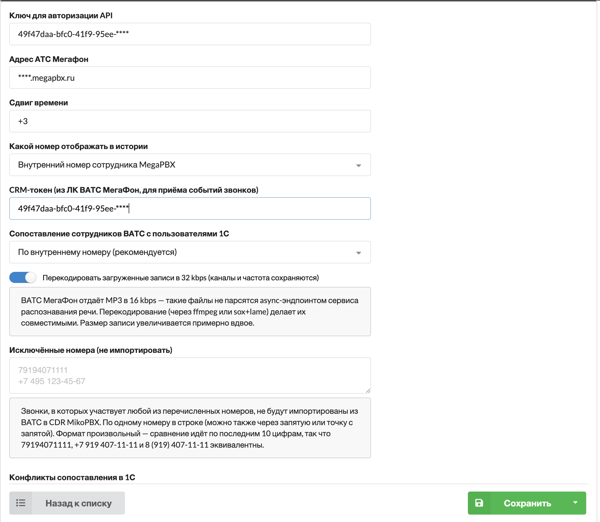

# Интеграция с Megapbx от Мегафон

Стандартный раздел **Телефония → История вызовов** после включения интеграции будет содержать историю звонков из MegaPBX. Для отвеченных звонков будут доступны записи разговоров.

### Кому будет полезно?

Если есть разъездные сотрудники, кому удобнее использовать мобильные телефоны и не требуется интеграция с 1С - в этом случае руководитель получит доступ к истории звонков и записям разговоров сотрудника в АТС и в 1С.&#x20;

### Настройки модуля

<figure><figcaption>Настройки модуля</figcaption></figure>

* **Ключ для авторизации API** — ключ для загрузки истории звонков и записей разговоров. Инструкции по его получению приведены на сайте [api.megapbx.ru](https://api.megapbx.ru).
* **Адрес АТС Мегафон** — адрес ВАТС без указания протокола, например `example.megapbx.ru`.
* **Сдвиг времени** — позволяет скорректировать время звонков на указанное количество часов, например `+3`.
* **Какой номер отображать в истории** — определяет, какой номер сотрудника будет показан в истории вызовов: внутренний или мобильный.
* **CRM-токен (из ЛК ВАТС МегаФон, для приёма событий звонков)** — токен для проверки входящих событий от ВАТС. Он должен совпадать с CRM-токеном в личном кабинете ВАТС МегаФон.
* **Сопоставление сотрудников ВАТС с пользователями 1С** — определяет способ поиска пользователя 1С: по внутреннему номеру, по мобильному номеру либо сначала по внутреннему и, при отсутствии совпадения, по мобильному.
* **Перекодировать загруженные записи в 32 kbps** — преобразует MP3-файлы ВАТС из 16 kbps в формат, совместимый с сервисом распознавания речи. Размер записи при этом увеличивается примерно вдвое.
* **Исключённые номера (не импортировать)** — звонки с участием любого указанного номера не попадут в историю MikoPBX. Указывайте по одному номеру в строке; также поддерживаются запятые и точки с запятой. Формат произвольный: сравнение выполняется по последним 10 цифрам, поэтому `79194071111`, `+7 919 407-11-11` и `8 (919) 407-11-11` считаются одним номером.

В разделе **Конфликты сопоставления в 1С** проверьте, не указан ли один внутренний или мобильный номер у нескольких пользователей. События для таких номеров не будут отправлены в 1С, пока конфликт не будет устранён.

После заполнения параметров нажмите **Сохранить**.

### Интеграция с 1С

* [Расширенный журнал звонков 1.0](https://wiki.miko.ru/astpanel:statistic) - журнал будет загружать историю звонков MegaPBX автоматически, дополнительных настроек не потребуется
* [Панель телефонии 4.0](https://docs.telefon1c.ru/user-guides/journal/calls-and-records/) - для загрузки истории звонков потребуется в 1С подключить дополнительную внешнюю обработку

### События звонков в 1С в реальном времени

Загрузка истории звонков и передача событий в реальном времени — независимые функции. История загружается модулем периодически, а события о начале, соединении и завершении звонка передаются в 1С сразу после их получения от ВАТС МегаФон.

Для настройки передачи событий:

1. Убедитесь, что **Панель телефонии 4.0 для 1С** установлена, включена и настроена в MikoPBX.
2. В личном кабинете ВАТС МегаФон настройте интеграцию с CRM и укажите публичный HTTPS-адрес MikoPBX:

   `https://YOUR_PBX_HOST/pbxcore/mega-pbx/event`

   Замените `YOUR_PBX_HOST` на доменное имя или публичный адрес вашей MikoPBX. Адрес должен быть доступен со стороны ВАТС МегаФон.
3. Скопируйте CRM-токен из личного кабинета ВАТС МегаФон и укажите его в поле **CRM-токен (из ЛК ВАТС МегаФон, для приёма событий звонков)** в настройках модуля MikoPBX.
4. В поле **Сопоставление сотрудников ВАТС с пользователями 1С** выберите подходящий способ:
   * **По внутреннему номеру (рекомендуется)**;
   * **По мобильному номеру**;
   * **По внутреннему, при отсутствии — по мобильному**.
5. Проверьте раздел **Конфликты сопоставления в 1С**. Если один внутренний или мобильный номер указан у нескольких пользователей 1С, события для него передаваться не будут. Устраните дубликаты, чтобы каждому номеру соответствовал только один пользователь.
6. Сохраните настройки, выполните тестовый звонок и убедитесь, что его состояния отображаются в 1С.


**Ключ для авторизации API** и **CRM-токен** выполняют разные задачи. Ключ API используется для загрузки истории звонков и записей разговоров, а CRM-токен — для проверки входящих событий от ВАТС МегаФон.


Действие, выполняемое при получении звонка, зависит от используемой конфигурации 1С и настроек интеграции. В **1С:УНФ**, **1С:УТ** или **1С:CRM** может открываться **карточка клиента**, документ **«Событие»** либо другая сущность, предусмотренная конкретной конфигурацией или реализованная в рамках кастомизации клиента.
