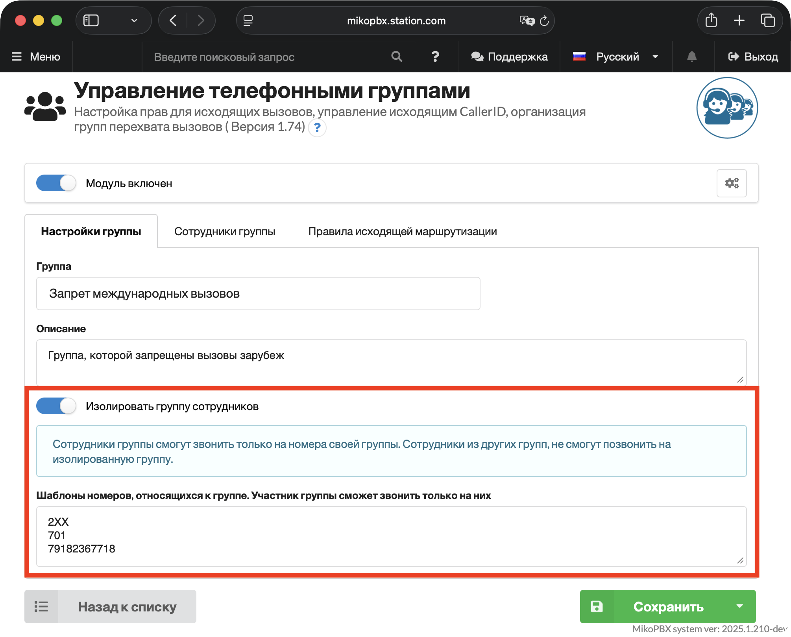

# Управление телефонными группами

С помощью модуля можно объединить сотрудников в группы и гибко управлять их правами: запретить международные звонки, разрешить только внутренние вызовы, назначить персональный маршрут или CallerID. Поддерживается полная изоляция группы — сотрудники смогут звонить только внутри своей группы.

### Установка и общее описание модуля 

1\. Перейдите в раздел "**Управление модулями**" -> "[**Маркетплейс**](../../manual/modules/pbx-extension-modules.md#marketpleis-modulei)". Установите модуль "**Управление телефонными группами"**.

<figure><figcaption>
Модуль "Управление телефонными группами" в разделе "Маркетплейс"
</figcaption></figure>

2\.  Перейдите в раздел "**Установленные модули**". Включите установленный модуль и перейдите в его параметры.

В разделе "**Список телефонных групп"** отображается список существующих групп. Здесь же можно указать группу по умолчанию - в неё будут автоматически добавляться все новые сотрудники. При необходимости группу можно выбрать вручную при создании сотрудника.

<figure><figcaption>
Вкладка "Список телефонных групп"
</figcaption></figure>

В разделе "**Сотрудники"** отображается список всех сотрудников и их групповая принадлежность.

### Создание новой группы

1. Для добавления новой группы, перейдите на вкладку "Список телефонных групп" и нажмите "**Создать телефонную группу**"**.**

2. Укажите базовые параметры для создаваемой группы:

* **Группа** - произвольное название, например "Отдел Маркетинга".
* **Описание** - краткое пояснение, например «Разрешены внешние звонки только через Мегафон». Помогает быстро понять назначение группы при дальнейшей работе.

Нажмите "**Cохранить**".

3. На вкладке "**Сотрудники группы"** выберите сотрудников, которых нужно включить в группу.

4. Перейдите на вкладку "**Правила исходящей маршрутизации"**. Здесь можно включить или отключить доступные маршруты для текущей группы. Например, активируйте только маршрут через Мегафон — тогда сотрудники группы смогут звонить исключительно через него.

При необходимости в поле **Исходящий Caller ID** укажите номер, который будет отображаться у получателя при звонке через данный маршрут. Если поле оставить пустым, будет использован Caller ID по умолчанию, заданный в настройках провайдера.


Не каждый провайдер разрешает подменять CallerID — как правило, допускается использовать только номер, принадлежащий организации. Поддерживаются следующие форматы:

* `74952293045 <admin>`
* `74952293045`
* `74952293045 <74952293045>`

Точный формат заголовка `FROM` (поле `user`) уточните у своего поставщика услуг связи.\
\
Если необходимо использовать этот функционал, то в настройках провайдера потребуется **отключить** использование поля **`fromuser`**. Эта настройка также влияет на заголовок `FROM` и имеет более высокий приоритет.&#x20;



Если все маршруты отключены, сотрудники группы смогут совершать только внутренние звонки.


### Популярные сценарии использования 

#### Разрешить только внутренние вызовы 

Если в компании есть стажёры или сотрудники, которым не нужно звонить на внешние номера — им можно ограничить доступ только до внутренних вызовов.

1. Перейдите в параметры модуля "**Управление телефонными группами**". Нажмите "**Создать телефонную группу**". Задайте произвольное название, например "Только внутренние вызовы".

.png)

2\. На вкладке "**Сотрудники группы"** выберите сотрудников, которых нужно включить в группу.

3\. На вкладке "**Правила исходящей маршрутизации"** отключите все маршруты — переведите все переключатели в неактивное положение.

#### Запретить международные направления 

1. Перейдите в параметры модуля "**Управление телефонными группами**". Нажмите "**Создать телефонную группу**". Задайте произвольное название, например "Запрет международных вызовов".

<figure><figcaption>
Общие настройки создаваемой группы
</figcaption></figure>

2. На вкладке "**Сотрудники группы"** выберите сотрудников, которых нужно включить в группу.

<figure><figcaption>
Указание сотрудников, которые будут добавлены в создаваемую группу
</figcaption></figure>

3. На вкладке "**Правила исходящей маршрутизации"** активируйте только маршруты через локальных провайдеров, маршрут для международных звонков оставьте отключённым.

<figure><figcaption>
Шаблон на запрет международных звонков
</figcaption></figure>

### Изоляция группы 

После создания группы перейдите в раздел "**Настройки группы"**, чтобы настроить параметры изоляции. Существует два варианта:

* Изолировать группу сотрудников.
* Изолировать функцию перехвата (Pickup).

#### Изолировать группу сотрудников

Функция полностью изолирует группу от остальных сотрудников АТС:

* сотрудники группы смогут звонить только на номера внутри своей группы.
* сотрудники из других групп не смогут дозвониться до изолированной группы.
* перехват вызова (`*8`) будет работать только внутри группы.

**Шаблоны номеров, относящихся к группе. Участник группы сможет звонить только на них -** здесь задаются шаблоны номеров, на которые участники группы смогут звонить. В шаблонах допускается использовать цифры от 1 до 9 и символ `X` (любая цифра от 0 до 9).

Примеры шаблонов:

* `2XX` — номера с 200 по 299
* `200001` — конкретный внутренний номер, например номер очереди
* `7XXXXXXXXXX` — одиннадцатизначные номера РФ

<figure><figcaption>
Изоляция группы сотрудников
</figcaption></figure>

#### Изолировать функцию перехвата (Pickup)

Подробнее о настройке функции перехвата можно почитать в [документации](https://docs.mikopbx.com/mikopbx/manual/system/general-settings#perevody_vyzovov).&#x20;

По умолчанию для перехвата звонка используется комбинация `*8` или `*8номерТелефона`. При включении изоляции перехват будет доступен только внутри группы — список её участников задаётся на вкладке "**Сотрудники группы"**.

<figure><figcaption>
Изолирование функции перехвата в рамках группы
</figcaption></figure>
