# Модуль ИИ Супервайзер

**Модуль ИИ Супервайзер** анализирует готовые расшифровки звонков MikoPBX и помогает руководителю контролировать качество коммуникаций. Модуль формирует краткую и подробную сводку, определяет причину обращения и итог разговора, выделяет следующие действия, темы, риски и подтверждающие фрагменты, оценивает тональность, риск и качество обслуживания.

Сам модуль в MikoPBX не запускает языковую модель. Он импортирует расшифровки, управляет очередью, хранит ключи доступа и результаты, а локальную обработку выполняет отдельное приложение **AI Supervisor Worker** на Mac. По умолчанию приложение использует Ollama и локальную модель, поэтому расшифровки и результаты анализа остаются внутри вашей инфраструктуры.

<p><mark style="color:red;">Устарело</mark></p>

<figure>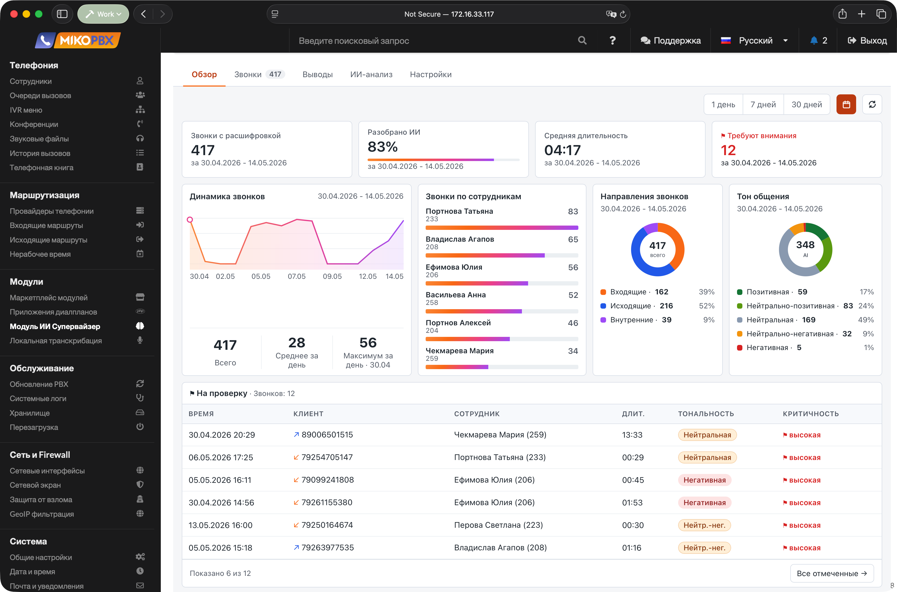<figcaption><p>Главная страница модуля</p></figcaption></figure>

### Как устроен анализ

Решение состоит из трёх независимых частей:

1. **Модуль локального распознавания речи** создаёт расшифровку и публикует событие `transcript.completed`.
2. **Модуль ИИ Супервайзер** импортирует расшифровку, создаёт задание и сохраняет результат анализа.
3. **AI Supervisor Worker** на Mac получает задание, подготавливает локальную модель, выполняет анализ и отправляет результат в MikoPBX.

Обычный цикл обработки:

1. После звонка модуль распознавания речи создаёт готовую расшифровку.
2. ИИ Супервайзер импортирует событие и сохраняет ссылку на расшифровку.
3. Для подходящего звонка создаётся задание `call_summary`.
4. Обработчик регистрируется и получает lease через `POST /job-leases`.
5. Для длинного разговора обработчик выполняет анализ по частям и сохраняет промежуточные результаты.
6. Итоговый JSON проходит проверку в приложении и повторную проверку в модуле.
7. Результат появляется на вкладках **Обзор** и **Звонки**.

### Требования и совместимость

* MikoPBX **2025.1.1** или новее.
* Установленный и включённый модуль локального распознавания речи.
* Сетевой доступ от Mac к веб-интерфейсу MikoPBX.
* Доступ в интернет для первой установки Ollama и загрузки локальных моделей.

### Установка модуля

1. Откройте веб-интерфейс MikoPBX.
2. Перейдите в раздел **Модули** → **Маркетплейс модулей**.

<p><mark style="color:red;">Устарело</mark></p>

<figure><figcaption><p>Раздел «Маркетплейс модулей»</p></figcaption></figure>

3. Найдите **Модуль ИИ Супервайзер** и установите его.
4. Откройте список установленных модулей и включите модуль.

<p><mark style="color:red;">Устарело</mark></p>

<figure><figcaption><p>Включение модуля «ИИ Супервайзер»</p></figcaption></figure>

5. Нажмите значок **Настройки** справа от версии модуля.

<p><mark style="color:red;">Устарело</mark></p>

<figure><figcaption><p>Переход в модуль «ИИ Супервайзер»</p></figcaption></figure>

### Навигация модуля

В текущей версии доступны три основные вкладки:

| Вкладка | Назначение |
| --- | --- |
| **Обзор** | Показатели звонков, покрытие ИИ-анализом, очередь внимания и сводная аналитика. |
| **Звонки** | Список импортированных звонков, фильтры, карточка звонка, расшифровка и разбор обращения. |
| **Настройки** | Обработчики, импорт, состав анализа, правила внимания, справочники, очередь и диагностика. |

Ранее отдельные вкладки **Выводы** и **ИИ-анализ** были удалены. Аналитические блоки находятся на **Обзоре**, а техническая очередь — в **Настройки** → **Система** → **Обработка**.

### Вкладка «Обзор»

Вкладка **Обзор** показывает состояние контроля звонков за выбранный период.

<p><mark style="color:red;">Устарело</mark></p>

<figure><figcaption><p>Вкладка «Обзор»</p></figcaption></figure>

Основные показатели:

| Показатель | Что означает |
| --- | --- |
| **Звонки с расшифровкой** | Количество импортированных звонков за выбранный период. |
| **Проанализировано** | Количество и доля звонков с сохранённым результатом анализа. |
| **Средняя длительность** | Средняя длительность звонков в выбранном периоде. |
| **Требуют внимания** | Непроверенные звонки, соответствующие правилам риска, качества, тональности или отметок ИИ. |

Ниже отображаются динамика звонков, сотрудники, направления, тон общения и звонки, которые необходимо проверить. Нажатие на показатель или аналитический блок открывает соответствующий список на вкладке **Звонки**.

### Вкладка «Звонки»

Вкладка **Звонки** — основная рабочая область супервайзера.

<p><mark style="color:red;">Устарело</mark></p>

<figure>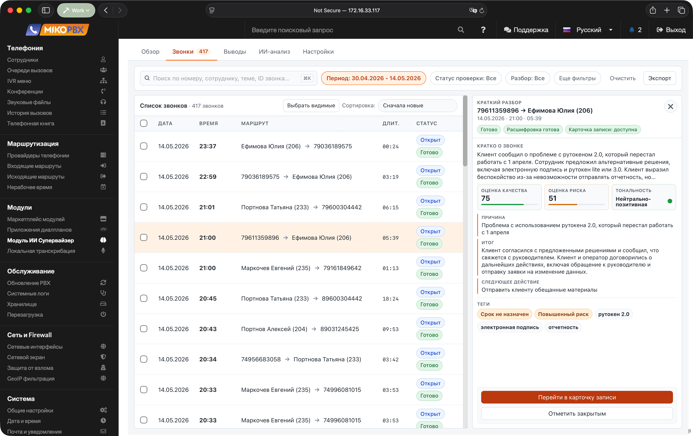<figcaption><p>Вкладка «Звонки»</p></figcaption></figure>

Доступны поиск, сортировка и фильтры по периоду, направлению, сотруднику, тональности, качеству, риску, статусу проверки, статусу разбора, сроку и состоянию ИИ-анализа. Состояние ИИ-анализа позволяет отдельно показать звонки, которые выполняются, завершены полностью или частично, ожидают распознавания речи либо ещё не запускались.

Канонические статусы разбора:

| Статус | Назначение |
| --- | --- |
| **Новый** | Обращение ещё не взято в работу. |
| **В работе** | Руководитель разбирает обращение или ожидает дальнейшее действие. |
| **Отработан** | Разбор завершён. |

Эскалация хранится отдельно от статуса. Старые статусы «ожидание» и «эскалация» преобразуются в «В работе», а «закрыт» и «отклонён» — в «Отработан».

Можно выбрать несколько строк и массово взять обращения в работу, отметить отработанными или вернуть в новые.

#### Карточка звонка

Карточка объединяет факты звонка, встроенное воспроизведение записи, расшифровку, результат анализа и рабочий разбор обращения. В ней доступны:

* краткая сводка разговора;
* причина обращения, итог и следующие действия;
* темы, риски и подтверждающие фрагменты;
* оценки риска, качества, тон общения и сложность разговора, если эти данные доступны;
* голосовые метрики и эмоции, если соответствующие этапы включены;
* обобщённое состояние ИИ-анализа в списке звонков без технической диагностики отдельных этапов в самой карточке;
* ответственный, срок, эскалация и заметки;
* история изменений разбора.

<p><mark style="color:red;">Устарело</mark></p>

<figure>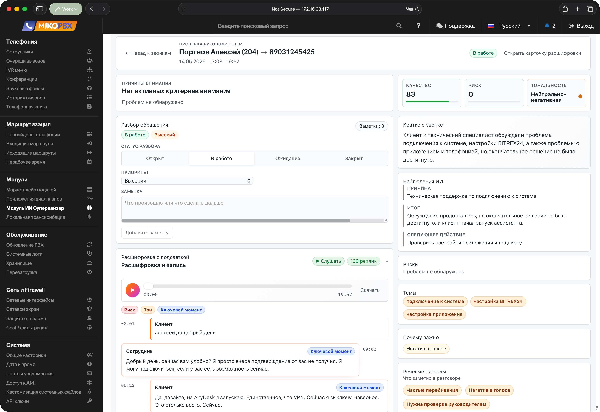<figcaption><p>Карточка звонка</p></figcaption></figure>

### Сводные выводы

Отдельной вкладки **Выводы** больше нет. Управленческие показатели и переходы к проблемным звонкам собраны на **Обзоре** и используют фильтры вкладки **Звонки**.

<p><mark style="color:red;">Устарело</mark></p>

<figure>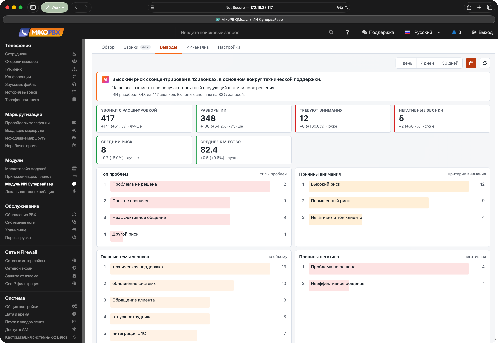<figcaption><p>Прежняя вкладка «Выводы»</p></figcaption></figure>

<p><mark style="color:red;">Устарело</mark></p>

<figure>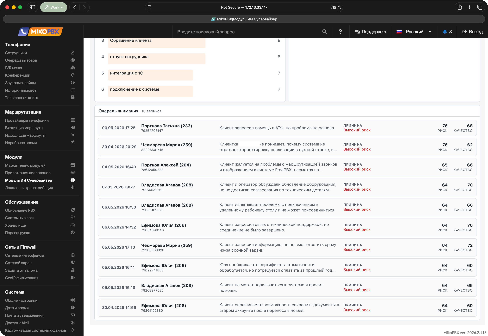<figcaption><p>Прежняя вкладка «Выводы»</p></figcaption></figure>

<p><mark style="color:red;">Устарело</mark></p>

<figure>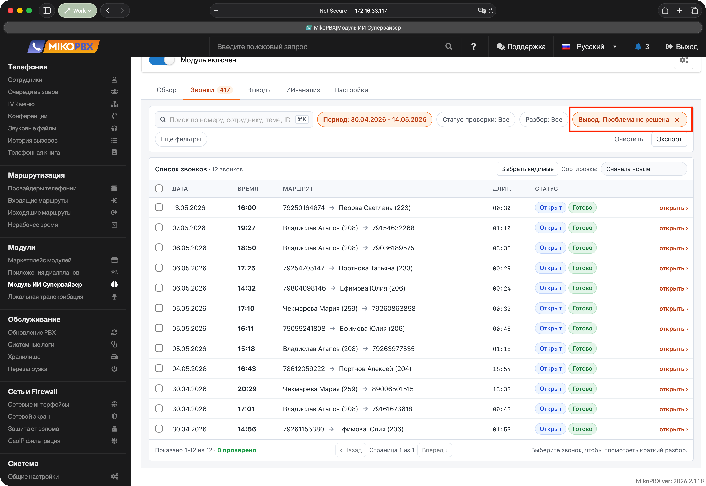<figcaption><p>Переход от аналитического блока к списку звонков</p></figcaption></figure>

### Очередь обработки

Очередь находится в **Настройки** → **Система** → **Обработка**. Здесь отображаются активные, ошибочные, завершённые и пропущенные задания. Можно обновить данные, повторить отдельное ошибочное задание, повторить все ошибки, вернуть просроченные lease в очередь или очистить незавершённую очередь.

Состояние `waiting_for_stt` означает, что заданию нужна расшифровка, но нет ни доступного снимка, ни ответа от модуля распознавания речи. Такое ожидание не считается ошибкой, задание не выдаётся обработчику и не расходует попытки.

<p><mark style="color:red;">Устарело</mark></p>

<figure>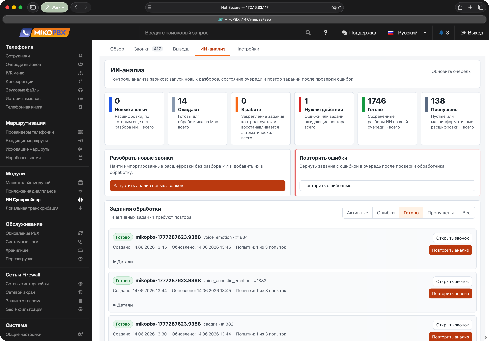<figcaption><p>Прежняя отдельная вкладка «ИИ-анализ»</p></figcaption></figure>

### Вкладка «Настройки»

Настройки разделены на шесть рабочих областей. Изменения сохраняются автоматически; отдельной кнопки **Сохранить настройки** нет.

#### Обработчики

Здесь создаются и удаляются ключи доступа для AI Supervisor Worker. Полное значение нового ключа показывается только один раз. Скопируйте его до закрытия окна.

<p><mark style="color:red;">Устарело</mark></p>

<figure>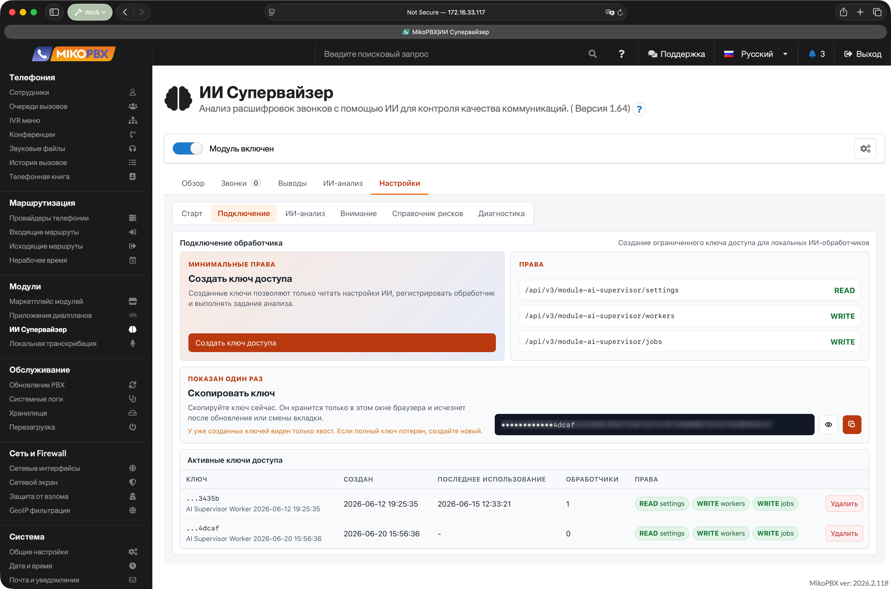<figcaption><p>Прежний экран создания ключа</p></figcaption></figure>

#### Поток звонков

В этом разделе настраиваются:

* автоматический ИИ-анализ;
* обработка внутренних звонков;
* подстановка имён из телефонной книги;
* язык результата;
* автоматический импорт и ручной запуск импорта;
* срок хранения расшифровок и результатов: 3 месяца, 6 месяцев, 1 год, 2 года или бессрочно.

<p><mark style="color:red;">Устарело</mark></p>

<figure>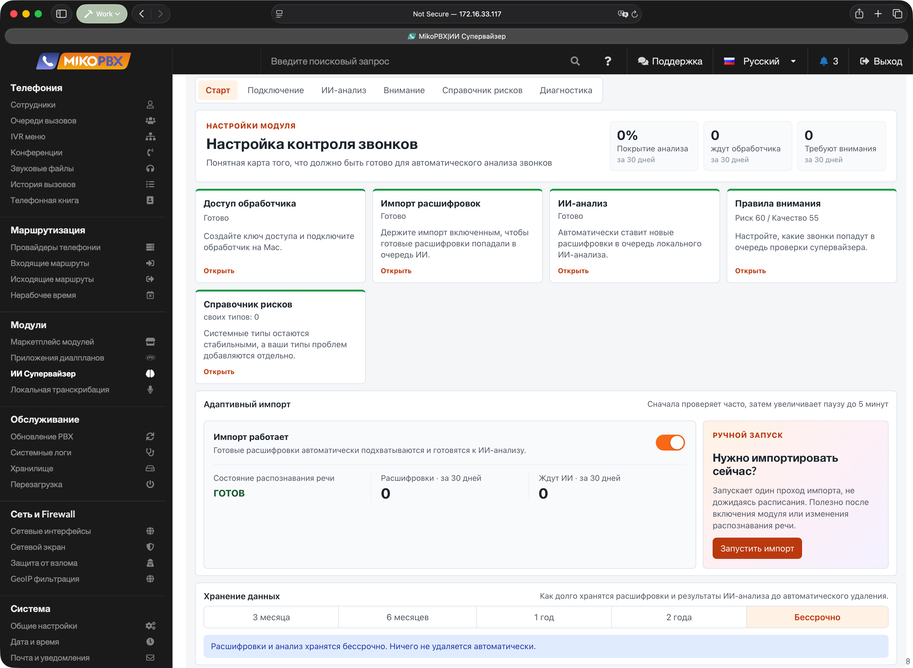<figcaption><p>Прежний раздел «Старт»</p></figcaption></figure>

#### ИИ-анализ

Раздел определяет состав конвейера и профиль модели:

| Компонент | Назначение |
| --- | --- |
| **Сводка** | Структурированный разбор звонка, темы, риски, качество и следующие действия. |
| **Голосовые метрики** | Темп, паузы, перебивания, тишина и баланс участников. |
| **Анализ эмоций** | Текстовое определение эмоций по выбранным фрагментам. |
| **Акустический анализ** | Асинхронное выявление акустических признаков записи. |

Актуальные профили:

| Профиль | Модель | Ориентировочная память | Назначение |
| --- | --- | --- | --- |
| **Qwen3 8B Instruct Q4** | `qwen3:8b` | 6–9 ГБ | Рекомендуемый сбалансированный профиль. |
| **Qwen3.5 4B Q4** | `qwen3.5:4b` | 4–6 ГБ | Быстрый компактный профиль. |
| **Qwen3.5 9B Q4** | `qwen3.5:9b` | 8–12 ГБ | Подробный анализ длинных и сложных звонков. |

В экспертных параметрах доступны время удержания модели в памяти, время ожидания и количество попыток. Размер контекста и фрагмента определяется выбранным профилем.

<p><mark style="color:red;">Устарело</mark></p>

<figure>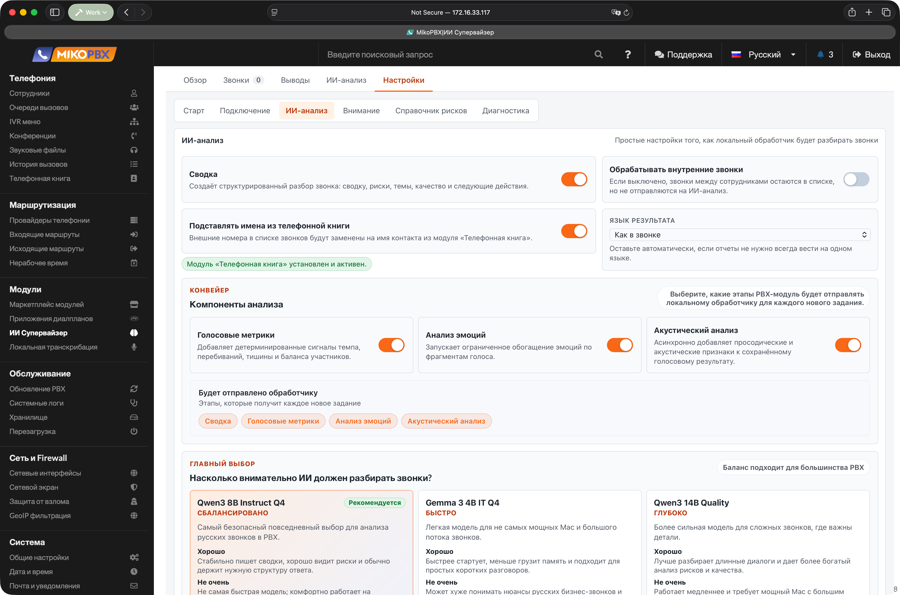<figcaption><p>Прежний вид параметров ИИ-анализа</p></figcaption></figure>

#### Правила внимания

Здесь задаются чувствительность к риску и качеству, а также правила **Клиент недоволен** и **Проблемные отметки ИИ**. Изменения влияют на очередь проверки и фильтры; сохранённые ответы модели при этом не пересчитываются.

<p><mark style="color:red;">Устарело</mark></p>

<figure>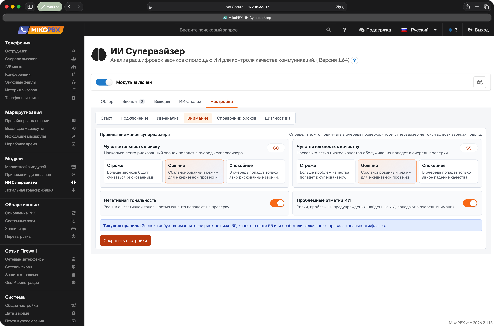<figcaption><p>Прежний вид правил внимания</p></figcaption></figure>

#### Правила поиска

Область содержит две вкладки:

* **Важные ситуации** — системные и пользовательские типы рисков, их важность и инструкция для модели.
* **Темы звонков** — корпоративные темы и синонимы, по которым приводятся к единому виду разные формулировки ИИ.

<p><mark style="color:red;">Устарело</mark></p>

<figure>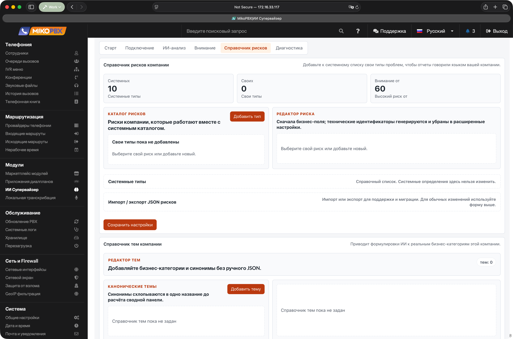<figcaption><p>Прежний вид справочников</p></figcaption></figure>

#### Система

Область **Система** содержит:

* **Сводка** — готовность распознавания речи, доступа обработчика, импорта и очереди;
* **Обработка** — задания, повторы, просроченные lease и очистка незавершённой очереди;
* **Диагностика** — состояние API и STT, покрытие снимками расшифровок, миграция снимков и журнал модуля.

<p><mark style="color:red;">Устарело</mark></p>

<figure>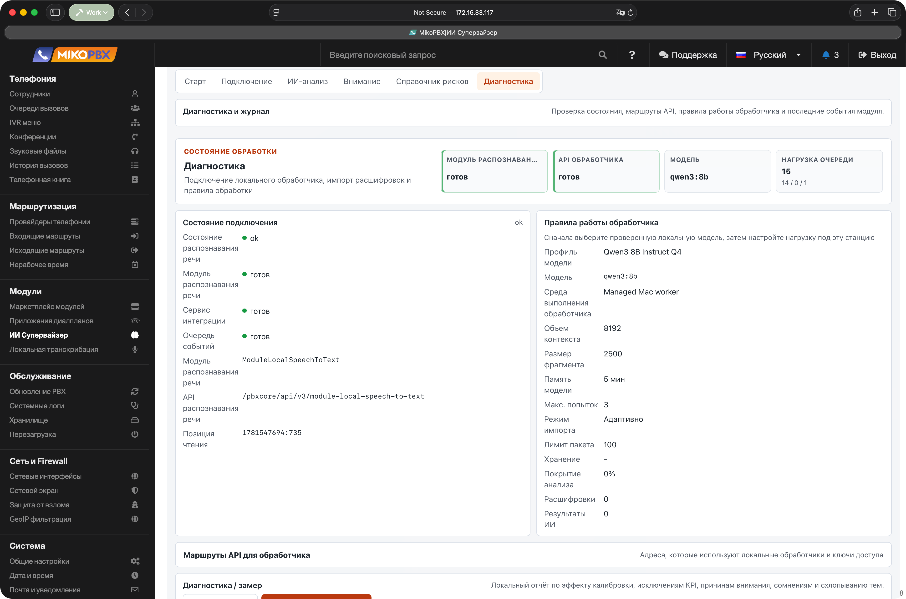<figcaption><p>Прежний экран диагностики</p></figcaption></figure>

### Работа при недоступном распознавании речи

Для подходящих звонков модуль сохраняет сжатый снимок нормализованной расшифровки на 30 дней от времени звонка. В снимке нет аудиозаписи: сохраняются только текст разговора и идентификаторы доказательств.

Если Local Speech To Text временно отключён или недоступен:

* ранее сохранённые результаты, заметки и разборы продолжают работать;
* недавние карточки могут использовать сохранённый снимок;
* очередь и обслуживание lease продолжают работать;
* задания без снимка переходят в `waiting_for_stt`;
* после восстановления STT подходящие задания возвращаются в обработку автоматически.

После 30 дней текст снимка удаляется. Результат ИИ и история разбора сохраняются, но для показа старой расшифровки снова требуется доступный модуль распознавания речи.

### REST API

Модуль использует REST API v3 MikoPBX.

Базовый путь ресурсов модуля:

```text
/pbxcore/api/v3/module-ai-supervisor
```

Все JSON-ответы используют стандартный конверт MikoPBX REST v3 `PBXApiResult`.

Административные ресурсы:

| Метод | Адрес | Назначение |
| --- | --- | --- |
| `GET` | `/health` | Состояние модуля и зависимостей. |
| `GET`, `PATCH` | `/settings` | Чтение и изменение настроек. |
| `GET` | `/dashboard` | Данные обзора. |
| `GET`, `PATCH` | `/calls`, `/calls/{id}` | Список, карточка и обновление разбора звонков. |
| `GET`, `POST` | `/call-notes` | Чтение и добавление заметок. |
| `GET` | `/call-workflow-events` | История разбора. |
| `GET`, `POST`, `PATCH`, `DELETE` | `/jobs` | Список очереди, создание и массовые действия над заданиями. |
| `GET`, `PATCH`, `DELETE` | `/jobs/{id}` | Просмотр, повтор и удаление отдельного задания. |
| `GET`, `POST` | `/worker-api-keys` | Список и создание ключей доступа обработчиков. |
| `DELETE` | `/worker-api-keys/{id}` | Удаление ключа доступа. |
| `GET`, `POST` | `/workers` | Список и регистрация обработчиков. |
| `GET`, `PUT`, `PATCH`, `DELETE` | `/workers/{id}` | Просмотр и управление зарегистрированным обработчиком. |
| `POST` | `/imports` | Запуск импорта расшифровок. |
| `GET` | `/imports/{id}` | Состояние запуска импорта. |
| `GET` | `/audit` | Сводные данные проверки результатов. |
| `POST` | `/audit-runs` | Запуск проверки результатов. |
| `GET` | `/audit-runs/{id}` | Состояние и результат проверки. |
| `GET` | `/logs` | Журнал модуля. |

Основные ресурсы обработчика:

* `GET /worker-api-contract`;
* `POST /workers`;
* `POST /job-leases`;
* `PATCH` и `DELETE /job-leases/{id}`;
* `GET /job-recordings/{id}`;
* `PUT /job-results/{id}`;
* `PUT /job-failures/{id}`;
* `PUT /job-partials/{id}`;
* `PATCH /job-voice-analytics/{id}`.

### Если что-то не работает

**На вкладке «Звонки» пусто**

* Проверьте, что установлен и включён модуль локального распознавания речи.
* Убедитесь, что в нём есть завершённые расшифровки.
* Откройте **Настройки** → **Система** → **Сводка**.
* Проверьте автоматический импорт в **Настройки** → **Поток звонков** и при необходимости запустите импорт вручную.

**Задания не обрабатываются**

* Откройте **Настройки** → **Система** → **Обработка**.
* Проверьте ошибки и состояние `waiting_for_stt`.
* Убедитесь, что автоматический анализ включён в разделе **Поток звонков**.
* Для внутренних звонков включите соответствующую настройку.

**Обработчик не подключается**

* Проверьте совместимость ModuleAISupervisor 1.73 и AI Supervisor Worker 1.7 build 34.
* Убедитесь, что используется ключ ИИ Супервайзера, а не токен Local STT Worker.
* Проверьте адрес PBX, сертификат TLS и файл CA.
* Откройте в приложении раздел **Диагностика** и выполните проверку соединения.

**Модель не готовится**

* Откройте в AI Supervisor Worker раздел **Модели** и нажмите **Обновить**.
* Проверьте состояние Ollama, выбранную PBX модель и свободное место.
* Для меньшего расхода памяти выберите **Qwen3.5 4B Q4**.
* Подробности загрузки и ошибки смотрите в разделах **Активность** и **Диагностика**.
