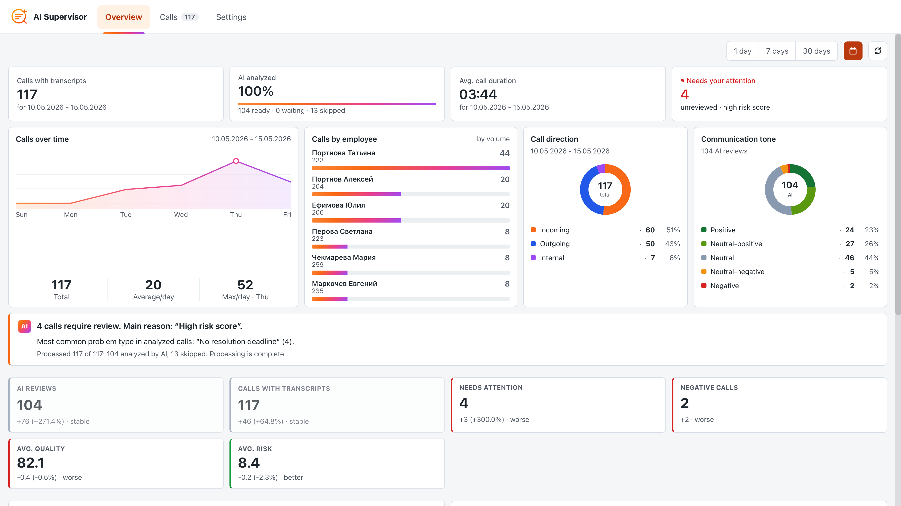
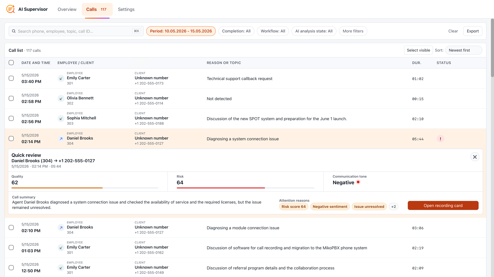
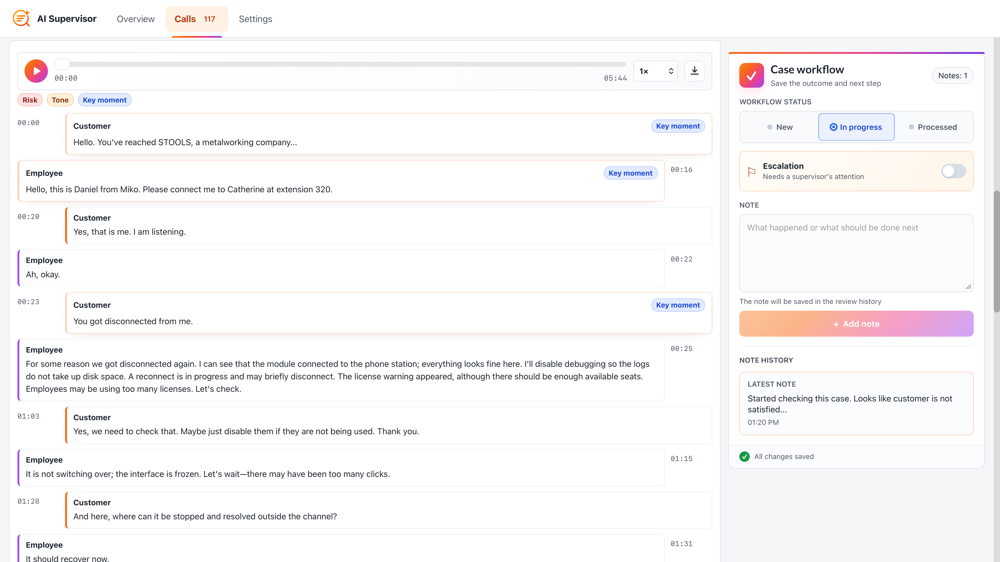
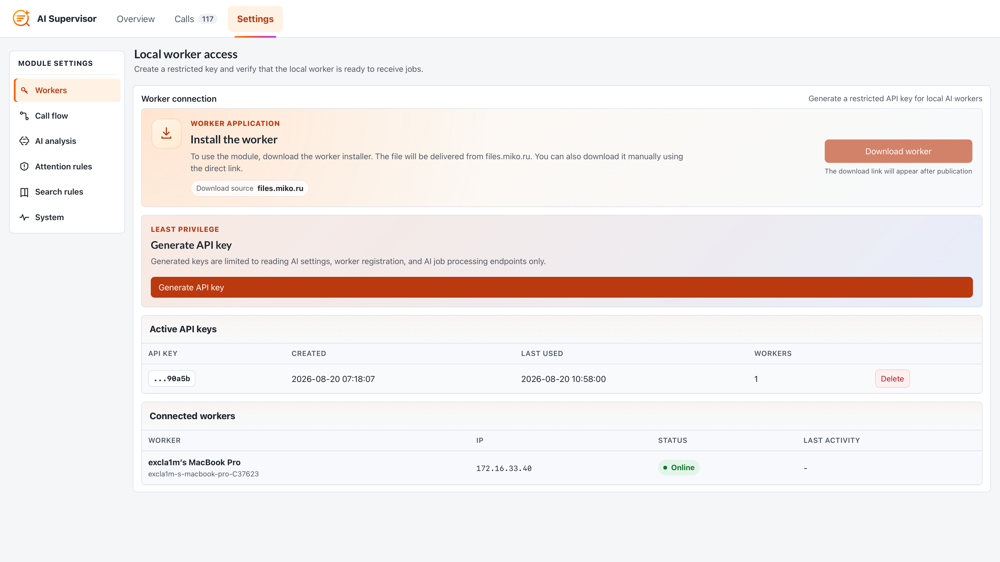
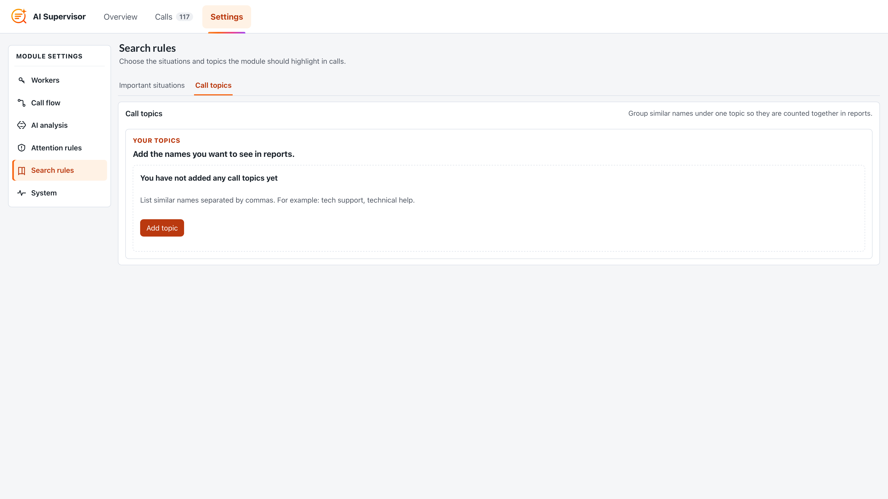

# AI Supervisor Module

The **AI Supervisor** module analyzes completed MikoPBX call transcripts and helps supervisors monitor communication quality. It produces short and detailed summaries, identifies the contact reason and call outcome, highlights next actions, topics, risks, and supporting evidence, and evaluates sentiment, risk, and service quality.

The MikoPBX module does not run a language model itself. It imports transcripts, manages the queue, and stores access keys and results. A separate **AI Supervisor Worker** application performs the local processing on a Mac. By default, the application uses Ollama and a local model, so transcripts and analysis results remain within your infrastructure.

<figure><figcaption><p>Module home page</p></figcaption></figure>

### How analysis works

The solution consists of three independent components:

1. The **Local Speech To Text** module creates a transcript and publishes the `transcript.completed` event.
2. The **AI Supervisor** module imports the transcript, creates a job, and saves the analysis result.
3. **AI Supervisor Worker** on the Mac receives the job, prepares the local model, performs the analysis, and sends the result to MikoPBX.

A typical processing cycle is as follows:

1. After a call, the speech recognition module creates a completed transcript.
2. AI Supervisor imports the event and saves a reference to the transcript.
3. A `call_summary` job is created for an eligible call.
4. The worker registers and acquires a lease through `POST /job-leases`.
5. For a long conversation, the worker analyzes it in chunks and saves partial results.
6. The final JSON is validated in the application and then validated again in the module.
7. The result appears on the **Overview** and **Calls** tabs.

### Requirements and compatibility

* MikoPBX **2025.1.1** or later.
* The Local Speech To Text module installed and enabled.
* Network access from the Mac to the MikoPBX web interface.
* Internet access for the initial Ollama installation and local model downloads.

### Installing the module

1. Open the MikoPBX web interface.
2. Go to **Modules** → **Module marketplace**.

<figure><figcaption><p>Module marketplace</p></figcaption></figure>

3. Find **AI Supervisor** and install it.
4. Open the **Installed modules** tab and enable the module.

<mark style="color:green;">NEED A SCREENSHOT</mark>

5. Click the settings button to the right of the module version.

<mark style="color:green;">NEED A SCREENSHOT</mark>

### Module navigation

The current version has three main tabs:

| Tab          | Purpose                                                                                         |
| ------------ | ----------------------------------------------------------------------------------------------- |
| **Overview** | Call metrics, AI analysis coverage, the attention queue, and aggregate analytics.               |
| **Calls**    | Imported calls, filters, the call card, transcript, analysis, and case workflow.                |
| **Settings** | Workers, import, analysis components, attention rules, catalogs, the queue, and diagnostics.    |

### Overview tab

The **Overview** tab shows call supervision status for the selected period.

<figure><figcaption><p>Overview tab</p></figcaption></figure>

Key metrics:

| Metric                     | Meaning                                                                                                             |
| -------------------------- | ------------------------------------------------------------------------------------------------------------------- |
| **Calls with transcripts** | Number of imported calls during the selected period.                                                               |
| **AI analyzed**            | Number and proportion of calls with a saved analysis result.                                                       |
| **Avg. call duration**     | Average duration of calls during the selected period.                                                              |
| **Needs your attention**   | Calls not yet reviewed by an operator that match risk, quality, sentiment, or AI problem-flag rules.               |

Below the metrics are charts for calls over time, employees, call directions, communication tone, and calls that need review. Selecting a metric or analytics block opens the corresponding list on the **Calls** tab.

### Calls tab

The **Calls** tab is the supervisor's main workspace.

<figure><figcaption><p>Calls tab</p></figcaption></figure>

You can search, sort, and filter by period, direction, employee, sentiment, quality, risk, completion status, workflow status, due date, and AI analysis state. The AI analysis state can separately show calls that are in progress, complete or incomplete, waiting for speech recognition, or not yet started.

Workflow statuses:

| Status          | Purpose                                                                    |
| --------------- | -------------------------------------------------------------------------- |
| **New**         | The case has not yet been taken into work.                                 |
| **In progress** | A supervisor is reviewing the case or waiting for a follow-up action.      |
| **Processed**   | The review is complete.                                                    |

You can select multiple rows and use bulk actions to take cases into work, mark them as processed, or return them to New.

#### Call card

The call card combines call details, built-in recording playback, the transcript, analysis results, and the case workflow. It includes:

* short and detailed summaries;
* contact reason, outcome, and next actions;
* topics, risks, and supporting evidence;
* risk, quality, and sentiment scores;
* key moments with time navigation;
* voice metrics and emotions when the corresponding stages are enabled;
* the state of every AI analysis stage;
* assignee, due date, escalation, and notes;
* case workflow history.

<figure><figcaption></figcaption></figure>

<figure><figcaption><p>Call card</p></figcaption></figure>

### Processing queue

The queue is located under **Settings** → **System** → **Processing**. It shows active, failed, completed, and skipped jobs. You can refresh the data, retry an individual failed job, retry all failures, return expired leases to the queue, or clear the unfinished queue.

The `waiting_for_stt` state means that a job needs a transcript, but neither an available snapshot nor a response from the speech recognition module is available. This waiting state is not an error: the job is not leased to a worker and does not consume attempts.

<mark style="color:red;">Outdated</mark>

<mark style="color:green;">NEED A SCREENSHOT</mark>

### Settings tab

Settings are divided into six work areas. Changes are saved automatically; there is no separate **Save settings** button.

#### Workers

Create and delete access keys for AI Supervisor Worker here. The complete value of a new key is displayed only once. Copy it before closing the window.

<figure><figcaption><p>Worker access in module settings</p></figcaption></figure>

#### Call flow

This section configures:

* automatic AI analysis;
* processing of internal calls;
* contact names from PhoneBook;
* AI result language;
* automatic import and manual import runs;
* transcript and result retention: 3 months, 6 months, 1 year, 2 years, or forever.

<figure><figcaption><p>Call flow section</p></figcaption></figure>

#### AI analysis

This section defines the analysis pipeline and the models to be used:


LLM stands for Large Language Model. It is a machine-learning model that can work with language: read text, understand its meaning in context, and generate coherent responses.


| Component                                      | Purpose                                                         |
| ---------------------------------------------- | --------------------------------------------------------------- |
| **Summary (LLM model)**                        | Structured call review, topics, risks, and quality.             |
| **Voice metrics (Technical analysis)**         | Tempo, pauses, interruptions, silence, and speaker balance.     |
| **Emotion Analysis (LLM model)**               | Text-based emotion detection for selected fragments.            |
| **Acoustic analysis (Acoustic model)**         | Asynchronous detection of acoustic features in the recording.   |

Current LLM model profiles:

| Profile                    | Model          | Approximate memory | Purpose                                        |
| -------------------------- | -------------- | ------------------ | ---------------------------------------------- |
| **Qwen3 8B Instruct Q4**   | `qwen3:8b`     | 6–9 GB             | Recommended balanced profile.                  |
| **Qwen3.5 4B Q4**          | `qwen3.5:4b`   | 4–6 GB             | Fast, compact profile.                         |
| **Qwen3.5 9B Q4**          | `qwen3.5:9b`   | 8–12 GB            | Detailed analysis of long and complex calls.   |

Expert parameters include the time the model remains loaded in memory, request timeout, and number of attempts. The selected profile determines the context and chunk sizes.

<figure><figcaption><p>Module AI analysis parameters</p></figcaption></figure>

#### Attention rules

Set risk and quality thresholds and rules for negative sentiment and AI problem flags here. Changes affect the review queue and filters; saved model responses are not recalculated.

<figure><figcaption><p>Attention rules and sensitivity settings</p></figcaption></figure>

#### Search rules

This area contains two tabs:

* **Important situations** — system and custom call risk types, their importance for analysis, and instructions that tell the model how to recognize each situation.

<figure><figcaption><p>Search rules → Important situations</p></figcaption></figure>

* **Call topics** — company-specific topics and aliases that normalize different AI-generated descriptions under the same topic.

<figure><figcaption><p>Search rules → Call topics</p></figcaption></figure>

#### System

The **System** area contains:

* **Status** — readiness of speech recognition, worker access, import, and the queue;
* **Processing** — jobs, retries, expired calls, and unfinished call queue cleanup;
* **Diagnostics** — logs and a technical debugging summary.

<figure><figcaption><p>Former diagnostics screen</p></figcaption></figure>

### REST API

Base path:

```
/pbxcore/api/v3/module-ai-supervisor
```

| Method                           | Address                                     | Purpose                                             |
| -------------------------------- | ------------------------------------------- | --------------------------------------------------- |
| `GET`, `PATCH`                   | `/settings`                                 | Read and update settings.                           |
| `GET`                            | `/dashboard`                                | Overview data.                                      |
| `GET`, `PATCH`                   | `/calls`, `/calls/{id}`                     | Call list, call card, and workflow updates.         |
| `GET`, `POST`                    | `/call-notes`                               | Read and add notes.                                 |
| `GET`                            | `/call-workflow-events`                     | Workflow history.                                   |
| `GET`, `POST`, `PATCH`, `DELETE` | `/jobs`, `/jobs/{id}`                       | Queue and job actions.                              |
| `GET`, `POST`, `DELETE`          | `/worker-api-keys`, `/worker-api-keys/{id}` | Worker access keys.                                 |
| `POST`, `GET`                    | `/imports`, `/imports/{id}`                 | Start an import and read its status.                |
| `GET`                            | `/logs`                                     | Module log.                                         |

Primary worker resources:

* `GET /worker-api-contract`;
* `POST /workers`;
* `POST /job-leases`;
* `PATCH` and `DELETE /job-leases/{id}`;
* `GET /job-recordings/{id}`;
* `PUT /job-results/{id}`;
* `PUT /job-failures/{id}`;
* `PUT /job-partials/{id}`;
* `PATCH /job-voice-analytics/{id}`.

### Troubleshooting

**The Calls tab is empty**

* Check that the Local Speech To Text module is installed and enabled.
* Make sure it contains completed transcripts.
* Open **Settings** → **System** → **Status**.
* Check automatic import under **Settings** → **Call flow** and run an import manually if necessary.

**Jobs are not being processed**

* Open **Settings** → **System** → **Processing**.
* Check for errors and the `waiting_for_stt` state.
* Make sure automatic analysis is enabled under **Call flow**.
* Enable the corresponding setting if internal calls must be processed.

**The worker cannot connect**

* Check compatibility between ModuleAISupervisor 1.73 and AI Supervisor Worker 1.7 build 34.
* Make sure you are using an AI Supervisor key, not a Local STT Worker token.
* Check the PBX address, TLS certificate, and CA file.
* Open **Diagnostics** in the application and run the connection test.

**The model cannot be prepared**

* Open **Models** in AI Supervisor Worker and click **Refresh**.
* Check Ollama status, the model selected by the PBX, and free disk space.
* Select **Qwen3.5 4B Q4** to use less memory.
* See **Activity** and **Diagnostics** for download details and errors.
