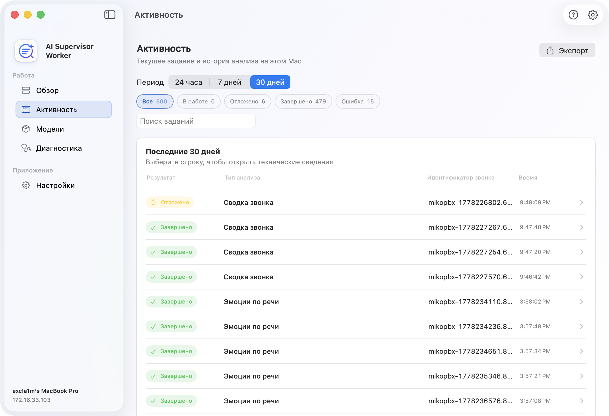
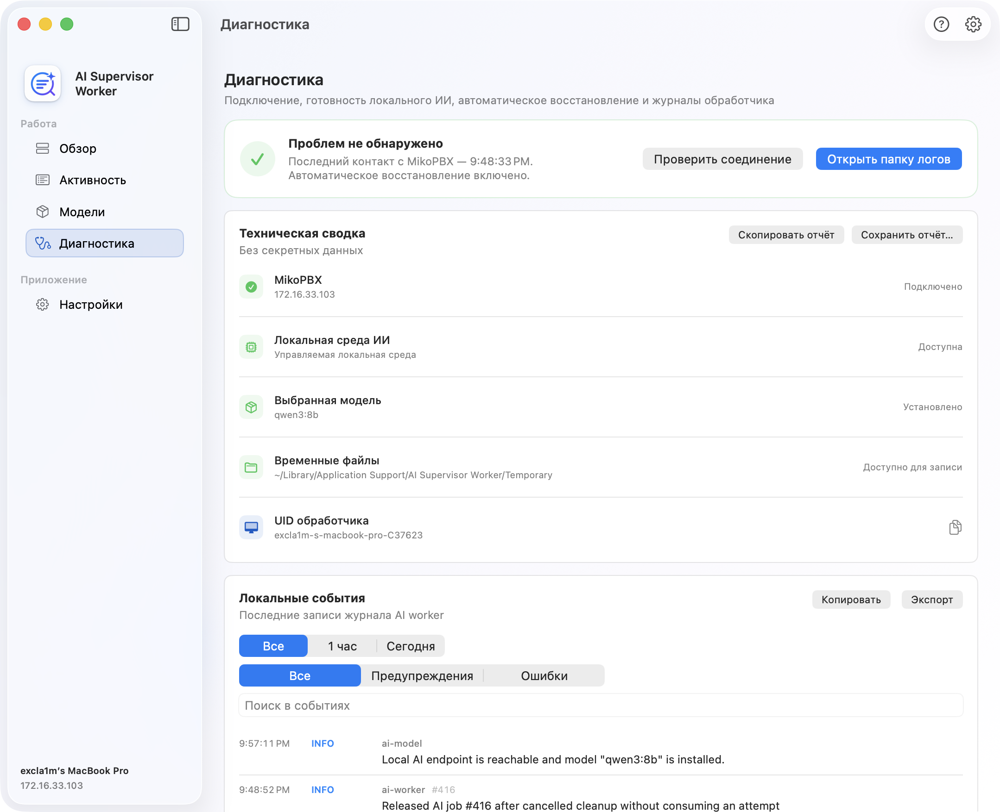
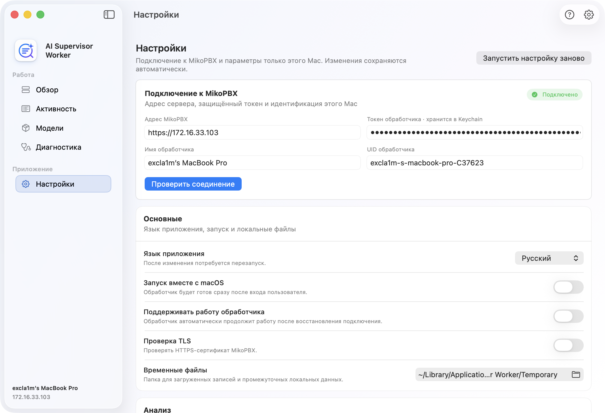
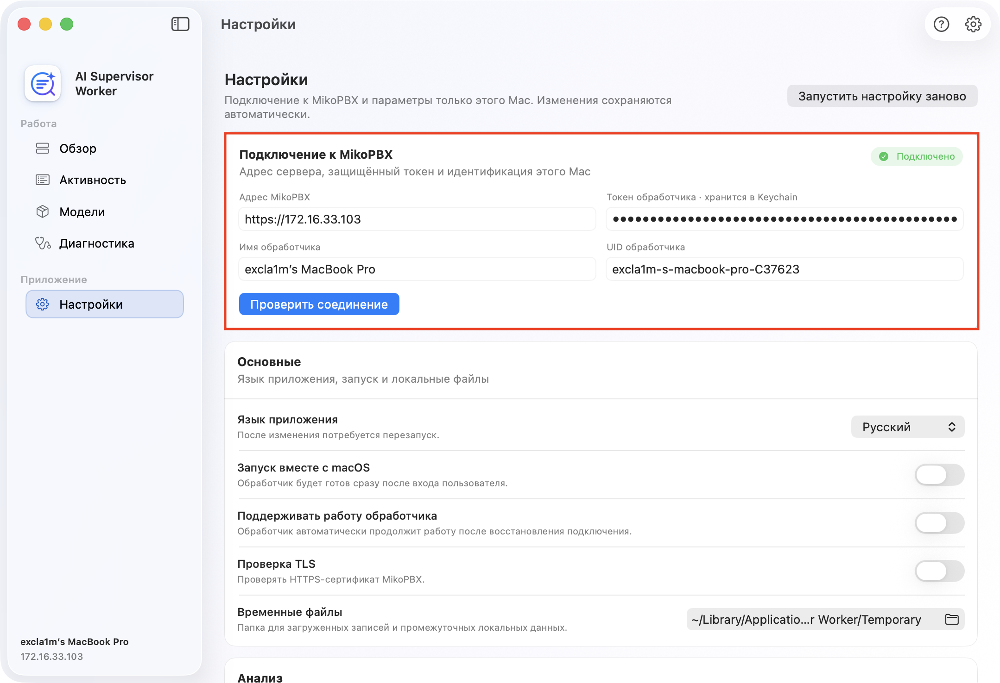

# MIKO AI Worker: ИИ-анализ

**AI Supervisor Worker** - самостоятельное приложение для macOS, которое выполняет локальный ИИ-анализ готовых расшифровок из MikoPBX. Приложение получает задания от **Модуля ИИ Супервайзер**, использует локальную языковую модель, обрабатывает запись звонка и отправляет структурированный результат обратно в PBX.

Приложение не выбирает звонки для анализа и не хранит серверную очередь. Импорт расшифровок, состав анализа, профиль модели, язык результата, правила внимания и сохранённые результаты управляются модулем на стороне MikoPBX.

<figure><figcaption>
Интерфейс приложения-обработчика
</figcaption></figure>

### Требования и совместимость

* Mac с Apple Silicon.
* macOS 14 или новее.
* MikoPBX 2025.1.1 или новее.
* Доступ Mac к MikoPBX.
* Локальная среда Ollama или совместимый с OpenAI локальный endpoint.
* Доступ в интернет при первой установке среды и моделей.

### Навигация приложения

В боковой панели доступны:

| Раздел          | Назначение                                                               |
| --------------- | ------------------------------------------------------------------------ |
| **Обзор**       | Готовность обработчика, соединение, текущая работа и краткая статистика. |
| **Активность**  | Текущее задание и локальная история обработки с фильтрами и экспортом.   |
| **Модели**      | Ollama, выбранная PBX модель, компоненты анализа и локальные модели.     |
| **Диагностика** | Соединение, готовность среды, автоматическое восстановление и журнал.    |
| **Настройки**   | Подключение к MikoPBX, локальное поведение и параметры анализа.          |

Отдельного экрана **Регистрация** больше нет. Адрес PBX, токен, имя и UID обработчика находятся в разделе **Настройки**.

### Раздел «Обзор»

**Обзор** - основной экран состояния AI Supervisor Worker. Здесь находятся:

* общий статус и главное доступное действие;
* состояние соединения с MikoPBX и время последнего контакта;
* количество обработанных сегодня звонков и доля успешных;
* текущая работа и ход выполнения задания;
* последние локальные задания.

Основные состояния:

| Состояние                         | Что делать                                              |
| --------------------------------- | ------------------------------------------------------- |
| **Требуется настройка**           | Откройте подключение и укажите адрес PBX и токен.       |
| **Проверка локального ИИ**        | Дождитесь проверки Ollama и моделей.                    |
| **Загрузка модели**               | Не закрывайте приложение до завершения загрузки.        |
| **Локальный ИИ требует внимания** | Откройте раздел **Модели**.                             |
| **Готов к запуску**               | Нажмите **Запустить обработчик**.                       |
| **Всё работает**                  | Обработчик подключён и автоматически проверяет очередь. |
| **Анализируется звонок**          | Текущее задание обрабатывается локально.                |
| **Подключение к MikoPBX**         | Обработчик автоматически восстанавливает соединение.    |
| **Обработчик требует внимания**   | Откройте **Диагностику**.                               |

### Раздел «Активность»

В разделе **Активность** отображается текущая работа и сохранённая на этом Mac история заданий. История сохраняется после перезапуска приложения, но не является серверной очередью MikoPBX.

Доступны:

* периоды 24 часа, 7 дней и 30 дней;
* фильтры **В работе**, **Отложено**, **Завершено** и **Ошибка**;
* поиск по заданию и идентификатору звонка;
* раскрытие строки с моделью, типом анализа, компонентами и текстом ошибки;
* экспорт видимых строк в CSV.

Статус **Отложено** означает, что обработчик безопасно освободил задание для повторной обработки, например при временно недоступной локальной модели или зависимости.

<figure><figcaption>
Раздел "Активность" в интерфейсе приложения
</figcaption></figure>

### Раздел «Модели»

Раздел **Модели** показывает локальную среду, профиль анализа из MikoPBX и установленные модели.

<figure><figcaption>
Прежний раздел управления моделями
</figcaption></figure>

На странице находятся:

* карточка установки Ollama, если среда ещё отсутствует;
* готовность endpoint и модели;
* выбранная MikoPBX модель;
* профиль подключённых компонентов: сводка, голосовые метрики, текстовые и акустические эмоции;
* список установленных локальных моделей;
* состояние моделей голосовой аналитики;
* ход текущей загрузки.

Кнопка **Обновить** повторно проверяет среду, модель и голосовые компоненты. Отдельных кнопок **Проверить среду** и **Проверить модель** в текущем интерфейсе нет.

Для локальных моделей доступны:

| Действие     | Описание                                          |
| ------------ | ------------------------------------------------- |
| **Показать** | Открыть расположение модели или связанных файлов. |
| **Удалить**  | Удалить модель из управляемой локальной среды.    |

Удаление отключено, пока обработчик запущен или модель используется. Если MikoPBX снова выберет удалённую модель, обработчик сможет загрузить её заново.

### Раздел «Диагностика»

**Диагностика** объединяет проверку состояния и локальный журнал.

В верхней части отображаются:

* состояние соединения с MikoPBX;
* токен и UID обработчика;
* локальный endpoint и выбранная модель;
* восстановление после временной ошибки;
* кнопки **Проверить соединение** и **Открыть папку журналов**.

Журнал поддерживает:

* периоды **1 час**, **Сегодня** и **Все**;
* уровни **Все**, **Предупреждения** и **Ошибки**;
* поиск по событиям;
* копирование видимых записей;
* экспорт в файл.

<figure><figcaption>
Раздел "Диагностика" в интерфейсе приложения
</figcaption></figure>

### Раздел «Настройки»

<figure><figcaption>
Настройки приложения 
</figcaption></figure>

Настройки разделены на три группы.

#### Подключение к MikoPBX

Содержит адрес станции, токен в Keychain, имя, UID и проверку соединения.

Необходимые поля:

| Поле                  | Описание                                                             |
| --------------------- | -------------------------------------------------------------------- |
| **Адрес MikoPBX**     | Полный адрес с `http://` или `https://`.                             |
| **Токен обработчика** | Ключ, созданный в ИИ Супервайзере → **Настройки** → **Обработчики**. |
| **Имя обработчика**   | Понятное имя этого Mac в MikoPBX.                                    |
| **UID обработчика**   | Стабильный технический идентификатор.                                |

Нажмите **Проверить соединение**. Приложение сначала запрашивает `GET /worker-api-contract`, проверяет ModuleAISupervisor, версию API и необходимые возможности, затем использует токен для регистрации.

<figure><figcaption>
Раздел "Подключение к MikoPBX" в настройках приложения
</figcaption></figure>

#### Основные

| Настройка                           | Назначение                                                           |
| ----------------------------------- | -------------------------------------------------------------------- |
| **Язык приложения**                 | Язык интерфейса. После изменения требуется перезапуск.               |
| **Запускать вместе с macOS**        | Открывать приложение после входа пользователя.                       |
| **Поддерживать работу обработчика** | Автоматически возобновлять работу после восстановления сети или PBX. |
| **Проверка TLS**                    | Проверять HTTPS-сертификат MikoPBX.                                  |
| **Файл CA**                         | Собственный PEM/CRT/CER для частного сертификата.                    |
| **Временные файлы**                 | Каталог для временных записей и промежуточных данных.                |

#### Анализ

| Настройка                       | Назначение                                                                                |
| ------------------------------- | ----------------------------------------------------------------------------------------- |
| **Профиль анализа**             | Открывает раздел **Модели**; активные компоненты приходят из задания MikoPBX.             |
| **OpenAI-совместимый endpoint** | Локальный адрес для структурированного анализа, по умолчанию `http://127.0.0.1:11434/v1`. |
| **Профиль модели эмоций**       | Модель для текстового анализа эмоций.                                                     |
| **Максимум фрагментов**         | Ограничение числа фрагментов для анализа эмоций.                                          |
| **Минимальная длина звонка**    | Более короткие звонки пропускают необязательное обогащение эмоций.                        |

Профиль основной модели, размер контекста и состав анализа задаются в MikoPBX и передаются в каждом задании.
