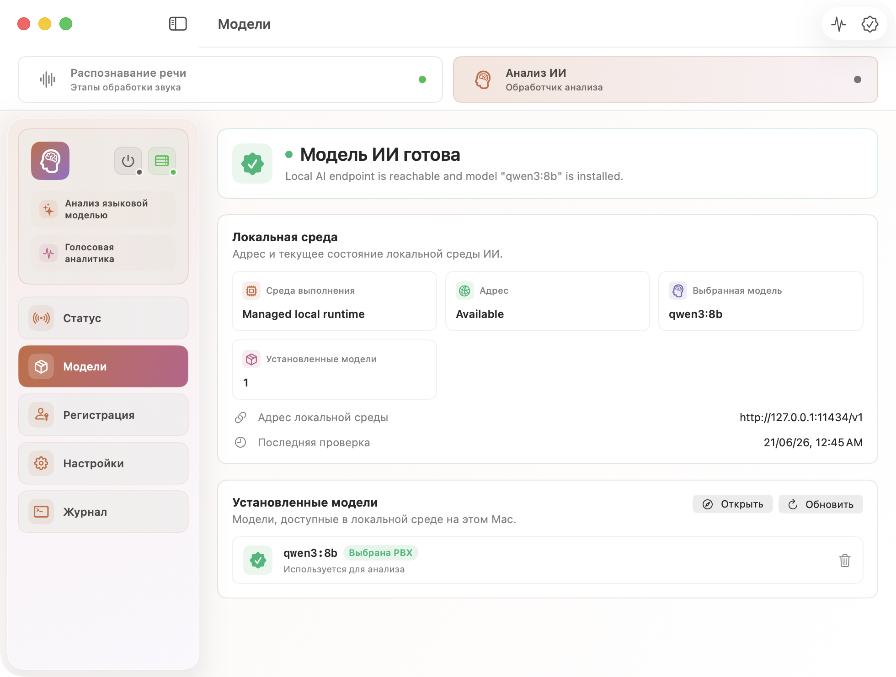
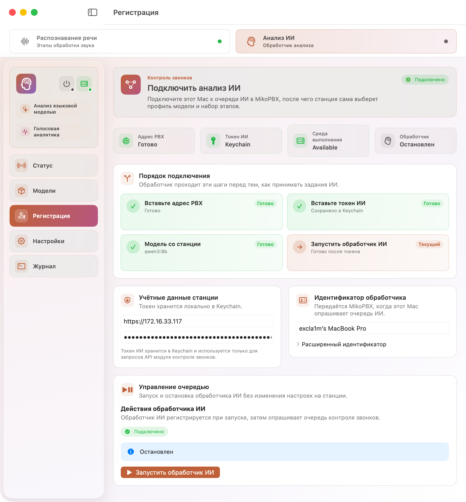
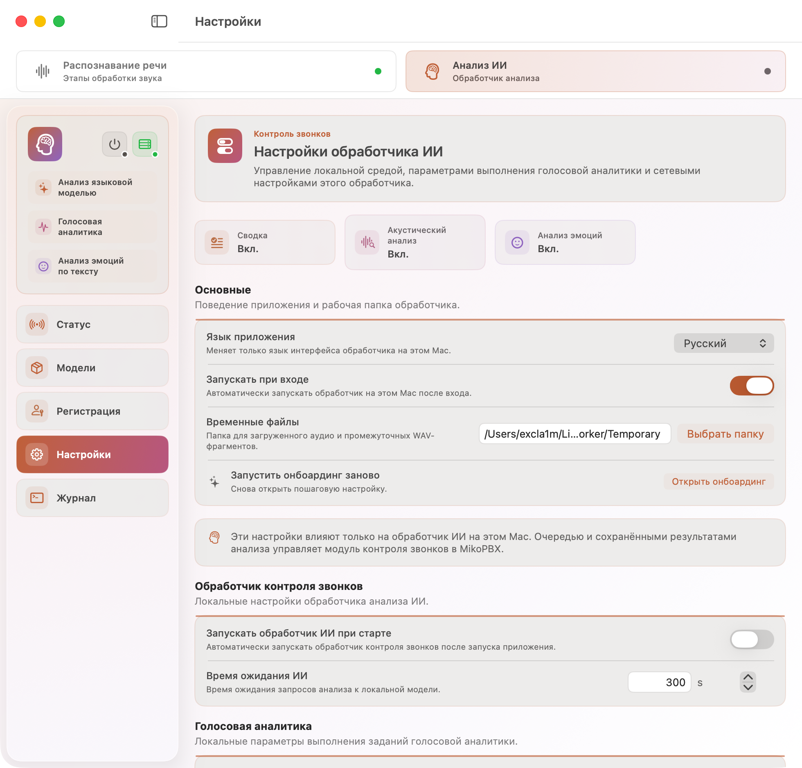
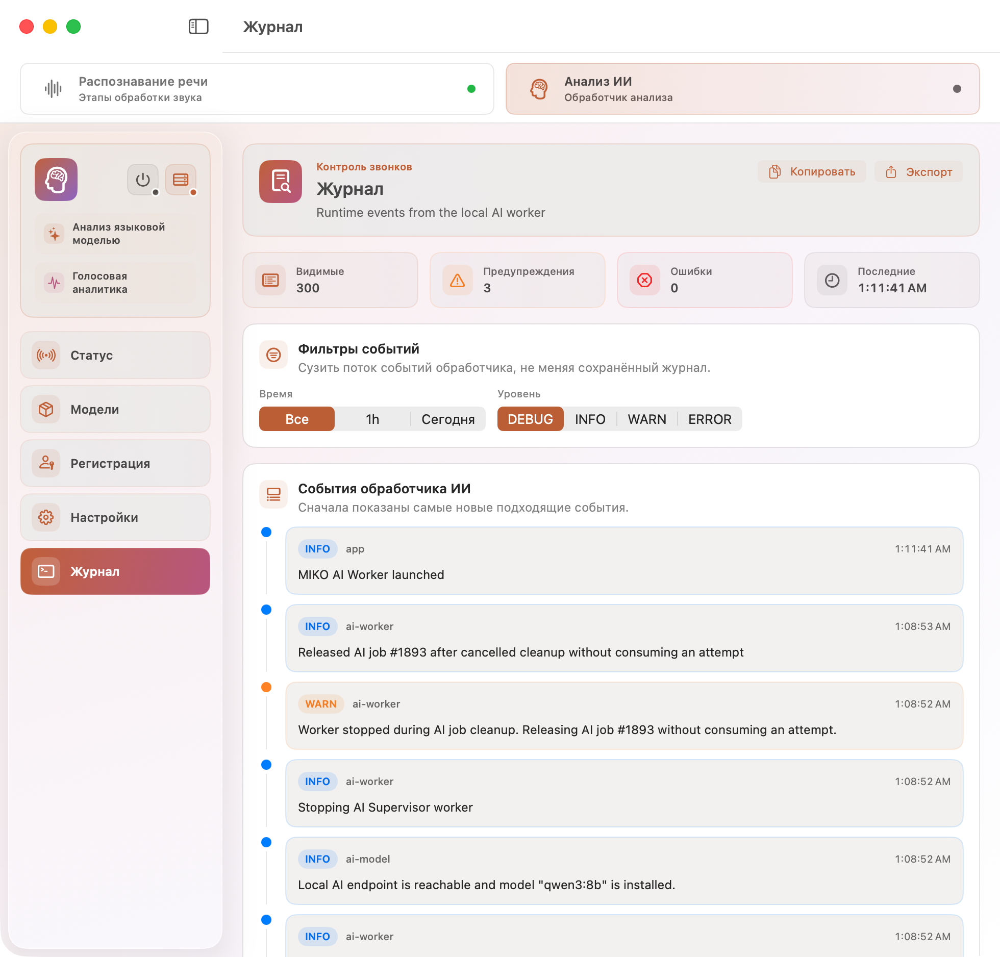

# MIKO AI Worker: ИИ-анализ

**MIKO AI Worker** - это приложение для Mac, которое выполняет локальные задания из MikoPBX. В этой статье описан режим **Анализ ИИ**: подключение к модулю **ИИ Супервайзер**, запуск локального обработчика, подготовка модели, этапы анализа и диагностика.

Приложение не выбирает, какие звонки нужно анализировать. Импорт расшифровок, очередь заданий, профиль модели, язык результата, правила внимания и сохранение итогов настраиваются в **Модуле ИИ Супервайзер** на стороне MikoPBX. Обработчик получает уже готовое задание, запускает локальную модель на Mac и отправляет результат обратно в PBX.

<figure><figcaption>
Интерфейс приложения
</figcaption></figure>

### Навигация приложения

В верхней части окна выбирается рабочий режим: **Распознавание речи** или **Анализ ИИ**. При выбранном режиме **Анализ ИИ** доступны экраны локального ИИ-обработчика.

| Раздел          | Назначение                                                                                                            |
| --------------- | --------------------------------------------------------------------------------------------------------------------- |
| **Анализ ИИ**   | Главный экран: запуск, остановка, состояние подключения, текущий этап анализа, этапы обработки и недавние задания.    |
| **Модели ИИ**   | Локальная среда ИИ и модели, которые установлены на этом Mac.                                                         |
| **Регистрация** | Адрес MikoPBX, токен контроля звонков, имя и UID обработчика.                                                         |
| **Настройки**   | Локальные настройки обработчика: автозапуск, время ожидания, голосовая аналитика, префикс API, TLS и сетевые повторы. |
| **Журнал**      | Локальный журнал обработчика ИИ с фильтрами, копированием и экспортом.                                                |

Разделы режима **Распознавание речи** относятся к локальной расшифровке звонков и не управляют анализом ИИ.

### Раздел "Статус"

**Статус**- основной рабочий экран локального ИИ-обработчика. Здесь видно, готов ли Mac к работе, запущен ли обработчик, какой этап выполняется и какие задания недавно проходили через эту машину.

<figure><figcaption>
Главный раздел "Статус"
</figcaption></figure>

**Верхний блок состояния**

Верхний блок показывает текущее состояние и основное действие.

| Состояние                                | Что означает                                                              |
| ---------------------------------------- | ------------------------------------------------------------------------- |
| **Нужна регистрация ИИ**                 | Не указан адрес PBX или токен контроля звонков.                           |
| **Готов к анализу ИИ**                   | Данные подключения есть, обработчик можно запускать.                      |
| **Регистрация обработчика ИИ**           | Обработчик регистрируется в MikoPBX.                                      |
| **Обработчик ИИ зарегистрирован**        | Mac подключен и готов получать задания.                                   |
| **Загрузка локальной модели ИИ**         | Локальная модель загружается или подготавливается.                        |
| **Локальная среда ИИ недоступна**        | Локальная среда недоступна. Обычно нужно запустить или установить Ollama. |
| **Локальная модель ИИ не установлена**   | Среда доступна, но выбранная модель еще не установлена.                   |
| **Идёт анализ языковой моделью**         | Выполняется основное задание сводки и анализа звонка.                     |
| **Идёт голосовая аналитика**             | Выполняется голосовое или эмоциональное обогащение результата.            |
| **Голосовая аналитика требует внимания** | Голосовой анализ завершился ошибкой или требует проверки.                 |
| **Идёт повтор запроса к PBX**            | Обработчик временно не получил ответ от PBX и повторяет запрос.           |

Доступные действия:

| Кнопка                       | Назначение                                                         |
| ---------------------------- | ------------------------------------------------------------------ |
| **Открыть регистрацию**      | Открыть раздел регистрации, если не хватает адреса PBX или токена. |
| **Открыть модели ИИ**        | Открыть раздел моделей, если нужно проверить среду или модель.     |
| **Запустить обработчик ИИ**  | Начать опрос очереди контроля звонков.                             |
| **Остановить обработчик ИИ** | Остановить локальный обработчик ИИ.                                |


Обработчик ИИ регистрируется в MikoPBX при запуске. Отдельной кнопки регистрации нет: вставьте токен контроля звонков и нажмите **Запустить обработчик ИИ**.


#### **Этапы анализа ИИ**

Блок **Этапы анализа ИИ** показывает, какие этапы обработки включены и что происходит с текущим заданием.

| Этап                    | Что делает                                                                                   |
| ----------------------- | -------------------------------------------------------------------------------------------- |
| **Сводка**              | Создает структурированный разбор звонка: сводку, риски, темы, качество и следующие действия. |
| **Акустический анализ** | Добавляет акустические и просодические признаки, если этот компонент включен в PBX.          |
| **Анализ эмоций**       | Выполняет ограниченное эмоциональное обогащение по фрагментам, если компонент включен.       |

Состояния этапов:

| Состояние         | Что означает                                              |
| ----------------- | --------------------------------------------------------- |
| **Ожидание**      | Этап включен и ждет подходящее задание.                   |
| **Активно**       | Этап выполняется сейчас.                                  |
| **Готово**        | Этап успешно завершился.                                  |
| **Внимание**      | Требуется внимание, но работа не обязательно остановлена. |
| **Заблокировано** | Этап остановлен ошибкой.                                  |
| **Пропущено**     | Этап пропущен по правилам или из-за условий задания.      |
| **Выкл.**         | Этап выключен в настройках ИИ Супервайзера.               |

#### **Последние задания**

Блок **Недавние задания ИИ** показывает задания, которые выполнял этот Mac. Список можно фильтровать по статусу.

| Статус        | Что означает                                                                   |
| ------------- | ------------------------------------------------------------------------------ |
| **Принято**   | Обработчик получил задание из очереди.                                         |
| **Анализ**    | Выполняется локальный анализ.                                                  |
| **Отложено**  | Задание временно отложено, обычно из-за недоступности PBX или локальной среды. |
| **Завершено** | Результат успешно отправлен в MikoPBX.                                         |
| **Ошибка**    | Задание завершилось ошибкой.                                                   |

Строку задания можно раскрыть, чтобы посмотреть детали, модель, `call_id`, тип задания и текст ошибки. Кнопка **Скопировать идентификатор звонка** копирует идентификатор звонка для поиска в MikoPBX.

### Раздел "Модели"

Раздел **Модели ИИ** показывает состояние локальной среды ИИ и моделей на этом Mac.

<figure><figcaption>
Раздел "Модели" в интерфейсе ИИ обработчика
</figcaption></figure>

#### **Локальная среда**

В блоке **Локальная среда** отображаются:

| Поле                      | Описание                                                                                                   |
| ------------------------- | ---------------------------------------------------------------------------------------------------------- |
| **Среда выполнения**      | Тип локальной среды, обычно Ollama.                                                                        |
| **Адрес**                 | Доступность совместимого с OpenAI адреса локальной среды.                                                  |
| **Выбранная модель**      | Модель, выбранная в MikoPBX. Если обработчик еще не получил профиль, отображается `Из профиля модели PBX`. |
| **Установленные модели**  | Количество моделей, найденных локальной средой.                                                            |
| **Адрес локальной среды** | Адрес локального API, обычно `http://127.0.0.1:11434/v1`.                                                  |
| **Последняя проверка**    | Время последней проверки.                                                                                  |

Кнопка **Проверить среду** проверяет локальную среду. Кнопка **Проверить модель** проверяет, установлена ли выбранная модель.

#### **Установленные модели**

Блок **Установленные модели** показывает модели, которые уже доступны в локальной среде. Модель, выбранная PBX, помечается как **Выбрана PBX**.

Доступные действия:

| Действие     | Описание                                                                  |
| ------------ | ------------------------------------------------------------------------- |
| **Обновить** | Повторно запросить список моделей у локальной среды.                      |
| **Открыть**  | Открыть веб-страницу или локальный путь, если среда его сообщает.         |
| **Удалить**  | Удалить локальную модель. Доступно только когда обработчик ИИ остановлен. |

Если модель отсутствует, обработчик может скачать ее автоматически при запуске задания. Для первого запуска `qwen3:8b` нужен стабильный интернет и достаточно свободного места.

### Раздел "Регистрация"

Раздел **Регистрация** отвечает за связь этого Mac с MikoPBX и модулем контроля звонков.

<figure><figcaption>
Раздел "Регистрация" в интерфейсе ИИ обработчика
</figcaption></figure>

#### **Порядок подключения**

Блок **Порядок подключения** показывает путь готовности обработчика:

| Шаг                         | Что нужно сделать                                                               |
| --------------------------- | ------------------------------------------------------------------------------- |
| **Вставьте адрес PBX**      | Указать адрес MikoPBX в формате `https://...`.                                  |
| **Вставьте токен ИИ**       | Вставить токен контроля звонков, созданный в ИИ Супервайзере → **Подключение**. |
| **Модель со станции**       | Обработчик прочитает профиль модели из MikoPBX при запуске.                     |
| **Запустить обработчик ИИ** | Запустить обработчик, чтобы он зарегистрировался и начал опрашивать очередь.    |

#### **Учётные данные станции**

В блоке **Учётные данные станции** хранятся:

| Поле                           | Описание                                                       |
| ------------------------------ | -------------------------------------------------------------- |
| **Адрес PBX**                  | Адрес MikoPBX, с которой работает обработчик.                  |
| **Токен API контроля звонков** | Токен контроля звонков. Он хранится локально в macOS Keychain. |

#### **Идентификатор обработчика**

В блоке **Идентификатор обработчика** задается имя и технический идентификатор Mac.

| Поле                | Описание                                            |
| ------------------- | --------------------------------------------------- |
| **Имя обработчика** | Понятное имя машины, которое будет видно в MikoPBX. |
| **UID обработчика** | Стабильный технический идентификатор обработчика.   |

Без необходимости не меняйте **UID обработчика**: после смены идентификатора MikoPBX будет считать этот Mac новым обработчиком.

#### **Управление очередью**

В блоке **Управление очередью** находится кнопка **Запустить обработчик ИИ** или **Остановить обработчик ИИ**. Запуск обработчика не меняет настройки на стороне PBX: он только регистрирует Mac и начинает получать задания из очереди.

Если локальная среда ИИ не установлена, обработчик покажет карточку установки Ollama. Установка выполняется в пользовательское окружение Mac.

### Раздел "Настройки"

Раздел **Настройки** управляет локальным поведением обработчика ИИ на этом Mac.


Эти настройки влияют только на текущий Mac. Очередь заданий, выбранный профиль модели, правила внимания и сохраненные результаты управляются модулем ИИ Супервайзер в MikoPBX.


<figure><figcaption>
Раздел "Настройки" в интерфейсе ИИ обработчика
</figcaption></figure>

#### **Основные**

| Настройка                       | Описание                                             |
| ------------------------------- | ---------------------------------------------------- |
| **Язык приложения**             | Язык интерфейса MIKO AI Worker.                      |
| **Запускать при входе**         | Запускать приложение при входе пользователя в macOS. |
| **Временные файлы**             | Папка для временных файлов и скачанных записей.      |
| **Запустить онбоардинг заново** | Повторно открыть окно первичной настройки.           |

#### **Обработчик контроля звонков**

| Настройка                              | Описание                                                                      |
| -------------------------------------- | ----------------------------------------------------------------------------- |
| **Запускать обработчик ИИ при старте** | Автоматически запускать обработчик контроля звонков после запуска приложения. |
| **Время ожидания ИИ**                  | Время ожидания локальных запросов к модели.                                   |

#### **Голосовая аналитика**

| Настройка                        | Описание                                                                                     |
| -------------------------------- | -------------------------------------------------------------------------------------------- |
| **Включить голосовую аналитику** | Сообщать MikoPBX, что обработчик поддерживает голосовые метрики, и добавлять их в результаты |
| **Максимум фрагментов**          | Максимальное количество фрагментов звонка для анализа эмоций.                                |
| **Максимальная длина фрагмента** | Максимальная длительность одного фрагмента.                                                  |
| **Пауза при простое**            | Пауза для низкоприоритетной обработки эмоций.                                                |
| **Минимальная длина звонка**     | Не запускать эмоции для звонков короче указанного порога.                                    |

#### **Расширенные интервалы ИИ**

| Настройка                          | Описание                                                                         |
| ---------------------------------- | -------------------------------------------------------------------------------- |
| **Префикс API ИИ**                 | Путь API модуля контроля звонков. Обычно `/pbxcore/api/v3/module-ai-supervisor`. |
| **Интервал опроса ИИ**             | Резервный интервал опроса очереди, если PBX не передала свой интервал.           |
| **Интервал сигнала активности ИИ** | Как часто обработчик ИИ продлевает закрепление активного задания.                |

#### **Расширенные настройки локальной среды**

| Настройка                    | Описание                                                                   |
| ---------------------------- | -------------------------------------------------------------------------- |
| **Адрес локальной среды ИИ** | Совместимый с OpenAI адрес локальной среды, например Ollama или LM Studio. |
| **Резервная модель ИИ**      | Модель на случай, если PBX не передала профиль модели в задании.           |
| **Сбросить настройки среды** | Вернуть локальные настройки среды к значениям по умолчанию.                |

В обычной схеме профиль модели приходит из MikoPBX и имеет приоритет над локальной резервной моделью ИИ.

#### **Расширенные сетевые настройки ИИ**

| Настройка                    | Описание                                                        |
| ---------------------------- | --------------------------------------------------------------- |
| **Время ожидания API PBX**   | Время ожидания коротких API-запросов к модулю контроля звонков. |
| **Задержка повтора**         | Начальная пауза после временной сетевой ошибки.                 |
| **Макс. задержка повтора**   | Максимальная пауза между повторными попытками.                  |
| **Множитель задержки**       | Множитель роста задержки после каждой попытки.                  |
| **Проверять сертификат TLS** | Проверять HTTPS-сертификат PBX.                                 |
| **Файл CA**                  | PEM-файл CA для частного или корпоративного сертификата PBX.    |

Кнопка **Сбросить настройки ИИ** возвращает настройки ИИ в обработчике к значениям по умолчанию.

### Раздел "Журнал"

Раздел **Журнал** показывает локальные события обработчика ИИ: регистрацию, проверку локальной среды, загрузку модели, получение задания, отправку сигнала активности, промежуточные результаты, итоговую отправку, голосовую аналитику и ошибки.

<figure><figcaption>
Раздел "Журнал" в интерфейсе ИИ обработчика
</figcaption></figure>

В верхней части доступны:

| Элемент        | Назначение                                                     |
| -------------- | -------------------------------------------------------------- |
| **Копировать** | Скопировать видимые события журнала.                           |
| **Экспорт**    | Сохранить журнал в файл.                                       |
| **Время**      | Ограничить события по времени.                                 |
| **Уровень**    | Ограничить журнал уровнем `DEBUG`, `INFO`, `WARN` или `ERROR`. |

Для диагностики удобно сначала открыть **Анализ ИИ**, посмотреть верхний статус и текущий этап, затем перейти в **Журнал** и отфильтровать события по уровню `WARN` или `ERROR`.

### Что настраивается в MikoPBX, а что в обработчике

| Где настраивать                | Что относится к этой стороне                                                                                                                                                                     |
| ------------------------------ | ------------------------------------------------------------------------------------------------------------------------------------------------------------------------------------------------ |
| **MikoPBX / ИИ Супервайзер**   | Импорт расшифровок, очередь заданий, ключи доступа, профиль модели, язык результата, компоненты анализа, правила внимания, справочники рисков/тем, разбор обращения, результаты и журнал модуля. |
| **MIKO AI Worker / Анализ ИИ** | Запуск и остановка обработчика, локальная среда ИИ, локальные модели, временные файлы, локальное время ожидания, голосовая аналитика на этом Mac, TLS/CA и локальный журнал.                     |

#### Если что-то не работает

**Обработчик просит регистрацию**

* Проверьте, что указан адрес PBX.
* Убедитесь, что вставлен именно токен контроля звонков.
* Проверьте, что ключ не удален в модуле ИИ Супервайзер.
* Откройте **Регистрация** и проверьте шаги **Вставьте адрес PBX** и **Вставьте токен ИИ**.

**Локальная среда недоступна**

* Откройте **Модели ИИ** и нажмите **Проверить среду**.
* Если обработчик предлагает установить Ollama, выполните установку.
* Проверьте, что адрес локальной среды доступен, обычно `http://127.0.0.1:11434/v1`.

**Модель отсутствует**

* Откройте **Модели ИИ** и нажмите **Проверить модель**.
* Запустите обработчик: при получении задания он попытается подготовить модель автоматически.
* Проверьте свободное место на Mac.
* Если модель слишком тяжелая, выберите более легкий профиль в MikoPBX → **Модуль ИИ Супервайзер** → **Настройки** → **ИИ-анализ**.

**Задания не обрабатываются**

* Проверьте, что обработчик ИИ запущен.
* Проверьте очередь в MikoPBX на вкладке **ИИ-анализ**.
* Убедитесь, что в модуле создан токен контроля звонков.
* Проверьте журнал обработчика и журнал модуля в **Настройки** → **Диагностика**.
