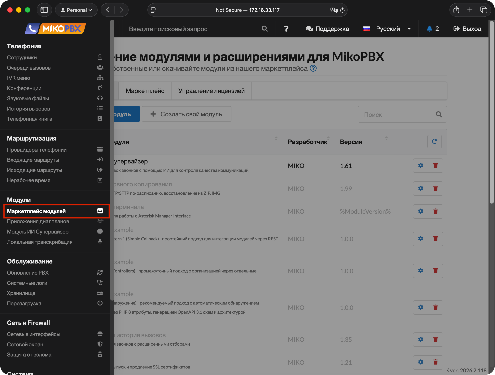
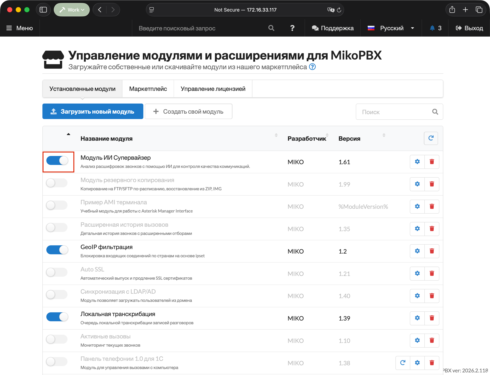
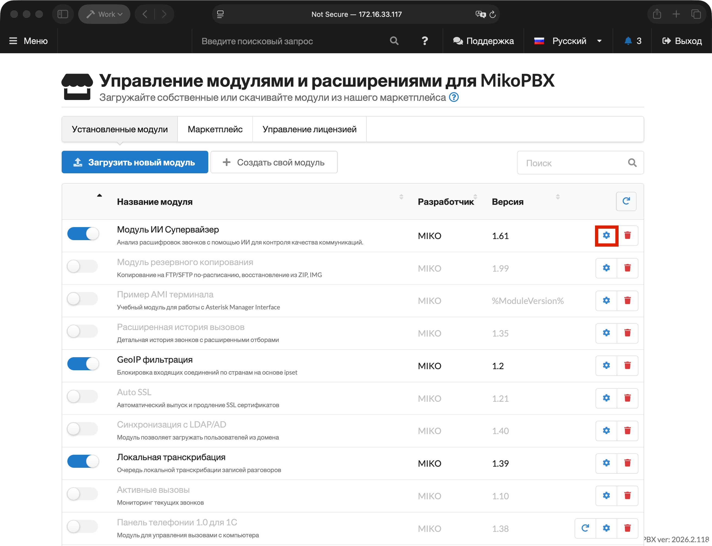
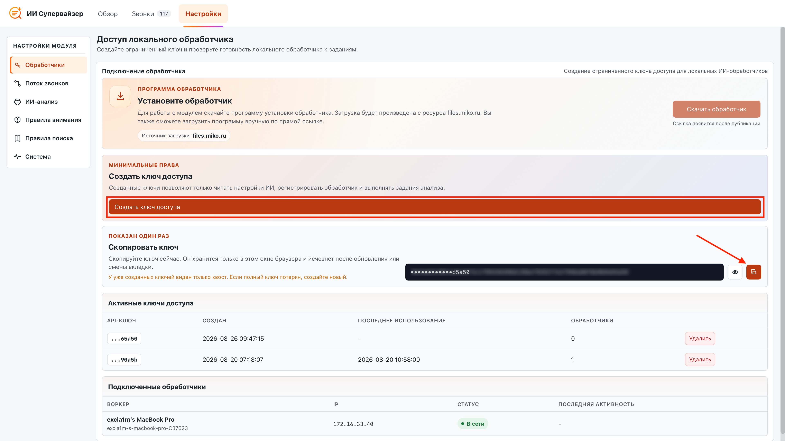
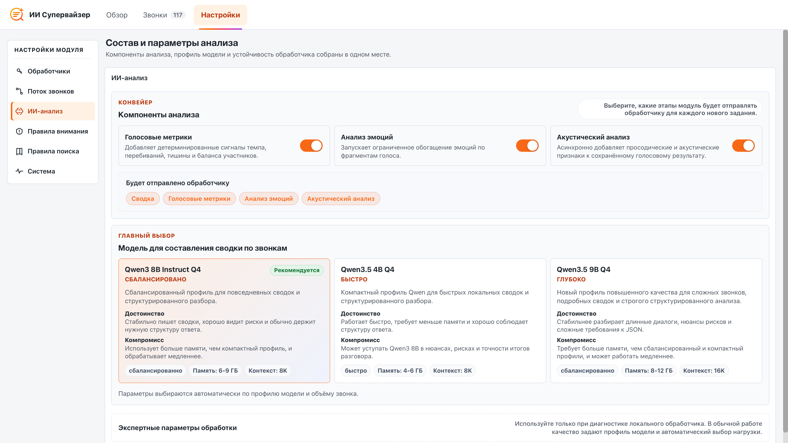
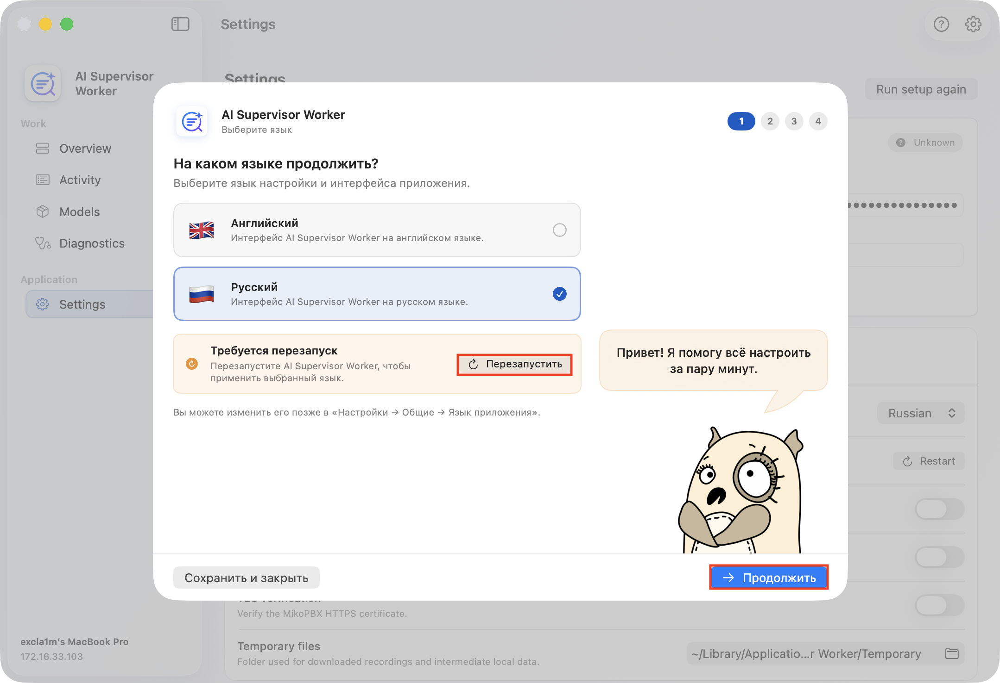
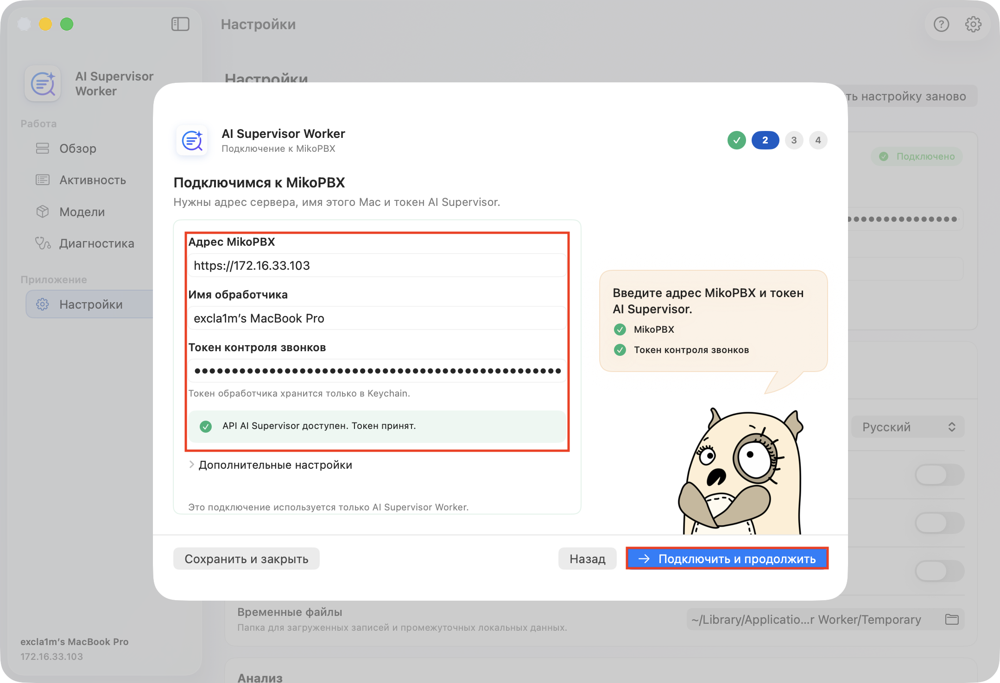
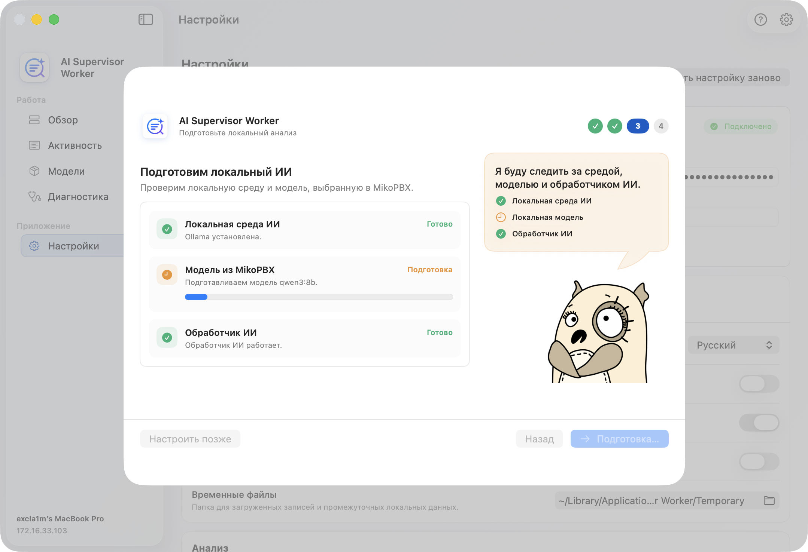
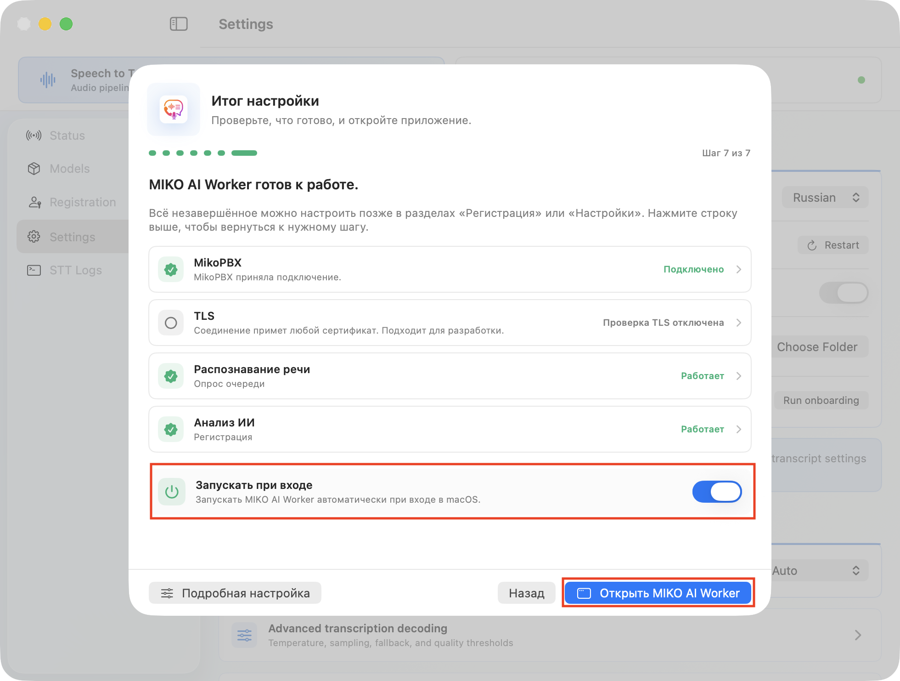
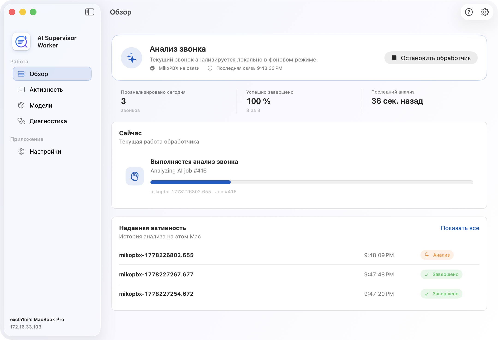

# Быстрый старт

### Перед началом

Для работы понадобятся:

* MikoPBX 2025.1.1 или новее;
* Mac с Apple Silicon и macOS 14 или новее;
* доступ Mac к веб-интерфейсу MikoPBX.


ИИ Супервайзер анализирует готовые расшифровки. Если распознавание речи ещё не настроено, сначала выполните [быстрый старт модуля локального распознавания речи](../module-local-speech-to-text/quick-start.md).&#x20;


### Установка модуля

1. Откройте веб-интерфейс MikoPBX.
2. Перейдите в раздел **Модули** → **Маркетплейс модулей**.

<figure><figcaption>
Раздел «Маркетплейс модулей»
</figcaption></figure>

3. Найдите **Модуль ИИ Супервайзер** и установите его.
4. Откройте список установленных модулей и включите модуль.

<figure><figcaption>
Включение модуля «ИИ Супервайзер»
</figcaption></figure>

5. Нажмите значок **Настройки** справа от версии модуля.

<figure><figcaption>
Переход в модуль «ИИ Супервайзер»
</figcaption></figure>

### Настройка модуля

#### 1. Создайте ключ обработчика

Откройте "**Настройки"** → "**Обработчики"**. Нажмите кнопку создания ключа доступа.

Скопируйте показанное значение. Полный ключ отображается только один раз. После закрытия окна в списке останутся только безопасные сведения о ключе.

<figure><figcaption>
Создание ключа обработчика
</figcaption></figure>

#### 2. Выберите состав анализа и модель

Откройте **Настройки** → **ИИ-анализ**.

Выберите компоненты линии анализа под Ваши задачи:

* **Сводка** - Структурированный разбор звонка, темы, риски, качество. Базовый компонент модуля. Проивзодится выбранной LLM моделью.
* **Голосовые метрики** - Темп, паузы, перебивания, тишина и баланс участников. Анализ технических аспектов звонка.
* **Анализ эмоций** - Текстовое определение эмоций по фрагментам разговора.
* **Акустический анализ** - выявление акустических признаков записи с помощью акустической модели. Используется для того, чтобы подтвердить или опровергнуть результаты голосовых метрик и анализ эмоций LLM моделью;

Так же выберите профиль модели. Подробнее можно прочитать [здесь](./#ii-analiz).

<figure><figcaption>
Выбор компонентов анализа
</figcaption></figure>

#### 3. Включите поток звонков

Откройте **Настройки** → **Поток звонков** и проверьте:

* **Автоматический ИИ-анализ** включён;
* **Автоматический импорт** включён;
* выбран нужный язык результата;
* обработка внутренних звонков включена, если она требуется;
* установлен подходящий срок хранения данных.

<figure><figcaption>
Параметры потока звонков
</figcaption></figure>

### Настройка AI Supervisor Worker

#### 1. Установите приложение

Перейдите в раздел "Обработчики", нажмите "Скачать обработчик". Произведите установку скаченного .dmg

#### 2. Выберите язык

Откройте приложение **AI Supervisor Worker**. На первом этапе выберите язык интерфейса и нажмите **Продолжить**. Если приложение предложит перезапуск после смены языка, выполните его.

<figure><figcaption>
Экран выбора языка для приложения
</figcaption></figure>

#### 3. Подключитесь к MikoPBX

На этапе подключения укажите:

* адрес MikoPBX в формате `https://...` или `http://...`;
* понятное имя этого Mac;
* ключ для AI Supervisor обработчика, созданный в модуле ранее.

Откройте **Расширенные настройки**, только если нужно изменить стабильный UID обработчика, проверку TLS или выбрать собственный PEM-файл CA. Нажмите **Подключить и продолжить** - приложение проверит адрес, ключ и контракт worker API v2.

<figure><figcaption>
Страница подключения к MikoPBX
</figcaption></figure>

#### 4. Подготовьте локальный ИИ

На этапе **Подготовка локального ИИ** приложение последовательно проверяет:

1. локальную среду Ollama;
2. модель, выбранную в MikoPBX;
3. готовность обработчика.

Если Ollama не установлена, нажмите **Установить Ollama**. После установки нажмите **Подготовить и запустить**. Приложение загрузит выбранную модель, зарегистрирует этот Mac и запустит обработчик.

Первая загрузка модели может занять продолжительное время. Не закрывайте приложение и убедитесь, что на Mac достаточно свободного места.

<figure><figcaption>
Подготовка локальной LLM окружения
</figcaption></figure>

#### 4. Завершите настройку

На последнем этапе проверьте состояния **MikoPBX**, **Локальная модель** и **AI Worker**.

При необходимости включите:

* **Запускать при входе** — открывать приложение после входа в macOS;
* **Поддерживать работу обработчика** — автоматически возобновлять работу после восстановления сети или PBX.

Нажмите **Открыть AI Supervisor Worker**.

<mark style="color:red;">Устарело</mark>

<figure><figcaption>
Прежний финальный экран настройки
</figcaption></figure>

### Проверка результата

1. В AI Supervisor Worker откройте **Обзор**. Состояние должно показывать готовность к новым заданиям.
2. В MikoPBX откройте **Настройки** → **Система** → **Обработка** и убедитесь, что задания переходят из ожидания в работу.
3. После завершения откройте вкладку **Звонки** и выберите обработанный звонок.

<figure><figcaption>
Раздел "Обзор" в интерфейсе приложения
</figcaption></figure>
