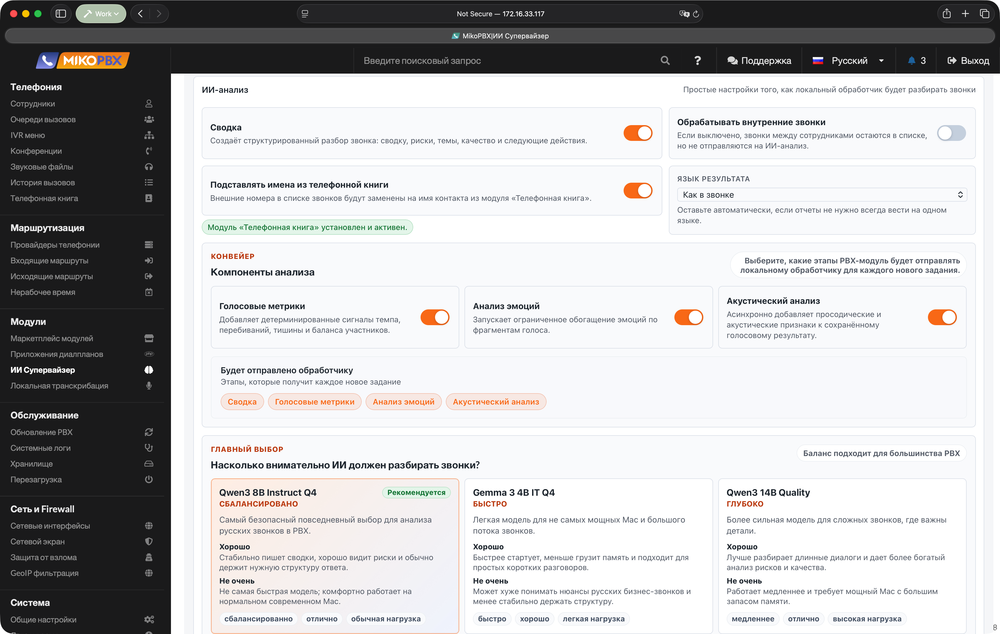
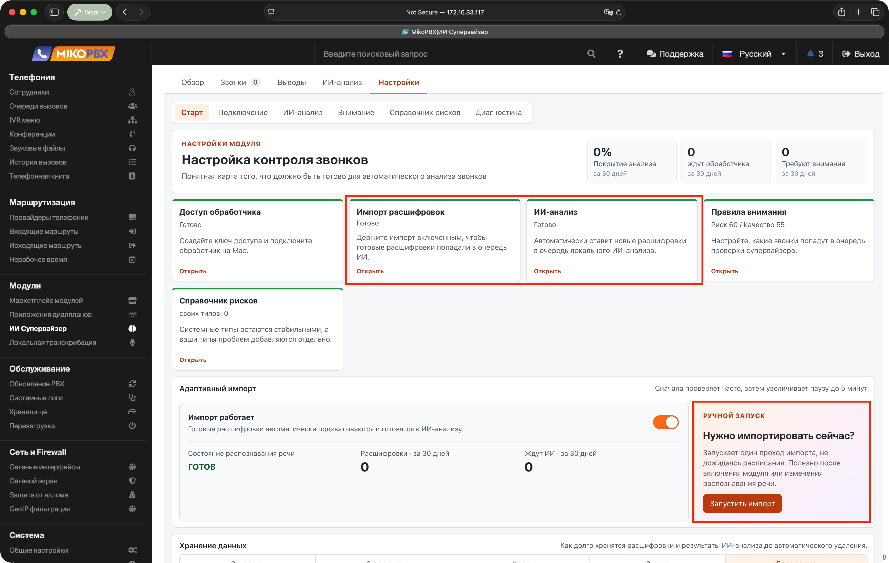
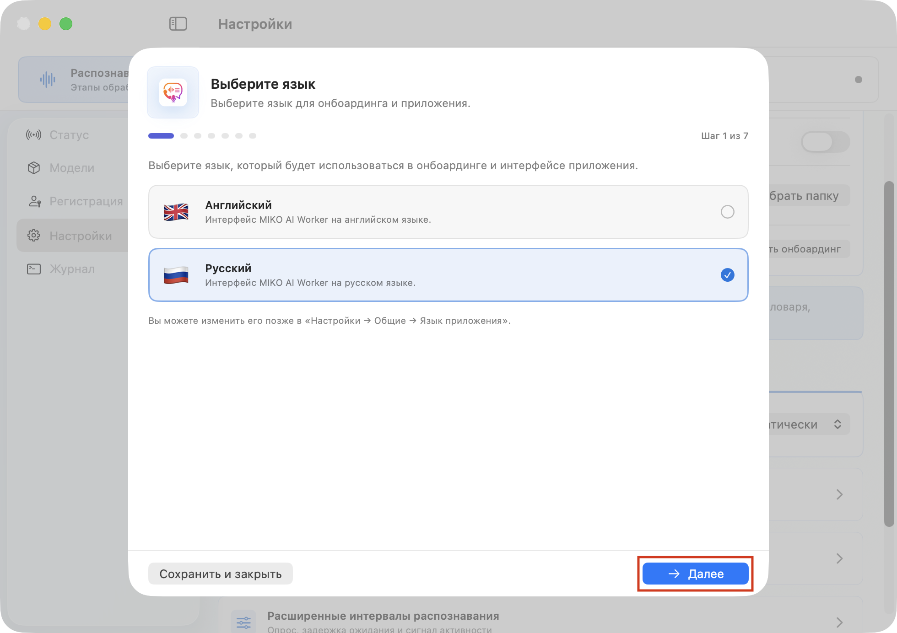
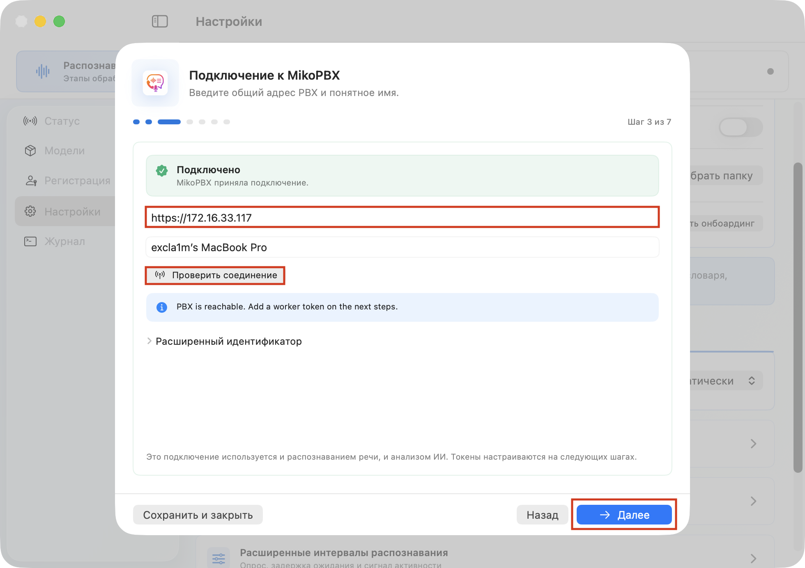
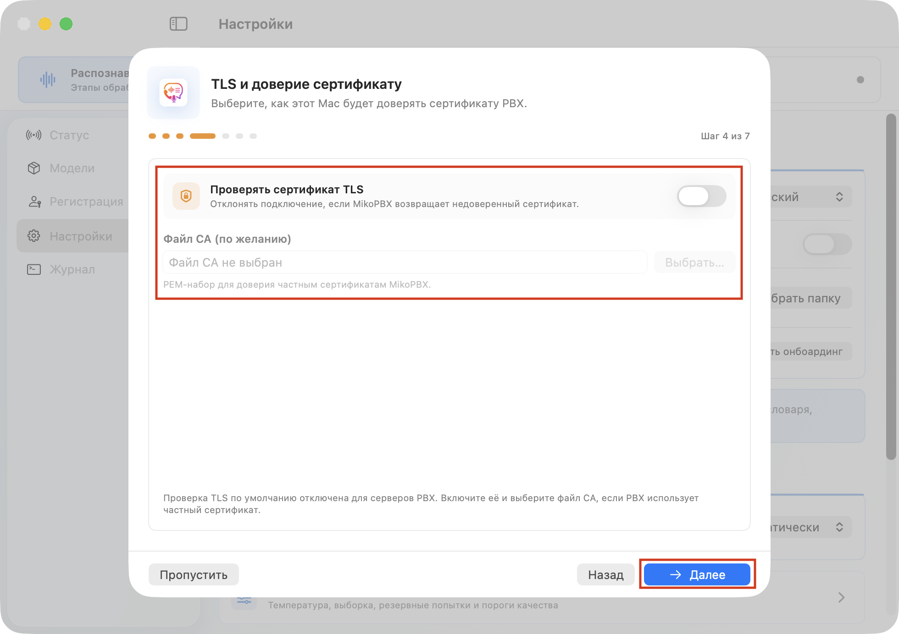
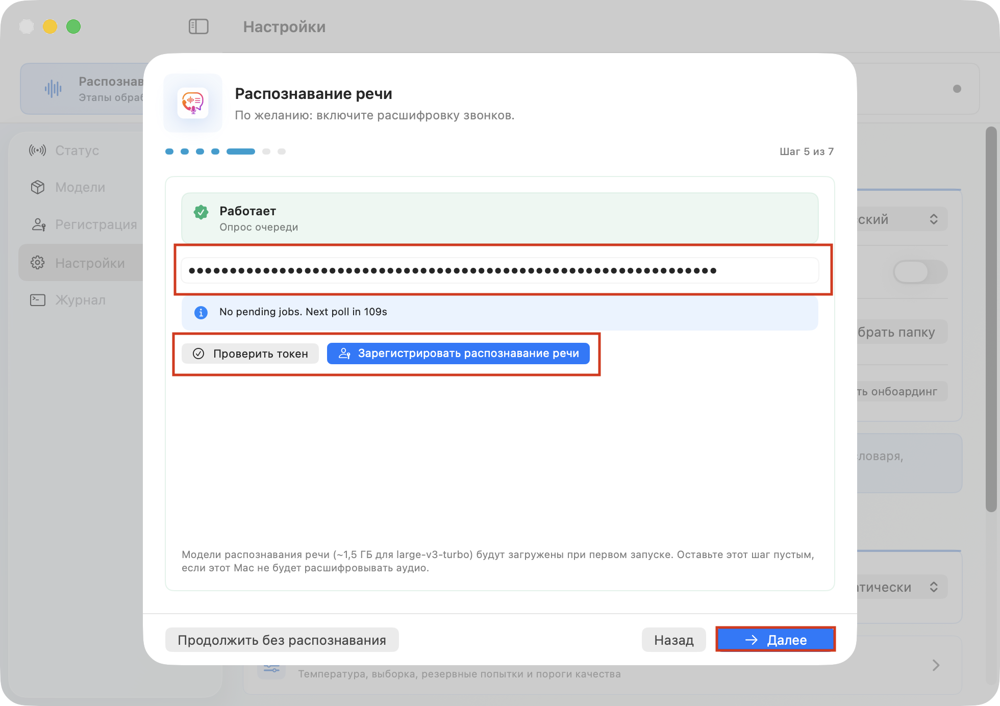
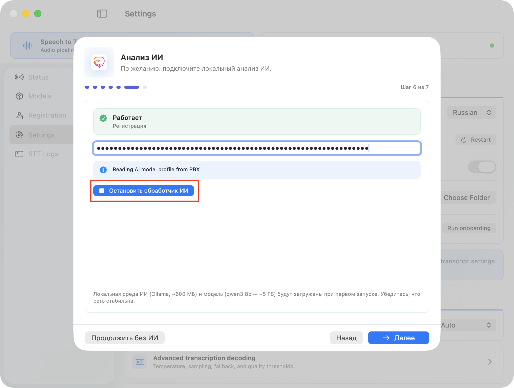
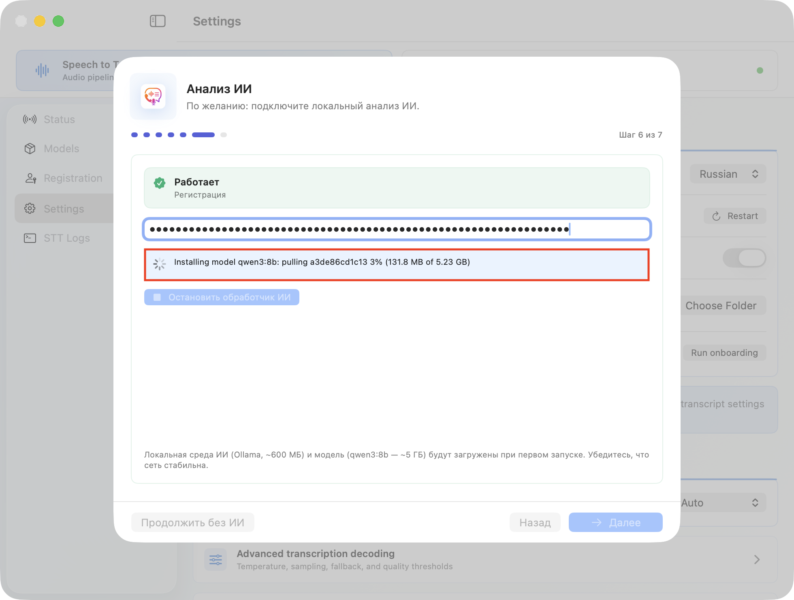
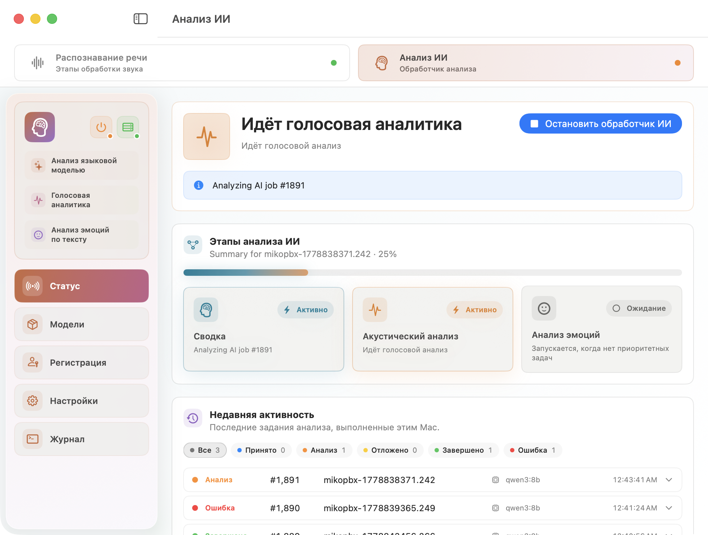

# Быстрый старт

### Перед началом

Убедитесь, что уже установлен и настроен **модуль распознавания речи**. ИИ Супервайзер анализирует готовые расшифровки, поэтому без модуля распознавания речи очередь ИИ-анализа будет пустой.


Если распознавание речи еще не настроено, сначала выполните быстрый старт модуля распознавания речи. Найти инструкцию можно [здесь](../module-local-speech-to-text/quick-start.md).


### Установка модуля

1. Откройте веб-интерфейс MikoPBX.
2. Перейдите в раздел **"Модули"** → **"Маркетплейс модулей"**.

<figure><figcaption>
Раздел "Маркетплейс модулей"
</figcaption></figure>

3. Найдите **Модуль ИИ Супервайзер** и установите его.
4. Перейдите в список установленных модулей и включите модуль.

<figure><figcaption>
Включение модуля "ИИ Супервайзер"
</figcaption></figure>

5. Откройте страницу модуля, нажав на иконку **"Настройки"** справа от версии модуля.

<figure><figcaption>
Переход в настройки модуля "ИИ Супервайзер"
</figcaption></figure>

### Настройка модуля

1. Откройте вкладку **Настройки** → **Подключение** и нажмите **Создать ключ доступа**.

Скопируйте ключ сразу: полный ключ показывается только один раз.


Для ИИ Супервайзера нужен отдельный токен контроля звонков. Токен обработчика речи из модуля распознавания речи здесь не подойдет.


<figure><figcaption>
Созданный ключ доступа
</figcaption></figure>

2. Перейдите в **Настройки** → **ИИ-анализ**.

Для первого запуска оставьте:

* **Сводка** - включено;
* **Голосовые метрики** - включено;
* **Анализ эмоций** - включено (если необходимо);
* **Акустический анализ** - включено (если необходимо);
* **Язык результата** - **Как в звонке/Или укажите Ваш язык**;
* профиль модели - **Qwen3 8B Instruct Q4**.

Нажмите **Сохранить настройки**.

<figure><figcaption>
Параметры для первого подключения
</figcaption></figure>

3. Перейдите в **Настройки** → **Старт,** убедитесь, что включены **Импорт расшифровок** и **ИИ-анализ**.

Если расшифровки уже есть, нажмите **Запустить импорт**.

<figure><figcaption>
Проверка готовности модуля к работе
</figcaption></figure>

### Настройка MIKO AI Worker

1. Откройте приложение **MIKO AI Worker** на Mac. На первом шаге онбоардинга выберите язык интерфейса и нажмите **Далее**.

<figure><figcaption>
Выбор языка онбоардинга и приложения
</figcaption></figure>

2. На шаге подключения укажите адрес MikoPBX в формате `https://...` и понятное имя обработчика.

Нажмите **Проверить соединение** и затем **Далее**.

<figure><figcaption>
Шаг "Подключение к MikoPBX"
</figcaption></figure>

3. На шаге **TLS и доверие сертификату** выберите, проверять ли HTTPS-сертификат PBX.

Если у вас собственный сертификат, включите проверку TLS и укажите PEM-файл CA.

<figure><figcaption>
Шаг "TLS и доверие сертификату"
</figcaption></figure>

4. Если этот Mac уже настроен для распознавания речи, оставьте шаг **Распознавание речи** как есть. Если распознавание речи на этом Mac не нужно, можно перейти дальше без него.

<figure><figcaption>
Шаг "Распознавание речи"
</figcaption></figure>

5. На шаге **Анализ ИИ** вставьте токен контроля звонков, созданный в модуле.

Нажмите **Запустить обработчик ИИ**.

<figure><figcaption>
Подключение ИИ обработчика
</figcaption></figure>

Если приложение предложит установить локальную среду ИИ, установите ее. При первом запуске также будет загружена выбранная модель, например `qwen3:8b`.

<figure><figcaption>
Установка локальной LLM модели при настройке обработчика
</figcaption></figure>

6. На финальном шаге включите **Запускать при входе**, если обработчик должен запускаться вместе с macOS.

Нажмите **Открыть MIKO AI Worker**.

<figure><figcaption>
Финальный шаг первичной настройки воркера
</figcaption></figure>

После всех настроек, воркер начнет выполнять задания и проводить ИИ анализ расшифровок, после завершения результаты будут переданы на станцию, найти их и посмотреть можно в интерфейсе модуля.

<figure><figcaption>
Процесс ИИ анализа записи
</figcaption></figure>
