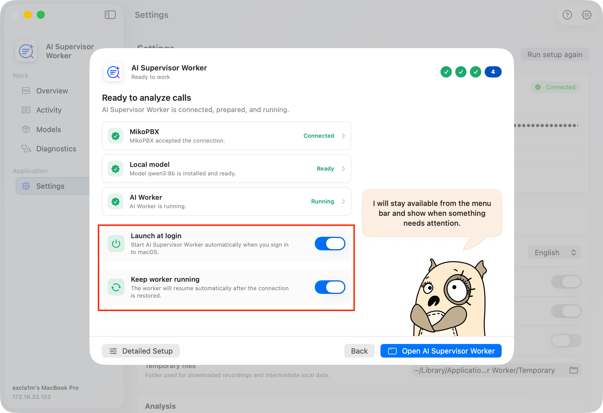

# Quick Start

### Before you begin

You will need:

* MikoPBX 2025.1.1 or later;
* a Mac with Apple silicon and macOS 14 or later;
* network access from the Mac to the MikoPBX web interface.


AI Supervisor analyzes completed transcripts. If speech recognition has not been configured yet, first follow the [Local Speech To Text quick start](../module-local-speech-to-text/quick-start.md).&#x20;


### Installing the module

1. Open the MikoPBX web interface.
2. Go to **Modules** → **Module marketplace**.

<figure><figcaption>
Module marketplace
</figcaption></figure>

3. Find **AI Supervisor** and install it.
4. Open the **Installed modules** tab and enable the module.

<mark style="color:green;">NEED A SCREENSHOT</mark>

5. Click the settings button to the right of the module version.

<mark style="color:green;">NEED A SCREENSHOT</mark>

### Configuring the module

#### 1. Create a worker key

Open **Settings** → **Workers**. Click **Generate API key**.

Copy the displayed value. The complete key is shown only once. After you close the window, only safe information about the key remains in the list.

<figure><figcaption>
Creating a worker key
</figcaption></figure>

#### 2. Select the analysis components and model

Open **Settings** → **AI analysis**.

Select the analysis pipeline components that suit your needs:

* **Summary** — a structured call review covering topics, risks, and quality. This is the module's core component and is produced by the selected LLM.
* **Voice metrics** — tempo, pauses, interruptions, silence, and speaker balance. This component analyzes the technical aspects of a call.
* **Emotion Analysis** — text-based emotion detection for conversation fragments.
* **Acoustic analysis** — detection of acoustic features in the recording with an acoustic model. It helps confirm or challenge the results of voice metrics and LLM-based emotion analysis.

Also select a model profile. See [AI analysis](./#ai-analysis) for more information.

<figure><figcaption>
Selecting analysis components
</figcaption></figure>

#### 3. Enable the call flow

Open **Settings** → **Call flow** and check that:

* **Automatically analyze new transcripts** is enabled;
* **Automatic import** is enabled;
* the required AI result language is selected;
* **Process internal calls** is enabled if required;
* an appropriate data retention period is selected.

<figure><figcaption>
Call flow settings
</figcaption></figure>

### Configuring AI Supervisor Worker

#### 1. Install the application

Open **Workers**, click **Download worker**, and install the downloaded DMG.

#### 2. Select the language

Open **AI Supervisor Worker**. On the first screen, select the interface language and click **Continue**. Restart the application if it prompts you to do so after the language change.

<figure><figcaption>
Application language selection
</figcaption></figure>

#### 3. Connect to MikoPBX

On the connection screen, enter:

* the MikoPBX address in `https://...` or `http://...` format;
* a friendly name for this Mac;
* the AI Supervisor worker key created earlier in the module.

Open **Advanced settings** only if you need to change the stable Worker UID, TLS verification, or select a custom PEM CA file. Click **Connect and continue**. The application verifies the address, key, and worker API v2 contract.

<figure><figcaption>
Connecting to MikoPBX
</figcaption></figure>

#### 4. Prepare local AI

On the **Prepare local analysis** screen, the application checks in sequence:

1. the local Ollama runtime;
2. the model selected in MikoPBX;
3. worker readiness.

If Ollama is not installed, click **Install Ollama**. After installation, click **Prepare and start**. The application downloads the selected model, registers this Mac, and starts the worker.

The first model download may take a long time. Do not close the application, and make sure the Mac has enough free disk space.

<figure><figcaption>
Preparing the local LLM runtime
</figcaption></figure>

#### 5. Finish setup

On the final screen, check the **MikoPBX**, **Local model**, and **AI Worker** states.

If necessary, enable:

* **Launch at login** — the application opens automatically when you sign in to macOS.
* **Keep worker running** — the worker automatically resumes after the network or PBX connection is restored, or after the Mac wakes from sleep.

Click **Open AI Supervisor Worker**.

<figure><figcaption>
Final onboarding screen
</figcaption></figure>

### Verifying the result

1. In AI Supervisor Worker, open **Overview**. The status should show that the worker is ready for the next job.
2. In MikoPBX, open **Settings** → **System** → **Processing** and make sure jobs move from waiting to in progress.
3. When processing finishes, open the **Calls** tab and select the processed call.

<figure><figcaption>
Overview in AI Supervisor Worker
</figcaption></figure>
