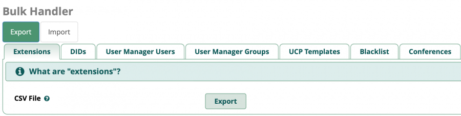

# Резервное копирование

## Создание архивной копии <a href="#sozdanie_arxivnoj_kopii" id="sozdanie_arxivnoj_kopii"></a>

1. Перейдите во вкладку **"Модули"** -> **"Управление модулями"**

Убедитесь, что **Модуль резервного копирования** установлен и включен

<figure><figcaption></figcaption></figure>

2. Перейдите в настройки модуля

<figure><figcaption></figcaption></figure>

3. Выполните действие «**Создать архивную копию**»

<figure><figcaption></figcaption></figure>

4. Необходимо выбрать, какие именно данные будут включены в архивную копию АТС, т.е. какие данные необходимо сохранить:
   * **Настройки PBX** - все **настройки конфигурации** MikoPBX, которые были выполнены в web-интерфейсе в соответствующих разделах.
   * **История разговоров** - сохранение истории базы данных **cdr.db** (расположение: **/storage/usbdisk1/mikopbx/astlogs/asterisk/cdr.db**). Данная настройка не предполагает сохранение самих записей разговоров, т.е. будет сохранена вся информация на вкладке **Телефония** → **История вызовов** ([Документация](../../manual/telephony/call-detail-records.md)) без возможности прослушивания / скачивания файлов записей.
   * **Файлы с записями разговоров** - сохранение всех записей разговоров в формате \*.mp3.
   * **Звуковые файлы** - сохранение звуковых файлов, которые были загружены на АТС в разделе **Телефония** → **Звуковые файлы** ([Документация](../../manual/telephony/sound-files.md)).

<figure><figcaption></figcaption></figure>

5. Выполните действие «**Создать архивную копию**».

<figure><figcaption></figcaption></figure>

После завершения операции списке резервных копий появится новые данные:

<figure><figcaption></figcaption></figure>

## Управление файлами <a href="#upravlenie_fajlami" id="upravlenie_fajlami"></a>

В списке резервных копий есть возможность выполнить следующие действия:

* Восстановить из резервной копии
* Скачать архив данных
* Удалить резервную копию

<figure><figcaption></figcaption></figure>

## Восстановление из архива <a href="#vosstanovlenie_iz_arxiva" id="vosstanovlenie_iz_arxiva"></a>


Порядок перехода с **Askozia 4, 5 ME** до **MikoPBX** описан в [инструкции](../../manual/maintenance/update/).


1. В списке резервных копий выберите нужную и выполните действие "**Восстановить из резервной копии"**

<figure><figcaption></figcaption></figure>

2. Выберите категории данных к восстановлению

<figure><figcaption></figcaption></figure>

3. Выполните действие «**Восстановить из архива**»

<figure><figcaption></figcaption></figure>

Будет запущен процесс восстановления, после завершения АТС будет перезагружена

Прогресс восстановления данных из архива будет отображен на текущей странице


Рекомендуем восстанавливать данные в два этапа:

1. Восстановление «**Звуковые файлы**» + «**Настройки PBX**» + «**История разговоров**»
2. Восстановление «**Файлы записи разговоров**» - наиболее длительный этап


## Резервное копирование по расписанию <a href="#rezervnoe_kopirovanie_po_raspisaniju" id="rezervnoe_kopirovanie_po_raspisaniju"></a>


* Режим **FTP** - будет создан **ZIP** архив. Для данного режима необходимо _наличие ftp-сервера_.
* Режим **SFTP** - создается **tar** архив. Для данного режима достаточно _только самой MikoPBX_.
* Режим **WebDav** - создается **tar** архив.

**Наиболее быстрые варианты** резервного копирования по расписанию - **SFTP** и **WebDav**. FTP морально устарел, со временем возможность использования этого протокола будет исключена из модуля резервного копирования


1. Нажмите на кнопку "Расписание архивации" для настройки автоматического резервного копирования.

<figure><figcaption></figcaption></figure>

2. Для включения резервного копирования активируйте переключатель «**Архивация по расписанию"**

<figure><figcaption></figcaption></figure>

3. Заполните необходимые данные:

* **Адрес сервера** - IP-адрес MikoPBX, или адрес SFTP \ FTP сервера
* **Порт** - для режима **SFTP** порт **22**, при отключении флага «**Режим SFTP**» активируется режим **FTP** - порт **21**
* **Имя пользователя** - имя пользователя для авторизации на сервере
* **Пароль** - пароль для авторизации на сервере
* **Путь на сервере** - директория, в которую будут сохраняться резервные копии. Рекомендуемый каталог на MikoPBX: **/storage/usbdisk1/mikopbx/backup/**


При использовании **WebDav** каталог из поля «**Путь на сервере**» необходимо создать заранее, вручную.


* **Расписание** - укажите в какой день выполнять резервное копирование и время, когда запустить операцию
* **Оставлять последние Х версий** - укажите, какое количество версий бекапа должно обязательно сохраняться
* **Настройки PBX** - все **настройки конфигурации** MikoPBX, которые были выполнены в web-интерфейсе в соответствующих разделах
* **История разговоров** - сохранение истории базы данных **cdr.db** (расположение: **/storage/usbdisk1/mikopbx/astlogs/asterisk/cdr.db**). Данная настройка не предполагает сохранение самих записей разговоров, т.е. будет сохранена вся информация на вкладке **Телефония** →[ **История вызовов**](../../manual/telephony/call-detail-records.md) без возможности прослушивания / скачивания файлов записей
* **Файлы с записями разговоров** - сохранение всех записей разговоров в формате \*.mp3
* **Звуковые файлы** - сохранение звуковых файлов, которые были загружены на АТС в разделе **Телефония** →[ **Звуковые файлы**](../../manual/telephony/sound-files.md)

<figure><figcaption></figcaption></figure>

4. Нажмите "**Сохранить**"

<figure><figcaption></figcaption></figure>

### Импорт сотрудников из CSV <a href="#zagruzka_dannyx_iz_csv" id="zagruzka_dannyx_iz_csv"></a>

Бывает полезно, когда требуется загрузить / создать большое количество сотрудников.

1. Кликните по кнопке «**`Загрузить файл для восстановления`**»
2. Выберите файл в кодировке `UTF-8`, с расширением **`*.csv`**
3. Дождитесь завершения операции

Формат файла должен быть следующим:

```
extension;username;password;mobile-phone;ringtime;enable-forward;authUsername
```

* **"`extension`"** - **обязательное поле**, внутренний номер пользователя
* **"`username`"** - **обязательное поле**, имя пользователя, допускает кириллица
* **"`password`"** - **обязательное поле**, пароль для SIP аккаунта
* **"`mobile-phone`"** - мобильный номер телефона, можно оставить пустым
* **"`ringtime`**" - как долго звонить на внутренний номер, можно оставить пустым
* **"`enable-forward`"** - включить адресацию на мобильный после «**`ringtime`**»,  задается числом: "`1`" - Истина, "`0`" - ложь, можно оставить пустым
* **"`authUsername`"** - имя для авторизации, для случаев, когда оно не соответствует внутреннему номеру (**username** и **authusername** будут приравнены этому параметру, а не значению внутреннего номера), можно оставить пустым

Пример файла:

```
701;Alex;password701@;89066643322;10;1
702;Петр (Sales);password@_702
105;Курчатов Петр;hdfsf_dLVz;;;;admin
```

### Импорт extensions из FreePBX <a href="#zagruzka_dannyx_iz_freepbx" id="zagruzka_dannyx_iz_freepbx"></a>

Функция позволяет загрузить из FreePBX все Extensions, которые будут преобразованы в «Сотрудников».

1. Установите в FreePBX модуль [Bulk Handler](https://wiki.freepbx.org/display/FPG/Bulk+Handler)
2. Перейдите в интерфейс модуля «**Admin**» - «**Bulk Handler**»
3.  Экспортируйте данные «**Extensions**»&#x20;

    <figure><figcaption></figcaption></figure>
4. Откройте в MikoPBX интерфейс модуля резервного копирования
5. Кликните по кнопке «**`Загрузить файл для восстановления`**»
6. Выберите файл, с расширением **`*.csv`**
7. Дождитесь завершения операции

<br>

