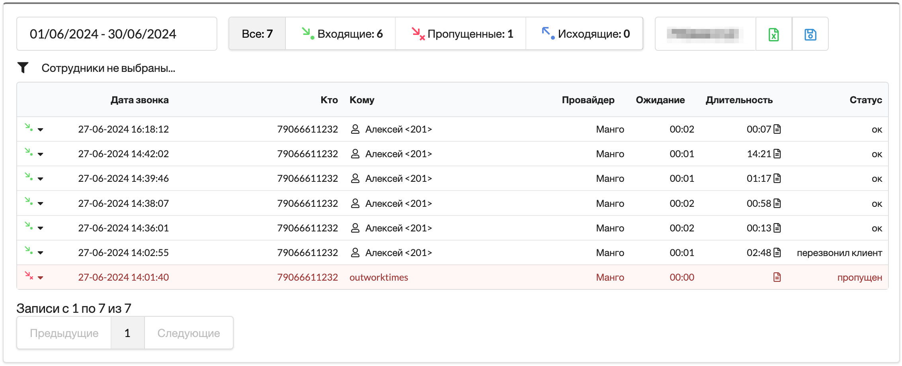
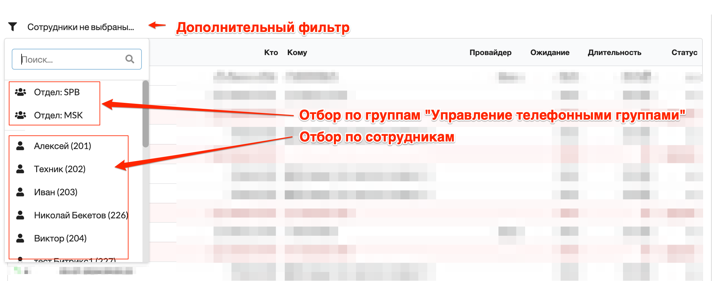
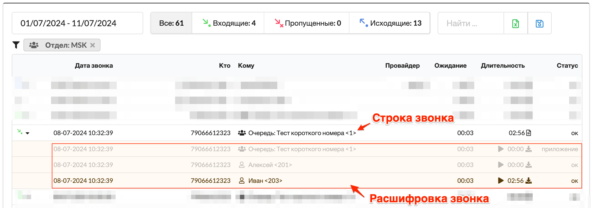

# Расширенная история звонков

### Назначение

* Отображение истории звонков
* Отбор истории звонков по группам / по сотрудникам
* Выгрузка истории звонков за период в Excel
* Отображение линии, через которую прошел вызов

<figure><figcaption></figcaption></figure>

### Настройка модуля

1. Выполните установку модуля в разделе [Управление модулями](../../manual/modules/pbx-extension-modules/).
2.  Включите модуль и перейдите к его странице&#x20;

    <figure><figcaption></figcaption></figure>


После включения, модуль создаст в собственной базе данных новую, адаптированную, таблицу и будет наполнять ее на основе оригинальной таблицы истории звонков.&#x20;

Новая таблица позволит выполнять запросы к базе данных максимально быстро, при этом не нагружая оригинальную базу данных истории звонков.&#x20;

Это процесс займет некоторое время, потребуется подождать.&#x20;


### Лицензирование

Для работы с модулем потребуется лицензия на хост, где модуль будет использоваться.&#x20;

Приобрести лицензию можно в [нашем магазине](https://shop.miko.ru/catalog/mikopbx/).

Купон имеет вид **MIKOUPD-00000-00000-00000-00000**, его следует активировать в разделе "**Маркетплейс модулей**" - "**Управление лицензией**"

### Использование модуля

Панель отборов

<figure><figcaption></figcaption></figure>

* Позволяет установить период выборки&#x20;
* Отображает количество вызов за выбранный период
* Позволяет кликом по кнопкам "**Входящие**" / "**Пропущенные**" / "**Исходящие**" быстро отфильтровать вызовы по типу звонка
* В поле "**Найти**..." можно описать произвольный номер телефона для отбора
* Кнопка выгрузки в Excel - позволит скачать данные, соответствующие текущему отбору
* Кнопка "Сохранить" - позволяет сохранить текущий отбор, при повторном открытии страницы фильтры восстановятся

#### Дополнительный фильтр

<figure><figcaption></figcaption></figure>

* Позволяет установить отбор по группе сотрудников, из модуля "Упрвление телефонными группами"
* Позволяет установить отбор по сотрудникам

#### Таблица вызовов

<figure><figcaption></figcaption></figure>

**Строка звонка** - содержит общую информацию по вызову, направление, дата начала, кто и кому звонил.&#x20;

Статус звонка может быть одним из:

* "**ok**"  - успешный вызов
* "**перевод**" - переадресация вызова
* "**пропущен**" - входящий вызов, не отвеченный
* "**недозвон**" - исходящий вызов, не отвеченный
* "**перезвонил клиент**" - успешный входящий вызов клиента после пропущенного
* "**перезвонили**" - успешный исходящий вызов клиенту после пропущенного
* "**приложение**" - вызов на "Приложение Dialplan или на служебный номер"

При клике по номеру в колонке "**Кто**" и "**Кому**" будет установлен отбор по номеру в поле "**Найти...**"

**Расшифровка звонка** - отображает  более подробную информацию:

* Кто пропустил вызов
* Кто ответил на вызов
* Ссылку на прослушивание и скачивание разговора
* Длительность ожидания
* Длительность разговора
