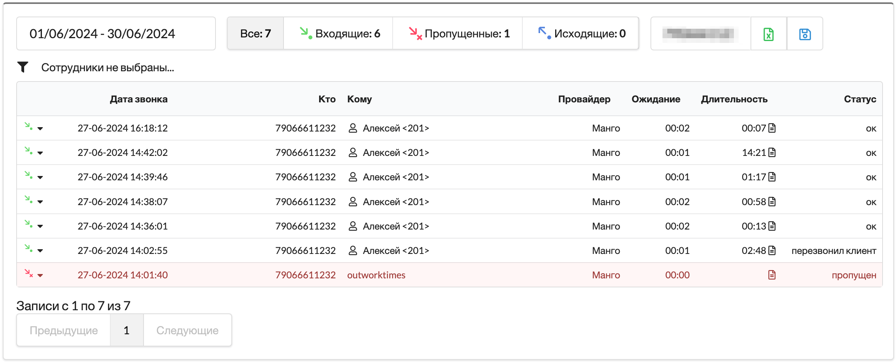
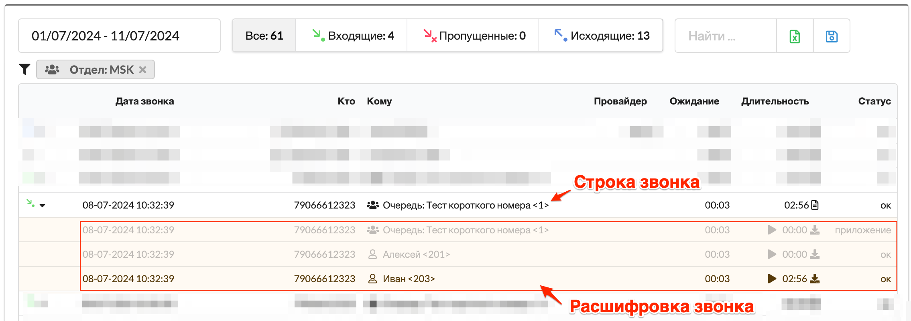

# Расширенная история звонков

### Назначение

* Анализ истории звонков
* Отбор истории звонков по группам / по сотрудникам
* Выгрузка истории звонков за период в Excel / PDF
* Отображение линии (провайдера), через которую прошел вызов

<figure><figcaption></figcaption></figure>

### Настройка модуля

1. Выполните установку модуля в разделе [Управление модулями](../../manual/modules/pbx-extension-modules.md).
2.  Включите модуль и перейдите к его странице&#x20;

    <figure><figcaption></figcaption></figure>


После включения, модуль создаст в собственной базе данных новую, адаптированную, таблицу и будет наполнять ее на основе оригинальной таблицы истории звонков.&#x20;

Новая таблица позволит выполнять запросы к базе данных максимально быстро, при этом не нагружая оригинальную базу данных истории звонков.&#x20;

Это процесс займет некоторое время, потребуется подождать.&#x20;


### Лицензирование

Для работы с модулем потребуется лицензия на хост, где модуль будет использоваться.&#x20;

Приобрести лицензию можно в [нашем магазине](https://shop.miko.ru/catalog/mikopbx/).

Купон имеет вид **MIKOUPD-00000-00000-00000-00000**, его следует активировать в разделе "**Маркетплейс модулей**" - "**Управление лицензией**"

### Варианты отчетов

<figure><figcaption></figcaption></figure>

При наведении курсора по меню вариантов отчета появится окно выбора.&#x20;

В окне перечислены системные и пользовательски варианты.&#x20;

* Кнопка "**Звезда**" - позволяет назначить вариант основным. При открытии страницы модуля этот вариант будет использоваться по умолчанию.&#x20;
* Кнопка "**Копировать**" - позволяет создать новый вариант отчета на основе существующего.&#x20;

Варианты отчетов сохраняются в разрезе пользователя, при использовании модуля "Управление доступом в систему" у каждого сотрудника будет свой набор вариантов.&#x20;

При копировании варианта отчета будет открыта форма редактирования:

<figure><figcaption></figcaption></figure>

Пользовательских вариант отчета позволяет задать свое наименование, отбор по длительности и расписание отправки отчета на email.&#x20;

* Число месяца - от 1 до 31
* День недели - 1 - понедельник, 7 - воскресенье
* Время в формате 00:00
* Email - список адресов через пробел

Отчет отправляется на email в формате PDF. Для возможности отправки необходимо настроить smtp клиент в общих настройках АТС.&#x20;

<figure><figcaption></figcaption></figure>

Пользовательские варианты отчетов можно редактировать или удалить.&#x20;

### Расширенная история звонков

Панель отборов

<figure><figcaption></figcaption></figure>

* Позволяет установить период выборки записей
* Отображает количество вызов за выбранный период
* Отображает процент пропущенных (`Пропущенные * 100 / (Входящие + Пропущенные)`)
* Позволяет кликом по кнопкам "**Входящие**" / "**Пропущенные**" / "**Исходящие**" отфильтровать вызовы по типу звонка
* В поле "**Найти**..." можно описать произвольный номер телефона или несколько номеров через пробел установки фильтра
* Кнопка выгрузки в **Excel** и **PDF** - позволит скачать данные, соответствующие текущему отбору
* Кнопка "**Сохранить**" - позволяет сохранить текущий отбор, при повторном открытии страницы фильтры восстановятся. Сохранен может быть только один из стандартных периодов "**Сегодня**" / "**Вчера**" / "**Последние 7 дней**" / "**Последние 30 дней**" / "**Прошлый месяц**"

#### Дополнительный фильтр

<figure><figcaption></figcaption></figure>

* Позволяет установить отбор по группе сотрудников, из модуля "Упрвление телефонными группами"
* Позволяет отобрать  вызовы, которые попали на конкретную очередь (первая очередь, в которую зашел звонок)
* Позволяет установить отбор по сотрудникам

#### Фильтр по длительности

<figure><figcaption></figcaption></figure>

Фильтр по длительности позволяет отобрать все звонки, в которых длительность хотя бы одного из диалогов удовлетворяет условию.

\
В рамках одного телефонного звонка может быть несколько разговоров — диалогов. Если один из диалогов попадет под условие, то звонок со всеми диалогами будет отображен в отчете.

#### Таблица вызовов

<figure><figcaption></figcaption></figure>

**Строка звонка** - содержит общую информацию по вызову, направление, дата начала, кто и кому звонил:

* **Дата звонка** - дата и время начала телефонного звонка / диалога
* **Провайдер** - либо наименование провайдера, либо его идентификатор (в случае если провайдер был удален). Также в этом поле для входящих звонков может отображаться DID - номер, на который поступил вызов
* **Ожидание** - время с момента начала вызова, до ответа сотрудником  (первый диалог)
* **Длительность** -  сумма длительностей всех диалогов

Статус звонка может быть одним из:

* "**ok**"  - успешный вызов
* "**перевод**" - переадресация вызова
* "**пропущен**" - входящий вызов, не отвеченный
* "**недозвон**" - исходящий вызов, не отвеченный
* "**перезвонил клиент**" - успешный входящий вызов клиента после пропущенного
* "**перезвонили**" - успешный исходящий вызов клиенту после пропущенного
* "**приложение**" - вызов на "Приложение Dialplan или на служебный номер"

При клике по номеру в колонке "**Кто**" и "**Кому**" будет установлен отбор по номеру в поле "**Найти...**"

**Расшифровка звонка** - отображает  более подробную информацию:

* Кто пропустил вызов
* Кто ответил на вызов
* Ссылку на прослушивание и скачивание разговора
* Ожидание - для конкретного диалога
* **Длительность** разговора в рамках диалога

### Входящие на очередь

<figure><figcaption></figcaption></figure>

Отчет позволяет проанализировать входящие вызовы, которые обработана очередями.&#x20;

* **Дата** - в формате `ГОД-МЕСЯЦ-ДЕНЬ`    &#x20;
* **Очередь** - наименование очереди, которая `первая` обработала звонок
* **Всего** - количество вызовов в разрезе даты и очереди
* **Отвечены** - количество отвеченных вызовов
* **Пропущены** - количество пропущенных вызовов
* **% Пропущенных** - считается по формуле `"Пропущенны" * 100/ "Всего"`
* **Отвечены в очереди** - количество вызовов, которые были отвечены именно в этой очереди, если вызов ушел на другую очередь (каскад) или на IVR, то счетчик не увеличится
* **Ср. Ожидание** - среднее время ожидания - `"Время ответа на вызов" - "Время поступления вызова" / "Всего"`
* **Ср. Ожидание очереди** - среднее время ожидания в конкретной очереди - `"Время ответа на вызов" - "Время поступления вызова в очередь" / "Всего"`

В колонке "**Дата**", по ссылке можно перейти к расшифровке строки, в отчет "**Расширенная история звонков**", отборы по дате и очереди будут установлены автоматически .

### Исходящие сотрудников

<figure><figcaption></figcaption></figure>

Отчет позволяет проанализировать исходящие вызовы сотрудников. Количество вызовов и общую длительность разговоров.&#x20;
