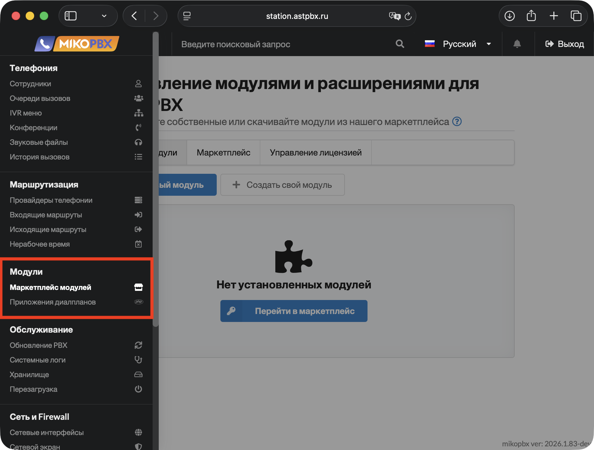
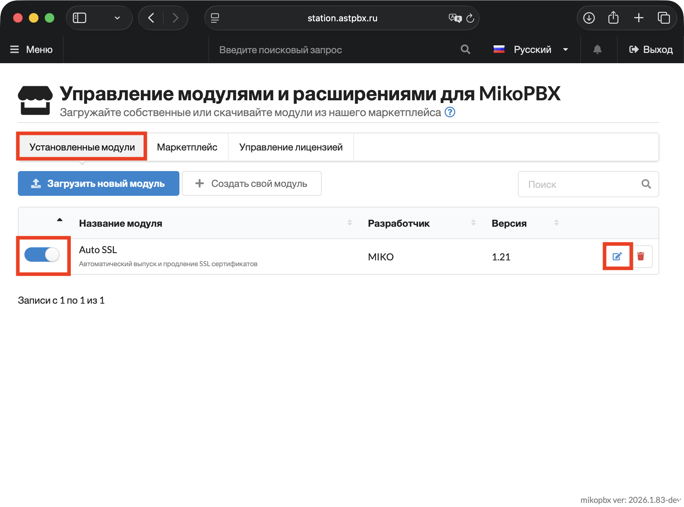
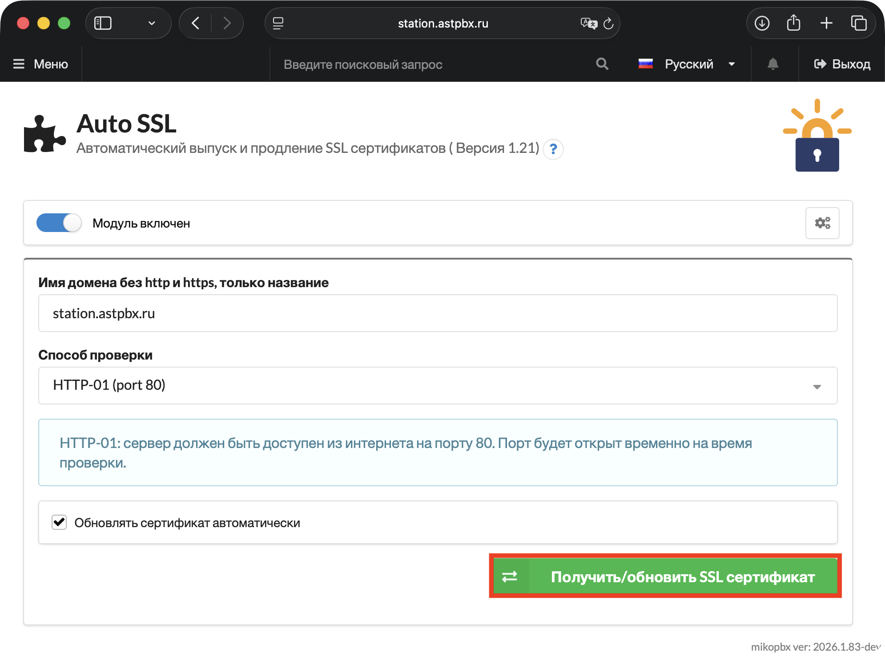
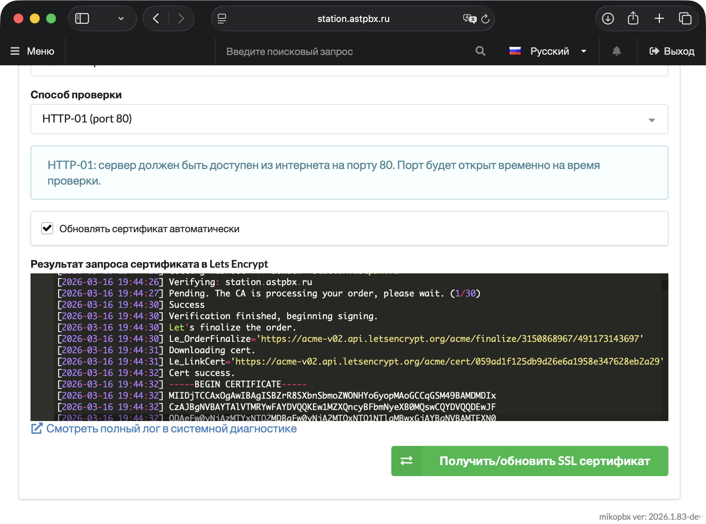

# Let's Encrypt

**Let's Encrypt** — это бесплатный автоматизированный центр сертификации (CA), который выпускает доверенные SSL/TLS-сертификаты для защиты веб-сайтов и сервисов по протоколу HTTPS.

**Когда будет полезен такой сертификат в MikoPBX?**

* Если ваша АТС доступна из интернета и вы хотите защитить веб-интерфейс администратора.
* Для безопасного подключения WebRTC-клиентов (звонки через браузер требуют HTTPS).
* Чтобы избавиться от предупреждений браузера о «небезопасном соединении».
* Если используете мобильные приложения или SIP-клиенты, которым требуется валидный сертификат.

**Системные требования:**

1. Для АТС должен быть выделен домен, к примеру **sip.test.ru**
2. Web-интерфейс АТС по протоколу `HTTP` должен быть доступен из интернета на порту **`80`**
3. В общих настройках (раздел "**HTTP/HTTPS**") отключите использование опции «**`Редирект на HTTPS`**», Сервер Lets encrypt для проверки ресурса обращается по **`http`** к вашей АТС.

### Установка модуля

1. Перейдите в раздел "**Модули**" -> "**Маркетплейс модулей**".

<figure><figcaption>
Раздел "Модули" -> "Маркетплейс модулей"
</figcaption></figure>

2. Далее перейдите в раздел "**Маркетплейс**". Установите модуль "**Генератор SSL сертификатов через Let\`s Encrypt**".

<figure><figcaption>
Установка модуля
</figcaption></figure>

### Получение сертификата

1. Вернитесь в раздел "**Установленные модули**". Далее, включите установленный модуль и перейдите в его параметры.

<figure><figcaption>
Включение и переход в настройки установленного модуля
</figcaption></figure>

2. Заполните общую информацию:

* Имя домена - укажите доменное имя Вашей станции.&#x20;
* Выберите способ проверки, доступно две опции: "HTTP-01 (Port 80)" и "DNS-01".


- **HTTP-01**: сервер должен быть доступен из интернета на порту 80. Порт будет открыт временно на время проверки.
- **DNS-01**: сертификат выпускается через API вашего DNS-провайдера. Порт 80 не нужен. Поддерживаются wildcard-сертификаты (\*.domain.com).


* Выберите опцию "**Обновлять сертификат автоматически**".

Если вы выбрали способ проверки **DNS-01**, заполните дополнительные поля:

* **DNS-провайдер** — выберите из списка вашего провайдера, у которого делегирован домен (например, Cloudflare, Route53, NameCheap и др.)
* **API-токен** — вставьте токен для доступа к API, полученный в личном кабинете вашего DNS-провайдера. Токен должен иметь права на создание и удаление TXT-записей в зоне домена.
* **Account ID** — идентификатор вашего аккаунта у DNS-провайдера. Обычно находится в настройках профиля или в разделе «Обзор» личного кабинета.
* **Zone ID** — идентификатор DNS-зоны вашего домена. Как правило, отображается на главной странице домена в личном кабинете провайдера.

Нажмите "**Получить/обновить SSL сертификат**".

<figure><figcaption>
Параметры модуля (генерация сертификата)
</figcaption></figure>

Вы увидите результат запроса сертификата в появившемся черном окне.

<figure><figcaption>
Успешное получение сертификата
</figcaption></figure>

В разделе "**Система**" -> "**Общие настройки**", во вкладке "**HTTP/HTTPS**" Вы можете найти информацию о выпущенном сертификате.

<figure><figcaption>
Выпущенный сертификат. Вкладка "HTTP/HTTPS" в системных настройках.
</figcaption></figure>
