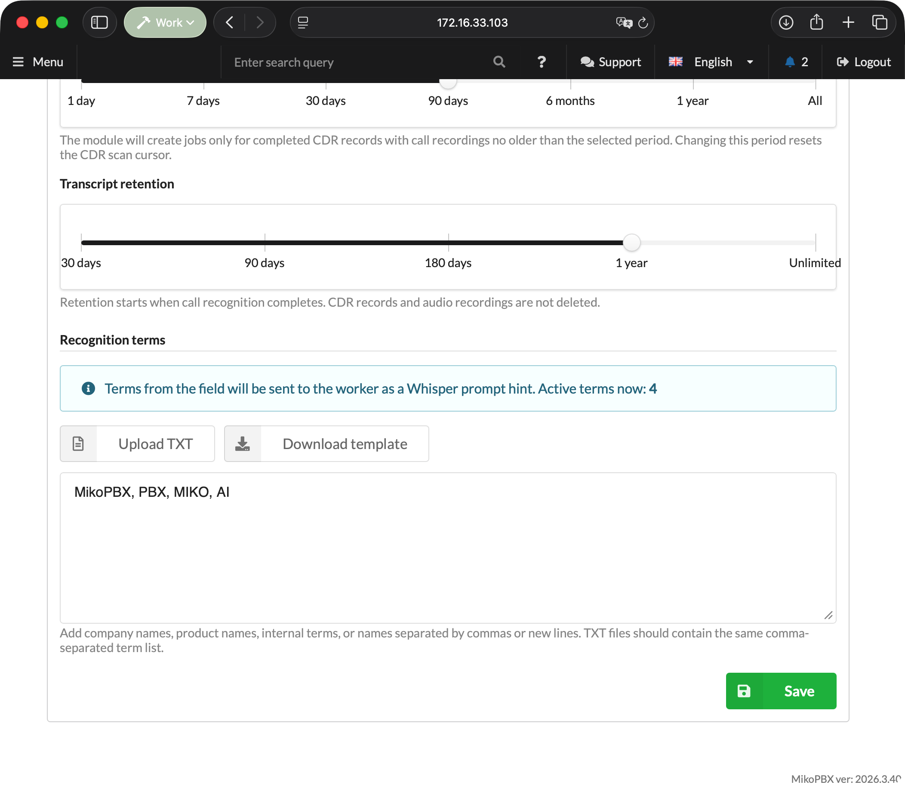

# Local Transcription

The **Local Speech To Text** module recognizes speech in recorded MikoPBX calls and saves the completed transcript as a conversation. Audio files are not sent to external cloud services: the PBX creates a job queue, while a separate **Local STT Worker** application downloads the assigned recording, recognizes it locally with the Parakeet or WhisperKit engine selected in MikoPBX, and returns the result to MikoPBX.


The PBX module runs inside MikoPBX. The separate Local STT Worker application is available for Apple silicon Macs. See [Local STT Worker](miko-ai-worker.md) for a detailed description of the application.


<figure><figcaption><p>Example transcription result</p></figcaption></figure>

### How processing works

1. A call ends, and MikoPBX saves the call recording.
2. The module's background process finds the recording and creates a job.
3. Local STT Worker acquires a lease for the job.
4. The PBX provides the assigned recording file to that worker.
5. The worker prepares the audio, starts the engine and Core ML model specified in the job, and produces transcript segments.
6. The module filters the result, saves the transcript, and publishes an event for integrations.

If the worker stops renewing its lease, the job returns to the queue.

### Requirements and compatibility

* MikoPBX **2025.1.1** or later.
* macOS **14.0** or later on a Mac with Apple silicon.
* Call recording enabled for the required routes, queues, or extensions.
* Network access from the Mac to the MikoPBX web interface.
* Internet access for the first download of the selected model and its supporting files. After the model has been downloaded, the worker only needs access to the PBX for processing.

### Installing the module

1. Open the MikoPBX web interface.
2. Go to **Modules** → **Module marketplace**.

<figure><figcaption><p>Module marketplace</p></figcaption></figure>

3. Find **Local Speech To Text** and install it.
4. Open the **Installed modules** tab and enable the module.

<figure><figcaption><p>Enabling the module</p></figcaption></figure>

5. Click the settings button to the right of the module version.

<figure><figcaption><p>Opening the module page</p></figcaption></figure>

### Settings tab

| Setting                                            | Default              | Purpose                                                                                                         |
| -------------------------------------------------- | -------------------- | --------------------------------------------------------------------------------------------------------------- |
| **Default language**                               | Detect automatically | Language hint for the recognition engine. In automatic mode, the worker detects the language from the result.  |
| **Base poll interval, sec.**                       | `30`                 | Interval for scanning new CDR records. Range: `30`–`3600`.                                                      |
| **Maximum recognizable recording duration, min.** | `60`                 | Recordings with a known duration above this limit are skipped. Range: `1`–`1440`.                              |
| **CDR per scan**                                   | `50`                 | Number of CDR records checked in one cycle. Range: `1`–`1000`.                                                   |
| **Job timeout, sec.**                              | `1800`               | Lease lifetime without a successful renewal. Range: `60`–`86400`.                                              |
| **Recording processing window**                    | `30 days`            | How far back to search for completed calls with recordings: 1, 7, 30, 90, 180, or 365 days, or all recordings. |
| **Transcript retention**                           | `1 year`             | When transcription results are deleted: after 30, 90, 180, or 365 days, or never.                              |
| **Recognition terms**                              | Empty                | Company, product, and system names, plus other words used as recognition hints.                                |

The recording processing window cannot exceed the transcript retention period. Retention starts when recognition completes; CDR records and source audio recordings are not deleted.


Changing the recording processing window resets the scan cursor so that the module reviews call history within the new range.



Parakeet supports 25 languages: Bulgarian, Croatian, Czech, Danish, Dutch, English, Estonian, Finnish, French, German, Greek, Hungarian, Italian, Latvian, Lithuanian, Maltese, Polish, Portuguese, Romanian, Slovak, Slovenian, Spanish, Swedish, Russian, and Ukrainian. Select a WhisperKit model before processing calls in another language.


<figure><figcaption><p>Module settings</p></figcaption></figure>

#### Recognition terms

Enter terms separated by commas, semicolons, or new lines, or upload them from a TXT file. The module removes duplicates and sends the worker up to 100 terms, each no longer than 120 characters.

The **Download template** button saves a sample TXT file.

<figure><figcaption><p>Recognition terms</p></figcaption></figure>

#### Audio processing parameters

WhisperKit model decoding parameters, normalization, VAD, maximum segment duration, and overlap are stored centrally in MikoPBX and sent to registered workers. In the current version, the advanced block containing these parameters is hidden, so they cannot be configured through either the module or worker interface.

### Model marketplace tab

This tab selects the model that the PBX includes in new jobs. The selection applies centrally to all workers and appears in Local STT Worker after its settings synchronize.

| Model                           | When to choose it                       | Characteristics                                                                                  |
| ------------------------------- | --------------------------------------- | ------------------------------------------------------------------------------------------------ |
| **Parakeet TDT 0.6B v3**        | Most calls                              | Default model. Fast recognition of long-form speech in 25 languages through the Parakeet engine. |
| **Whisper Large V3 Turbo**      | You want a proven general-purpose model | A good balance of speed and quality for typical multilingual calls through WhisperKit.           |
| **Whisper Podlodka Turbo**      | Almost all conversations are in Russian | A Whisper model fine-tuned for Russian speech from `smkrv/whisper-podlodka-turbo-coreml`.         |
| **Whisper Large V3**            | Quality matters more than speed         | The heaviest model in the catalog for difficult or unclear recordings. Runs through WhisperKit.  |

After selecting a model, click **Save model**.

<figure><figcaption><p>Selecting a recognition model</p></figcaption></figure>

#### Catalog contents

The catalog contains only the four reviewed models listed above. Adding arbitrary custom repositories through the interface is no longer supported: the worker accepts only the engine and Core ML artifact combinations provided by the module.


Previously saved custom models do not extend the current catalog. After upgrading, select one of the supported models and save the selection.


<figure><figcaption><p>Adding a Hugging Face model</p></figcaption></figure>

### Queue tab

| Status                         | Meaning                                                                 |
| ------------------------------ | ----------------------------------------------------------------------- |
| **Pending**                    | The job is waiting for an available worker.                             |
| **Processing**                 | The job is assigned to a worker under an active lease.                  |
| **Done today**                 | Jobs completed during the current day.                                  |
| **Errors**                     | Failed jobs that can be returned to the queue.                           |
| **Waiting for recording file** | A CDR record was found, but the file has not appeared or is unreadable. |
| **Skipped recordings**         | Recordings that will not be processed unless the conditions change.     |

Reasons for skipping include exceeding the maximum duration, being unable to verify the duration of a recording that appears too long in the CDR, exceeding the fixed 500 MiB limit, a missing file after the waiting period expires, and a call falling outside the processing window. An unknown or zero CDR duration does not by itself prevent the module from creating a job. When the CDR duration exceeds the limit, the module verifies the media file duration with a time-limited `ffprobe` process.

<figure><figcaption><p>Queue in the module interface</p></figcaption></figure>

### Workers tab

Use this tab to create access keys, view registered Macs, and check their compatibility.

A key is shown only once after it is created. A single key cannot be bound to multiple `worker_uid` values at the same time; create a separate key for each Mac. After deleting a key, register the associated worker again with a new token.

The worker table shows the name, UID, IP address, model selected in MikoPBX, application version, status, and last activity. Worker API version and compatibility are no longer separate columns. An incompatible worker appears offline; the update guide link remains below the table.

The top of the tab includes a download section for the macOS application. Until a build is published there, the download button remains unavailable.

<figure><figcaption><p>Creating a Worker API key</p></figcaption></figure>

### Transcripts tab

You can filter the list by call date range. The table shows the date, `call_id`, job number, file, language, duration, model, and time when the result was created.

The conversation view includes a player and recording download, timestamped turns, separate channel columns for stereo recordings, grouped diagnostics, raw technical information, and transcript JSON. Clicking a turn moves the player to the corresponding point in the recording.

<figure><figcaption><p>Transcript list</p></figcaption></figure>

<figure><figcaption><p>Transcript conversation view</p></figcaption></figure>

### Logging tab

The log contains structured technical events from the module and workers, without transcripts, audio recordings, or secrets. Available periods are `1h`, `3h`, `12h`, `1d`, and the entire log. You can filter by level and component, perform a full-text search, and refresh the list. The interface displays no more than the latest 1,000 matching events.

### Updating the module and worker

When moving to Worker API v2, update the components in this order:

1. Update ModuleLocalSpeechToText to version 1.45.
2. Older workers temporarily become incompatible and offline; active v1 leases return to the queue without increasing the attempt count.
3. Update Local STT Worker to version 1.7 build 34.
4. Open **Diagnostics** or **Settings** in the worker and run the connection check again.

The queue, completed results, settings, worker UIDs, and existing API keys are preserved. This transition does not require a MikoPBX Core version newer than 2025.1.1.

### REST API

Base path:

```
/pbxcore/api/v3/module-local-speech-to-text
```

#### Transcripts for integrations

* `GET /transcripts?limit=50&offset=0&date_from=YYYY-MM-DD&date_to=YYYY-MM-DD`
* `GET /transcripts/{result_id}`
* `GET /transcripts/events?cursor=created_at:event_id&limit=100`
* `GET /call-transcripts/{call_transcript_id}?revision={revision}`
* `GET /call-transcripts/events?cursor={cursor}&limit=100`

`transcripts/events` publishes idempotent `transcript.completed` events. A detailed transcript contains stable `segment_id` values, source segments, merged `turns`, and plain text.

`call-transcripts` combines multiple recordings from one logical call into a versioned transcript. Its part manifest preserves `cdr_start_ms` and `cdr_end_ms`, while segments contain relative and absolute timestamps. Adjacent segments from the same participant and channel are combined into a single turn without losing their source `segment_id` values.

#### Worker API v2

The worker first calls `GET /worker-api-contract`, then sends the `X-MikoPBX-Worker-API-Version: 2` header with every Worker API request.

The `GET /worker-processing-settings` response contains the centralized processing profile and a `selected_model` object with the model identifier, repository, engine, Core ML artifact type, and display name. Jobs also contain `model_engine` and `model_artifact_type`, which the worker uses to choose Parakeet or WhisperKit. Arbitrary engine, model, and artifact combinations are rejected.

| Operation          | Endpoint                          |
| ------------------ | --------------------------------- |
| Registration       | `POST /workers`                   |
| Processing profile | `GET /worker-processing-settings` |
| Acquire lease      | `POST /job-leases`                |
| Download recording | `GET /job-recordings/{job_id}`    |
| Renew lease        | `PATCH /job-leases/{job_id}`      |
| Release lease      | `DELETE /job-leases/{job_id}`     |
| Submit result      | `PUT /job-results/{job_id}`       |
| Submit failure     | `PUT /job-failures/{job_id}`      |

Legacy Worker API v1 endpoints have been removed. Local STT Worker 1.7 does not fall back to v1 and stops with upgrade guidance when it encounters an incompatible module version.
