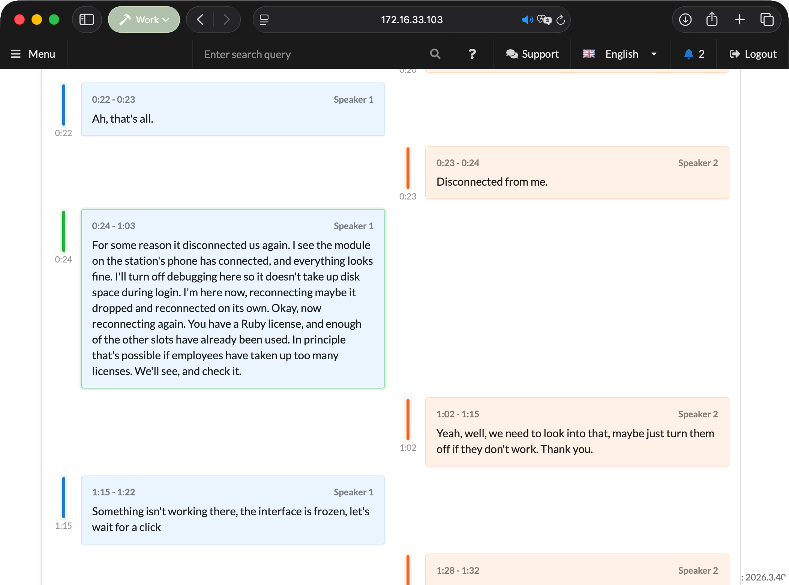
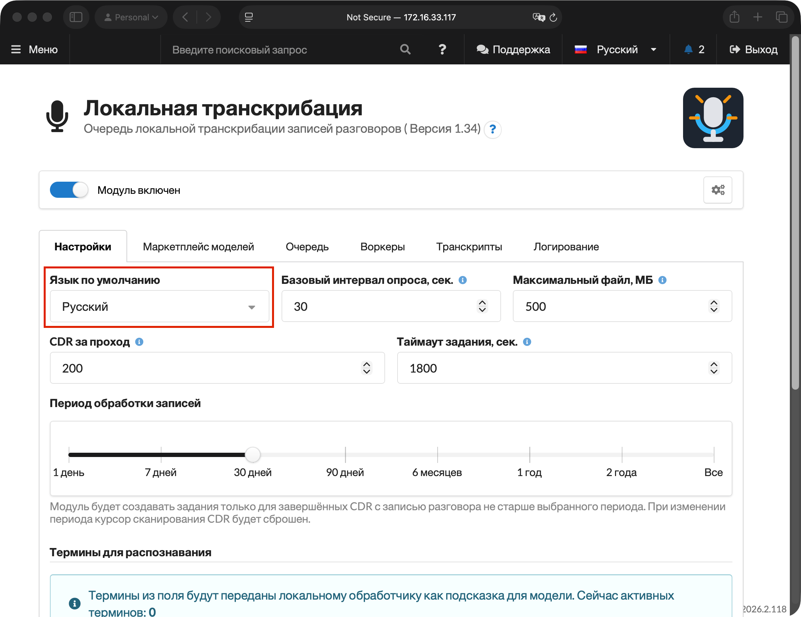
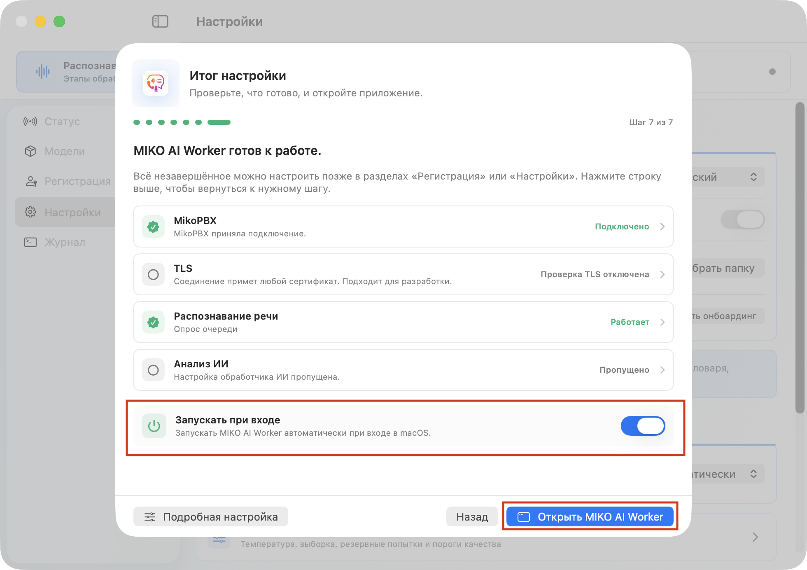
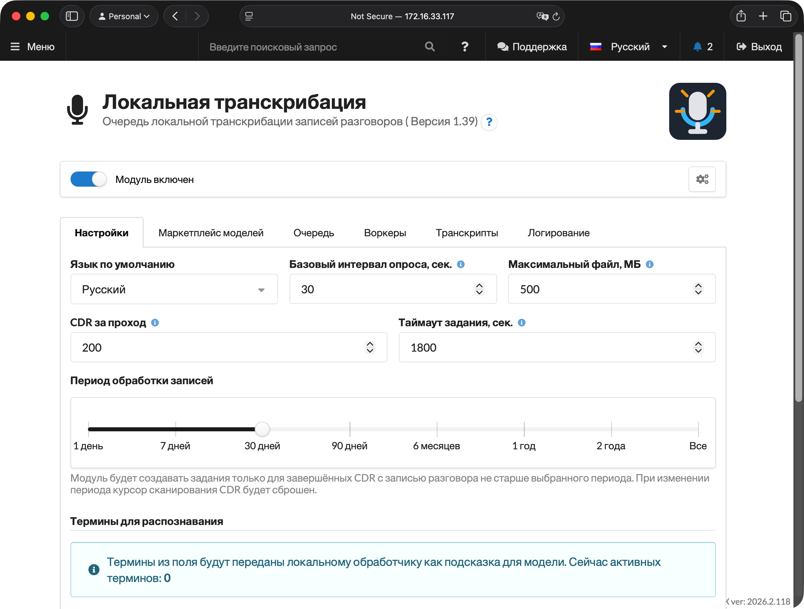
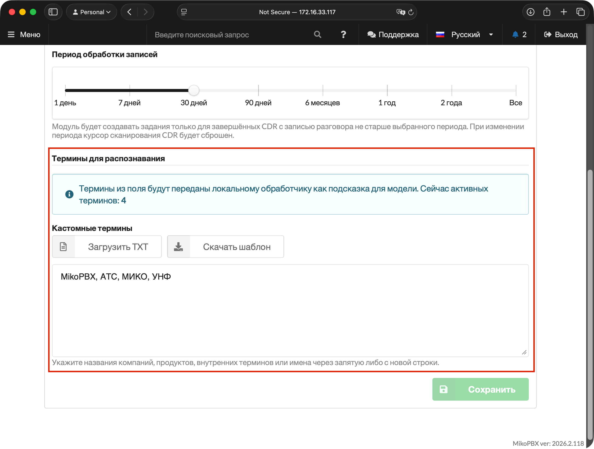
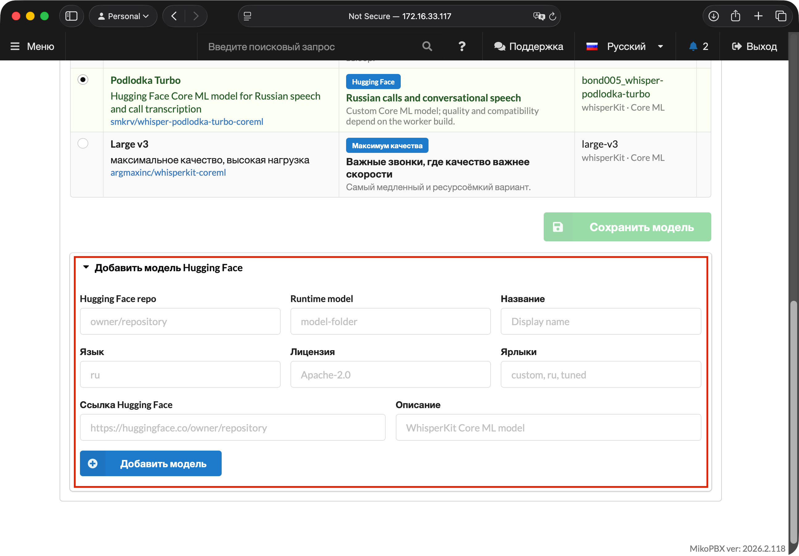
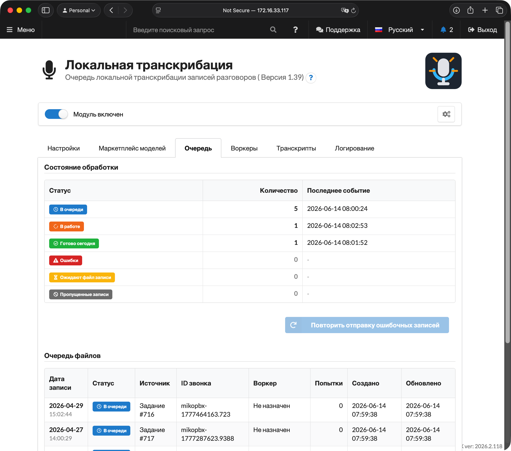
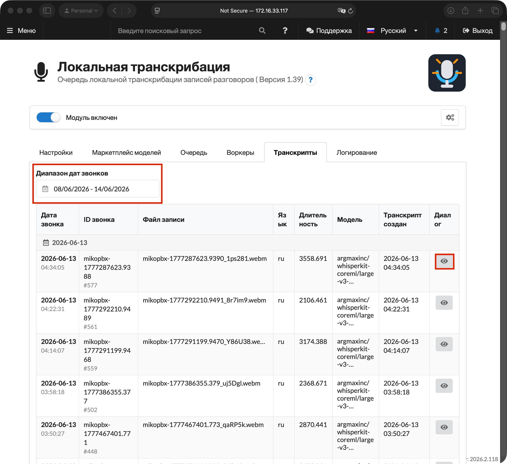

# Локальная транскрибация (In dev)

**STT-модуль локальной транскрибации** распознает речь в записанных звонках MikoPBX и сохраняет готовую расшифровку как диалог. Аудиофайлы не отправляются во внешние облачные сервисы: PBX создает очередь заданий, а отдельное приложение-обработчик на Mac скачивает назначенную запись, распознает ее локально через WhisperKit/Core ML и отправляет результат обратно в MikoPBX.


На данный момент серверная часть доступна только на OSx, в будущем планируется расширение и под другие платформы.


Модуль полезен, когда нужно быстро находить важные разговоры, передавать текст звонков в другие локальные модули, готовить данные для контроля качества или просто иметь читаемую историю общения рядом с записью звонка.

<figure><figcaption><p>Пример результата транскрибации</p></figcaption></figure>

### Что делает модуль

* Находит завершенные звонки с доступными файлами записей.
* Создает очередь заданий на расшифровку и не дублирует уже обработанные записи.
* Передает файл только тому обработчику, который взял конкретное задание.
* Позволяет выбрать язык, модель распознавания, период обработки записей, лимиты очереди и словарь терминов.
* Показывает состояние очереди, обработчиков, ошибок, отложенных и пропущенных записей.
* Хранит расшифровки с таймкодами, участниками разговора, моделью, языком и технической диагностикой.
* Публикует событие `transcript.completed` для интеграций с другими локальными модулями.


Модуль работает только с теми звонками, для которых в MikoPBX есть запись разговора. Если запись звонков отключена в маршруте, очереди или настройках сотрудника, расшифровка для такого звонка не появится.


### Как устроена обработка

Решение состоит из двух частей:

1. **PBX-модуль** в MikoPBX. Он сканирует историю звонков, создает задания, хранит настройки, ключи обработчиков, очередь и готовые расшифровки.
2. **Локальный обработчик на Mac**. Он подключается к PBX по API, забирает задания, подготавливает аудио, запускает распознавание и возвращает результат.

Обычный цикл выглядит так:

1. Звонок завершился, и MikoPBX сохранила запись разговора.
2. Фоновый процесс модуля находит эту запись и создает задание.
3. Mac-обработчик берет задание из очереди.
4. PBX отдает обработчику только назначенный аудиофайл.
5. Обработчик распознает речь локально и отправляет сегменты текста с таймкодами.
6. Модуль сохраняет расшифровку, показывает ее в интерфейсе и создает событие для интеграций.

### Требования

* MikoPBX **2025.1.1** или новее.
* Установленный и включенный модуль "**Модуль локальной транскрибации"**.
* Включенная запись разговоров для тех вызовов, которые нужно расшифровывать.
* Mac на Apple Silicon для локального приложения-обработчика.
* Сетевой доступ от Mac к веб-интерфейсу MikoPBX.
* Достаточно места на Mac для кэша моделей WhisperKit/Core ML. Модели скачиваются при первом использовании (необходим доступ в интернет для загрузки модулей при первом использовании)

### Установка модуля

1. Откройте веб-интерфейс MikoPBX.
2. Перейдите в раздел **"Модули"** → **"Маркетплейс модулей"**.

<figure><figcaption><p>Раздел "Маркетплейс модулей"</p></figcaption></figure>

3. Найдите **Модуль локальной транскрибации** и установите его.
4. Перейдите в список установленных модулей и включите модуль.

<figure><figcaption><p>Включение модуля "Локальная транскрибация"</p></figcaption></figure>

5. Откройте страницу модуля, нажав на иконку "Настройки", справа от версии модуля.

<figure><figcaption><p>Переход на страницу модуля</p></figcaption></figure>

### Быстрый запуск

1. Во вкладке "**Настройки"** оставьте язык "**Определять автоматически"** или выберите основной язык звонков.

<figure><figcaption><p>Выбор языка распознавания</p></figcaption></figure>

2. Во вкладке "**Маркетплейс моделей"** выберите модель "**Large V3 Turbo"** или **"Podlodka Turbo"** (для русского языка). Это рекомендуемые варианты для рабочей расшифровки звонков.

Нажмите "**Сохранить модель**".

<figure><figcaption><p>Выбор модели для распознавания</p></figcaption></figure>

3. Перейдите во вкладку "**Воркеры**" нажмите "**Создать API-ключ"** и сразу скопируйте ключ.

<figure><figcaption><p>Создание API ключа для внешней работы с модулем</p></figcaption></figure>

4. Откройте приложение-обработчик "**MIKO AI Worker**" на Mac. На первом шаге онбоардинга выберите язык интерфейса. Нажмите "**Далее**".

<figure><figcaption><p>Выбор языка онбоардинга и приложения</p></figcaption></figure>

5. Перейдите на Шаг 3 (нажмите "**Далее**" на Шаге 2). Введите адрес Вашей MikoPBX в формате `https://...` и задайте понятное имя обработчика.

Нажмите "**Проверить соединение**", потом "**Далее**".

<figure><figcaption><p>Шаг "Подключение к MikoPBX"</p></figcaption></figure>

6. На шаге "**TLS и доверие сертификату"** выберите, проверять ли сертификат PBX. Если у Вас есть сертификат - включите проверку и укажите PEM-файл CA.

<figure><figcaption><p>Шаг "TLS и доверие сертификату"</p></figcaption></figure>

7. На шаге **"Распознавание речи",** вставьте созданный STT воркер token, нажмите **"Проверить токен"**, затем **"Зарегистрировать распознавание речи"**.

Нажмите "**Далее**".

<figure><figcaption><p>Шаг "Распознавание речи"</p></figcaption></figure>

8. Если ИИ Аналитика на этом Mac не нужна, пропустите шаг **AI Analysis (**&#x43D;ажмите **"Далее".**


Подробнее про модуль "ИИ Супервайзер" можно прочитать <mark style="color:red;">здесь</mark>.


9. На финальном шаге включите **"Запускать при входе"**, если обработчик должен запускаться вместе с macOS.

Нажмите "**Открыть MIKO AI Worker**".

<figure><figcaption><p>Итог настройки, выбор опции запуска при входе в MacOS</p></figcaption></figure>

Будет загружена модель с ресурса [Hugging Face](https://huggingface.co/), после этого начнется процесс расшифровки записей, переданных со станции. Можно отключить доступ к внешним ресурсам, локальной сети со станцией будет достаточно для дальнейшей работы.

Результат расшифровки Вы сможете найти в разделе "**Транскрипты**".

<figure><figcaption><p>Процесс расшифровки записи</p></figcaption></figure>

### Вкладка "Настройки"

Здесь задаются параметры, которые PBX передает в задания и использует при поиске новых записей.

| Настройка                         | Значение по умолчанию        | Описание                                                                                                                                                                                             |
| --------------------------------- | ---------------------------- | ---------------------------------------------------------------------------------------------------------------------------------------------------------------------------------------------------- |
| **Язык по умолчанию**             | **Определять автоматически** | Языковая подсказка для распознавания. Если выбран конкретный язык, обработчик получает его в задании. Если выбран автоматический режим, язык определяет модель.                                      |
| **Базовый интервал опроса, сек.** | `30`                         | Как часто модуль проверяет новые записи и добавляет их в очередь. Допустимый диапазон: `30`-`3600` секунд.                                                                                           |
| **Максимальный файл, МБ**         | `500`                        | Верхний размер записи, которую можно добавить в очередь. Файлы больше лимита будут пропущены и появятся в очереди как **Пропущенные записи**. Допустимый диапазон: `1`-`10240` МБ.                   |
| **CDR** **за проход**             | `200`                        | Сколько записей CDR модуль проверяет за один цикл сканирования. Большие значения быстрее догоняют историю, но увеличивают нагрузку при сканировании. Допустимый диапазон: `1`-`1000`.                |
| **Таймаут ожидания, сек.**        | `1800`                       | Сколько времени задание может оставаться закрепленным за обработчиком. Если обработчик не завершит задание и не продлит lease, задание вернется в очередь. Допустимый диапазон: `60`-`86400` секунд. |
| **Период обработки записей**      | `30 дней`                    | За какой период искать завершенные звонки с записью.                                                                                                                                                 |
| **Кастомные термины**             | пусто                        | Список слов, которые будут переданы обработчику как контекст: названия компаний, продуктов, внутренних систем или типовые фразы.                                                                     |


При изменении "**Периода обработки записей",** позиция сканирования сбрасывается. Это нужно, чтобы модуль корректно пересмотрел историю в новом диапазоне.


<figure><figcaption><p>Вкладка "Настройки" в STT модуле</p></figcaption></figure>

#### Термины для распознавания

В блоке "**Термины для распознавания"** можно добавить пользовательский словарь. Он помогает модели точнее распознавать внутренние названия: например, `MikoPBX`, `Asterisk`, `SIP`, `VoIP`, название компании, продукта или CRM.

Термины можно вводить через запятую, точку с запятой или с новой строки. Также можно загрузить TXT-файл с таким же списком. Модуль удалит дубликаты и передаст обработчику до 100 терминов, каждый длиной до 120 символов.

Кнопка "**Скачать шаблон"** сохраняет пример TXT-файла, который можно отредактировать и загрузить обратно.

<figure><figcaption><p>Термины для распознавания в настройках модуля</p></figcaption></figure>

### Вкладка "Маркетплейс моделей"

На этой вкладке выбирается модель, которую PBX будет передавать обработчику в новые задания расшифровки.

| Модель             | Когда выбирать                                              | Особенности                                                                                                                               |
| ------------------ | ----------------------------------------------------------- | ----------------------------------------------------------------------------------------------------------------------------------------- |
| **Base**           | Тесты, слабые Mac, записи без высоких требований к качеству | Самая быстрая базовая модель, но хуже распознает шум, акценты и короткие фразы.                                                           |
| **Small**          | Большая очередь, где важна скорость                         | Быстрая модель с приемлемым качеством телефонных разговоров.                                                                              |
| **Medium**         | Повседневные звонки на Mac среднего уровня                  | Баланс точности и умеренной нагрузки.                                                                                                     |
| **Large V3 Turbo** | Рабочая расшифровка звонков                                 | Рекомендуемый вариант: обычно лучший практический баланс качества и скорости.                                                             |
| **Podlodka Turbo** | Русскоязычные звонки и разговорная речь                     | Встроенная Hugging Face/Core ML модель `smkrv/whisper-podlodka-turbo-coreml`. Качество и совместимость зависят от версии Mac-обработчика. |
| **Large V3**       | Важные звонки, где качество важнее скорости                 | Максимальное качество, но самая высокая нагрузка и самая медленная обработка.                                                             |

После выбора модели нажмите **Сохранить модель**. Уже завершенные расшифровки не пересчитываются автоматически.

<figure><figcaption><p>Подсвеченная модель в Маркетплейсе моделей</p></figcaption></figure>

#### Добавление модели Hugging Face

Если нужна своя WhisperKit/Core ML-совместимая модель, раскройте блок **Добавить модель Hugging Face**.

| Поле                         | Что указать                                                           |
| ---------------------------- | --------------------------------------------------------------------- |
| **Репозиторий Hugging Face** | В формате `owner/repository`, например `argmaxinc/whisperkit-coreml`. |
| **Модель для распознавания** | Имя папки или runtime-модели внутри репозитория.                      |
| **Название**                 | Как модель будет отображаться в таблице.                              |
| **Язык**                     | Короткая пометка языка, например `ru` или `en`.                       |
| **Лицензия**                 | Лицензия модели, если ее нужно видеть в таблице.                      |
| **Ярлыки**                   | Теги через запятую: `custom`, `ru`, `tuned`.                          |
| **Ссылка Hugging Face**      | Полная ссылка на страницу модели на `https://huggingface.co/`.        |
| **Описание**                 | Краткое пояснение, чем эта модель отличается от стандартных.          |


Пользовательская модель должна быть совместима с WhisperKit/Core ML. Если указать обычную модель, не подготовленную для локального запуска в обработчике, Mac не сможет выполнить задание.


<figure><figcaption><p>Возможность добавления своей модели</p></figcaption></figure>

### Вкладка "Очередь"

Вкладка **Очередь** показывает, что сейчас происходит с файлами записей.

#### Состояние обработки

| Статус                  | Что означает                                                                                                       |
| ----------------------- | ------------------------------------------------------------------------------------------------------------------ |
| **В очереди**           | Задание создано и ждет свободный обработчик.                                                                       |
| **В работе**            | Задание закреплено за обработчиком.                                                                                |
| **Готово сегодня**      | Количество заданий, завершенных за текущий день.                                                                   |
| **Ошибки**              | Задания, которые завершились ошибкой. Их можно вернуть в очередь кнопкой **Повторить отправку ошибочных записей**. |
| **Ожидают файл записи** | CDR-запись уже найдена, но аудиофайл еще не появился или пока недоступен для чтения.                               |
| **Пропущенные записи**  | Записи, которые модуль не будет обрабатывать без изменения условий.                                                |

#### Почему запись может быть пропущена

* **Файл больше текущего лимита** - увеличьте **Максимальный файл, МБ** или оставьте запись без расшифровки.
* **Файл записи не появился вовремя** - проверьте, создаются ли записи разговоров и доступен ли каталог записей.
* **Звонок вне периода обработки** - увеличьте **Период обработки записей** на вкладке **Настройки**.

В таблице файлов отображаются дата записи, статус, источник, `call_id`, назначенный обработчик, количество попыток, время создания и время последнего обновления.

<figure><figcaption><p>Раздел "Очередь"</p></figcaption></figure>

### Вкладка "Воркеры"

Воркер - это Mac, который выполняет локальное распознавание. На вкладке **Воркеры** создаются ключи доступа и отображаются зарегистрированные рабочие станции.

#### Ключи подключения обработчиков

Нажмите **Создать ключ доступа**, чтобы выпустить новый токен для Mac-приложения. Ключ показывается только один раз сразу после создания, поэтому его нужно скопировать до обновления страницы.

В таблице ключей отображаются:

* замаскированный ключ;
* дата создания;
* последнее использование;
* количество привязанных обработчиков;
* кнопка удаления.

Удаление ключа сразу запрещает обработчику использовать этот токен. Если обработчик был привязан к удаленному ключу, его нужно подключить заново с новым ключом.


Модуль поддерживает несколько ключей доступа. Это удобно, если в работе несколько Mac-обработчиков или нужно отдельно перевыпустить ключ для конкретной машины.


#### Таблица обработчиков

После регистрации Mac появится в таблице обработчиков.

| Колонка                  | Описание                                           |
| ------------------------ | -------------------------------------------------- |
| **Обработчик**           | Имя, указанное в приложении на Mac.                |
| **IP**                   | IP-адрес, с которого обработчик подключился к PBX. |
| **Модель**               | Текущая модель распознавания, выбранная в PBX.     |
| **Статус**               | **Онлайн** или **Офлайн**.                         |
| **Последняя активность** | Время последнего обращения обработчика к PBX.      |

Если обработчик долго не выходит на связь, он будет помечен как **Офлайн**. Проверьте, запущено ли приложение на Mac, доступна ли PBX по сети и не был ли удален ключ доступа.

<figure><figcaption><p>Вкладка "Воркеры"</p></figcaption></figure>

### Вкладка "Транскрипты"

Вкладка "**Транскрипты"** показывает готовые результаты. Список можно фильтровать по диапазону дат звонков.

В таблице видны:

* дата звонка;
* `call_id` и номер задания;
* файл записи;
* язык;
* длительность;
* использованная модель;
* дата создания расшифровки;
* кнопка открытия диалога.

<figure><figcaption><p>Вкладка "Транскрипты"</p></figcaption></figure>

#### Просмотр диалога

Откройте расшифровку кнопкой с иконкой просмотра. В карточке диалога отображаются:

* данные записи и звонка;
* проигрыватель записи и кнопка скачивания, если файл еще доступен;
* реплики разговора с таймкодами;
* отдельные колонки участников для стереозаписей;
* техническая информация обработки.

Если запись доступна для прослушивания, можно нажать на реплику в диалоге, и проигрыватель перейдет к соответствующему фрагменту.

<figure><figcaption><p>Пример транскрипта, сделанного модулем</p></figcaption></figure>

### Вкладка "Логирование"

Логирование помогает понять, что происходило с модулем: сохранение настроек, создание заданий, подключение обработчиков, ошибки скачивания, повторы и другие события.

## Работа с приложением воркера


### Типовые сценарии

#### Расшифровывать только свежие звонки

1. Откройте **Настройки**.
2. Установите **Период обработки записей** в `1 день` или `7 дней`.
3. Оставьте **Звонков за один проход** равным `200`.
4. Сохраните настройки.

Такой режим подходит, если нужно обрабатывать только текущую работу операторов и не поднимать большую старую историю.

#### Догнать историю за несколько месяцев

1. Временно увеличьте **Период обработки записей** до `90 дней`, `6 месяцев` или `1 год`.
2. Если PBX справляется с нагрузкой, увеличьте **Звонков за один проход**.
3. Следите за вкладкой **Очередь**.
4. После обработки истории верните период к рабочему значению.


Большой период обработки и большой лимит звонков за один проход могут увеличить нагрузку на PBX при сканировании истории. Меняйте эти параметры постепенно.


#### Улучшить распознавание внутренних терминов

1. На вкладке **Настройки** добавьте названия продуктов, компаний, отделов и типовые аббревиатуры в **Свои термины**.
2. Сохраните настройки.
3. Совершите тестовый звонок и проверьте новую расшифровку.

Термины применяются к новым заданиям. Старые готовые расшифровки автоматически не пересчитываются.

### REST API для интеграций

Готовые расшифровки можно получать через REST API v3:

| Метод | Endpoint                                                         | Описание                                                                                |
| ----- | ---------------------------------------------------------------- | --------------------------------------------------------------------------------------- |
| `GET` | `/pbxcore/api/v3/module-local-speech-to-text/transcripts`        | Список готовых расшифровок. Поддерживает `limit`, `offset`, `date_from`, `date_to`.     |
| `GET` | `/pbxcore/api/v3/module-local-speech-to-text/transcripts/{id}`   | Детальная расшифровка с сегментами, репликами и текстом.                                |
| `GET` | `/pbxcore/api/v3/module-local-speech-to-text/transcripts/events` | События `transcript.completed` для модулей, которые читают новые расшифровки по cursor. |

API обработчика использует тот же базовый путь:

```
/pbxcore/api/v3/module-local-speech-to-text
```

Основные методы обработчика:

* `POST /workers:register`
* `GET /jobs:getNext?worker_uid=...`
* `GET /jobs/{job_id}:download?worker_uid=...`
* `POST /jobs/{job_id}:heartbeat`
* `POST /jobs/{job_id}:submitResult`
* `POST /jobs/{job_id}:submitError`
* `POST /jobs/{job_id}:release`


Для новых интеграций используйте REST API, а не прямое чтение таблиц модуля. Так интеграция останется совместимой с будущими изменениями структуры хранения.


### Если что-то не работает

#### Обработчик не появляется в MikoPBX

* Проверьте адрес PBX в Mac-приложении.
* Убедитесь, что адрес начинается с `https://`.
* Нажмите **Test Connection**.
* Убедитесь, что вставлен именно STT-ключ с вкладки **Обработчики**.
* Если ключ удаляли или перевыпускали, вставьте новый ключ и зарегистрируйте обработчик снова.
* При HTTPS с собственным сертификатом проверьте **TLS verification** и **Custom CA file** в настройках Mac-приложения.

#### Очередь пустая

* Убедитесь, что для звонков включена запись разговора.
* Проверьте **Период обработки записей**.
* Проверьте **Максимальный файл, МБ**.
* Посмотрите вкладку **Журнал**: там будут события сканирования и причины пропуска.

#### Задания есть, но расшифровки не появляются

* Проверьте, что обработчик в статусе **Онлайн**.
* Убедитесь, что приложение на Mac запущено и STT worker не остановлен.
* Проверьте, не скачивается ли модель впервые. Первый запуск тяжелой модели может занять время.
* Если задание ушло в ошибку, нажмите **Повторить отправку ошибочных записей**.

#### Расшифровка есть, но качество низкое

* Выберите более точную модель: **Medium**, **Large V3 Turbo** или **Large V3**.
* Укажите основной язык звонков вместо автоматического определения.
* Добавьте внутренние названия и аббревиатуры в **Свои термины**.
* Проверьте качество самой записи: шум, слабый уровень громкости и обрывы речи напрямую влияют на результат.


Локальные настройки Mac-приложения не меняют настройки PBX-модуля. Они отвечают только за поведение конкретной машины:

* **App language** - язык интерфейса приложения на Mac.
* **Start on login** - запускать обработчик при входе пользователя в macOS.
* **Temporary files** - папка для скачанных записей и промежуточных WAV-файлов.
* **Re-run onboarding** - повторно открыть пошаговую настройку.
* **Language Fallback** - запасной язык, если PBX не передала языковую подсказку.
* **Advanced audio processing** - нормализация, VAD, разделение стерео и длина локальных фрагментов.
* **Advanced STT timing** - интервалы опроса и heartbeat со стороны Mac.
* **Advanced STT network** - API prefix, таймауты, повторные попытки, TLS verification и CA-файл.
