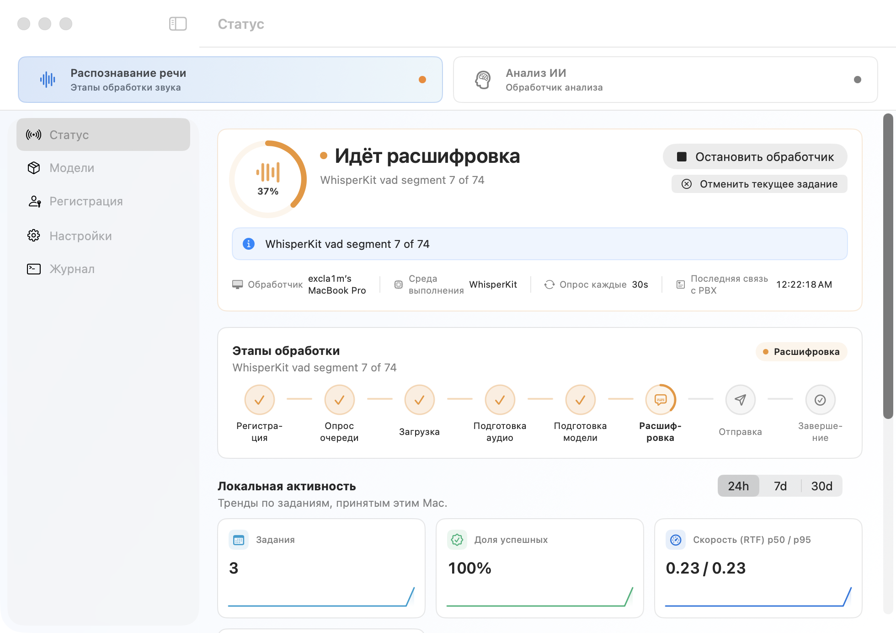
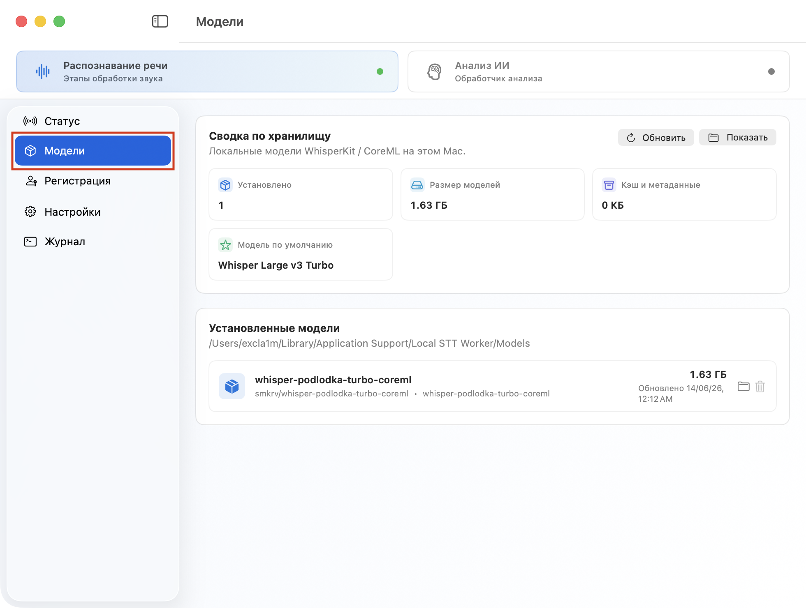
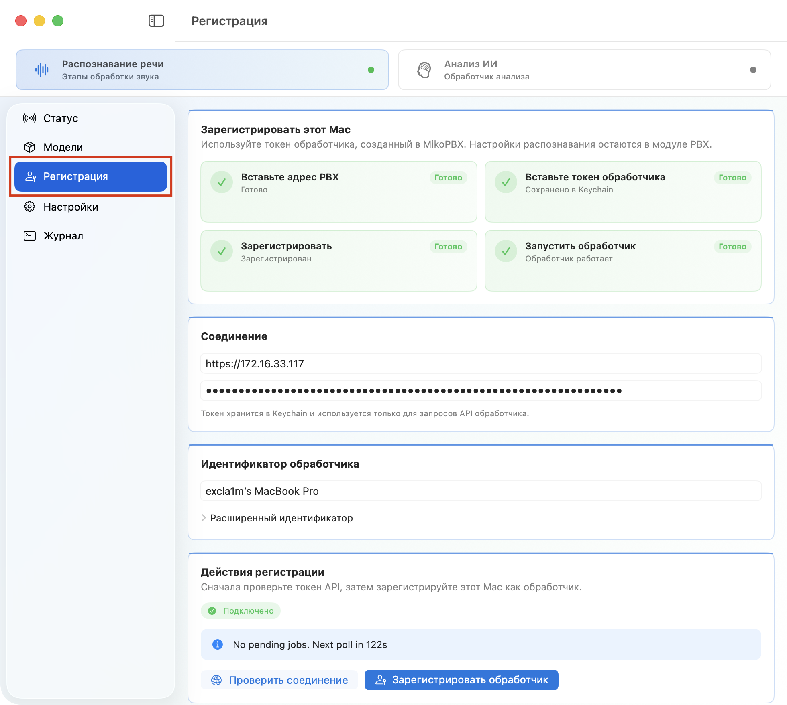
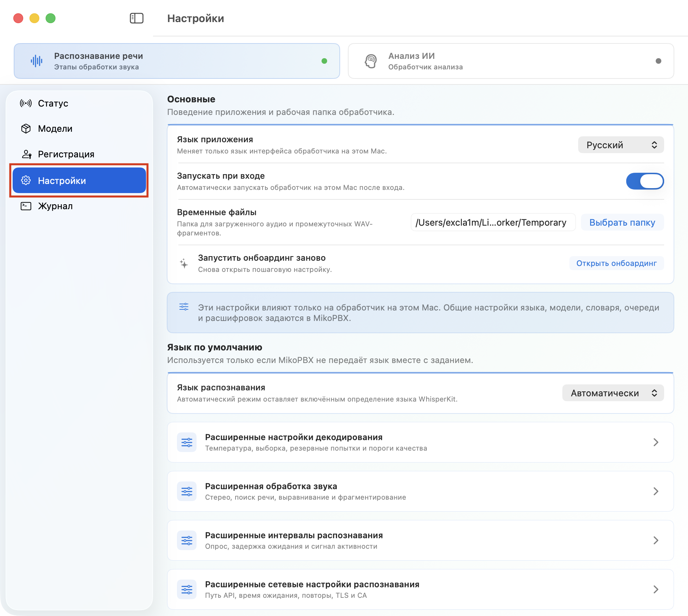
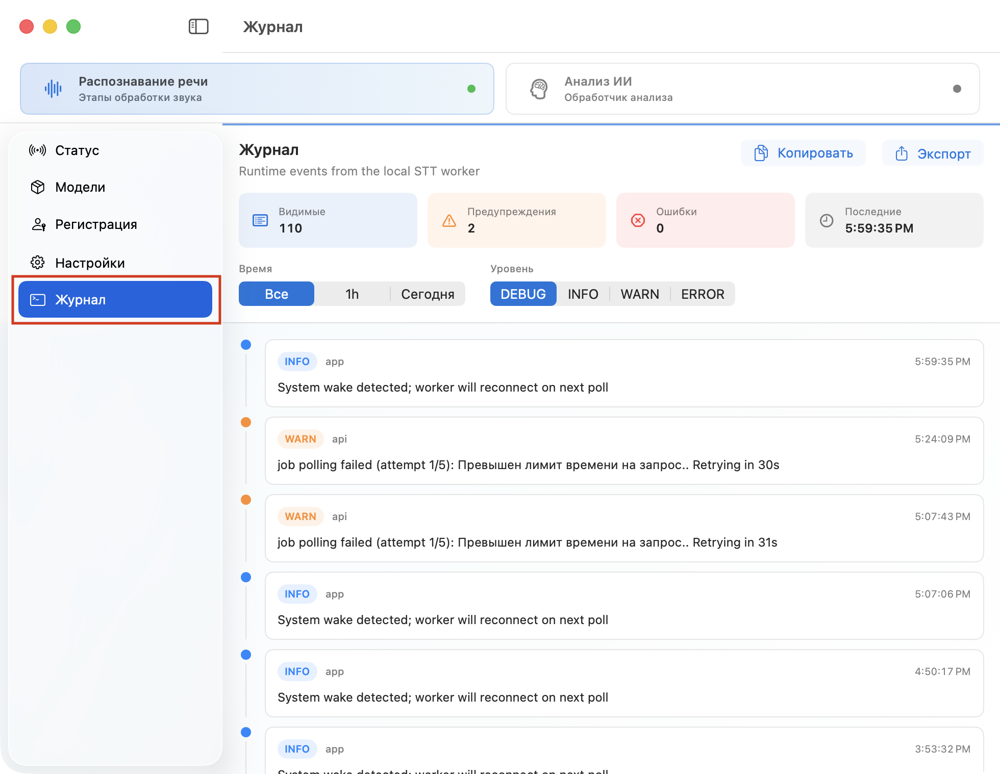

# MIKO AI Worker: Локальная транскрибация

**MIKO AI Worker** - это приложение для Mac, которое выполняет локальную обработку заданий из MikoPBX. В этой статье описана только STT-часть приложения: какие окна доступны в режиме **Распознавание речи**, что в них отображается и какие действия можно выполнять.

Приложение не выбирает, какие звонки нужно расшифровывать. Очередь, модель, язык, словарь терминов и правила поиска записей задаются в **Модуле локальной транскрибации** на стороне MikoPBX. MIKO AI Worker получает уже готовое задание, скачивает назначенную запись, подготавливает аудио, распознает речь локально на Mac и возвращает результат в PBX.

<figure><figcaption>
Интерфейс приложения
</figcaption></figure>

### Навигация приложения

В левой части окна находится переключатель рабочих режимов и список разделов. При выбранном режиме "**Распознавание речи"** доступны STT-экраны приложения.

| Раздел                 | Назначение                                                                                                                               |
| ---------------------- | ---------------------------------------------------------------------------------------------------------------------------------------- |
| **Распознавание речи** | Главный экран STT-обработчика: запуск, остановка, текущий этап обработки, локальная статистика и последние задания.                      |
| **Модели**             | Локальный кэш WhisperKit/Core ML моделей на этом Mac.                                                                                    |
| **Регистрация**        | Данные подключения к MikoPBX и регистрация этого Mac как STT-обработчика.                                                                |
| **Настройки**          | Локальные настройки приложения: язык интерфейса, временные файлы, язык распознавания, параметры звука, декодирования, сети и интервалов. |
| **Журнал**             | Локальный журнал событий STT-обработчика с фильтрами, поиском, копированием и экспортом.                                                 |

Разделы режима **Анализ ИИ** относятся к другому модулю и не используются для локальной транскрибации звонков.

### Раздел "Статус"

**Статус** - основной рабочий экран STT-обработчика. Здесь видно, готов ли Mac к работе, обрабатывается ли сейчас задание, на каком этапе находится обработка и какие задания недавно выполнялись на этой машине.

**Скриншот 2:** окно **Распознавание речи** целиком, видны верхний блок состояния, **Этапы обработки**, **Локальная активность** и **Недавние задания**.

Верхний блок показывает текущее состояние STT-обработчика и содержит основные действия. Отдельного заголовка у этого блока в интерфейсе нет, поэтому в документации он описан по назначению.

| Состояние                           | Что означает                                                                                                      |
| ----------------------------------- | ----------------------------------------------------------------------------------------------------------------- |
| **Нужна регистрация**               | Для STT не хватает адреса PBX, токена API обработчика или регистрации обработчика.                                |
| **Готов к регистрации**             | Данные для подключения введены, но Mac еще не зарегистрирован как обработчик.                                     |
| **Проверка регистрации**            | Приложение проверяет связь с MikoPBX или выполняет регистрационное действие.                                      |
| **Обработчик речи зарегистрирован** | Mac зарегистрирован и готов к запуску STT-обработчика.                                                            |
| **Обработчик речи работает**        | Обработчик запущен, поддерживает связь с MikoPBX и опрашивает очередь заданий распознавания речи.                 |
| **Идёт расшифровка**                | Обработчик выполняет активное задание: скачивает запись, готовит аудио, распознает речь или отправляет результат. |
| **Ошибка обработчика**              | Возникла ошибка подключения, подготовки аудио, модели, распознавания или отправки результата.                     |

Доступные действия:

| Кнопка                       | Назначение                                                                                      |
| ---------------------------- | ----------------------------------------------------------------------------------------------- |
| **Открыть регистрацию**      | Открыть окно **Регистрация**.                                                                   |
| **Запустить обработчик**     | Запустить локальный опрос очереди MikoPBX.                                                      |
| **Остановить обработчик**    | Остановить STT-обработчик на этом Mac.                                                          |
| **Отменить текущее задание** | Прервать активную обработку. Задание освобождается на стороне PBX и может быть повторено позже. |

В этом же блоке отображается краткое сообщение регистрации или последней ошибки. Если состояние требует внимания, подробности обычно можно найти в разделе **Журнал**.

#### Этапы обработки

Блок **Этапы обработки** показывает путь одного задания от ожидания в очереди до отправки готовой расшифровки.

| Этап                  | Что происходит                                                                 |
| --------------------- | ------------------------------------------------------------------------------ |
| **Регистрация**       | Обработчик регистрируется или подтверждает подключение к PBX.                  |
| **Опрос очереди**     | Обработчик опрашивает MikoPBX и ждет новое задание.                            |
| **Загрузка**          | Скачивается аудиофайл звонка, назначенный этому обработчику.                   |
| **Подготовка аудио**  | Запись конвертируется, нормализуется, делится на каналы и фрагменты.           |
| **Подготовка модели** | Проверяется локальная модель или скачивается нужная WhisperKit/Core ML модель. |
| **Расшифровка**       | Выполняется локальное распознавание речи на Mac.                               |
| **Отправка**          | Сегменты текста, таймкоды и технические данные отправляются обратно в MikoPBX. |
| **Завершение**        | Удаляются временные файлы задания.                                             |

#### Локальная активность

**Локальная активность** показывает статистику только этого Mac. Это не общая статистика STT-модуля в PBX и не суммарная статистика всех обработчиков.

Доступны интервалы:

* `24h`;
* `7d`;
* `30d`.

| Показатель                   | Описание                                                                                         |
| ---------------------------- | ------------------------------------------------------------------------------------------------ |
| **Задания**                  | Количество локальных заданий за выбранный период.                                                |
| **Доля успешных**            | Доля успешно завершенных заданий среди завершенных и ошибочных.                                  |
| **Скорость (RTF) p50 / p95** | Скорость обработки относительно длительности записи. Чем меньше значение, тем быстрее обработка. |
| **Временный кэш**            | Размер временной рабочей папки с загруженными и промежуточными файлами.                          |

#### Недавние задания

**Недавние задания** показывает последние задания, которые брал этот Mac. Список можно фильтровать по статусу.

| Статус          | Что означает                                                    |
| --------------- | --------------------------------------------------------------- |
| **Принято**     | Обработчик получил задание из очереди PBX.                      |
| **Загрузка**    | Скачивается запись звонка.                                      |
| **Расшифровка** | Выполняется локальное распознавание.                            |
| **Отложено**    | Задание временно отложено, обычно из-за сетевой или API-ошибки. |
| **Завершено**   | Расшифровка успешно отправлена в MikoPBX.                       |
| **Ошибка**      | Задание завершилось ошибкой.                                    |

Строку задания можно раскрыть, чтобы посмотреть детали и скопировать **Идентификатор звонка** кнопкой **Скопировать идентификатор звонка**. Это удобно при сопоставлении локального события с очередью или расшифровкой в MikoPBX.

### Раздел "Модели"

Раздел **Модели** показывает локальное хранилище моделей WhisperKit/Core ML на этом Mac. Здесь не выбирается модель для новых заданий: рабочая модель задается в MikoPBX на вкладке **Каталог моделей** STT-модуля. MIKO AI Worker скачивает и хранит только те модели, которые понадобились для обработки заданий.

<figure><figcaption>
Раздел "Модели"в MIKO AI Worker (Распознавание речи)
</figcaption></figure>

#### Сводка по хранилищу

В блоке **Сводка по хранилищу** отображается сводка по локальному кэшу.

| Показатель              | Описание                                              |
| ----------------------- | ----------------------------------------------------- |
| **Установлено**         | Сколько моделей найдено в локальном хранилище.        |
| **Размер моделей**      | Общий размер скачанных моделей.                       |
| **Кэш и метаданные**    | Размер служебного кэша и метаданных.                  |
| **Модель по умолчанию** | Модель, которую приложение считает резервной моделью. |

Кнопка **Обновить** перечитывает локальное хранилище моделей. Кнопка **Показать** открывает папку моделей в Finder.

#### Установленные модели

В списке **Установленные модели** отображаются скачанные модели: название, репозиторий, размер, дата обновления или количество файлов. Для модели могут показываться дополнительные метки, например **По умолчанию**, **Быстрая**, **Сбалансированная** или **Точная**.

Доступные действия:

| Действие                       | Описание                                  |
| ------------------------------ | ----------------------------------------- |
| **Показать в Finder**          | Открыть папку конкретной модели в Finder. |
| **Удалить загруженную модель** | Удалить скачанную модель с Mac.           |

Удаление доступно только когда STT-обработчик остановлен. Если удаленная модель снова понадобится для задания, приложение скачает ее повторно.


Для `large-v3-turbo` потребуется примерно 1,5 ГБ свободного места. Первое задание с новой моделью может выполняться дольше из-за загрузки и подготовки локального кэша.


### Раздел "Регистрация"

Раздел **Регистрация** отвечает за связь этого Mac с MikoPBX и регистрацию STT-обработчика. Это техническое окно: обычно его открывают при первом подключении, смене PBX, перевыпуске токена или изменении идентификатора обработчика.

<figure><figcaption>
Раздел "Регистрация"в MIKO AI Worker (Распознавание речи)
</figcaption></figure>

#### Зарегистрировать этот Mac

Блок **Зарегистрировать этот Mac** показывает общую готовность подключения. В нем видно, какие части регистрации уже заполнены и что еще требует внимания.

#### Соединение

В блоке **Соединение** хранятся параметры доступа к MikoPBX.

| Поле                      | Описание                                                               |
| ------------------------- | ---------------------------------------------------------------------- |
| **Адрес PBX**             | Адрес PBX, с которой работает STT-обработчик.                          |
| **Токен API обработчика** | Токен STT-обработчика, созданный в MikoPBX на вкладке **Обработчики**. |

Адрес PBX должен быть указан с протоколом `https://...`. Для тестовых стендов TLS-проверку можно настроить в **Настройки** → **Расширенные сетевые настройки распознавания**.

#### Идентификатор обработчика

Блок **Идентификатор обработчика** описывает сам Mac-обработчик.

| Поле                          | Описание                                              |
| ----------------------------- | ----------------------------------------------------- |
| **Имя обработчика**           | Понятное имя машины, которое удобно видеть в MikoPBX. |
| **Расширенный идентификатор** | Раскрываемый блок с техническим UID обработчика.      |
| **UID обработчика**           | Стабильный технический идентификатор обработчика.     |

Без необходимости не меняйте **UID обработчика**: после смены идентификатора MikoPBX будет воспринимать этот Mac как новый обработчик.

#### Действия регистрации

В блоке **Действия регистрации** расположены действия проверки и регистрации.

| Кнопка                          | Что делает                                                                   |
| ------------------------------- | ---------------------------------------------------------------------------- |
| **Проверить соединение**        | Проверяет доступность MikoPBX и корректность базовых параметров подключения. |
| **Зарегистрировать обработчик** | Регистрирует этот Mac как STT-обработчик в PBX.                              |

После успешной регистрации основной экран **Распознавание речи** сможет запускать обработчик кнопкой **Запустить обработчик**.

### Раздел "Настройки"

Раздел **Настройки** управляет локальным поведением MIKO AI Worker на этом Mac. Эти настройки не заменяют параметры STT-модуля в MikoPBX: PBX по-прежнему задает очередь, модель, язык задания и словарь терминов.

<figure><figcaption>
Раздел "Регистрация"в MIKO AI Worker (Распознавание речи)
</figcaption></figure>

#### Основные

| Настройка                       | Описание                                                           |
| ------------------------------- | ------------------------------------------------------------------ |
| **Язык приложения**             | Язык интерфейса MIKO AI Worker.                                    |
| **Запускать при входе**         | Автоматически запускать приложение при входе пользователя в macOS. |
| **Временные файлы**             | Папка для загруженных записей и промежуточных WAV-файлов.          |
| **Запустить онбоардинг заново** | Повторно открыть окно первичной настройки приложения.              |

#### Язык по умолчанию

| Настройка              | Описание                                                                                 |
| ---------------------- | ---------------------------------------------------------------------------------------- |
| **Язык распознавания** | Язык, который используется только если MikoPBX не передала языковую подсказку в задании. |

В обычной схеме язык задается в PBX-модуле на вкладке **Настройки**. Локальный язык распознавания в приложении нужен для нестандартных случаев или диагностики.

#### Расширенные настройки декодирования

Этот блок управляет параметрами декодирования WhisperKit.

| Настройка                              | Описание                                                                        |
| -------------------------------------- | ------------------------------------------------------------------------------- |
| **Температура**                        | Базовая температура выборки при распознавании.                                  |
| **Шаг повышения температуры**          | Насколько повышать температуру после резервной попытки.                         |
| **Количество резервных попыток**       | Сколько дополнительных попыток можно выполнить при проблемах качества.          |
| **Top K**                              | Ограничение кандидатов для основной выборки.                                    |
| **Порог коэффициента сжатия**          | Порог повторов, после которого включается резервная попытка.                    |
| **Порог логарифмической вероятности**  | Порог средней вероятности токенов для резервной попытки или определения тишины. |
| **Порог logprob первого токена**       | Порог вероятности первого токена.                                               |
| **Порог отсутствия речи**              | Порог вероятности отсутствия речи.                                              |
| **Top K для повтора**                  | Ограничение кандидатов для повторной попытки при пустом тексте.                 |
| **Подавлять пустой токен при повторе** | Подавлять пустой токен при повторе после пустого текста.                        |
| **Фильтр первого токена при повторе**  | Применять фильтр первого токена при повторной попытке.                          |
| **Сбросить декодирование**             | Вернуть параметры декодирования к значениям по умолчанию.                       |

Обычно эти параметры не меняют. Они нужны для тонкой диагностики качества распознавания или по рекомендации разработчика.

#### Расширенная обработка звука

Этот блок управляет локальной подготовкой аудио перед распознаванием.

| Настройка                        | Описание                                                                |
| -------------------------------- | ----------------------------------------------------------------------- |
| **Режим стерео**                 | Как обрабатывать многоканальную запись звонка.                          |
| **Метка левого канала**          | Подпись участника для левого канала.                                    |
| **Метка правого канала**         | Подпись участника для правого канала.                                   |
| **Выравнивание громкости**       | Выравнивать громкость фрагментов перед распознаванием.                  |
| **Поиск речи**                   | Обрезать тишину и делить запись по найденным участкам с речью.          |
| **Макс. длительность фрагмента** | Максимальная длина локального фрагмента, отправляемого в распознавание. |
| **Перекрытие фрагментов**        | Перекрытие соседних фрагментов, чтобы не обрезать слова на границах.    |

#### Расширенные интервалы распознавания

| Настройка                       | Описание                                                                 |
| ------------------------------- | ------------------------------------------------------------------------ |
| **Резервный интервал опроса**   | Интервал опроса очереди, если PBX не передала свой интервал.             |
| **Макс. интервал ожидания**     | Максимальная пауза между опросами, пока очередь остается пустой.         |
| **Интервал сигнала активности** | Как часто обработчик сообщает PBX, что активное задание еще выполняется. |

#### Расширенные сетевые настройки распознавания

| Настройка                   | Описание                                                                          |
| --------------------------- | --------------------------------------------------------------------------------- |
| **Префикс API**             | Путь worker API STT-модуля. Обычно `/pbxcore/api/v3/module-local-speech-to-text`. |
| **Время ожидания API**      | Таймаут коротких API-запросов к PBX.                                              |
| **Время ожидания загрузки** | Таймаут скачивания аудиофайла звонка.                                             |
| **Задержка повтора**        | Начальная пауза перед повтором при временной ошибке.                              |
| **Макс. задержка повтора**  | Максимальная пауза между повторными попытками.                                    |
| **Множитель задержки**      | Множитель роста задержки после каждой попытки.                                    |
| **Проверка TLS**            | Проверять HTTPS-сертификат PBX.                                                   |
| **Файл CA**                 | PEM-файл CA для частного или корпоративного сертификата PBX.                      |

Кнопка **Сбросить расширенные настройки** возвращает расширенные параметры к значениям по умолчанию.

### Раздел "Журнал"

Раздел **Журнал** показывает локальные события STT-обработчика: подключение, регистрацию, опрос очереди, скачивание записей, подготовку аудио, загрузку моделей, распознавание, отправку результата и ошибки.

<figure><figcaption>
Раздел "Регистрация"в MIKO AI Worker (Распознавание речи)
</figcaption></figure>

В верхней части окна доступны:

| Элемент                                   | Назначение                                                     |
| ----------------------------------------- | -------------------------------------------------------------- |
| **Копировать**                            | Скопировать видимые события журнала.                           |
| **Экспорт**                               | Сохранить журнал в файл.                                       |
| **Все** / **Последний час** / **Сегодня** | Ограничить события по времени.                                 |
| **Уровень**                               | Ограничить журнал уровнем `DEBUG`, `INFO`, `WARN` или `ERROR`. |
| **Поиск по событиям**                     | Найти события по тексту.                                       |

Под списком приложение показывает, сколько событий соответствует фильтрам. Если событий больше лимита отображения, показывается последний хвост журнала.


Для диагностики ошибки удобно сначала открыть **Распознавание речи**, посмотреть текущее состояние в верхнем блоке, а затем перейти в **Журнал** и отфильтровать события по уровню `WARN` или `ERROR`.


### Что настраивается в MikoPBX, а что в Worker

Часть параметров находится в PBX-модуле, часть - в локальном приложении.

| Где настраивать                         | Что относится к этой стороне                                                                                                                                                             |
| --------------------------------------- | ---------------------------------------------------------------------------------------------------------------------------------------------------------------------------------------- |
| **MikoPBX / STT-модуль**                | Период обработки записей, лимит размера файла, модель для новых заданий, язык задания, словарь терминов, очередь, ключи обработчиков, расшифровки и журнал модуля.                       |
| **MIKO AI Worker / Распознавание речи** | Запуск и остановка обработчика, локальные модели, локальные временные файлы, язык распознавания, подготовка аудио, параметры декодирования, сетевые таймауты, TLS/CA и локальный журнал. |
