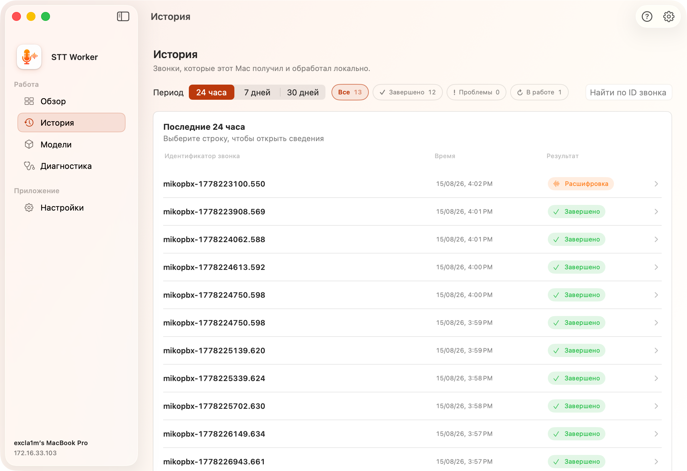
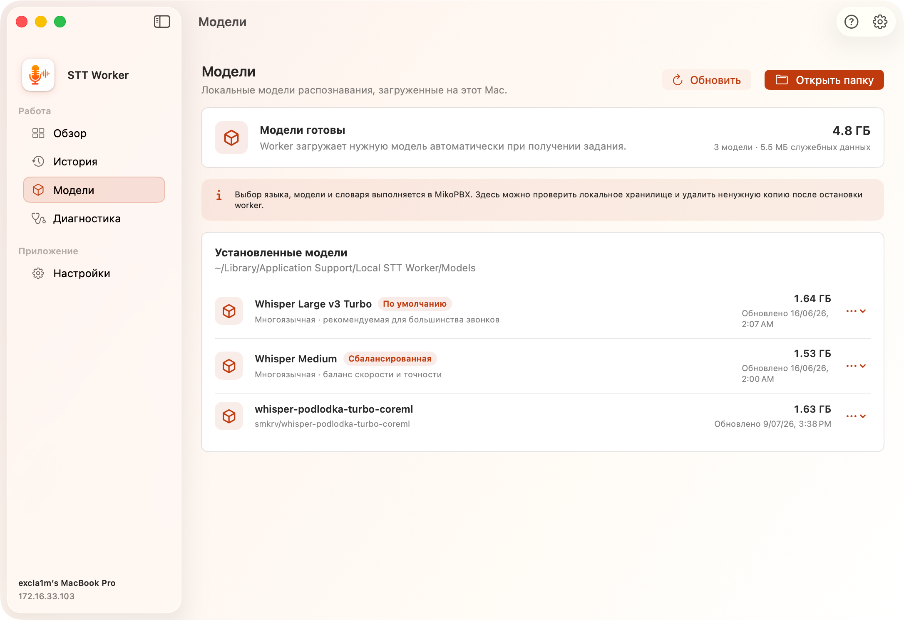
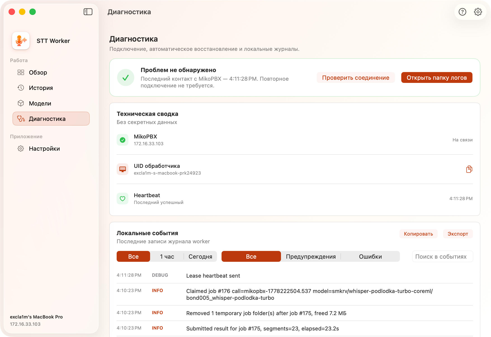
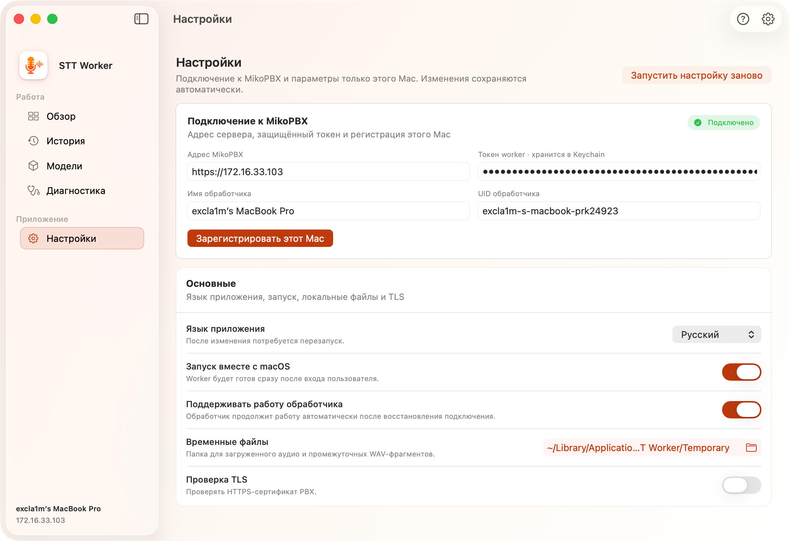
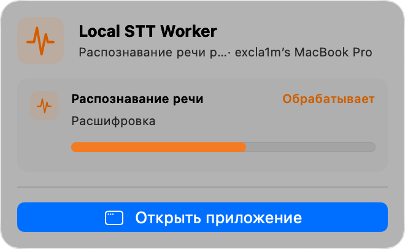

# Local STT Worker

**Local STT Worker** - приложение для локального распознавания записей звонков из MikoPBX. Оно скачивает одно назначенное задание, подготавливает аудио встроенными `ffmpeg` и `ffprobe`, запускает WhisperKit/Core ML и отправляет в PBX сегменты с таймкодами и техническую диагностику.

<figure><figcaption>
Вкладка "Обзор" в обработчике STT
</figcaption></figure>

### Требования

* Mac с Apple Silicon.
* macOS 14.0 или новее.
* MikoPBX 2025.1.1 или новее.
* Доступ к PBX по сети.
* Доступ в интернет для первой загрузки требуемой модели WhisperKit/Core ML.

WhisperKit является внешней Swift-зависимостью приложения. `ffmpeg` и `ffprobe` уже включены в сборку Worker и отдельно устанавливать их не требуется.

### Первый запуск


Подробнее про онбоардинг можно прочитать [здесь](quick-start.md#shag-1.-yazyk).


Онбоардинг состоит из трех шагов:

1. **Выбор языка** - русский или английский интерфейс. После смены языка приложение может предложить перезапуск и продолжит настройку после запуска.
2. **Подключение к MikoPBX** - адрес `https://...`, имя Worker и токен с вкладки **Обработчики**. В дополнительных настройках находятся проверка TLS, собственный CA и UID.
3. **Завершение** - проверка готовности MikoPBX и Speech to Text, настройка запуска при входе и переход в приложение.

### Навигация

| Раздел          | Назначение                                                                            |
| --------------- | ------------------------------------------------------------------------------------- |
| **Обзор**       | Состояние Worker, подключение, текущая работа, готовность системы и последние звонки. |
| **История**     | Локальная история заданий этого Mac с фильтрами и поиском.                            |
| **Модели**      | Локально загруженные модели WhisperKit/Core ML и размер хранилища.                    |
| **Диагностика** | Проверка подключения, UID, heartbeat и локальные события.                             |
| **Настройки**   | Подключение к MikoPBX и параметры, относящиеся только к этому Mac.                    |

### Раздел «Обзор»

Верхний блок показывает одно из основных состояний:

| Состояние               | Значение                                                  |
| ----------------------- | --------------------------------------------------------- |
| **Все работает**        | Worker подключен и автоматически проверяет очередь.       |
| **Расшифровка звонка**  | Выполняется активное задание.                             |
| **Требуется внимание**  | Возникла ошибка подключения, совместимости или обработки. |
| **Готов к запуску**     | Подключение настроено, но Worker остановлен.              |
| **Требуется настройка** | Не хватает адреса PBX, токена или регистрации.            |

Основная кнопка меняется в зависимости от состояния: **Запустить обработчик**, **Остановить обработчик** или **Открыть настройки**. При остановке новые звонки остаются в очереди MikoPBX.

Сводка показывает количество обработанных сегодня звонков, долю успешно завершенных заданий и время последнего звонка. Ниже находятся текущая активность, готовность подключения, выбранная модель, автозапуск и три последних задания.

Во время активной работы отображается текущий этап и прогресс:

1. проверка контракта и регистрация;
2. получение lease задания;
3. скачивание записи;
4. анализ и подготовка аудио;
5. загрузка или открытие модели;
6. локальная транскрибация;
7. отправка результата или ошибки;
8. удаление временных файлов.

### Раздел «История»

История содержит задания, которые получил именно этот Mac. Это не общий список расшифровок PBX.

Доступны периоды **24 часа**, **7 дней** и **30 дней**, фильтры по завершенным, проблемным и активным заданиям, а также поиск по `call_id`. Строку можно раскрыть для просмотра этапов и технических данных; из проблемного задания можно перейти в **Диагностика**.

Локальная история сохраняется между запусками приложения. Готовая расшифровка и запись разговора по-прежнему хранятся и управляются на стороне MikoPBX.

<figure><figcaption>
Раздел "История" в STT обработчике
</figcaption></figure>

### Раздел «Модели»

Модель для новых заданий выбирается в MikoPBX на вкладке **Каталог моделей**. Worker автоматически скачивает требуемую модель при первом задании.

Раздел показывает:

* количество моделей и общий размер;
* размер служебных данных;
* список локально загруженных моделей;
* расположение модели в Finder.

Кнопки **Обновить** и **Открыть папку** перечитывают хранилище и открывают его в Finder. Ненужную локальную копию можно удалить только после остановки Worker. Если модель снова понадобится, она будет загружена повторно.


Первая обработка новой модели занимает больше времени из-за загрузки и подготовки кэша. Не отключайте интернет до окончания загрузки.


<figure><figcaption>
Раздел "Модели" в STT обработчике
</figcaption></figure>

### Раздел «Диагностика»

Диагностика объединяет состояние подключения, автоматического восстановления и локальный журнал.

В верхней части доступны:

* общая оценка состояния;
* кнопка **Проверить соединение**;
* кнопка **Открыть папку логов**.

Техническая сводка показывает адрес MikoPBX, состояние подключения, UID и время последнего успешного heartbeat. UID можно скопировать для сопоставления с таблицей обработчиков на PBX.

Локальные события можно ограничить по времени (**Все**, **1 час**, **Сегодня**) и уровню (**Все**, **Предупреждения**, **Ошибки**), найти по тексту, скопировать или экспортировать. На экране показываются последние 250 подходящих событий.

<figure><figcaption>
Раздел "Диагностика" в STT обработчике
</figcaption></figure>

### Раздел «Настройки»

#### Подключение к MikoPBX

| Поле              | Назначение                                               |
| ----------------- | -------------------------------------------------------- |
| **Адрес MikoPBX** | Адрес PBX, с которой работает Worker.                    |
| **Токен Worker**  | Ограниченный токен модуля, сохраненный в macOS Keychain. |
| **Имя Worker**    | Понятное имя Mac в таблице обработчиков.                 |
| **UID Worker**    | Стабильный технический идентификатор этого Mac.          |

Кнопка **Зарегистрировать этот Mac** проверяет подключение и создает или обновляет регистрацию.

#### Общие настройки

| Настройка                           | Назначение                                                                                                  |
| ----------------------------------- | ----------------------------------------------------------------------------------------------------------- |
| **Язык приложения**                 | Русский, английский или системный язык. Для применения требуется перезапуск.                                |
| **Запуск вместе с macOS**           | Запускать приложение после входа пользователя.                                                              |
| **Поддерживать работу обработчика** | Сохранять намерение работать и автоматически восстанавливаться после потери сети, сна или временной ошибки. |
| **Временные файлы**                 | Папка загруженных записей и промежуточных WAV-сегментов.                                                    |
| **Проверка TLS**                    | Проверять HTTPS-сертификат MikoPBX.                                                                         |
| **Собственный CA**                  | Необязательный PEM/CRT/CER-файл для частного сертификата.                                                   |

Кнопка **Запустить настройку заново** повторно открывает онбоардинг.

<figure><figcaption>
Раздел "Настройки" в STT обработчике
</figcaption></figure>

### Статус в строке меню

Значок Local STT Worker в строке меню показывает, работает ли STT, выполняется ли транскрибация или требуется внимание. Меню содержит состояние, текущий этап или время последнего контакта и кнопку **Открыть приложение**.

<figure><figcaption>
Состояние обработчика в строке меню
</figcaption></figure>

### Локальные данные и безопасность

| Данные          | Расположение                                               |
| --------------- | ---------------------------------------------------------- |
| Модели          | `~/Library/Application Support/Local STT Worker/Models`    |
| Временные файлы | `~/Library/Application Support/Local STT Worker/Temporary` |
| Журналы         | `~/Library/Logs/Local STT Worker`                          |
| Пароли/Токены   | Keychain service `LocalSTTWorker.PBX`                      |
| Настройки       | UserDefaults приложения `com.mikopbx.LocalSTTWorker`       |

Worker принимает запись только от авторизованной MikoPBX и сохраняет ее в безопасную временную директорию. После завершения задания временные аудиофайлы удаляются.

### Что настраивается в MikoPBX, а что на Mac

| Где                  | Параметры                                                                                                                                                                  |
| -------------------- | -------------------------------------------------------------------------------------------------------------------------------------------------------------------------- |
| **MikoPBX / модуль** | Период обработки, срок хранения, максимальная длительность записи, модель, язык задания, словарь терминов, профиль обработки, очередь, ключи, расшифровки и журнал модуля. |
| **Local STT Worker** | Параметры подключения, UID и имя Mac, запуск и восстановление Worker, локальный кэш моделей, временная папка, TLS/CA, локальная история и диагностика.                     |
