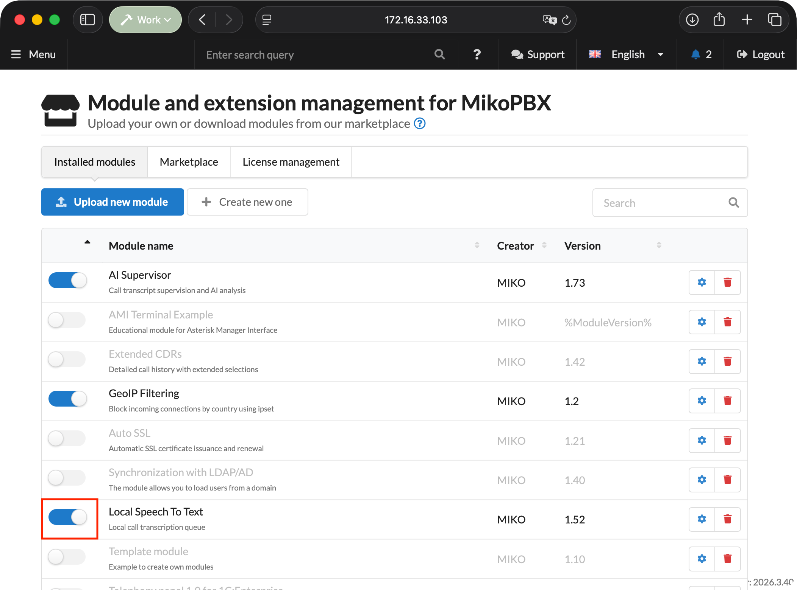
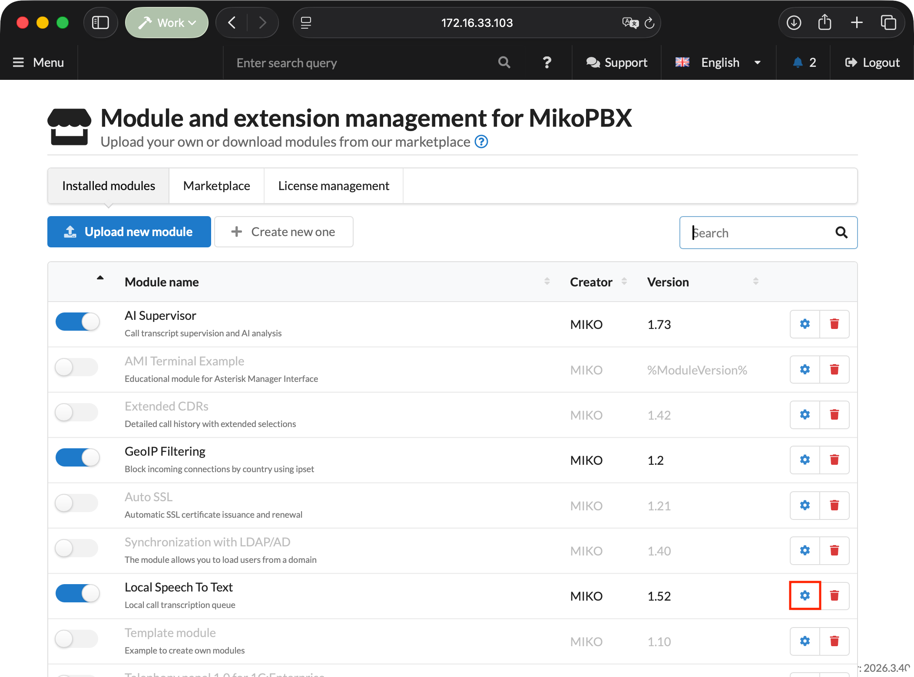
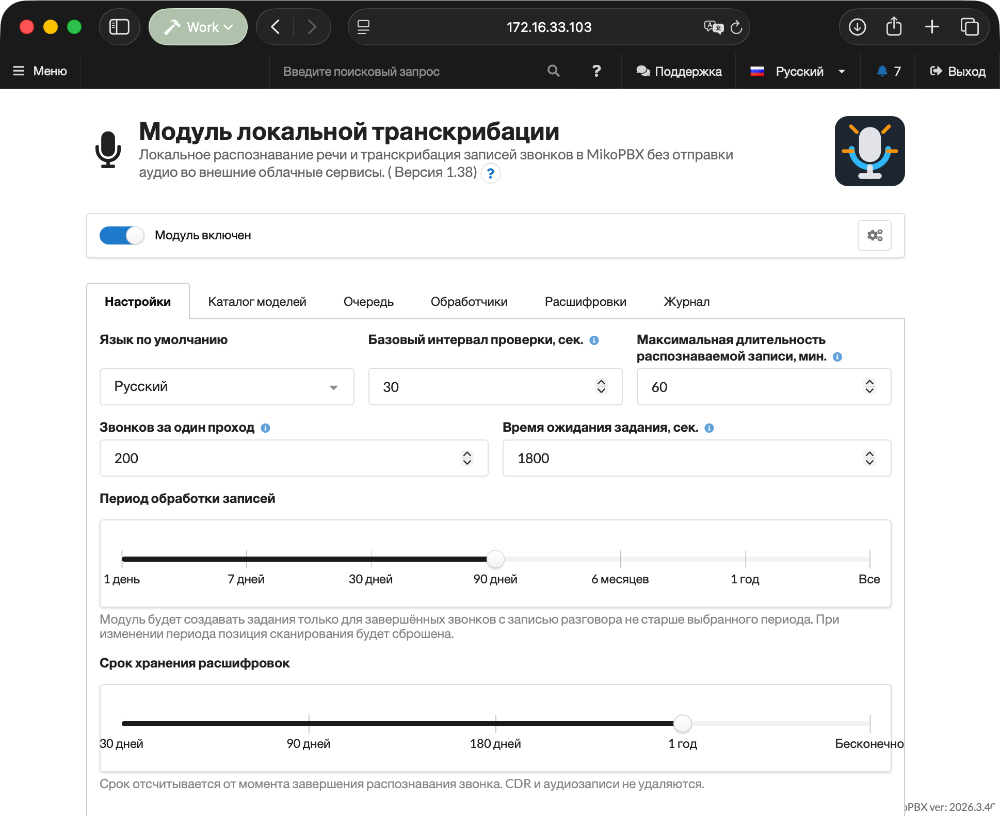
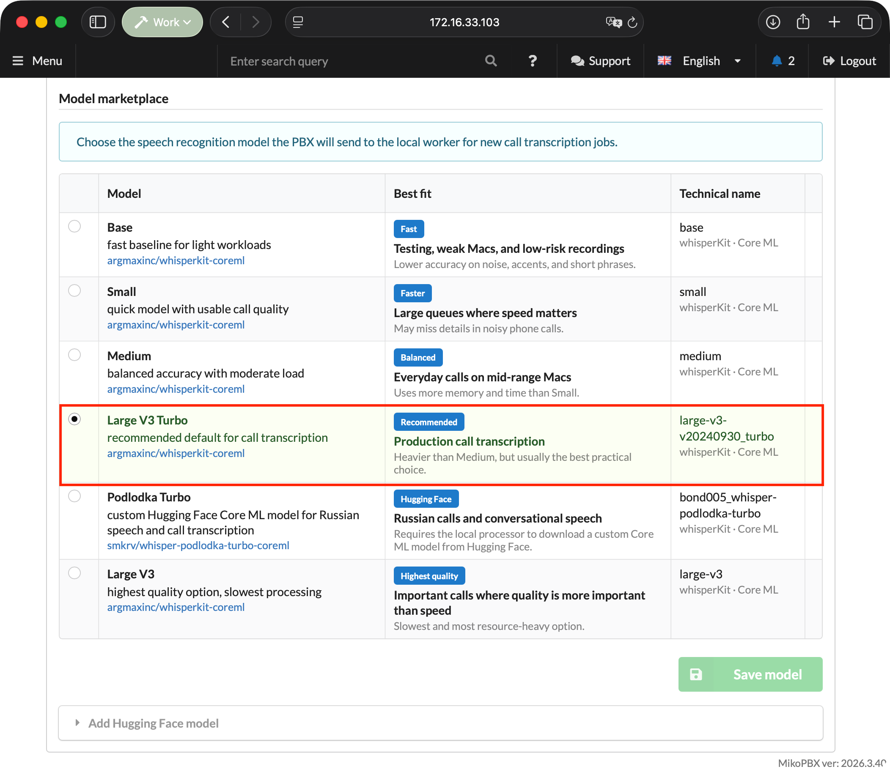
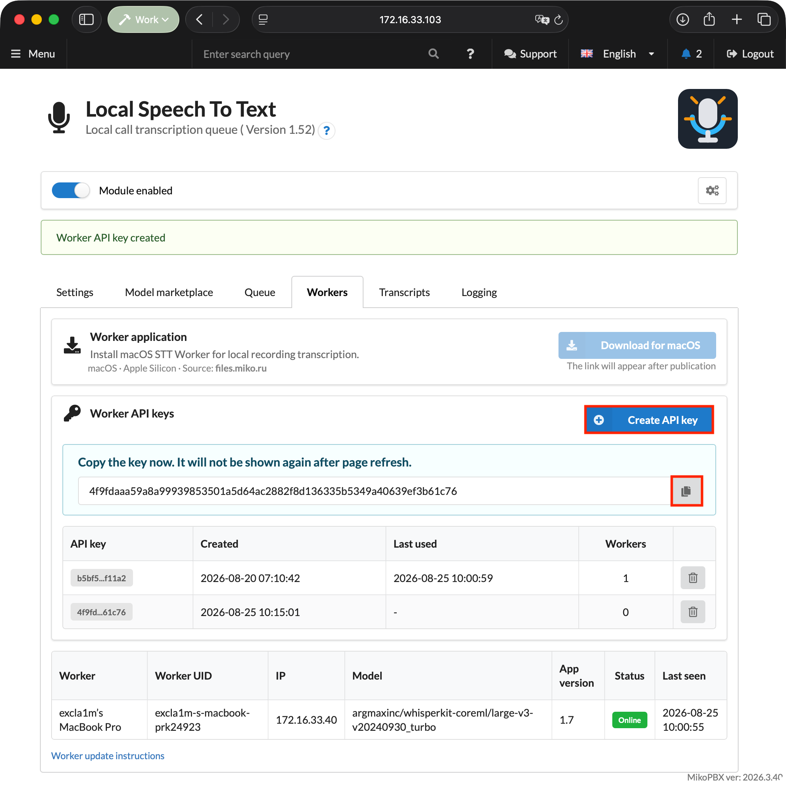
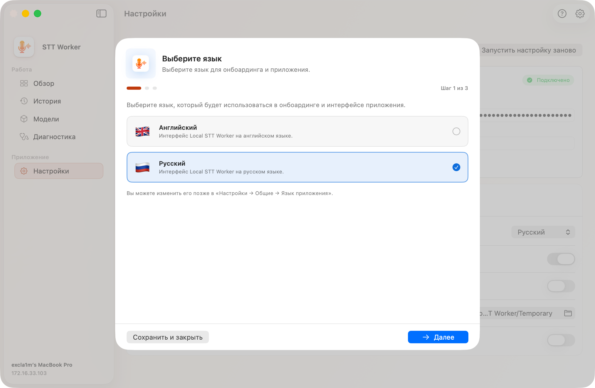
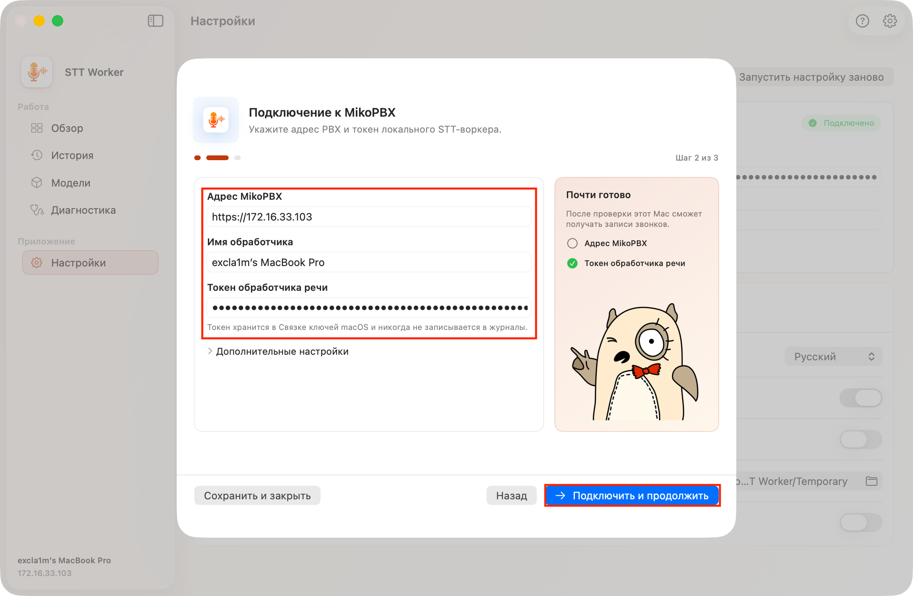
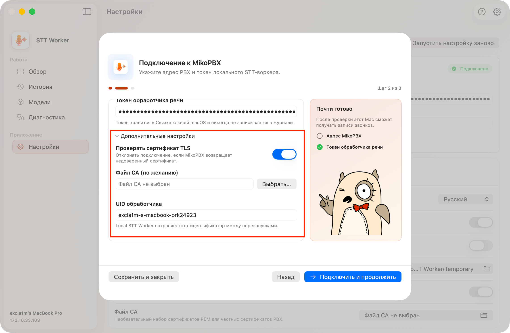
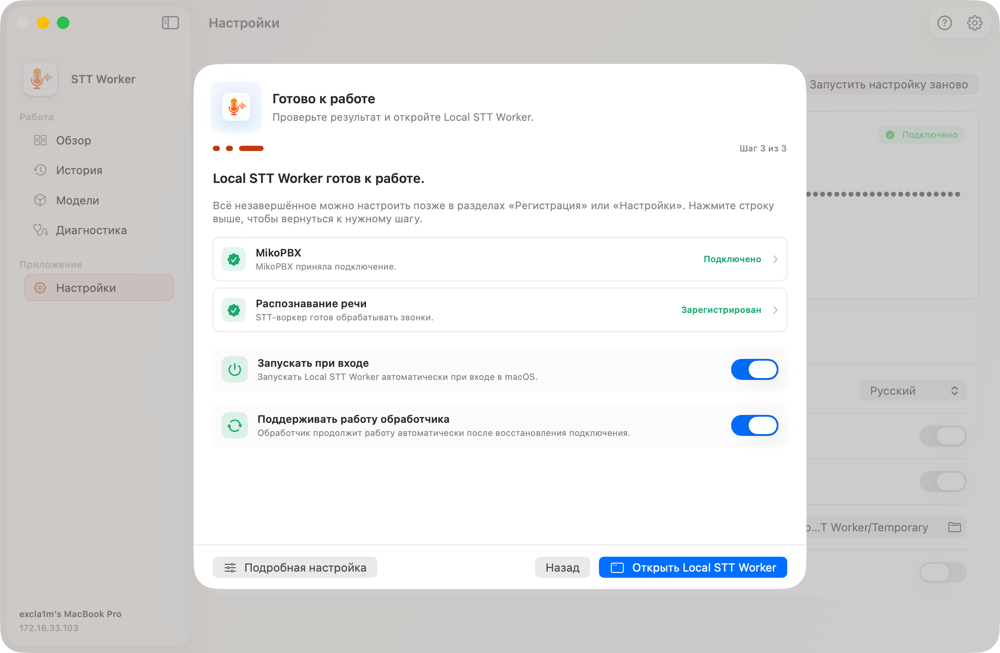
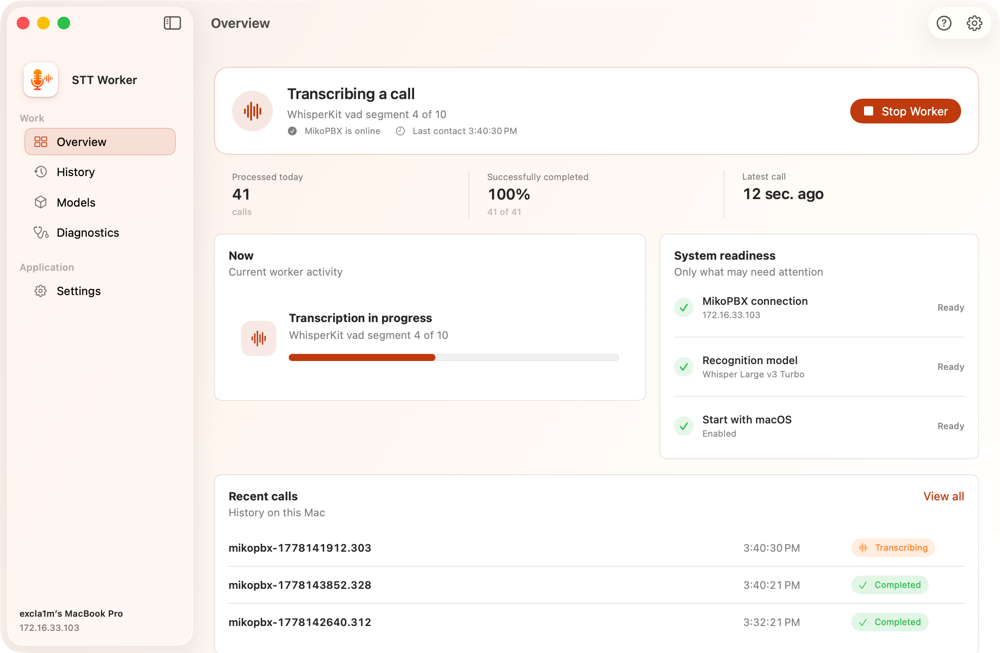

# Быстрый старт

### Установка модуля

1. Откройте веб-интерфейс MikoPBX.
2. Перейдите в раздел **Модули** → **Маркетплейс модулей**.

<figure><figcaption>
Маркетплейс модулей
</figcaption></figure>

3. Найдите **Модуль локальной транскрибации** и установите его.
4. Откройте список установленных модулей и включите модуль.

<figure><figcaption>
Включение модуля локальной транскрибации
</figcaption></figure>

5. Нажмите кнопку настроек справа от версии модуля.

<figure><figcaption>
Переход на страницу модуля
</figcaption></figure>

### Первичная настройка модуля

1. На вкладке **Настройки** выберите основной язык звонков или оставьте "**Определять автоматически"**.
2. Проверьте **Максимальную длительность распознаваемой записи**. Значение по умолчанию - 60 минут.
3. Выберите **Период обработки записей** и **Срок хранения расшифровок**. Период обработки не должен превышать срок хранения.
4. При необходимости добавьте внутренние названия и сокращения в список терминов.
5. Сохраните настройки.

<figure><figcaption>
Прежний вид страницы настроек
</figcaption></figure>

### Выбор модели

1. Откройте вкладку **Каталог моделей**.
2. Выберите модель для транскрибации звонков.
3. Нажмите **Сохранить модель**.


Модель будет загружена на Mac при первом задании. Для первой загрузки необходим доступ к платформе Hugging Face.


<figure><figcaption>
Выбор модели распознавания
</figcaption></figure>

### Создание ключа Worker

1. Откройте вкладку **Обработчики**.
2. Нажмите **Создать ключ доступа**.
3. Сразу скопируйте показанный токен: после обновления страницы его нельзя будет посмотреть повторно.


Для каждого Mac рекомендуется создавать отдельный ключ. Один ключ нельзя привязать к нескольким UID обработчиков.


<mark style="color:red;">Устарело, обновить после реализации загрузки обработчика</mark>

<figure><figcaption>
Прежний вид вкладки обработчиков
</figcaption></figure>

### Подключение Local STT Worker

Установите и откройте приложение **Local STT Worker**. При первом запуске появится онбоардинг из трех шагов.

#### Шаг 1. Язык

Выберите русский или английский язык интерфейса и нажмите **Далее**. При смене языка может потребоваться перезапуск; после него онбоардинг откроется снова.

<figure><figcaption>
Экран выбора языка MIKO AI Worker
</figcaption></figure>

#### Шаг 2. Подключение к MikoPBX

Заполните поля:

| Поле                 | Что указать                                                     |
| -------------------- | --------------------------------------------------------------- |
| **Адрес MikoPBX**    | Адрес вида `https://pbx.example.com` без логина и пароля в URL. |
| **Имя обработчика**  | Понятное имя Mac, которое будет видно в MikoPBX.                |
| **Токен STT Worker** | Ключ, созданный на вкладке **Обработчики**.                     |

<figure><figcaption>
Настройка параметров подключения к станции
</figcaption></figure>

В раскрывающемся блоке **Дополнительные настройки** доступны:

* проверка TLS-сертификата;
* добавление PEM-файла собственного CA;
* указание собственного UID обработчика.

<figure><figcaption>
Дополнительные настройки подключения к станции
</figcaption></figure>

Нажмите "**Подключить и продолжить"**. Приложение проверит соединение и корректность указанных параметров.

#### Шаг 3. Завершение

На финальном шаге будет показано состояние обработчика, так же существует возможность подключение двух параметров:

* Запускать при входе - при этой настройке приложение будет открываться автоматически при входе в macOS.
* Поддерживать работу обработчика - при этой настройке Worker автоматически возобновляет работу после восстановления сети или пробуждения Mac (при возникшей ошибке).

<figure><figcaption>
Финальный шаг настройки воркера
</figcaption></figure>

В приложении откройте **Обзор**. Если обработчик остановлен, нажмите **Запустить обработчик.**

### Проверка работы

1. Совершите звонок, для которого включена запись разговора.
2. Дождитесь появления задания на вкладке **Очередь** модуля.
3. При первом запуске дождитесь загрузки модели на Mac.
4. Проверьте локальные этапы в разделе **Обзор** или события в разделе **Диагностика**.
5. Откройте готовый результат на вкладке **Расшифровки** в MikoPBX.

<figure><figcaption>
Процесс обработки звонка. Главный экран обработчика.
</figcaption></figure>

Подробное описание разделов приложения приведено в статье [Local STT Worker](miko-ai-worker.md).
