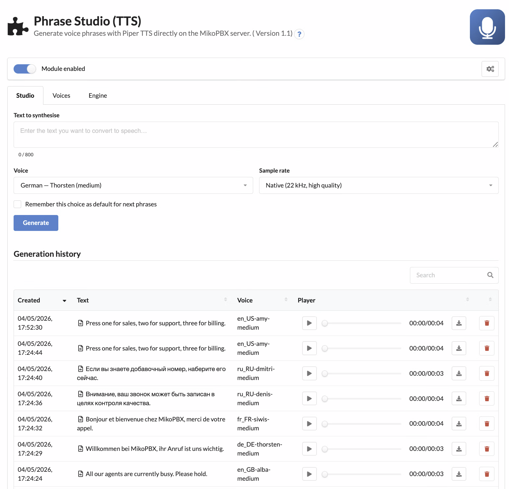
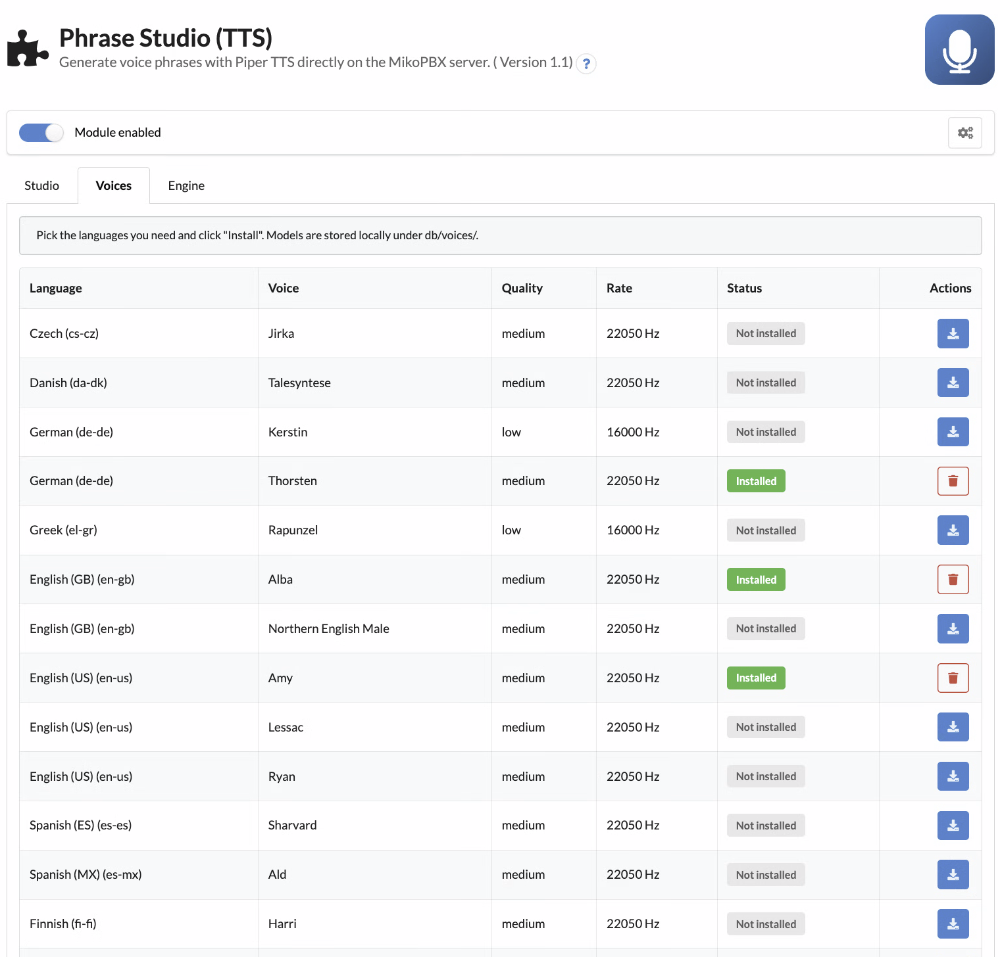
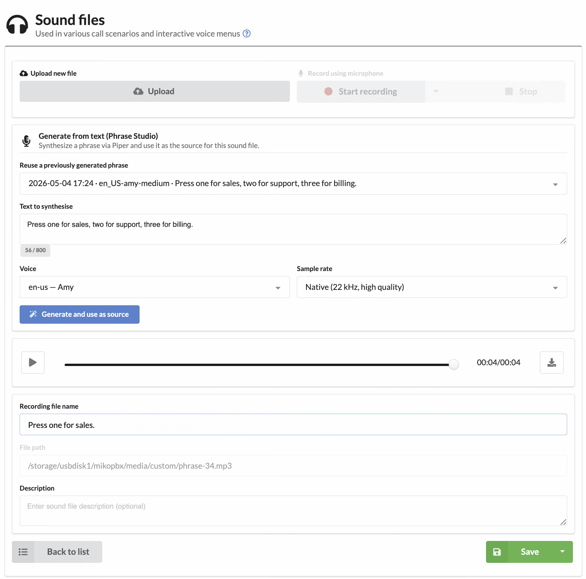

# Phrase Studio (TTS)

The **Phrase Studio (TTS)** module is an offline voice-phrase generator for MikoPBX, powered by the [Piper TTS](https://github.com/rhasspy/piper) neural engine. All synthesis happens on the PBX itself — no caller text leaves the server, there are no per-character cloud charges, and there is no GDPR exposure for prompts and IVR scripts.

<figure><figcaption><p>Phrase Studio main page</p></figcaption></figure>

## What it does

* Inline TTS studio with text editor, voice picker, sample-rate switch and live audio preview.
* Searchable generation history — click any row to repopulate the form with that phrase's text + voice and re-record it instantly.
* 25+ languages out of the box: English (multiple regional accents), Russian, German, French, Italian, Spanish, Polish, Portuguese, Czech, Ukrainian, Chinese and more.
* Per-voice install / uninstall — pull only the languages you actually use; the rest stays off disk.
* High-quality preview MP3 (22 kHz / 128 kbit/s) — no more "talking through a bucket" sound that the default 8 kHz telephony pipeline produces.
* Filenames are auto-derived from the phrase text via Cyrillic→Latin transliteration (e.g. *"Здравствуйте, спасибо за ваш звонок"* → `Zdravstvujte_spasibo_za_vas_zvonok.wav`).
* REST API v3 for scripted IVR build pipelines.

## Bootstrapping the engine and voices

The module ships empty: the Piper binary and the voice models are downloaded on demand. The first two steps are normally automatic — **enabling the module triggers a background download of the Piper engine and a refresh of the voice catalogue** — so in the common case you can jump straight to step 2:

1. *(Auto on enable, manual fallback)* Open the **Engine** tab. The architecture-matched Piper binary (≈ 25 MB, statically linked) is downloaded and unpacked into `db/piper/` automatically when the module is enabled. If the auto-bootstrap was skipped (no internet during enable, air-gapped install) or you want to re-pull the binary after a release, press **Install engine** — the same button is also exposed as **Update engine** and forces a re-download even if a working binary is already on disk.
2. Switch to the **Voices** tab, select the languages you need and press **Install** next to each one. Models are 30–60 MB each and live in `db/voices/`. The download runs asynchronously in a detached background process: the row immediately shows an *Installing…* spinner and flips to *Installed* (or *Failed* with a diagnostic message) once the download completes. You can navigate away or reload the page — progress is tracked on the database row, not in the browser, so the spinner picks up where it left off.
3. Go back to the **Studio** tab and start synthesizing.

<figure><figcaption><p>Voice catalogue with one-click install / uninstall</p></figcaption></figure>

## Inline use in the Sound Files editor

When you create or edit a custom sound file in MikoPBX, a **"Generate from text (Phrase Studio)"** segment appears right inside the standard form:

* **Reuse a previously generated phrase** — pick an entry from the history dropdown; the source file in the form is replaced immediately and the player starts playing the new audio.
* **Generate and use as source** — type new text, pick a voice and rate, and the result automatically becomes the source file of the current sound entry.
* The high-quality MP3 plays in the standard MikoPBX player; the Asterisk-format derivatives (`ulaw`, `alaw`, `gsm`, `g722`, `sln`) are produced at the rates Asterisk requires for telephony playback.

<figure><figcaption><p>The TTS block embedded in the standard Sound Files editor</p></figcaption></figure>

The block is intentionally hidden for **MOH** (music-on-hold) entries — Phrase Studio is for speech, not background music.

## Quality knobs

* **Sample rate** — *Native (22 kHz)* for studio-quality preview and HD codecs (g.722, opus); *Telephony (8 kHz mono)* for legacy g.711 trunks.
* **Maximum text length** — defaults to 800 characters (≈ 60 seconds of speech). Longer phrases are rejected to protect the worker.
* **Cache size limit** — defaults to 500 phrases; the oldest entries are pruned automatically.

## REST API v3

All endpoints are auto-discovered via PHP 8 attributes and live under `/pbxcore/api/v3/module-phrase-studio/`. Authentication: localhost or Bearer token.

| Method | Endpoint                      | Description                              |
| ------ | ----------------------------- | ---------------------------------------- |
| GET    | `engine`                      | Engine status (installed, version)       |
| POST   | `engine:install`              | Install the Piper binary. Pass `{"force":true}` in the body to force a re-download (Update flow) |
| DELETE | `engine`                      | Remove the Piper binary                  |
| GET    | `voices`                      | Catalogue + installed flag per voice. Optional query: `language=ru-ru`, `installed_only=true` |
| POST   | `voices:install`              | **Async.** Queues a voice download and returns `202 Accepted` with `install_status="installing"` — clients poll `GET voices` until the row flips to `installed` / `failed` |
| DELETE | `voices/{id}`                 | Remove a voice model                     |
| GET    | `phrases`                     | Phrase history                           |
| POST   | `phrases`                     | Generate (or return cached) phrase       |
| GET    | `phrases/{id}:download`       | Stream the WAV (HEAD = duration probe)   |
| POST   | `phrases/{id}:promoteToTmp`   | Stage WAV for Sound Files import         |
| DELETE | `phrases/{id}`                | Remove a single history entry            |

Voice rows returned by `GET voices` carry the async-install status fields the UI uses to drive its loader: `install_status` (`""` / `"installing"` / `"installed"` / `"failed"`) and `install_error` (set only when status is `failed`). A row stuck in `installing` for over five minutes is auto-flipped to `failed` with a synthetic timeout message, so a polling loop will eventually converge without manual cleanup.

Example — generate a phrase from a script:

```bash
curl -X POST -H "Authorization: Bearer $TOKEN" \
  -H "Content-Type: application/json" \
  -d '{"text":"Welcome to MikoPBX","voice_id":"en_US-amy-medium","sample_rate":"telephony"}' \
  https://pbx.example.com/pbxcore/api/v3/module-phrase-studio/phrases
```

Example — install a voice asynchronously and poll until ready:

```bash
curl -X POST -H "Authorization: Bearer $TOKEN" \
  -H "Content-Type: application/json" \
  -d '{"voice_id":"en_US-amy-medium"}' \
  https://pbx.example.com/pbxcore/api/v3/module-phrase-studio/voices:install
# → 202 {"voice_id":"en_US-amy-medium","install_status":"installing","queued":true,...}

curl -H "Authorization: Bearer $TOKEN" \
  "https://pbx.example.com/pbxcore/api/v3/module-phrase-studio/voices?installed_only=true"
# → poll until the matching row reports install_status="installed"
```

## Requirements

* MikoPBX **2026.1.223+**
* PHP **8.4** on the module side
* ≈ 50 MB free disk for the engine plus a similar amount per installed voice
* Outbound HTTPS access at first install (engine + voice download)


Module source code and issue tracker live on GitHub: [mikopbx/ModulePhraseStudio](https://github.com/mikopbx/ModulePhraseStudio). Share ideas and pull requests in our developer chat: [@mikopbx\_dev](https://t.me/mikopbx_dev).

