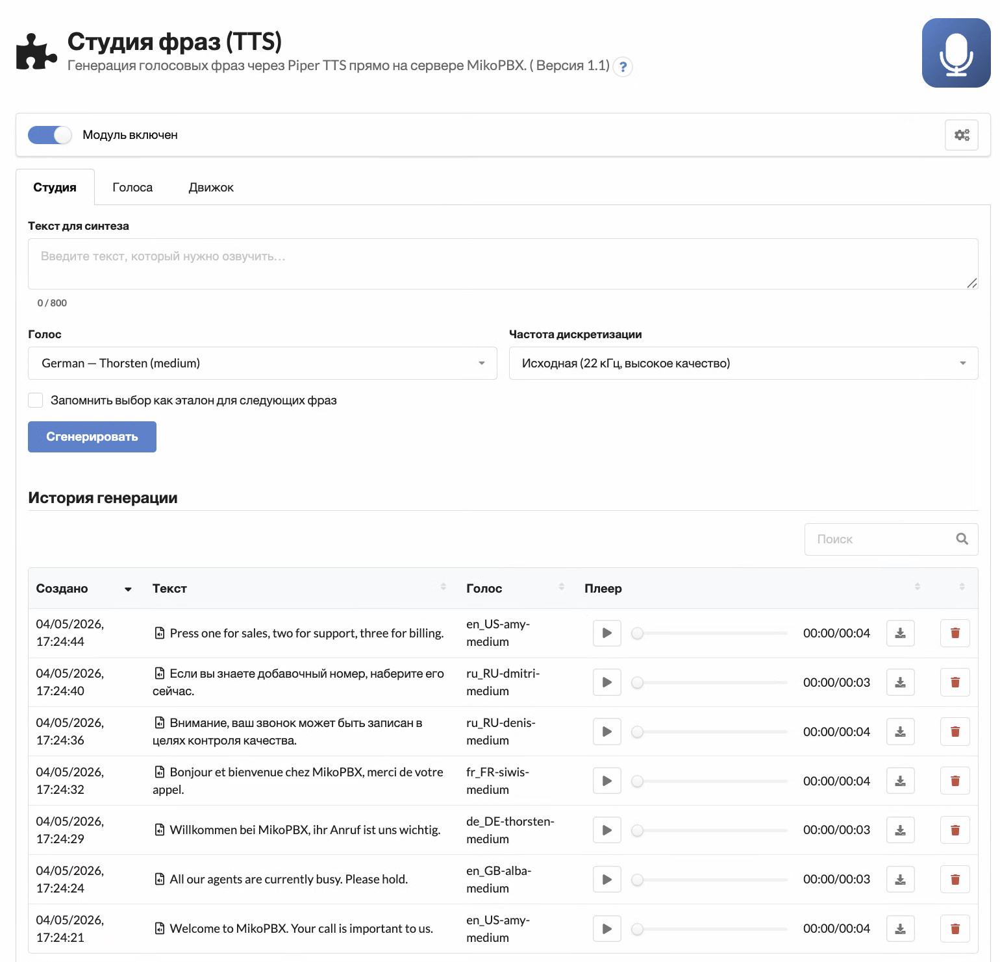
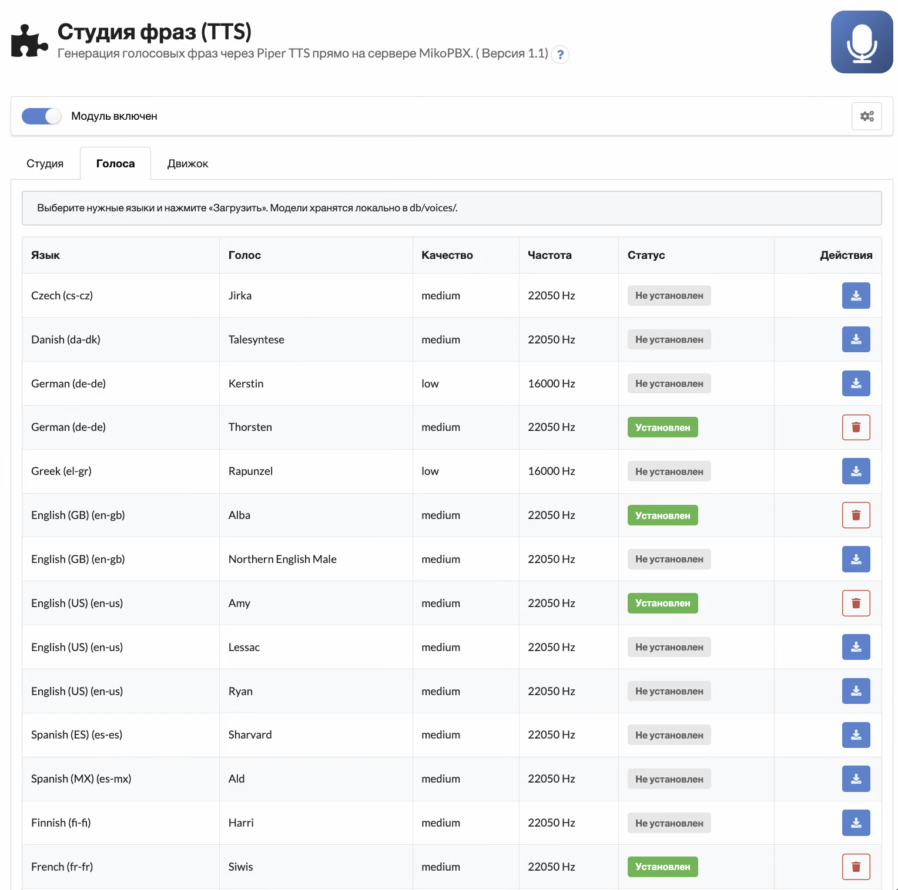
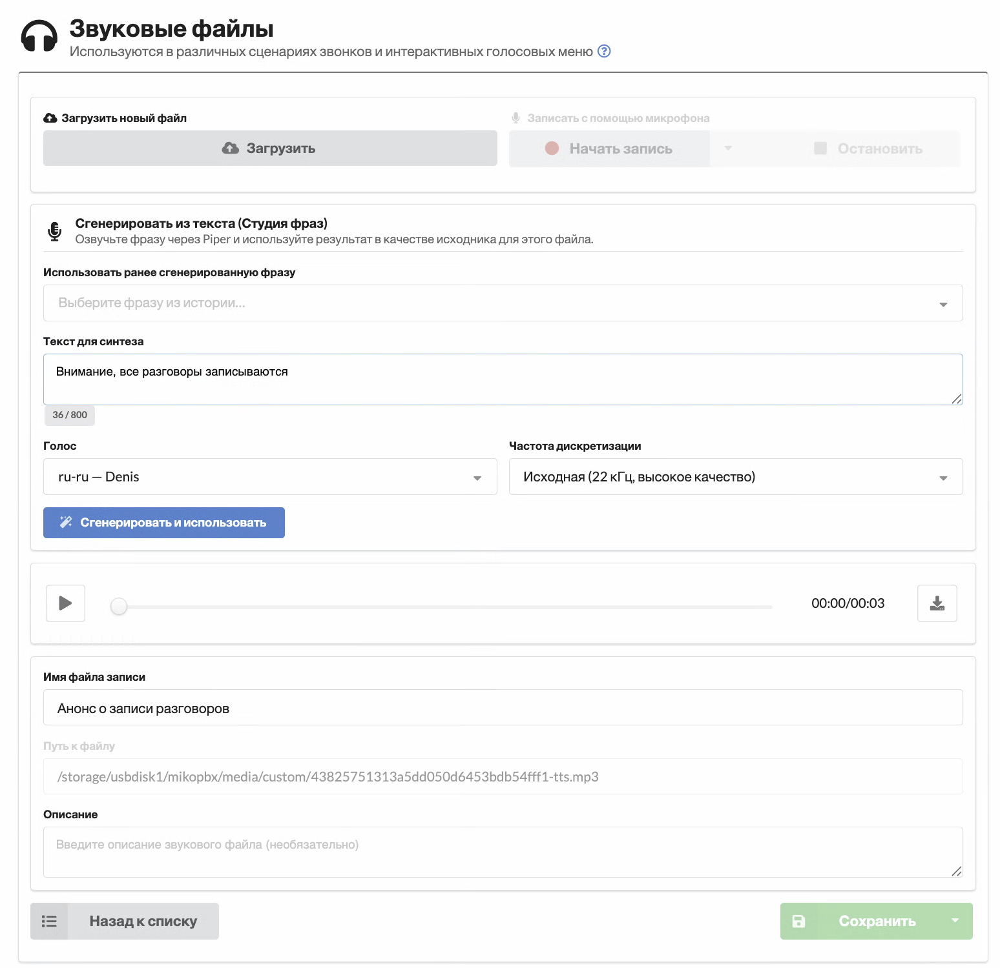

# Студия фраз (TTS)

Модуль **Студия фраз (TTS)** — это офлайн-генератор голосовых фраз для MikoPBX на базе нейросетевого движка [Piper TTS](https://github.com/rhasspy/piper). Все вычисления выполняются прямо на сервере АТС: ни одна реплика клиента не уходит во внешние облака, нет оплаты «по символам» и нет рисков по 152-ФЗ / GDPR.

<figure><figcaption><p>Главная страница «Студии фраз»</p></figcaption></figure>

## Возможности

* Встроенная TTS-студия: текстовое поле, выбор голоса, переключатель частоты дискретизации, плеер с предпрослушкой.
* Поисковая история генераций — клик по строке заполняет форму её текстом и голосом, чтобы быстро переозвучить или скорректировать фразу.
* 25+ языков «из коробки» — английский (несколько региональных акцентов), русский, немецкий, французский, итальянский, испанский, польский, португальский, чешский, украинский, китайский и другие.
* Установка / удаление по голосу — качаются только нужные языки, всё остальное свободно от лишних мегабайт.
* Высококачественный preview-MP3 (22 кГц / 128 кбит/с) — без характерного «ведра», которое получается при стандартной телефонной конвертации в 8 кГц.
* Имена файлов автоматически собираются из текста фразы с транслитерацией кириллицы (например, «Здравствуйте, спасибо за ваш звонок» → `Zdravstvujte_spasibo_za_vas_zvonok.wav`).
* REST API v3 — встраивайте генерацию голосовых меню в собственные сценарии деплоя и CI.

## Установка движка и голосов

Модуль распространяется «пустым»: бинарь движка и голосовые модели подкачиваются по мере необходимости. После включения модуля:

1. Откройте вкладку **Движок** и нажмите **Установить движок** — нужный архитектурный бинарь Piper (около 25 МБ, статически слинкован) скачается и распакуется в `db/piper/`.
2. Перейдите на вкладку **Голоса**, отметьте нужные языки и нажмите **Установить** напротив каждого. Модели весят 30–60 МБ и хранятся в `db/voices/`.
3. Вернитесь на вкладку **Студия** — теперь можно генерировать фразы.

<figure><figcaption><p>Список доступных голосов: установка и удаление по одному</p></figcaption></figure>

## Использование в редакторе «Звуковые файлы»

При создании или редактировании пользовательского звукового файла прямо в стандартной форме MikoPBX появляется блок **«Сгенерировать из текста (Студия фраз)»**:

* **Использовать ранее сгенерированную фразу** — выпадающий список с историей; выбор сразу подменяет источник в форме, и плеер начинает играть свежую запись.
* **Сгенерировать и использовать** — введите новый текст, выберите голос и частоту, и результат автоматически становится исходником текущего звукового файла.
* Высококачественный MP3 проигрывается во встроенном плеере MikoPBX, а телефонные форматы (`ulaw`, `alaw`, `gsm`, `g722`, `sln`) генерируются на тех частотах, которые требует Asterisk.

<figure><figcaption><p>Блок генерации внутри стандартного редактора «Звуковых файлов»</p></figcaption></figure>

Для категории **MOH** (музыка на удержании) блок намеренно скрыт — Студия фраз про речь, а не про фоновую музыку.

## Параметры качества

* **Частота дискретизации** — *Исходная (22 кГц)* для студийной предпрослушки и HD-кодеков (g.722, opus); *Телефонная (8 кГц моно)* для классических g.711 транков.
* **Максимальная длина текста** — по умолчанию 800 символов (≈ 60 секунд речи). Более длинные фразы отклоняются, чтобы защитить воркер.
* **Лимит кэша** — по умолчанию 500 фраз; самые старые автоматически вытесняются.

## REST API v3

Все эндпоинты доступны под `/pbxcore/api/v3/module-phrase-studio/`. Авторизация — localhost или Bearer-токен.

| Метод  | Эндпоинт                      | Описание                                  |
| ------ | ----------------------------- | ----------------------------------------- |
| GET    | `engine`                      | Статус движка (установлен, версия)        |
| POST   | `engine:install`              | Скачать и установить бинарь Piper         |
| DELETE | `engine`                      | Удалить бинарь Piper                      |
| GET    | `voices`                      | Каталог + флаг установки по каждому голосу |
| POST   | `voices:install`              | Скачать модель голоса                     |
| DELETE | `voices/{id}`                 | Удалить установленный голос               |
| GET    | `phrases`                     | История генераций                         |
| POST   | `phrases`                     | Сгенерировать (или вернуть кэш) фразы     |
| GET    | `phrases/{id}:download`       | Поток WAV (HEAD = длительность)           |
| POST   | `phrases/{id}:promoteToTmp`   | Подготовить WAV для импорта в SoundFiles  |
| DELETE | `phrases/{id}`                | Удалить запись из истории                 |

Пример запроса:

```bash
curl -X POST -H "Authorization: Bearer $TOKEN" \
  -H "Content-Type: application/json" \
  -d '{"text":"Здравствуйте, спасибо за ваш звонок","voice_id":"ru_RU-irina-medium","sample_rate":"telephony"}' \
  https://pbx.example.com/pbxcore/api/v3/module-phrase-studio/phrases
```

## Системные требования

* MikoPBX **2026.1.223+**
* PHP **8.4** на стороне модуля
* ≈ 50 МБ свободного места под движок плюс по столько же на каждый установленный голос
* Доступ в интернет по HTTPS на момент первой установки (для скачивания движка и голосов)


Исходники модуля и баг-трекер живут на GitHub: [mikopbx/ModulePhraseStudio](https://github.com/mikopbx/ModulePhraseStudio). Делитесь идеями и пулл-реквестами в чате разработчиков [@mikopbx\_dev](https://t.me/mikopbx_dev).

