# Backup


**Note**: In version **2020.2.XXX**, the backup functionality has been moved to a separate module and is not included in the core package. The module can be installed via the [Module Management section](../../manual/modules/pbx-extension-modules/).


### Creating a Backup 

1. Go to the **"Modules"** -> **"Marketplace of modules section"** tab.

<figure>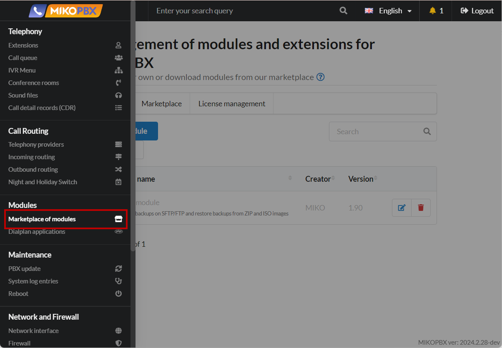<figcaption>
Marketplace of modules section
</figcaption></figure>

Make sure that the **Backup Module** is installed and enabled.

2. Go to the module settings.

<figure>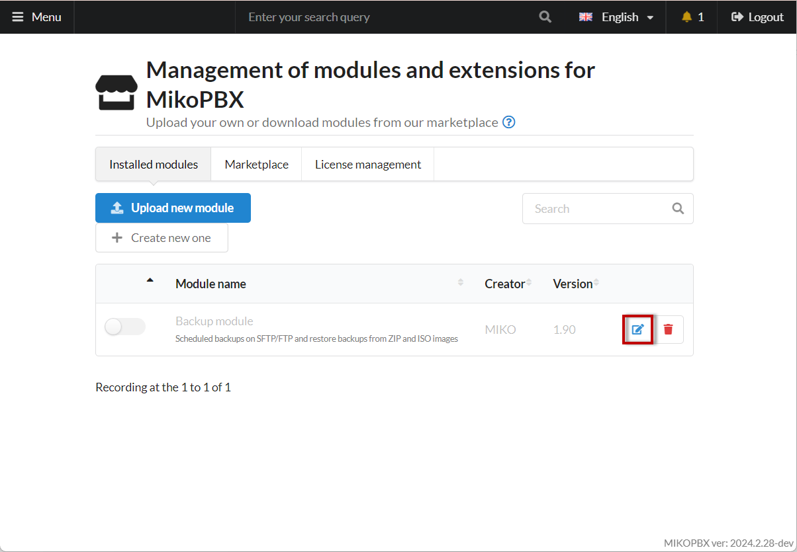<figcaption>
Module settings
</figcaption></figure>

3. Click on **"Create backup copy"**.

<figure>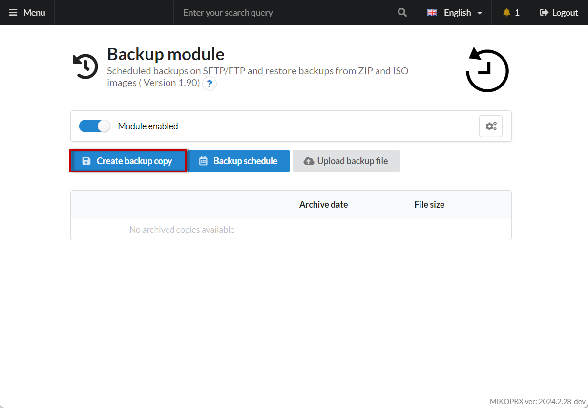<figcaption>
"Create backup copy" button
</figcaption></figure>

4. Select the data that should be included in the backup:

* **PBX Settings** - all **configuration settings** of MikoPBX made in the web interface.
* **Call History** - saves the **cdr.db** database (location: **/storage/usbdisk1/mikopbx/astlogs/asterisk/cdr.db**). This setting does not save actual call recordings, only the information on the **Telephony** → **Call History** (Documentation) tab without playback/download functionality.
* **Call Recording Files** - saves all call recordings in \*.mp3 format.
* **Sound Files** - saves sound files uploaded to the PBX in the **Telephony** → **Sound Files** (Documentation) section.

<figure>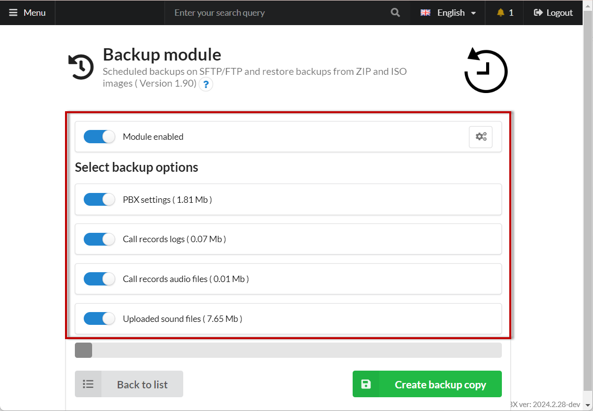<figcaption></figcaption></figure>

5. Click on **"Create a backup"**.

<figure>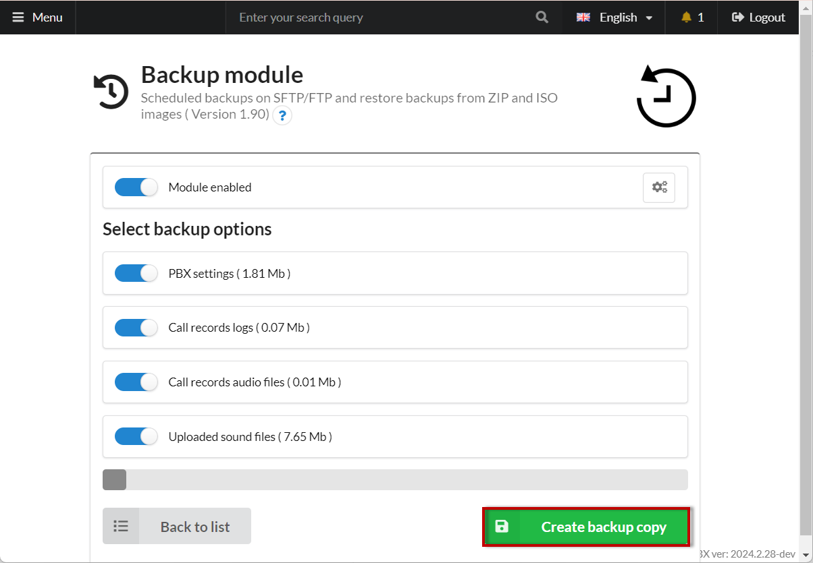<figcaption></figcaption></figure>

Once the process is complete, the backup will appear in the list of backups:

<figure>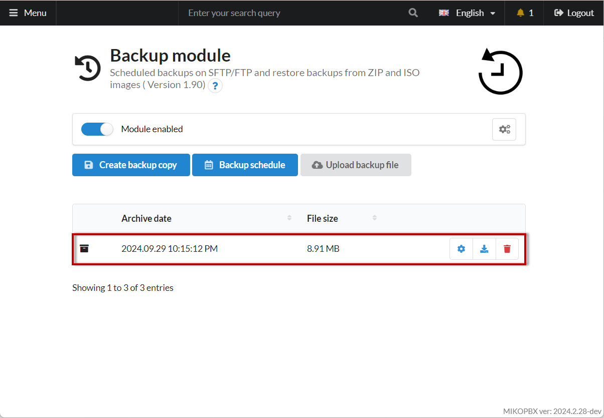<figcaption>
Created copy
</figcaption></figure>

### Managing Backup Files 

In the backup list, you can perform the following actions:

* Restore from a backup.
* Download the backup archive.
* Delete the backup.

<figure>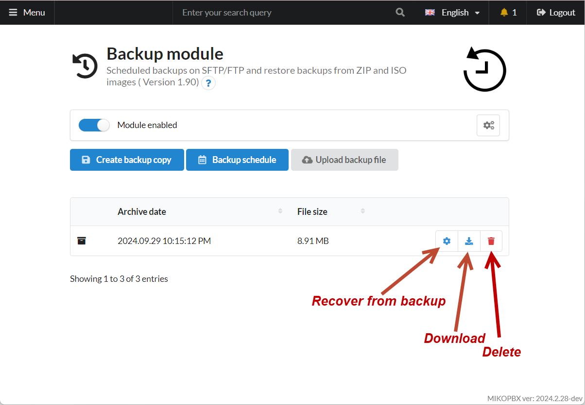<figcaption>
Options 
</figcaption></figure>

### Restore from Backup 


The process of upgrading from **Askozia 4, 5 ME** to **MikoPBX** is described in this <mark style="color:red;">guide</mark>.


1. In the list of backups, select the desired one and click "**Restore from backup"**.

<figure>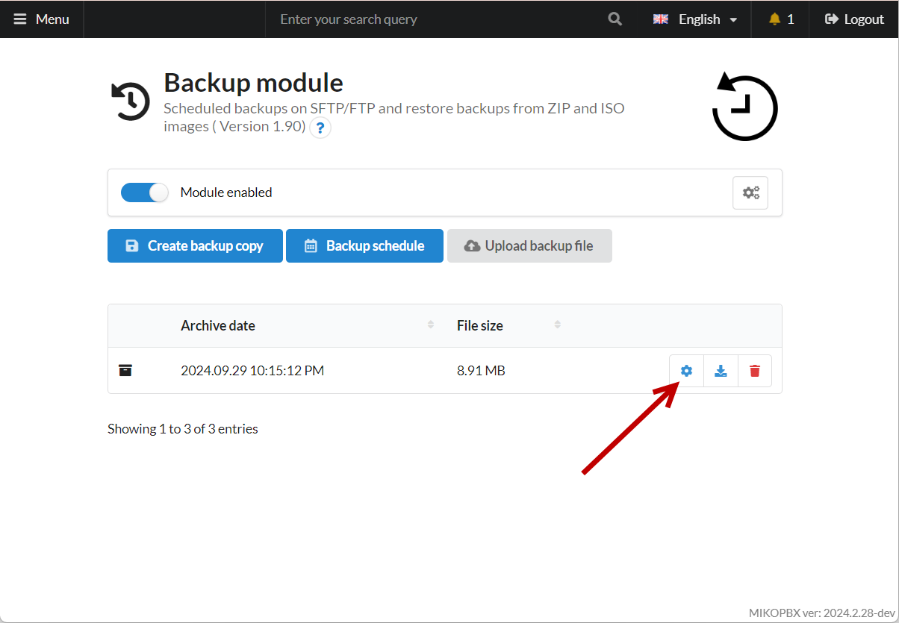<figcaption></figcaption></figure>

2. Select the categories of data to restore.

<figure>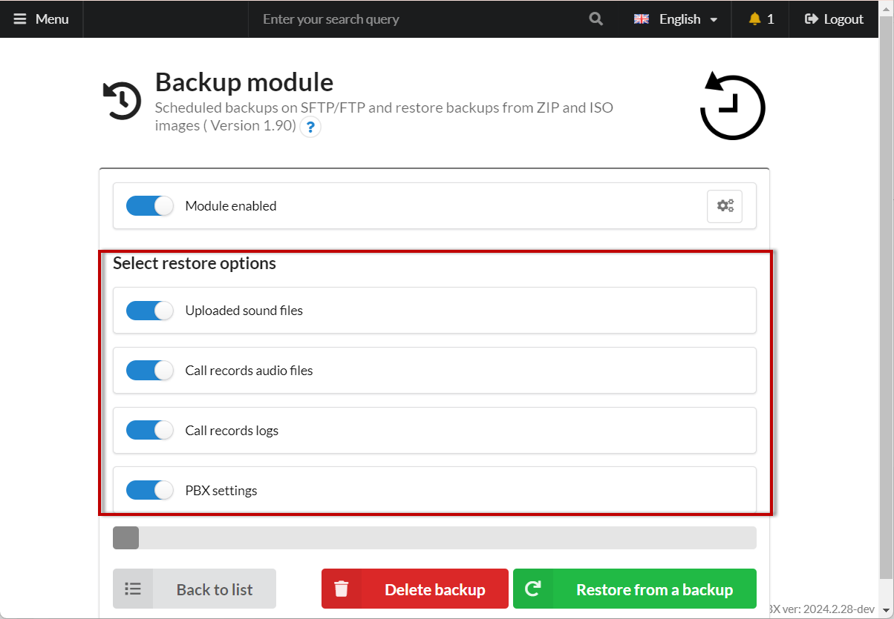<figcaption></figcaption></figure>

3. Click on **"Restore from a backup"**.

<figure>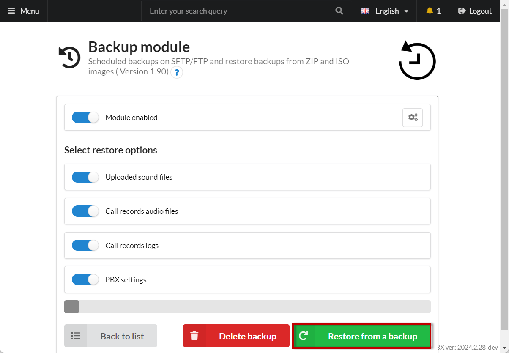<figcaption>
"Restore from a backup" button
</figcaption></figure>

The restoration process will start, and once completed, the PBX will be rebooted.

The progress of data restoration will be displayed on the current page.


We recommend restoring the data in two stages:

1. Restore **Sound Files**, **PBX Settings**, and **Call History**.
2. Restore **Call Recording Files** - this is the longest stage.


### Scheduled Backups 


* **FTP Mode** - creates a **ZIP** archive. For this mode, an _FTP server_ is required.
* **SFTP Mode** - creates an **IMG** container. This mode only requires _MikoPBX_.
* **WebDav Mode** - creates an **IMG** container.

**The fastest backup options** are **SFTP** and **WebDav**. FTP is outdated, and the ability to use this protocol will eventually be removed from the backup module.


1. Click the "**Backup schedule**" button to configure automatic backups.

<figure>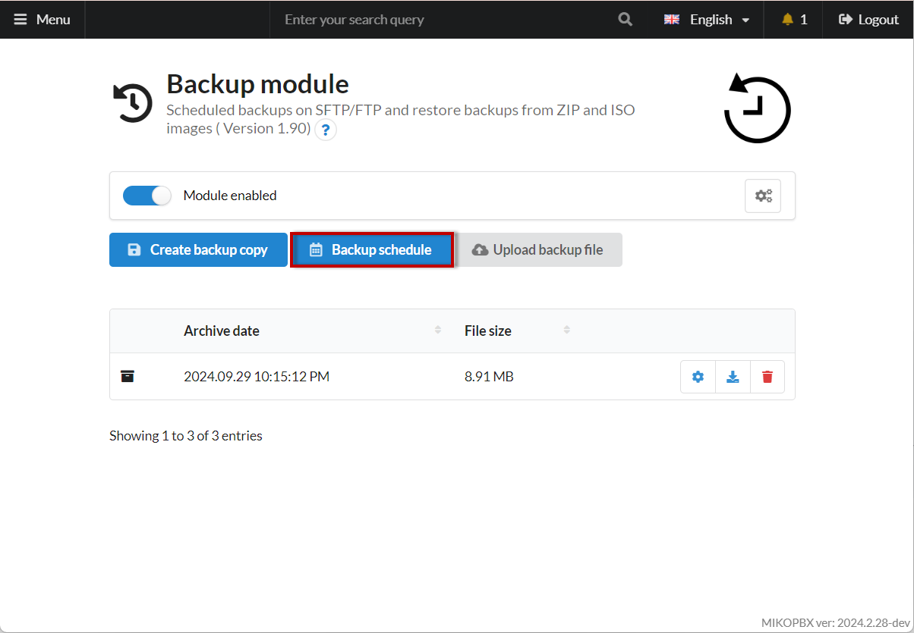<figcaption>
"Backup schedule" button
</figcaption></figure>

2. To enable scheduled backups, activate the switch "**Scheduled Backup**."

<figure>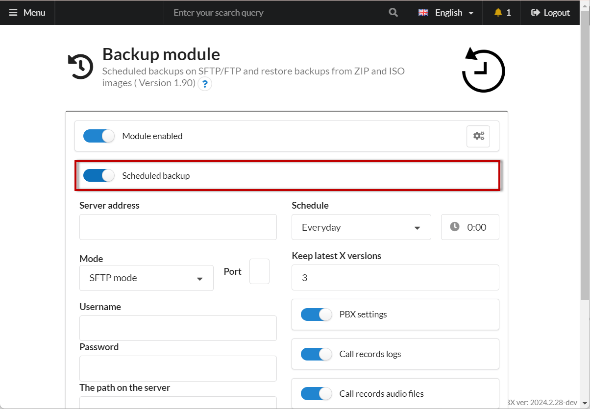<figcaption></figcaption></figure>

3. Fill in the required information:

* **Server Address** - IP address of MikoPBX or the address of the SFTP \ FTP server.
* **Port** - for **SFTP** mode, the port is **22**. Disabling the "SFTP Mode" switch activates **FTP** mode with port **21**.
* **Username** - the username for server authentication.
* **Password** - the password for server authentication.
* **Server Path** - the directory where the backups will be saved. Recommended directory on MikoPBX: **/storage/usbdisk1/mikopbx/backup/**.


When using **WebDav**, the directory in the "Server Path" field must be created manually in advance.


* **Schedule** - specify the day and time for the backup operation.
* **Keep Last X Versions** - specify how many backup versions should be retained.
* **PBX Settings** - all **configuration settings** of MikoPBX made in the web interface.
* **Call History** - saves the **cdr.db** database (location: **/storage/usbdisk1/mikopbx/astlogs/asterisk/cdr.db**). This does not save actual call recordings, only the information on the **Telephony** → **Call History** tab without playback/download functionality.
* **Call Recording Files** - saves all call recordings in \*.mp3 format.
* **Sound Files** - saves sound files uploaded to the PBX in the **Telephony** → **Sound Files** section.

<figure>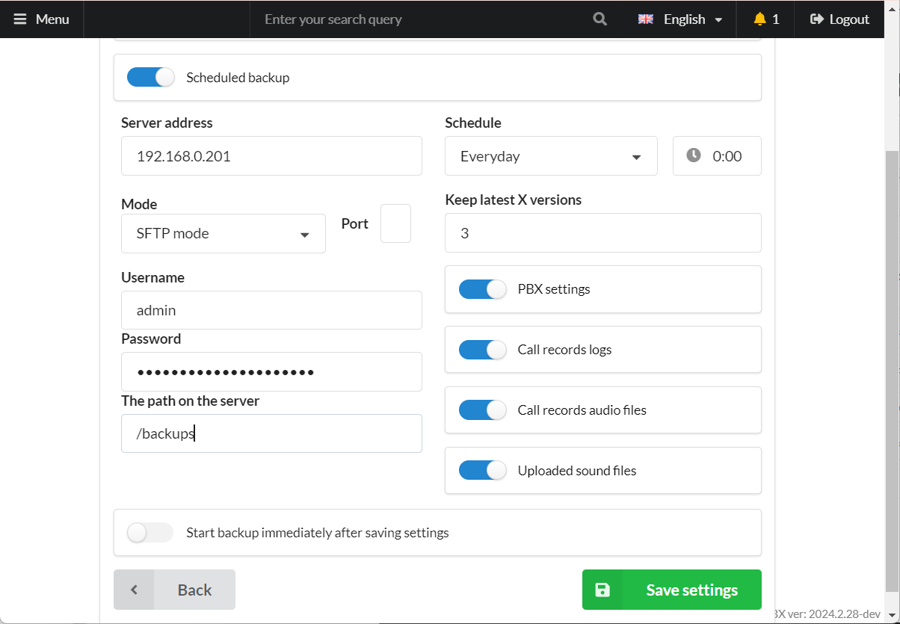<figcaption></figcaption></figure>

4. Click "**Save**."

<figure><figcaption></figcaption></figure>
