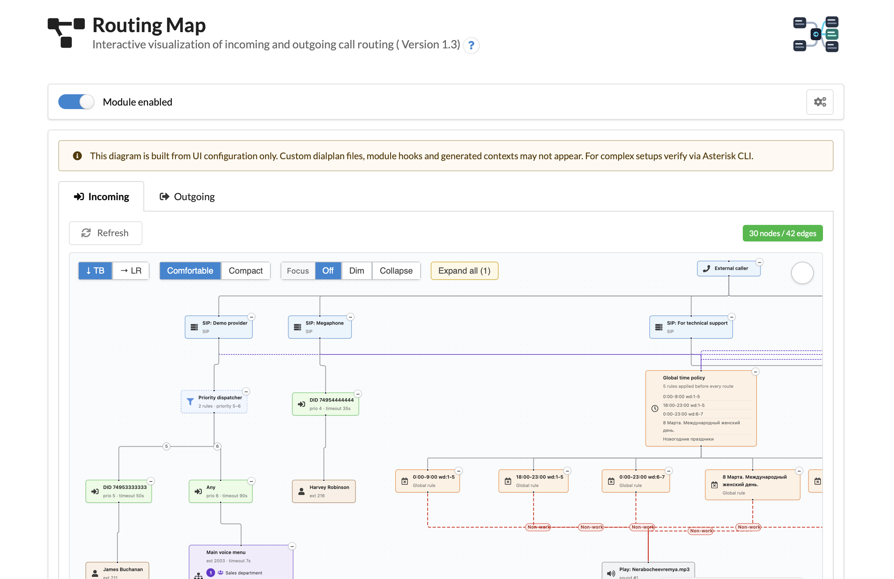
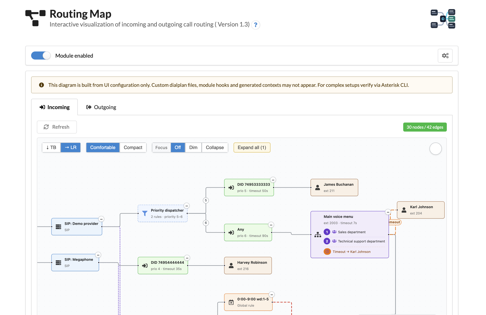
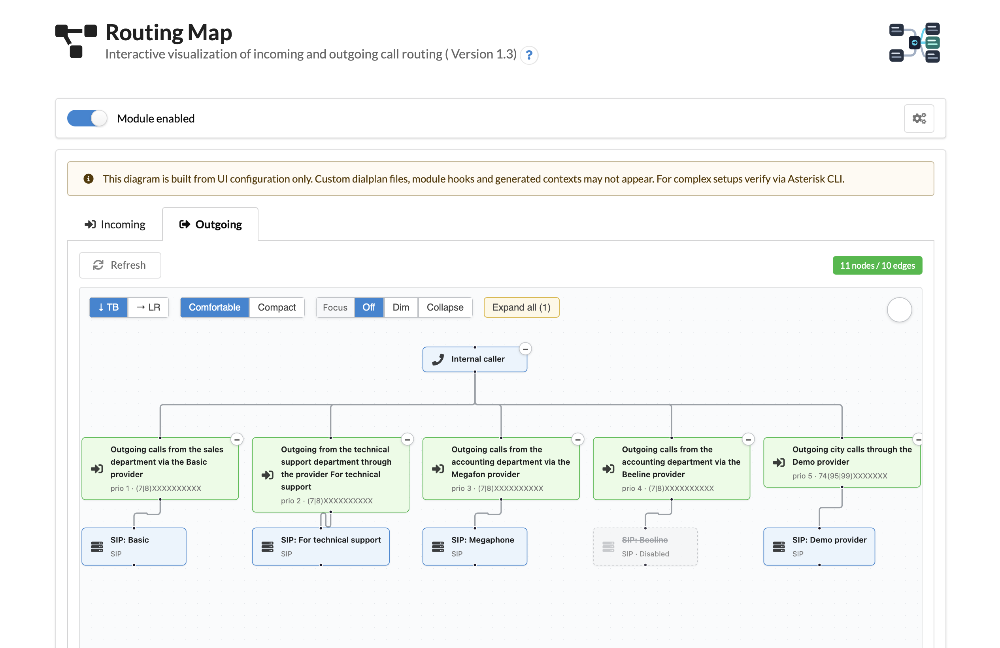

# Call Routing Map

The **Call Routing Map** module shows incoming and outgoing call routing as an interactive read-only diagram. It collects providers, DID routes, time conditions, IVR menus, queues, conferences, applications and extensions from the current MikoPBX configuration and displays them as a clickable graph.

<figure><figcaption><p>Call Routing Map overview</p></figcaption></figure>

## What it does

* Shows the full call path on one screen instead of forcing you to open several routing pages.
* Builds the diagram automatically from MikoPBX settings. There is no separate diagram editor and no extra configuration database.
* Opens the corresponding admin page when you click a graph node: provider, route, IVR menu, queue, extension and other supported objects.
* Works in read-only mode. The module does not change Asterisk dialplan files and does not modify MikoPBX routing tables.
* Provides separate views for incoming and outgoing routing.

## Installation

1. Open the MikoPBX web interface.
2. Go to **Modules** → **Marketplace**.
3. Find **Call Routing Map** and install it.
4. Open **Modules** → **Installed** and enable the module.

For manual installation, download the module archive from the project releases page and upload it through **Modules** → **Installed** → **Upload module**.

## Using the module

1. Open **Modules** → **Call Routing Map**.
2. The **Incoming** tab opens by default and shows how external calls move from providers and DID routes to their destinations.
3. Drag the canvas to pan, use the mouse wheel to zoom, and use the minimap to navigate large diagrams.
4. Click **Refresh** after changing routing settings elsewhere in the web interface.
5. Click a node to open the matching MikoPBX settings page.


The diagram is generated from the configuration available in the MikoPBX web interface. Custom dialplan files, `extensions_custom.conf` overrides, hooks from other modules and runtime-generated contexts are not displayed.


## Incoming routing

The **Incoming** tab helps audit how external calls are processed. It can include providers, DID routes, time conditions, IVR menus, queues, extensions, conferences and dialplan applications.

<figure><figcaption><p>Incoming routing diagram</p></figcaption></figure>

Typical use cases:

* Check which DID numbers are connected to which destinations.
* See how non-working time conditions affect the route.
* Follow the path from a provider to an IVR menu, queue or employee.
* Quickly open a route, queue or extension settings page from the graph.

## Outgoing routing

The **Outgoing** tab shows which dial patterns are routed through which providers. This is useful when checking provider priority, fallback rules and number templates.

<figure><figcaption><p>Outgoing routing diagram</p></figcaption></figure>

## Node types

The diagram uses different visual styles for supported object types:

* Provider
* Route / DID
* Time condition
* IVR menu
* Call queue
* Extension
* Conference
* Application

The built-in legend shows the node types that are present in the currently opened diagram.

## REST API

The module exposes a read-only REST API v3 under `/pbxcore/api/v3/module-routing-map/`. Authentication is available from localhost or with a Bearer token.

| Method | Endpoint | Description |
| ------ | -------- | ----------- |
| GET | `graph:incoming` | Returns the incoming routing graph as `{ nodes, edges }`. |
| GET | `graph:outgoing` | Returns the outgoing routing graph as `{ nodes, edges }`. |

Example request:

```bash
curl -H "Authorization: Bearer $TOKEN" \
  https://pbx.example.com/pbxcore/api/v3/module-routing-map/graph:incoming
```

Example response fragment:

```json
{
  "nodes": [
    {
      "id": "provider-1",
      "type": "provider",
      "data": {
        "label": "SIP-Trunk",
        "href": "/admin-cabinet/providers/modify/1"
      }
    }
  ],
  "edges": [
    {
      "id": "e-provider-1-route-42",
      "source": "provider-1",
      "target": "route-42"
    }
  ]
}
```

## Requirements and limitations

* MikoPBX **2025.1.1+**.
* Modern browser with ES2017 support.
* The graph is a configuration snapshot, not a live call monitor.
* Editing routing directly from the graph is intentionally not supported.


Module source code and issue tracker are available on GitHub: [mikopbx/ModuleRoutingMap](https://github.com/mikopbx/ModuleRoutingMap).

