# Настройка звонков через Telegram


**Обратите внимание**: Все данные авторизации / секретные коды / данные переписки Telegram используются исключительно ЛОКАЛЬНО на вашей АТС и НЕ передаются на сервера МИКО.


Модуль состоит из нескольких компонент:

* **Шлюз SIP ↔ Telegram** - позволяет **принимать звонки** от telegram и **совершать исходящие** звонки через telegram. Шлюз не зависит от прочих компонент, они лишь его дополняют
* **Телеграм клиент** - работает совместно с ботом, во время входящего звонка звонящему отправляется клавиатура для ввода добавочного номера.
* **Телеграм бот** - служит для формирования клавиатуры и отправки тональных команд в текущий канал. Для работы необходимо предварительно получить токен через интерфейс бота «**@BotFather**»

При звонке в компанию клиенту будет отправлена с сообщением **клавиатура для ввода добавочного номера**:

<figure>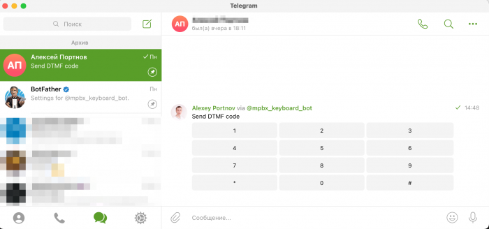<figcaption><p>Клавиатура для ввода добавочного номера</p></figcaption></figure>

После завершения звонка клавиатура будет скрыта.

После неудачного звонка из компании (клиент не ответил). Клиенту будет отправлена **визитка**:

<figure>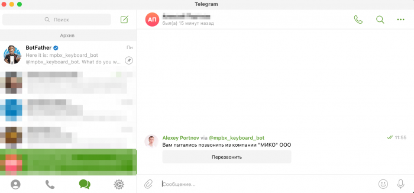<figcaption><p>Визитка</p></figcaption></figure>

Текст визитки и клавиатуры ввода добавочного можно исправить в настройках **модуля**:

<mark style="color:red;">**Screenshot here!**</mark>

## Настройка Telegram <a href="#nastrojka_telegram" id="nastrojka_telegram"></a>

### Аккаунт <a href="#nastrojka_telegram" id="nastrojka_telegram"></a>

Необходимо настроить видимость номера телефона в разделе "**Конфиденциальность**" , а так же разрешить Всем звонить на номер телефона в разделе "**Звонки**":

<figure>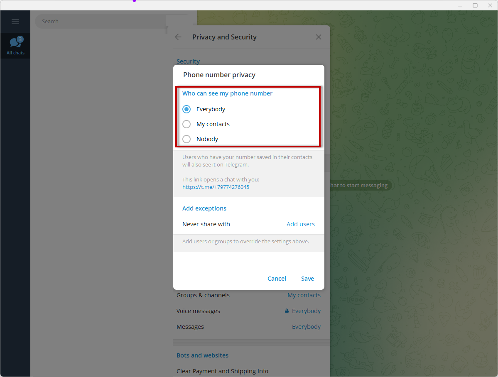<figcaption><p>Настройки приватности номера телефона</p></figcaption></figure>

### Telegram Bot

**Создайте бота**

1. Откройте чат с **@BotFather** в любом удобном клиенте Телеграм

<figure>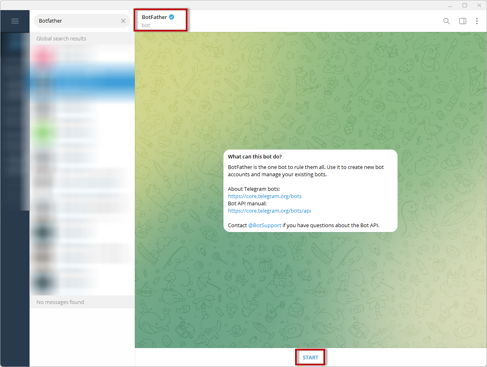<figcaption><p>@BotFather</p></figcaption></figure>

2. Отправьте команду

```
/newbot
```

3. Введите «**name**» нового бота, к примеру **new\_keyboard\_bot**, имя должно быть коротким и понятным, **имя увидит клиент при получении клавиатуры**
4. Введите «**username**» для нового бота, к примеру **newest\_keyboard\_bot**

<figure>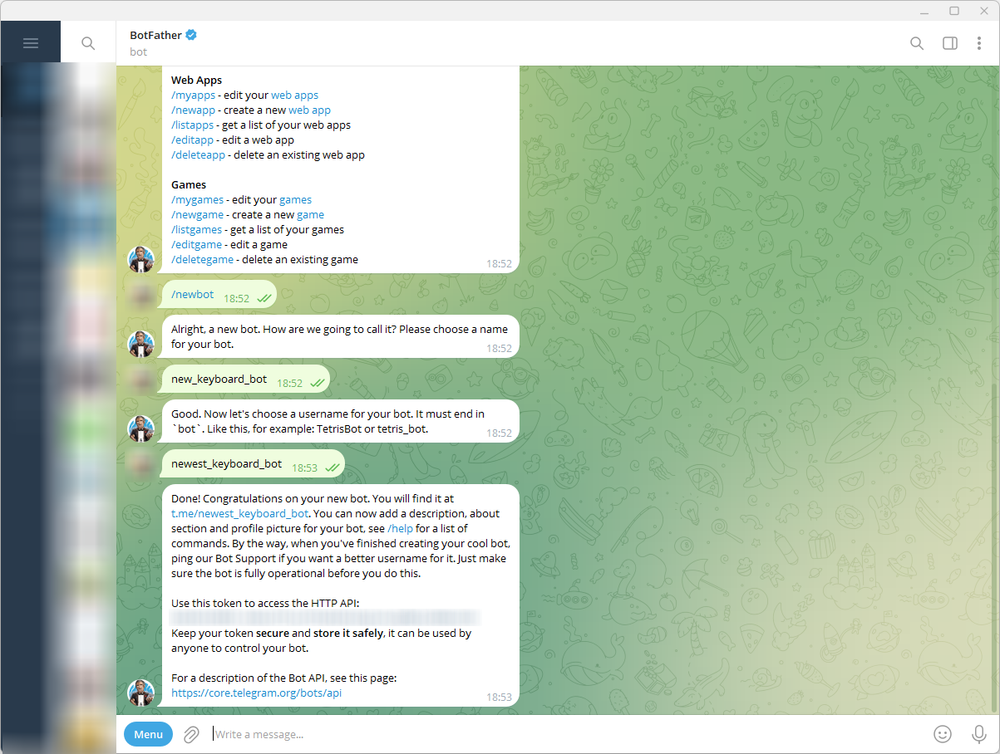<figcaption><p>@BotFather</p></figcaption></figure>

#### **Включите Inline Mode**

1.  Отправьте боту команду

    ```
    /setinline
    ```
2. Выберите созданного ранее бота

<figure>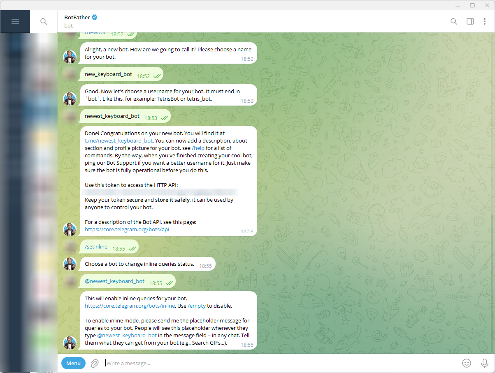<figcaption><p>Inline Mode in @BotFather</p></figcaption></figure>

#### **Получите Token**

1.  Отправьте команду

    ```
    /mybots
    ```
2. Выберите созданного ранее бота
3. Кликните по кнопке «**API Token**»
4. Скопируйте значение «**token**»

#### **Начните диалог с ботом**

1.  Отправьте из аккаунта телеграмм вашему боту команду

    ```
    /start
    ```
2. Напишите боту произвольное сообщение, к примеру «**Привет**!»

<figure>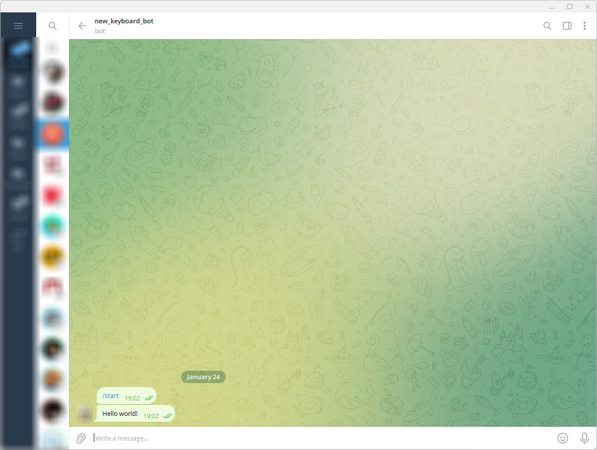<figcaption><p>Hello world to your bot</p></figcaption></figure>


С ботом должен быть открытый диалог, если не отправить ему команду «**/start**», то часть функционала работать не будет.


## Получение "App api\_id" и "App api\_hash" <a href="#poluchenie_app_api_id_i_app_api_hash" id="poluchenie_app_api_id_i_app_api_hash"></a>


«**App api\_id**» и «**App api\_hash**» - это секретные параметры, которые привязываются к вашему _telegram_ аккаунту. **Никому не сообщайте эти значения!** Они необходимы для подключения к API Telegram. Подробнее можно почитать в [документации](https://core.telegram.org/api/obtaining\_api\_id).


1. Перейдите по ссылке [https://my.telegram.org/auth](https://my.telegram.org/auth)

<figure>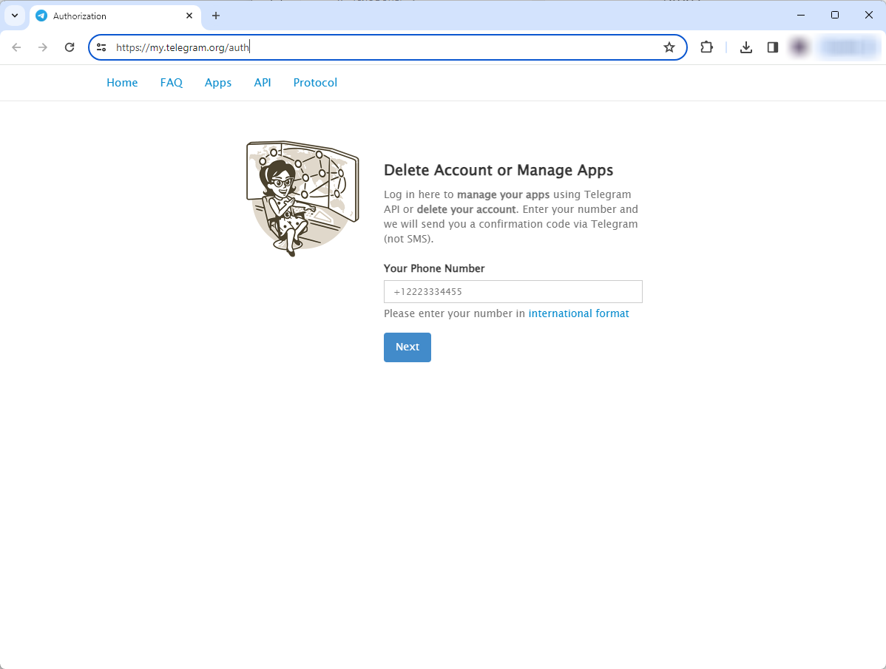<figcaption><p>Telegram page</p></figcaption></figure>

2. Укажите номер телефона, привязанный к telegram аккаунту
3. Перейдите в раздел «**API development tools**»

<figure>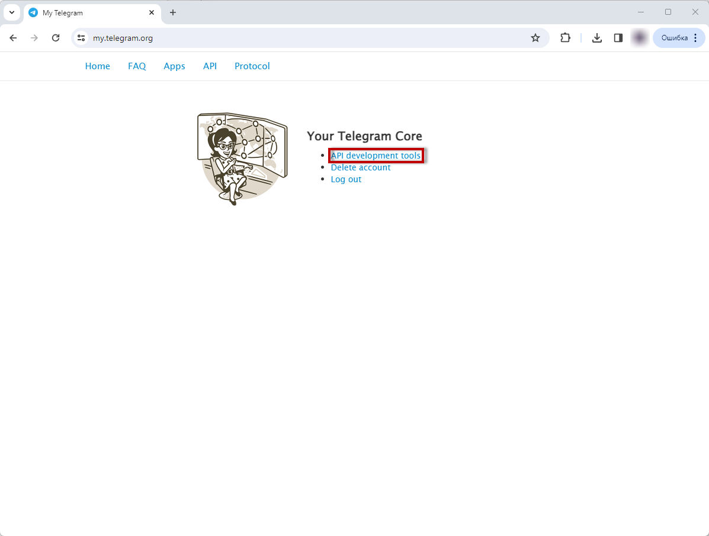<figcaption><p>API development tools</p></figcaption></figure>

4. Опишите параметры нового приложения:

* «**App title**» - заголовок приложения
* «**Short name**» - уникальное короткое имя приложения
* «**URL**»- произвольный адрес сайта
* «**Platform**» - Other
* «**Description**» - произвольное описание

Выполните действие «**Create application**»

<figure>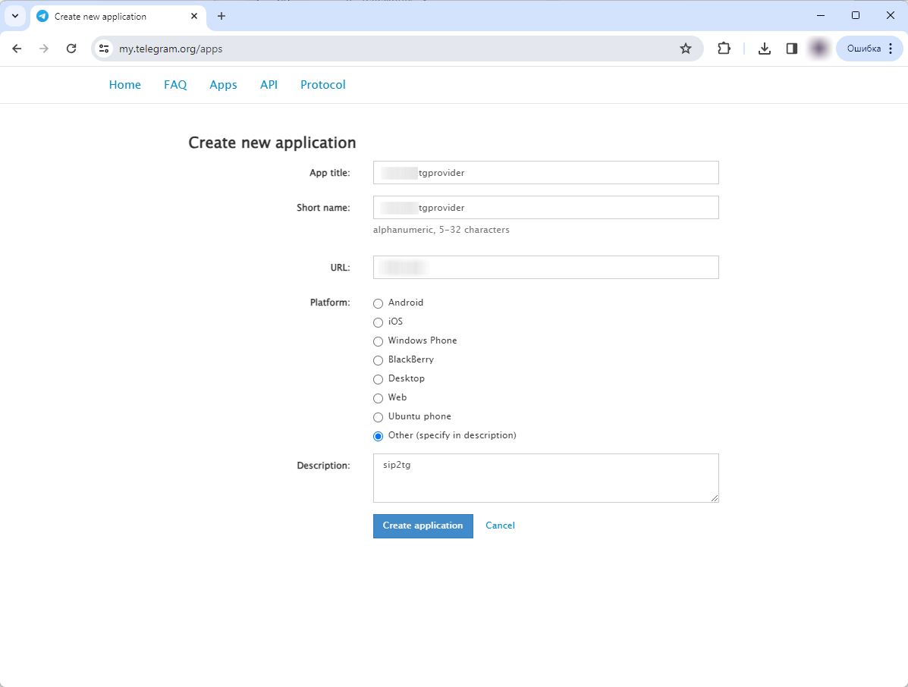<figcaption><p>AppParameters</p></figcaption></figure>

5. Скопируйте значения «**App api\_id**» и «**App api\_hash**»

<figure>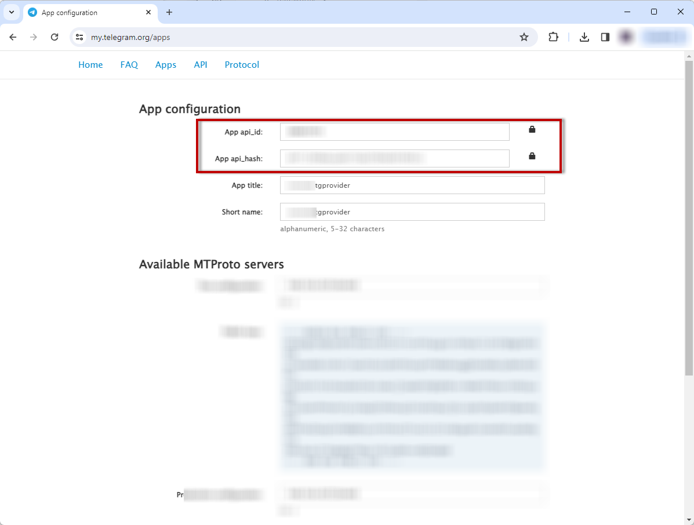<figcaption><p>«<strong>App api_id</strong>» и «<strong>App api_hash</strong>»</p></figcaption></figure>

## Настройки модуля MikoPBX <a href="#nastrojki_modulja_mikopbx" id="nastrojki_modulja_mikopbx"></a>


При восстановлении из бекапа может потребоваться повторная авторизация в telegram.


1. Установите дополнительный модуль «**Провайдер Telegram**», (см. инструкции по установке модулей в разделе [Управление модулями](../../manual/modules/pbx-extension-modules/))
2. Ведите значения «**App api\_id**» и «**App api\_hash**», полученные на предыдущем этапе, а так же **Token** бота, который вы получили при создании бота.

Сохраните изменения

<figure>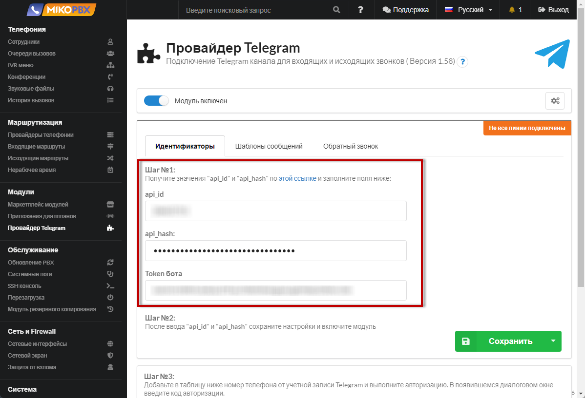<figcaption></figcaption></figure>

3. Добавьте новый номер по кнопке «**Добавить**»
4. Запустите процесс авторизации для **Шлюза**, **Клиента Telegram**, для **Бота**

<figure>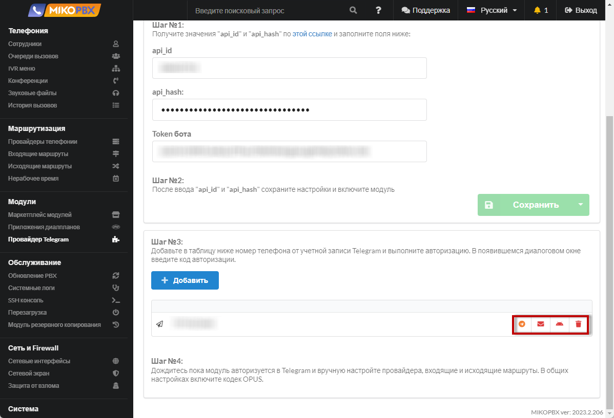<figcaption></figcaption></figure>

5. Авторизуйте все линии. После подключения отобразится "**Линии подключены**". Подключенные каналы отобразятся зеленым цветом.

<figure>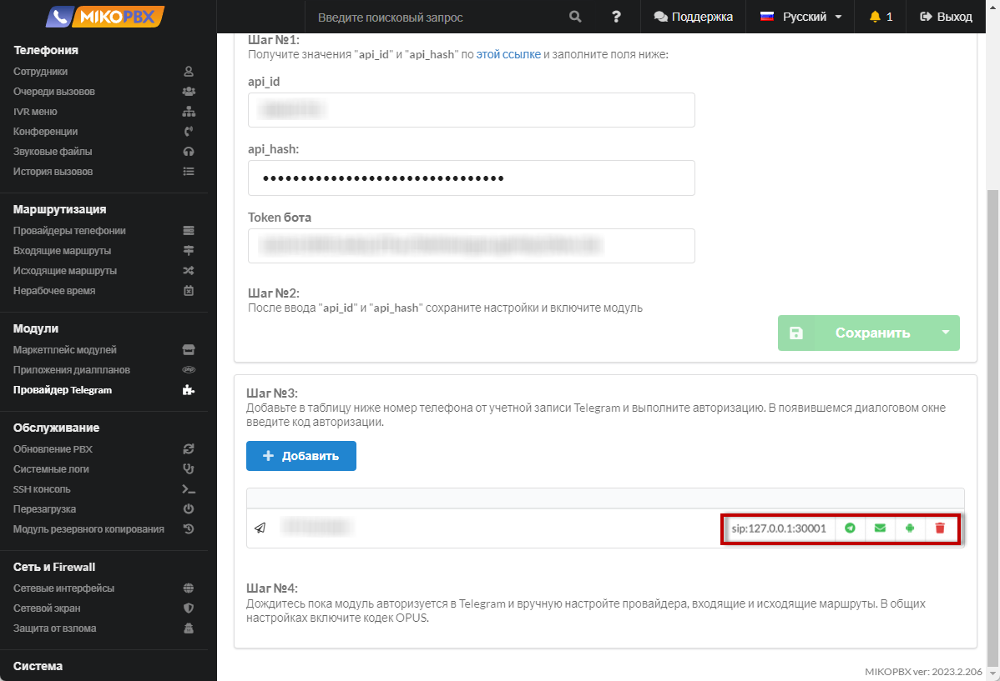<figcaption></figcaption></figure>


Кнопки авторизации отображают статус подключения:

* **Красный** - Необходима авторизация
* **Оранжевый** - Ожидается запуск сервиса
* **Зеленый** - Соединение установлено

В любом из состояний возможно запустить процесс авторизации заново.



В случае возникновения проблем, может потребоваться очистить служебные каталоги ([с помощью SSH-клиента](../../faq/troubleshooting/connecting-to-a-pbx-using-an-ssh-client.md)):

* /storage/usbdisk1/mikopbx/custom\_modules/ModuleTelegramProvider/db/**7906660000**
* /storage/usbdisk1/mikopbx/custom\_modules/ModuleTelegramProvider/db/madeline/**7906660000**

где 7906660000 - номер телефона, логин телеграмм аккаунта


## Настройка провайдера <a href="#nastrojka_provajdera" id="nastrojka_provajdera"></a>

1. Скопируйте адрес и порт из активной линии. В нашем случае это **127.0.0.1:30001**
2. Перейдите в раздел "[Провайдеры телефонии](../../manual/routing/providers.md)"

<figure><figcaption><p>Раздел "Провайдеры телефонии"</p></figcaption></figure>

3. Добавьте нового провайдера

<figure><figcaption><p>Новый провайдер</p></figcaption></figure>

4. Введите «**Название провайдера**» - произвольное значение.&#x20;

Укажите «**Тип учетной записи**» - «**Аутентификация по IP адресу, без пароля**».&#x20;

Введите «**Хост или IP адрес**» - **127.0.0.1**

«**Расширенные настройки**» - «**Порт соединения SIP**» - укажите порт линии, в текущем примере «**30001**»

<figure><figcaption><p>Настройки провайдера </p></figcaption></figure>

5. «**Расширенные настройки**» - «**Отключить использование поля fromuser**»

Сохраните изменения

<figure>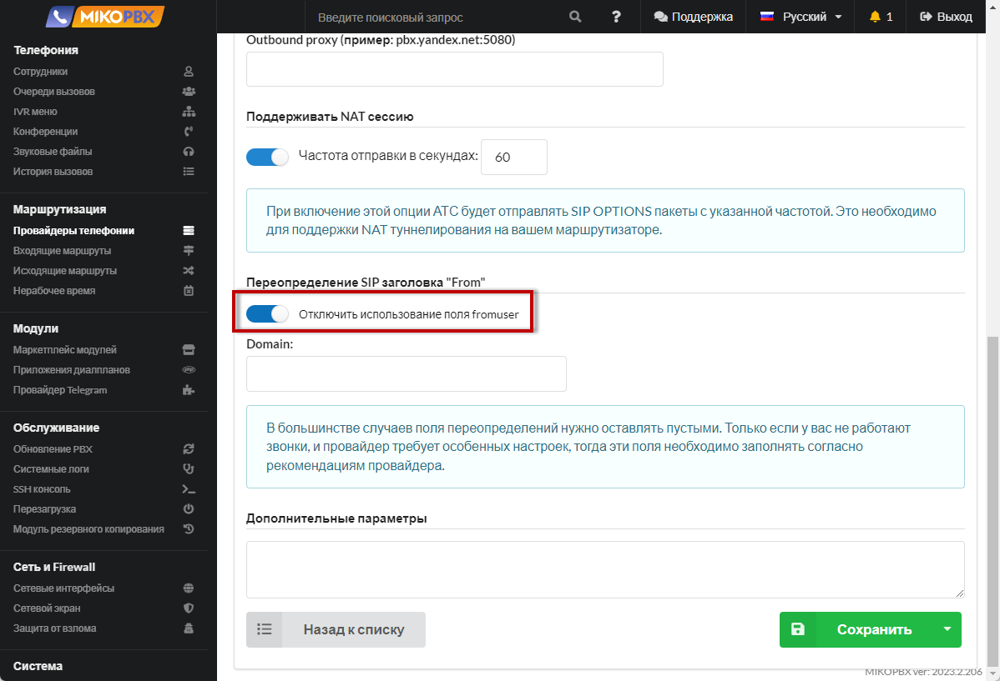<figcaption></figcaption></figure>

6. В разделе «**Система**» -> «**Общие настройки**» разрешите использование кодека **Opus**

<figure><figcaption><p>"Opus"</p></figcaption></figure>

### Входящий маршрут <a href="#vxodjaschij_marshrut" id="vxodjaschij_marshrut"></a>

Для настройки входящих маршрутов ознакомьтесь с документацией «[Входящие маршруты](../../manual/routing/incoming-routing.md)»&#x20;


**Порядок определения callerid**:\
Telegram может передавать следующие идентификаторы:

1. **X-TG-Phone** - номер телефона
2. **X-TG-Username** - ник пользователя
3. **X-TG-ID** - идентификатор пользователя

Некоторые идентификаторы могут быть скрыты клиентом в настройках приватности. Caller ID будет установлен исходя из этих полей, **X-TG-Phone** - имеет наивысший приоритет, **X-TG-ID** - низший.


### Исходящий маршрут <a href="#isxodjaschij_marshrut" id="isxodjaschij_marshrut"></a>

Для настройки входящих маршрутов ознакомьтесь с документацией «_**Исходящие маршруты**_»&#x20;


**Обязательно добавить плюс при наборе номера**! См. пример ниже.


Пример маршрута:

* «**Название правила**» - siptg
* «**Номер начинается с**» - 7
* «**Остальная часть номера состоит из указанного количества цифр**» - 10
* «**Перед тем как начать звонок отсекаем**» - 0
* «**цифр в начале номера, затем добавляем в начало** » - символ плюс »+«

<figure><figcaption><p>Исходящие вызовы</p></figcaption></figure>
