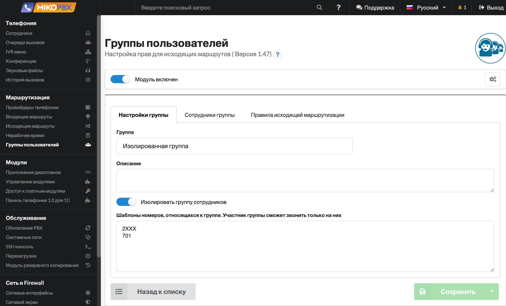

# Группы пользователей


Модуль возможно использовать начиная с **MikoPBX 2019.04.134.**


## Назначение 

* Разграничение прав доступа к исходящим маршрутам
* Установка caller id для исходящего вызова

## Настройка модуля 

1\. Выполните установку модуля в разделе [Управление модулями](../../manual/modules/pbx-extension-modules/).

2\. Включите модуль и зайдите в его настройки.

3\. На основной странице модуля отображается список существующих групп. Сейчас он пустой.

3\. На вкладке **Cотрудники** отображается список всех сотрудников и то, к какой группе они принадлежат. Сейчас они сотрудники не принадлежат ни к какой группе, потому что самих групп еще не создано.

4\. Для добавления новой группы нажмите **Создать группу сотрудников.**

5\. На вкладке **Настройки группы** укажите ее имя и описание**.**  Затем нажмите **Сохранить.**

6\. Вы перейдете на вкладку **Сотрудники группы.** Добавьте в группу необходимых сотрудников.

7\. Перейдите на вкладку **Правила исходящей маршрутизации** и активируйте разрешенные маршруты.


Если все маршруты будут запрещены - то будут позволены только внутренние вызовы.


## Возможные сценарии использования 

### Разрешить сотруднику только внутренние вызовы 

1\. Создайте новую группу **Только внутренние** (название группы может быть любым).

2\. На вкладке **Сотрудники группы** заполните список сотрудников.

3\. На вкладке **Правила исходящей маршрутизации** отключите все маршруты.

### Запретить сотруднику международные направления 

Настройка выполняется аналогично примеру [Разрешить сотруднику только внутренние вызовы](module-users-groups.md#razreshit\_sotrudniku\_tolko\_vnutrennie\_vyzovy) с тем лишь отличием, что следует запретить только международные маршруты.

### Персональный маршрут для каждого сотрудника 

Для каждого сотрудника создайте отдельную группу. Укажите разрешенный маршрут.

### Свой caller id для каждого маршрута 

На вкладке **Правила исходящей маршрутизации** укажите CallerID для каждого маршрута.


Не каждый провайдер позволяет подменить CallerID. Обычно позволяют использовать только тот номер, который принадлежит организации.



Если необходимо использовать этот функционал, то в настройках провайдера потребуется **отключить** использование поля **fromuser**.


## Изоляция группы 

Функция позволяет изолировать группу сотрудников на АТС:

1. Сотрудники группы смогут звонить только на номера своей группы
2. Сотрудники из других групп, не смогут позвонить на изолированную группу

<figure><figcaption></figcaption></figure>

**Шаблоны номеров, относящихся к группе. Участник группы сможет звонить только на них**

1. В шаблонах допускается использовать символ от 1 до 9 и символ X (любая цифра 1-9)
2. Участник группы сможет набрать Все номера, удовлетворяющие шаблону

Примеры шаблонов:

* **2XX** - номера с 200 по 299
* **200001** - явно указанный внутренни номер, к примеру номер очереди
* **7XXXXXXXXXX** - 11ти значные номера РФ
