# Dial groups management

The module allows you to organize employees into groups and flexibly manage their permissions: block international calls, allow internal calls only, assign personal routes or CallerID. Full group isolation is supported — employees will only be able to call within their own group.

### Installation and module overview

1\. Go to "**Module marketplace"** -> "[**Marketplace**](../../manual/modules/pbx-extension-modules.md#marketplace)**"**. Install the **"Manage call groups"** module.

<figure>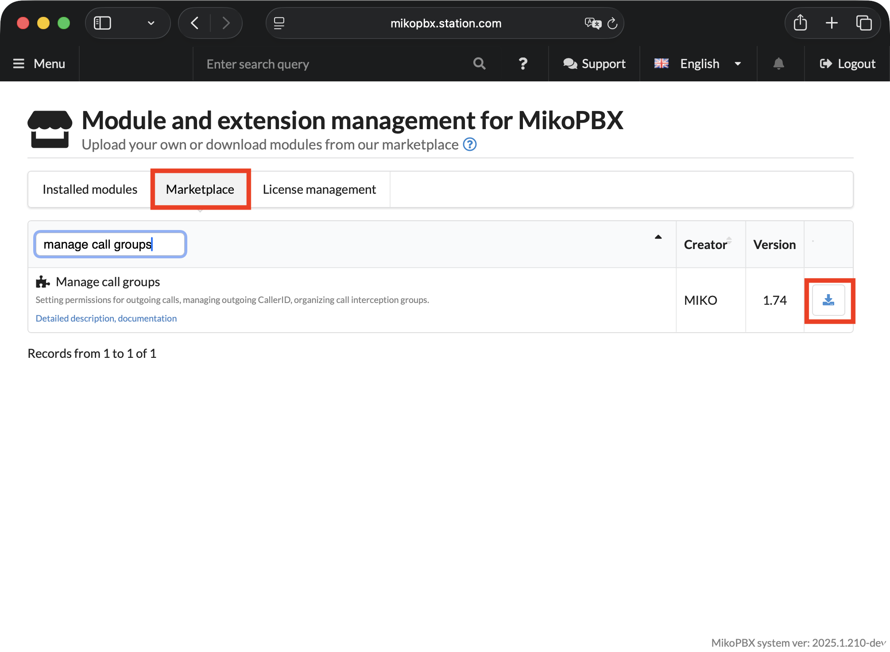<figcaption>
"Manage call groups" module in the Marketplace
</figcaption></figure>

2\. Go to "**Installed modules"** section. Enable the module and open its settings.

<figure>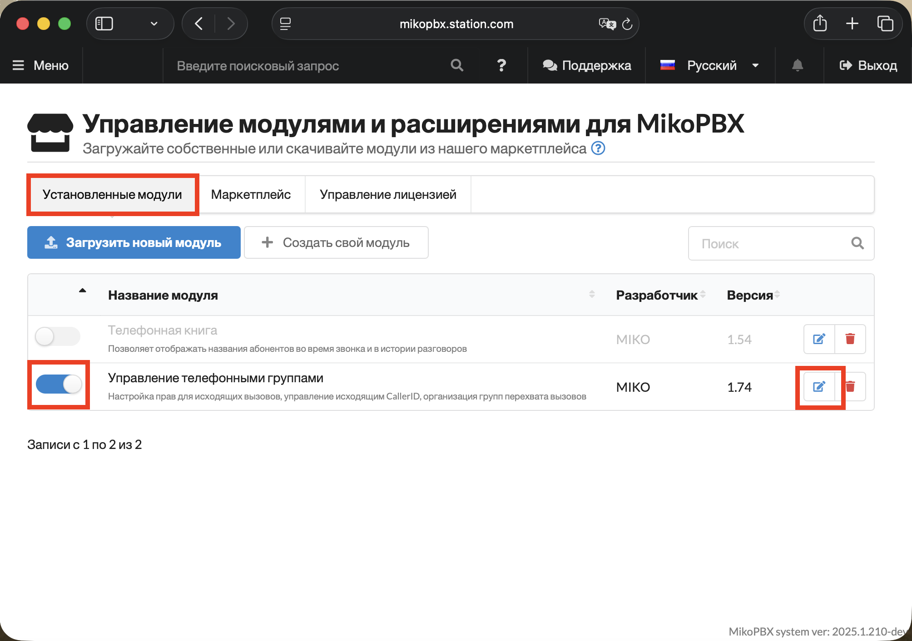<figcaption>
"Installed modules" section. Opening module settings.
</figcaption></figure>

In the "**Dial group list"** section you can see all existing groups. You can also set a default group here — all newly created employees will be added to it automatically. If needed, a group can be selected manually when creating an employee.

<figure>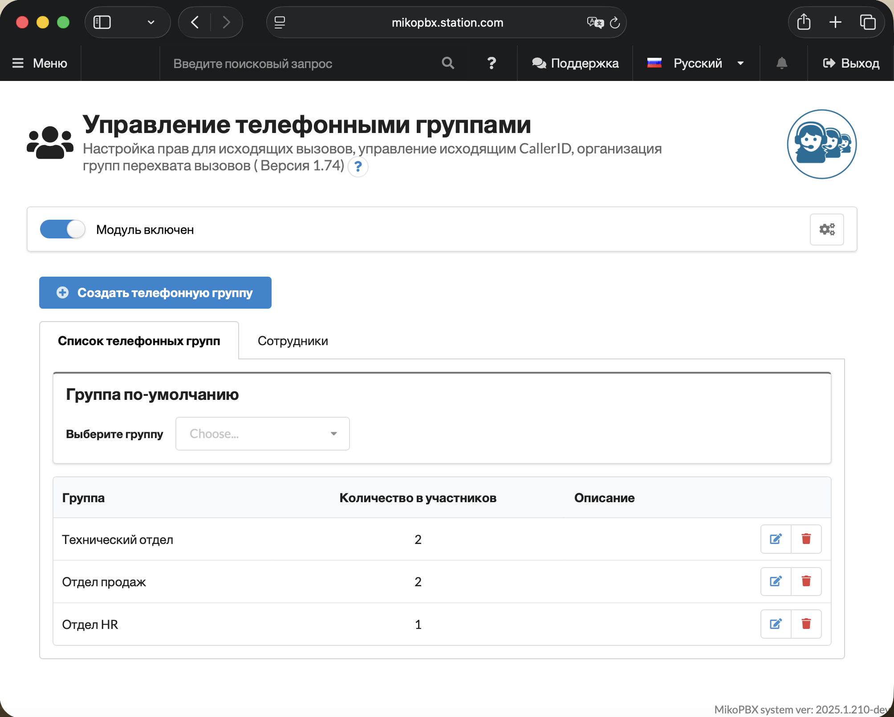<figcaption>
"Dial group list" tab
</figcaption></figure>

In the **"Extensions"** section you can see all employees and which group they belong to.

<figure>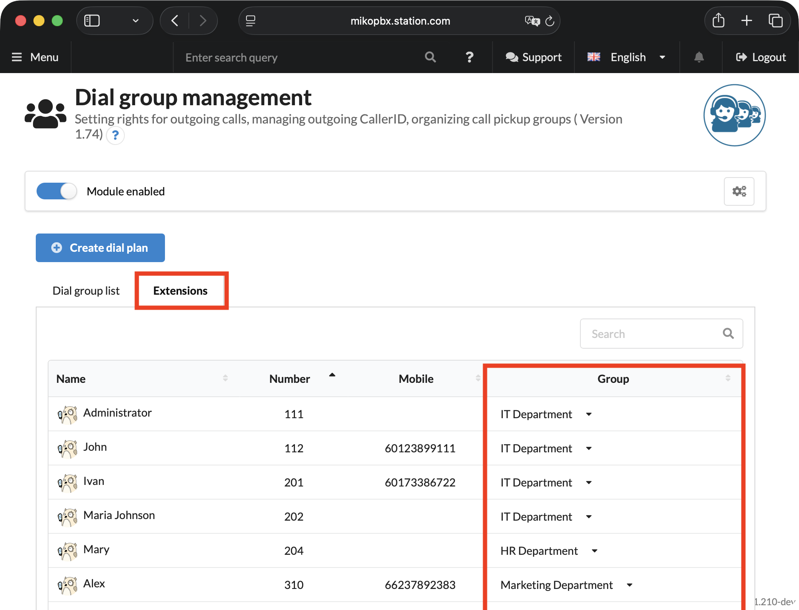<figcaption>
"Extensions" tab
</figcaption></figure>

### Creating a new group

1. To add a new group, go to the "**Dial group list"** tab and click "**Create dial plan"**.

<figure>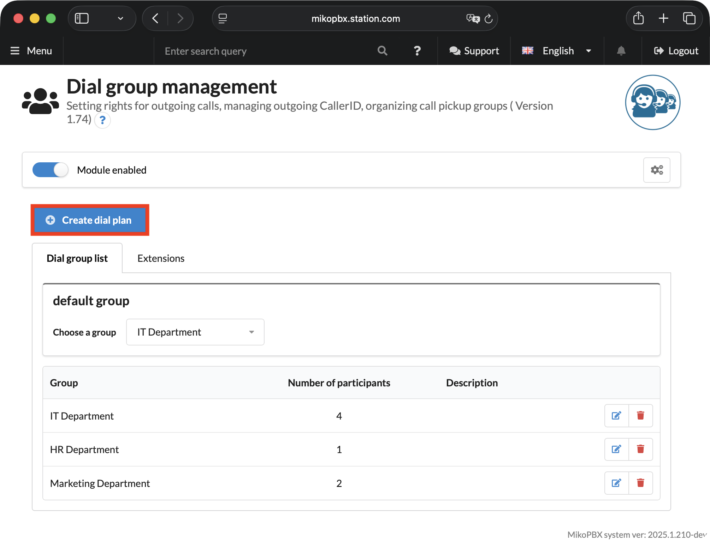<figcaption>
"Create dial plan" button
</figcaption></figure>

2. Specify the basic parameters for the new group:

* **Group** — any name, for example "Marketing Department".
* **Description** — a brief note, for example "External calls allowed through Telnyx only". Helps quickly identify the group's purpose later.

Click "**Save**".

<figure>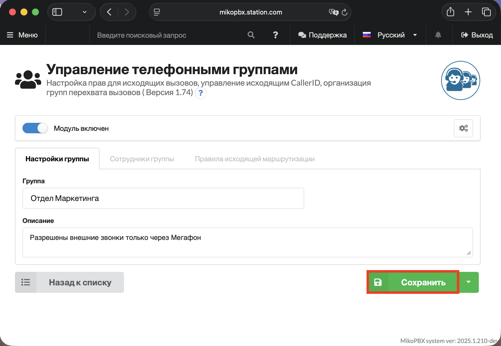<figcaption>
Basic parameters for the new group
</figcaption></figure>

3. On the "**Group staff"** tab, select the employees to include in the group.

<figure>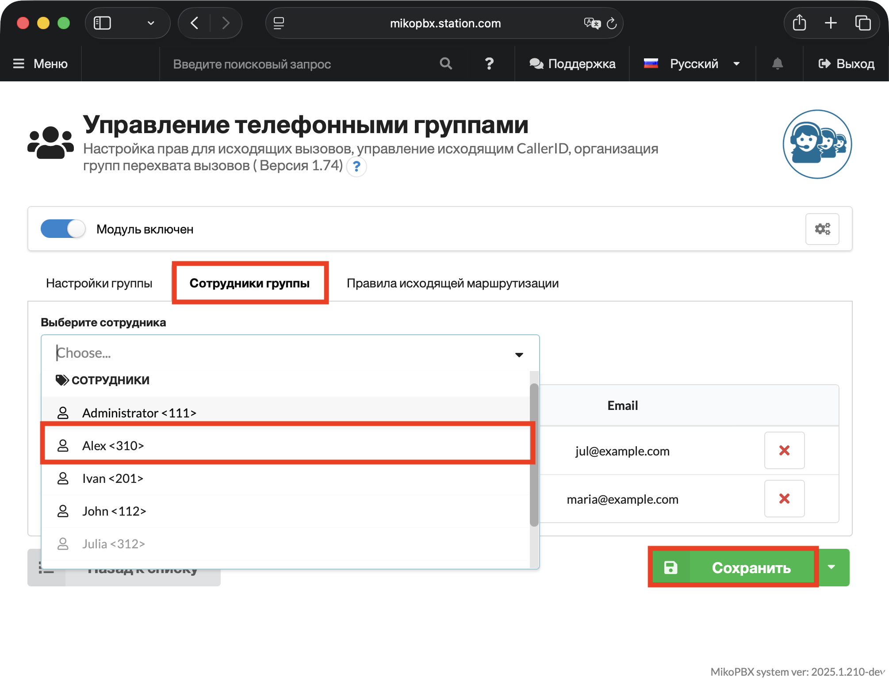<figcaption>
Adding employees when creating a new group
</figcaption></figure>

4. Go to the "**Outbound routing rules"** tab. Here you can enable or disable available routes for the current group. For example, activate only the Telnyx route — then group members will only be able to call through it.

If needed, enter a number in the **Outbound Caller ID** field — this number will be shown to the recipient when calling through this route. If left empty, the default Caller ID from the provider settings will be used.


Not every provider allows CallerID substitution — typically only numbers belonging to the organization are permitted. The following formats are supported:

* `60177876453 <admin>`
* `60195229304`
* `60195223045 <60195223045>`

Check with your telecom provider which `FROM` header format (the `user` field) is supported.

If you need to use this feature, make sure to **disable** the **`fromuser`** field in the provider settings. This setting also affects the `FROM` header and has higher priority.



If all routes are disabled, group members will only be able to make internal calls.


<figure>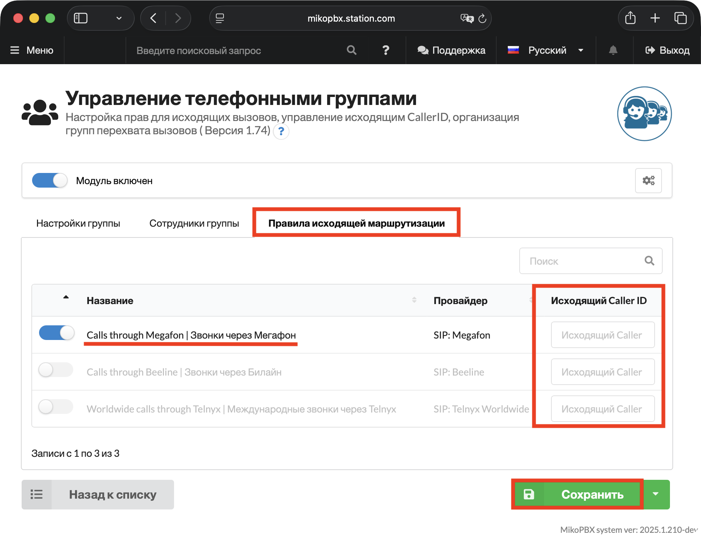<figcaption>
"Outbound routing rules" tab settings
</figcaption></figure>

### Common use cases

#### **Allow internal calls only**

If your company has interns or employees who don't need to call external numbers, you can restrict their access to internal calls only.&#x20;

1. Go to the "**Dial group list"** module settings. Click "**Create dial plan"**. Set any name, for example "Internal Calls Only".

<figure>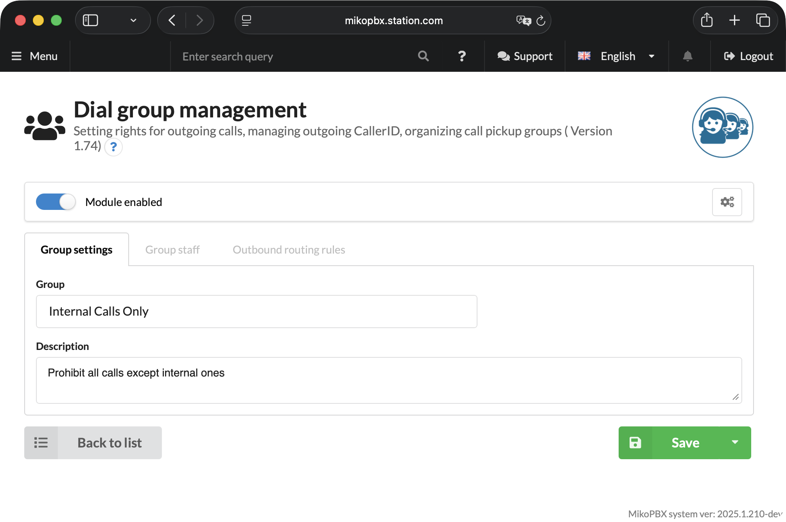<figcaption>
General settings of the new group (internal calls only)
</figcaption></figure>

2. On the "**Group staff"** tab, select the employees to include in the group.

<figure><figcaption>
Selecting employees to add to the group
</figcaption></figure>

3. On the "**Outbound routing rules"** tab, disable all routes — switch all toggles to the off position.

<figure>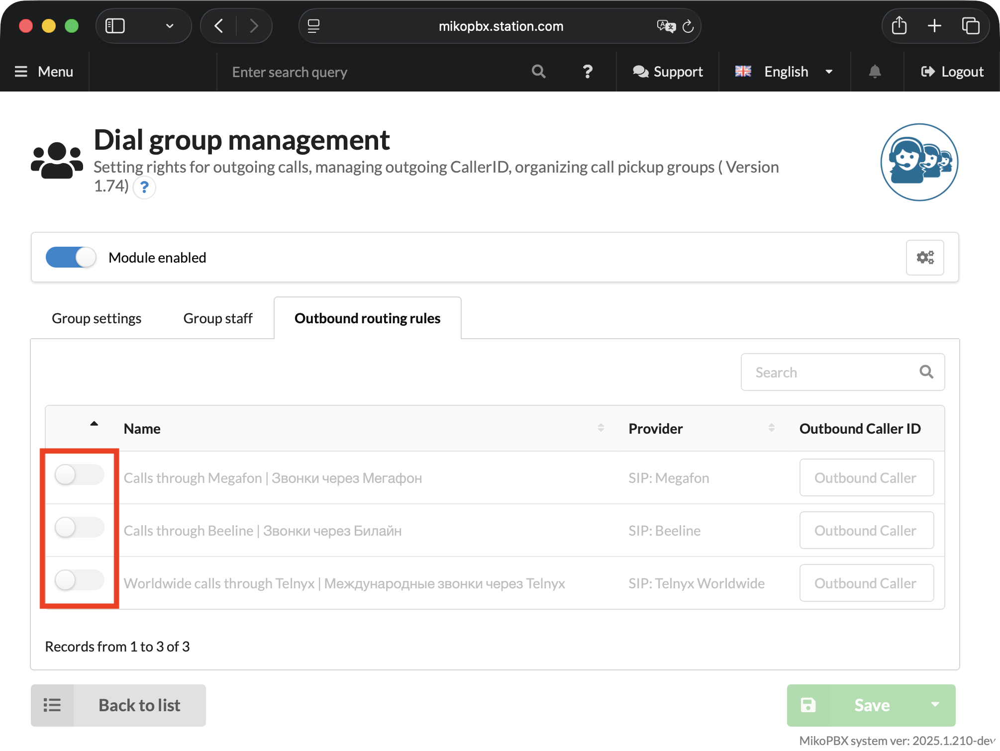<figcaption>
Disabling all outbound routes for the group
</figcaption></figure>

#### **Block international calls**

1. Go to the "**Dial group list"** module settings. Click "**Create dial plan"**. Set any name, for example "No international calls (only local)". <mark style="background-color:blue;">In this example, the providers for local calls are Megafon and Beeline. Telnyx will be used for worldwide (international) calls.</mark>

<figure>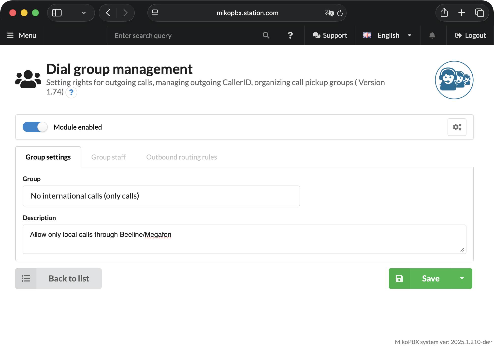<figcaption>
General settings of the new group (no international calls)
</figcaption></figure>

2. On the "**Group staff"** tab, select the employees to include in the group.

<figure><figcaption>
Selecting employees to add to the group
</figcaption></figure>

3. On the "**Outbound routing rules"** tab, enable only local provider routes and leave the "**Telnyx**" international route disabled.

<figure>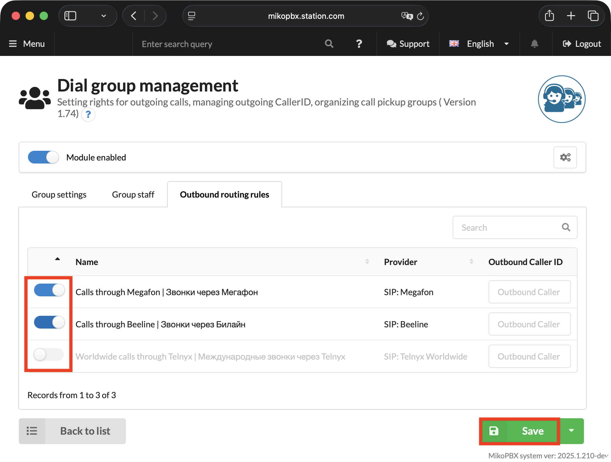<figcaption>
Outbound routing template with international calls blocked
</figcaption></figure>

### Group isolation

After creating a group, go to **Group Settings** to configure isolation options. Two options are available:

* Isolate a group of employees.
* Isolate the pickup function.

#### **Isolate a group of employees**

This feature fully isolates the group from all other employees on the PBX:

* Group members can only call numbers within their own group.
* Employees from other groups cannot call the isolated group.
* Call pickup (`*8`) will only work within the group.

**Patterns of numbers related to the group. A group member will only be able to call them** - define the patterns of numbers that group members are allowed to dial. Patterns support digits 1–9 and the symbol `X` (any digit 0–9).

Pattern examples:

* `2XX` — numbers from 200 to 299
* `200001` — a specific internal number, for example a queue number
* `66XXXXXXXXX` — 11-digit Thai phone numbers

<figure>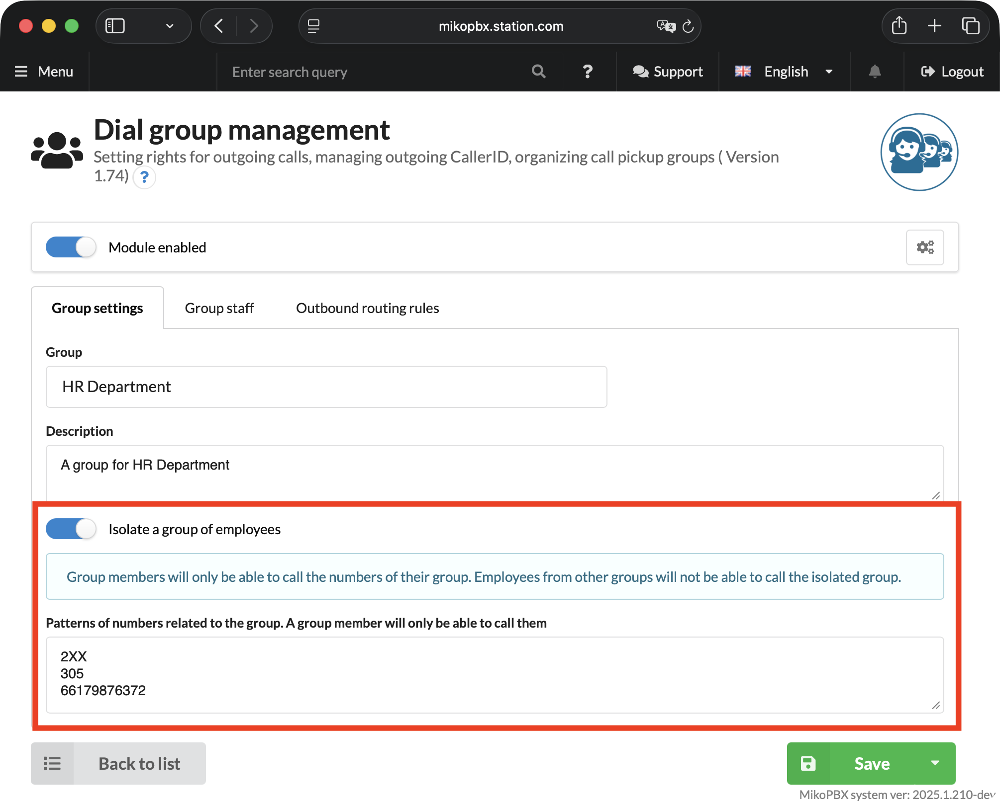<figcaption>
Isolating the employee group
</figcaption></figure>

#### **Isolate the pickup function**

More details about the pickup function can be found in the [documentation](../../manual/system/general-settings.md#perevody_vyzovov1).

By default, the call pickup combination is `*8` or `*8phoneNumber`. When isolation is enabled, pickup will only be available within the group — the list of members is defined on the **Group Employees** tab.

<figure>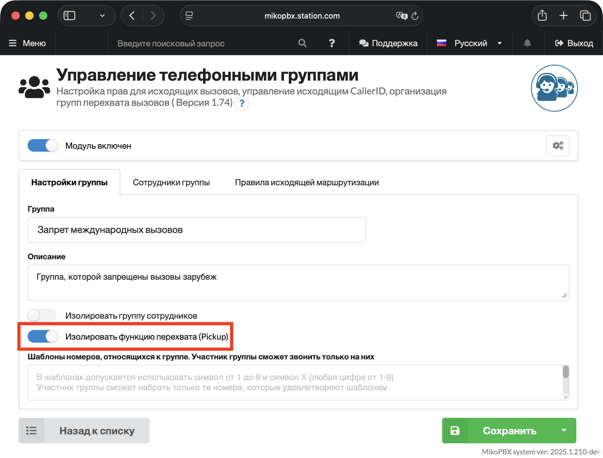<figcaption>
Isolating the call pickup function within the group
</figcaption></figure>
