# Управление телефонными группами

## Назначение 

* Разграничение прав доступа к исходящим маршрутам
* Установка СallerID (FROM, user) для исходящего вызова
* Изоляция групп

## Настройка модуля 

1\. Выполните установку модуля в разделе [Управление модулями](../../manual/modules/pbx-extension-modules.md).

2\. Включите модуль и зайдите в его настройки.

3\. На основной странице модуля отображается список существующих групп. Сейчас он пустой.

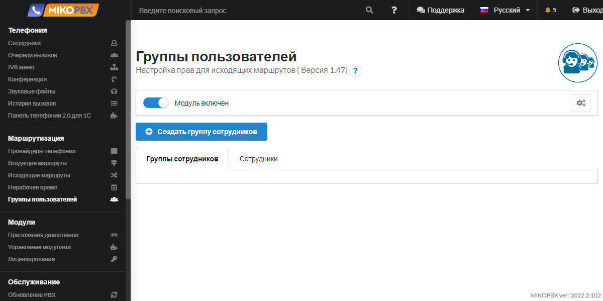

3\. На вкладке **Cотрудники** отображается список всех сотрудников и то, к какой группе они принадлежат. Сейчас они сотрудники не принадлежат ни к какой группе, потому что самих групп еще не создано.

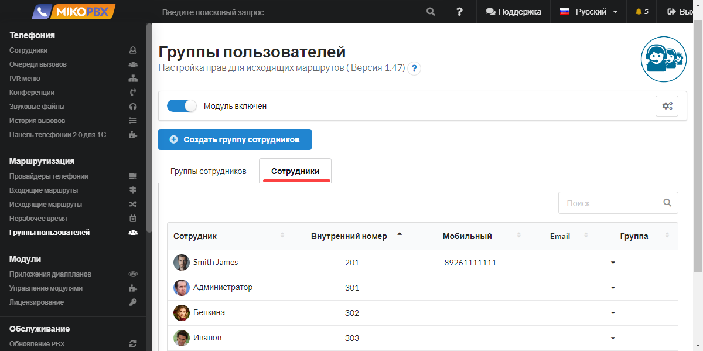

4\. Для добавления новой группы нажмите **Создать группу сотрудников.**

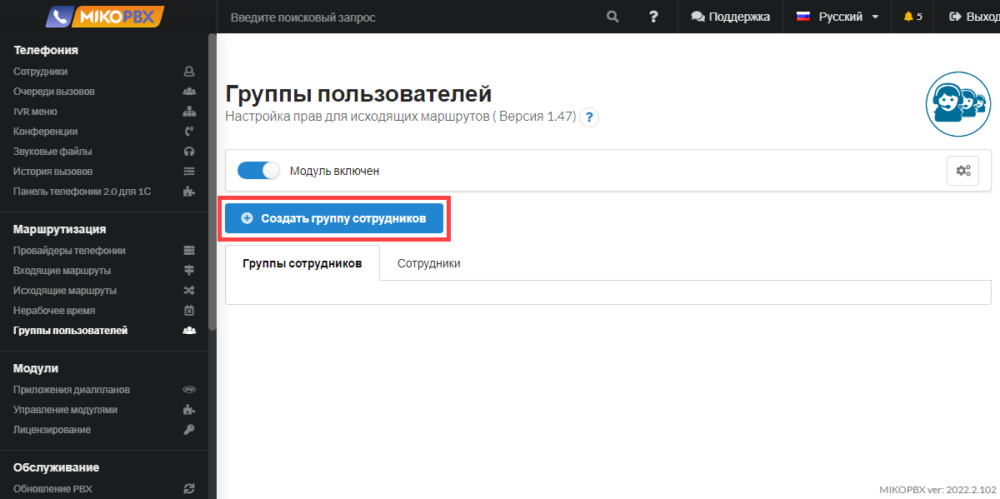

5\. На вкладке **Настройки группы** укажите ее имя и описани&#x435;**.**  Затем нажмите **Сохранить.**

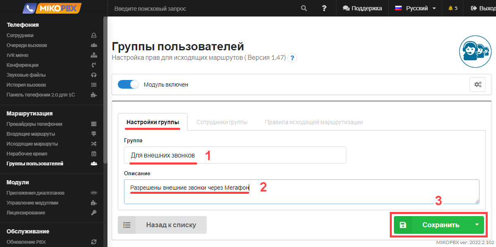

6\. Вы перейдете на вкладку **Сотрудники группы.** Добавьте в группу необходимых сотрудников.

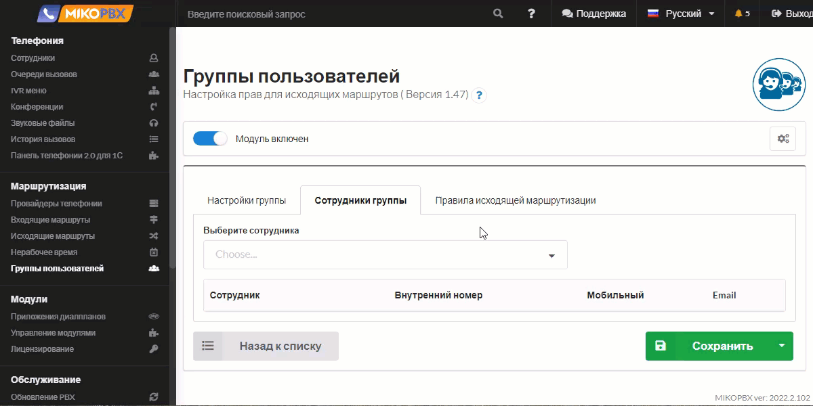

7\. Перейдите на вкладку **Правила исходящей маршрутизации** и активируйте разрешенные маршруты.

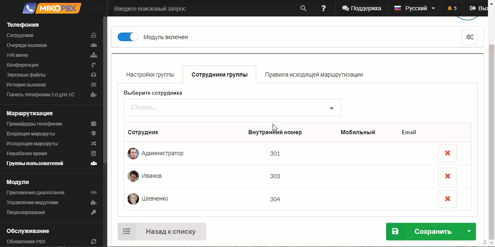


Если все маршруты будут запрещены - то будут позволены только внутренние вызовы.


## Возможные сценарии использования 

### Разрешить сотруднику только внутренние вызовы 

1\. Создайте новую группу **Только внутренние** (название группы может быть любым).

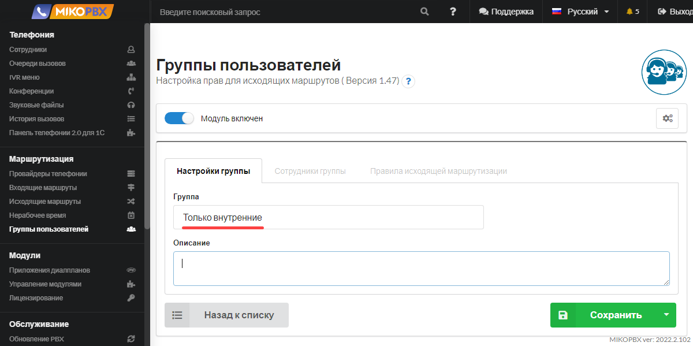

2\. На вкладке **Сотрудники группы** заполните список сотрудников.

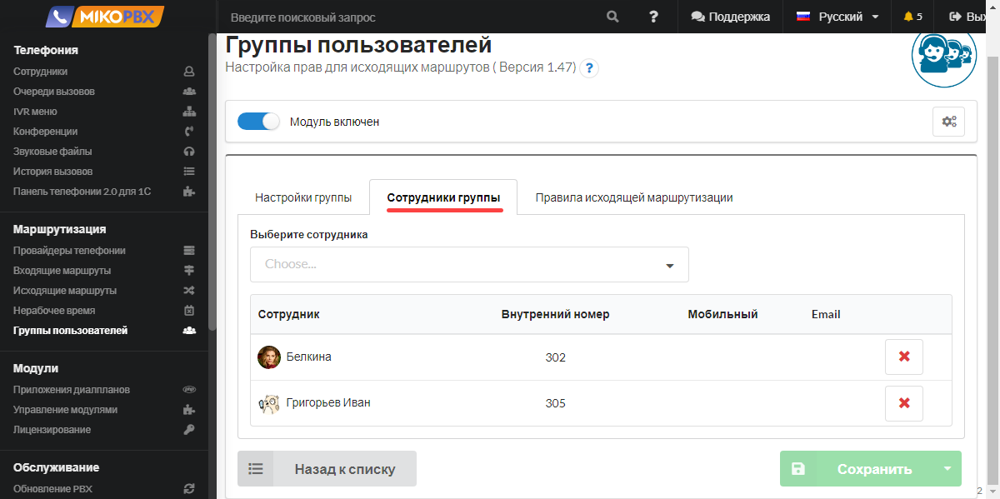

3\. На вкладке **Правила исходящей маршрутизации** отключите все маршруты.

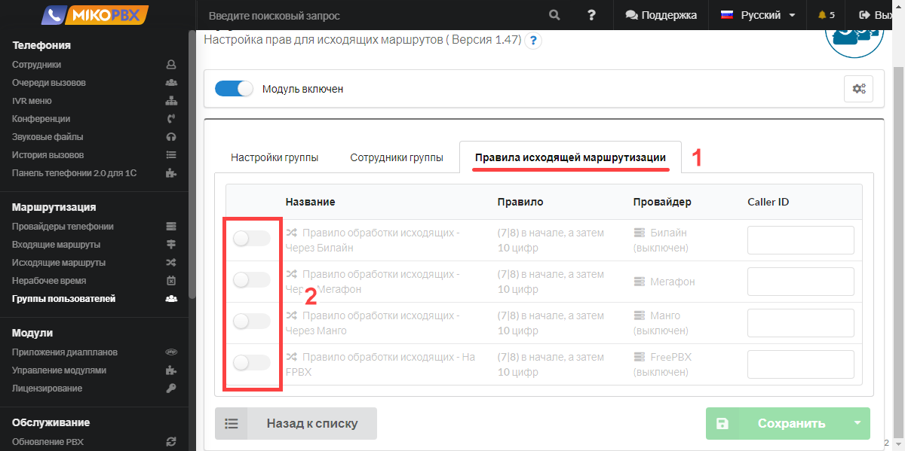

### Запретить сотруднику международные направления 

Настройка выполняется аналогично примеру [Разрешить сотруднику только внутренние вызовы](module-users-groups.md#razreshit_sotrudniku_tolko_vnutrennie_vyzovy) с тем лишь отличием, что следует запретить только международные маршруты.

### Персональный маршрут для каждого сотрудника 

Для каждого сотрудника создайте отдельную группу. Укажите разрешенный маршрут.

### Свой caller id для каждого маршрута 

На вкладке **Правила исходящей маршрутизации** укажите CallerID для каждого маршрута.

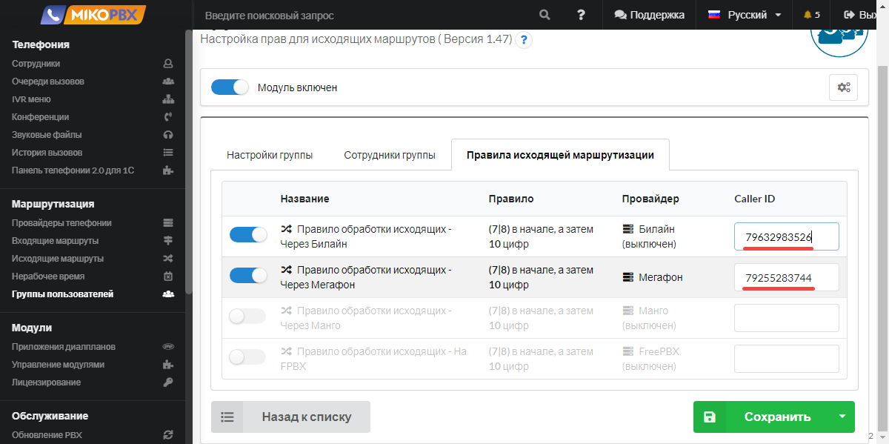


Не каждый провайдер позволяет подменить CallerID. Обычно позволяют использовать только тот номер, который принадлежит организации. Допускается следующий формат CallerID `ИМЯ <ИДЕНТИФИКАТОР>:` примеры:

* 74952293045 \<admin>
* 74952293045
* 74952293045 <74952293045>

Следует уточнить у поставщика услуг связи, какой формат заголовка `FROM` (поле `user`) поддерживается.




Если необходимо использовать этот функционал, то в настройках провайдера потребуется **отключить** использование поля **`fromuser`**. Эта настройка также влияет на заголовок `FROM` и имеет более высокий приоритет.&#x20;


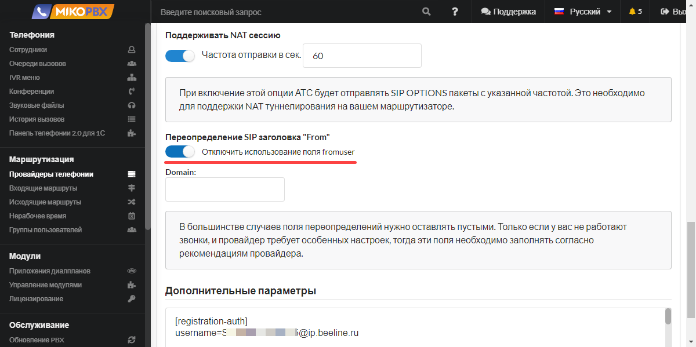

## Изоляция группы 

### Изолировать функцию перехвата (Pickup)

<figure><figcaption></figcaption></figure>

Подробнее о настройке функции перехвата можно почитать в [документации](https://docs.mikopbx.com/mikopbx/manual/system/general-settings#perevody_vyzovov).&#x20;

Кобинация для перехвата звонка по умолчанию `*8` или `*8номерТелефона`

При включении функции изоляции перехват вызова будет доступен только в рамках группы. Состав группы описан на вкладке "Сотрудники группы".&#x20;

### Изолировать группу сотрудников

Функция позволяет изолировать группу сотрудников на АТС:

1. Сотрудники группы смогут звонить только на номера своей группы
2. Сотрудники из других групп, не смогут позвонить на изолированную группу
3. Перехват вызова (pickup) будет доступен только в рамках группы

<figure>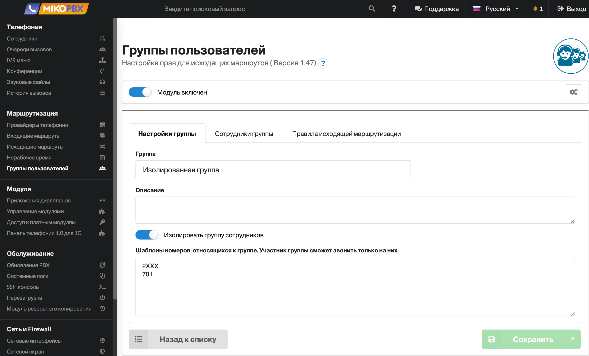<figcaption></figcaption></figure>

**Шаблоны номеров, относящихся к группе. Участник группы сможет звонить только на них**

1. В шаблонах допускается использовать символ от 1 до 9 и символ X (любая цифра 1-9)
2. Участник группы сможет набрать Все номера, удовлетворяющие шаблону

Примеры шаблонов:

* **2XX** - номера с 200 по 299
* **200001** - явно указанный внутренни номер, к примеру номер очереди
* **7XXXXXXXXXX** - 11ти значные номера РФ
