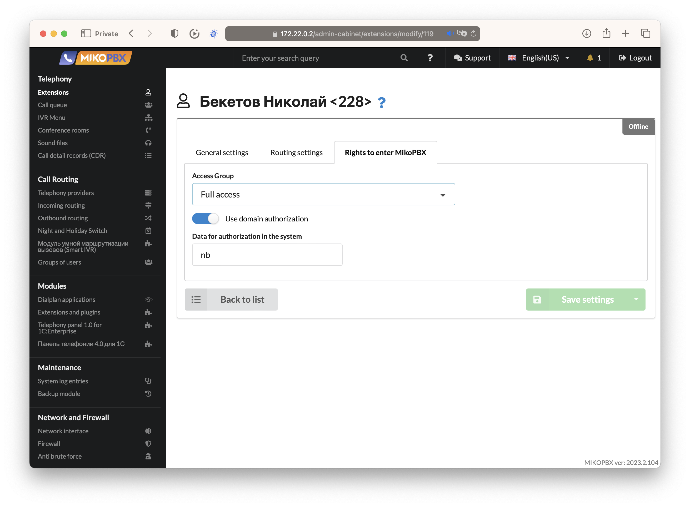
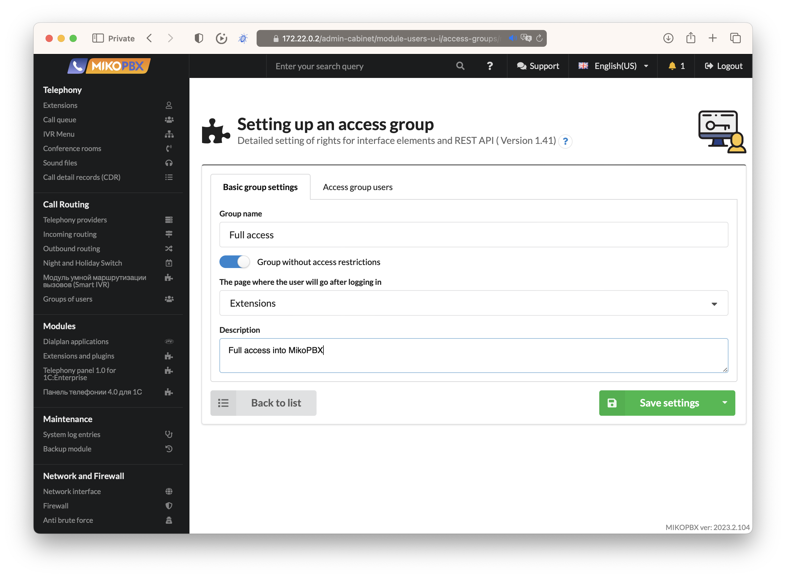
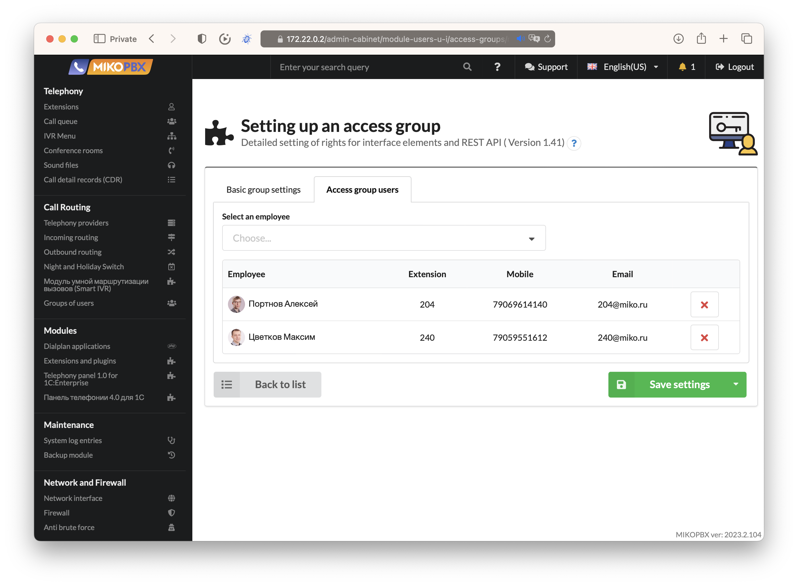
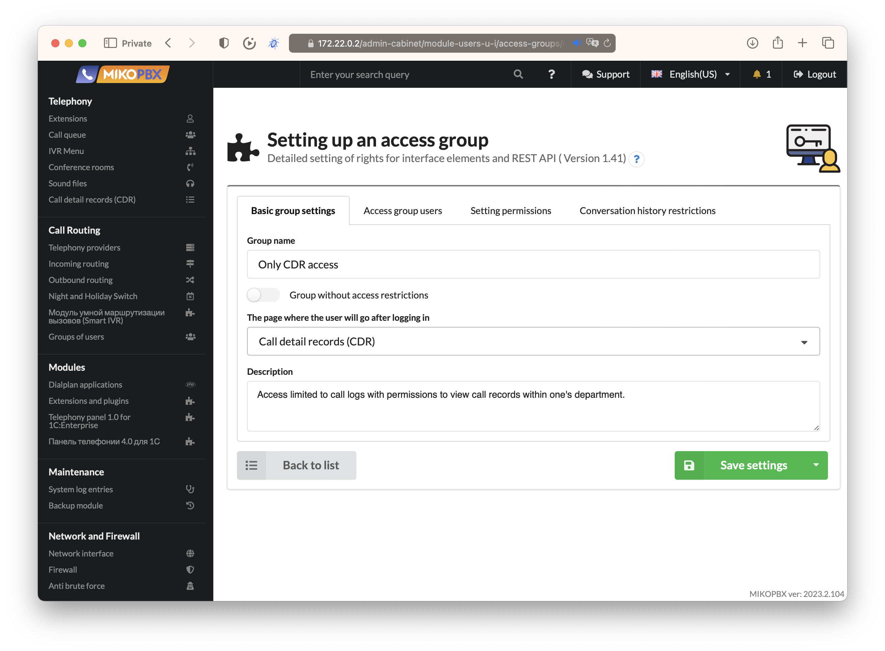
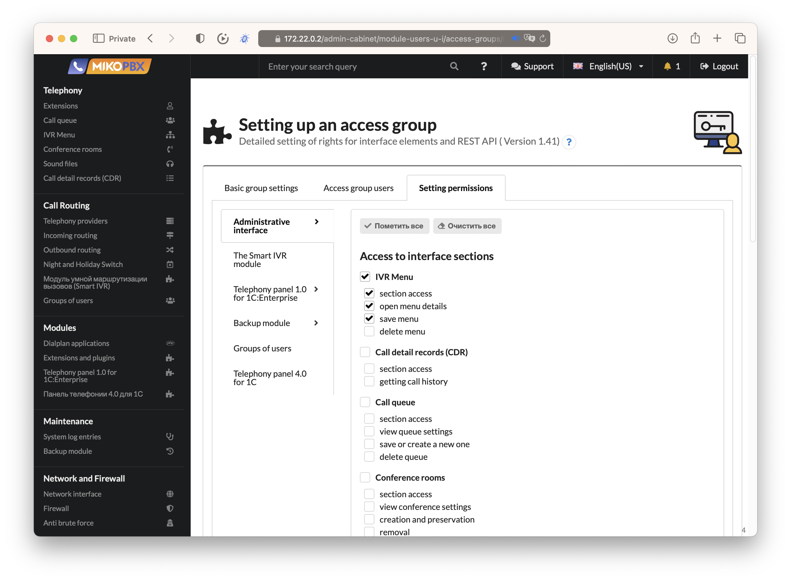
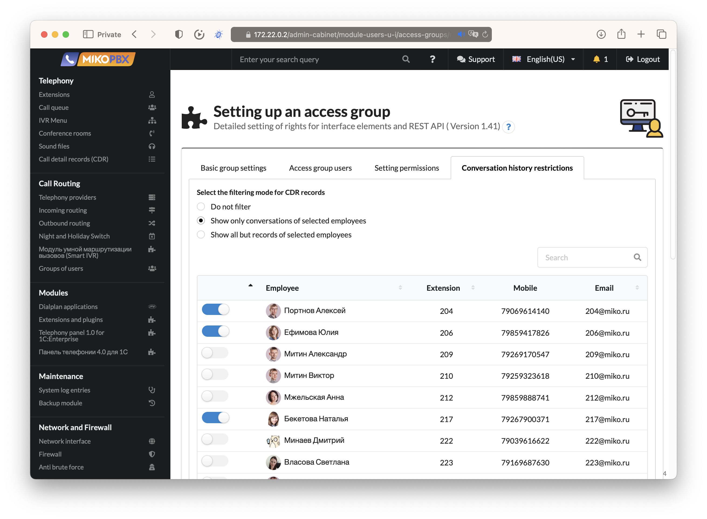
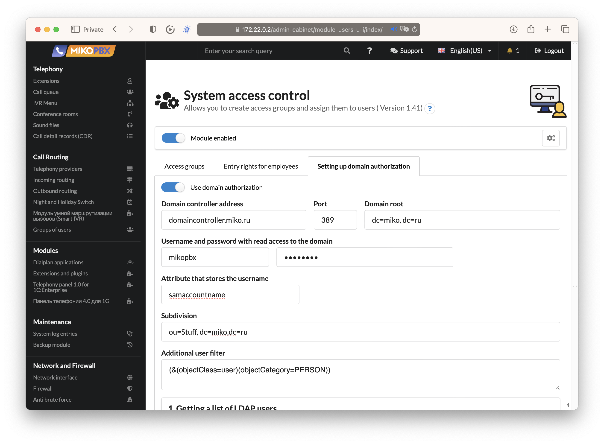
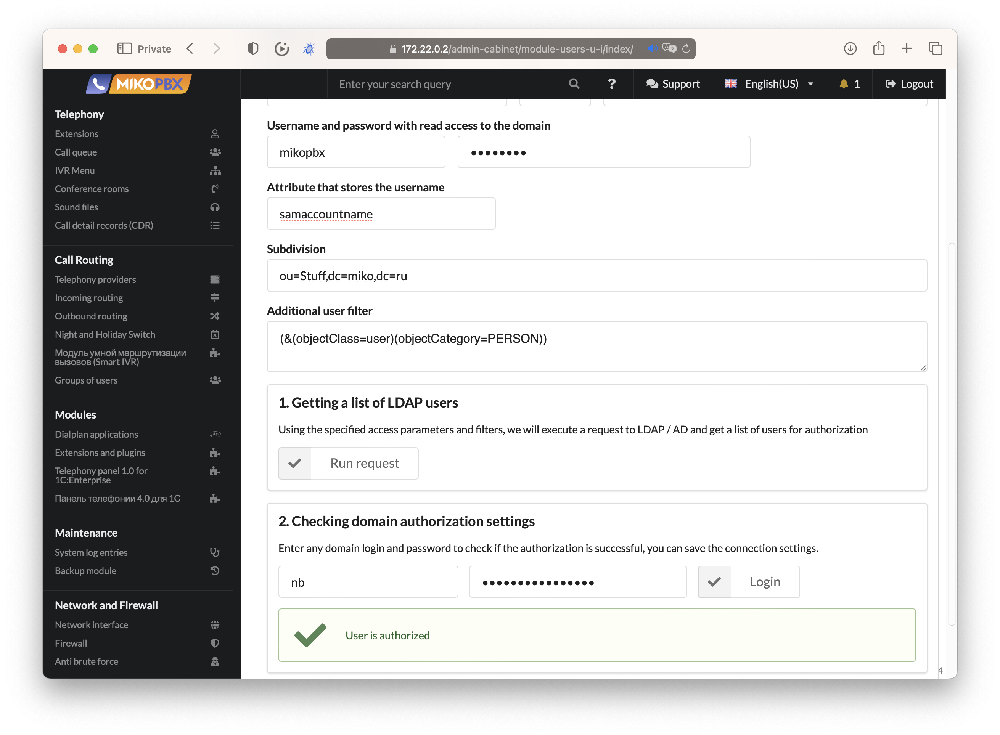

# Access control management

<figure><figcaption>
The module page for configuring access groups
</figcaption></figure>

Additionally, the module allows for authentication in MikoPBX using external LDAP/AD services or simply assigning a login and password to each employee.

<figure><figcaption>
Assignment of access groups and authentication credentials
</figcaption></figure>

The module also adds a new tab to the employee settings page, allowing for quick assignment of access groups or password changes directly from their profile card.

<figure><figcaption>
An additional tab in the employee profile card with access group configuration settings
</figcaption></figure>

Let's consider a few common scenarios for MikoPBX access control:

### Scenario 1: Access for Multiple Administrators

1. Create an access group and enable the **Group without access restrictions** toggle.
2. Choose the home page that administrators will land on after authentication.

<figure><figcaption>
Setting up the access group for administrators
</figcaption></figure>

Next, navigate to the "Users" tab of the access group and select the employees who will be granted permission to administer the system.

<figure><figcaption>
To select users for the access group
</figcaption></figure>

### Scenario 2: Access Limited to IVR Menu Administration&#x20;

Create an access group with restricted privileges that grants access only to IVR menu administration.

<figure><figcaption>
Access group with IVR menu editing rights
</figcaption></figure>

Next, go to the **Setting permissions** tab and select only the necessary rights to view and modify existing IVR menus.

<figure><figcaption>
Detailed access control settings in MikoPBX
</figcaption></figure>

Assign the access group to employees who will administer the IVR menus and save the access group.

### Scenario 3: Access to Call History with User Filtering&#x20;

Create an access group, disable full privileges, and grant access only to the call history section with user filtering.

<figure><figcaption>
Configure access to call history in MikoPBX
</figcaption></figure>

When selecting this section, an additional tab appears in the module settings, allowing you to configure permissions for viewing and listening to call recordings on a per-employee basis.

<figure><figcaption>
Configuring permissions for listening and viewing call recording history in MikoPBX
</figcaption></figure>

You can select various filtering options and employees whose call recordings can be listened to by users within this access group.

### LDAP Authorization Configuration&#x20;

The module allows users to be authenticated either with a simple login-password pair or by using an external LDAP authentication server. To configure the connection with the server, navigate to the "Domain Authorization Settings" tab.

<figure><figcaption>
Setting up access parameters for the domain controller
</figcaption></figure>

Please provide the access parameters to your domain. If necessary, specify the parameters for the organizational unit and the filter for user accounts. Before saving, you can perform a connection data check and retrieve a list of users from the server.

<figure><figcaption>
Testing the connection with the domain controller
</figcaption></figure>

At the end, you can enter user credentials to test the authorization and save the module settings.
