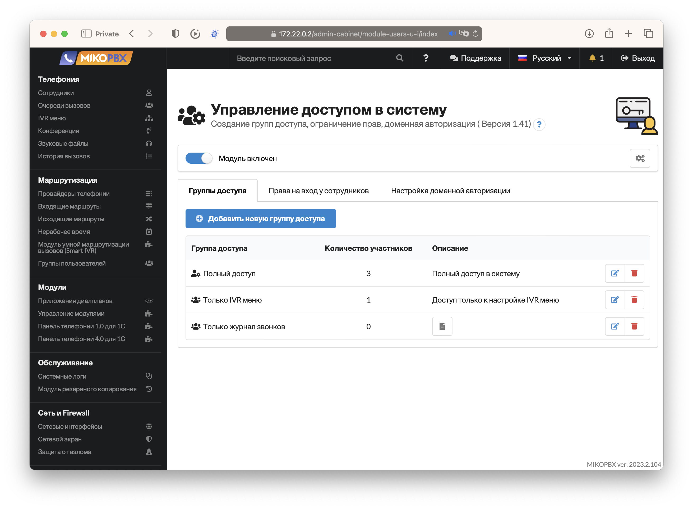
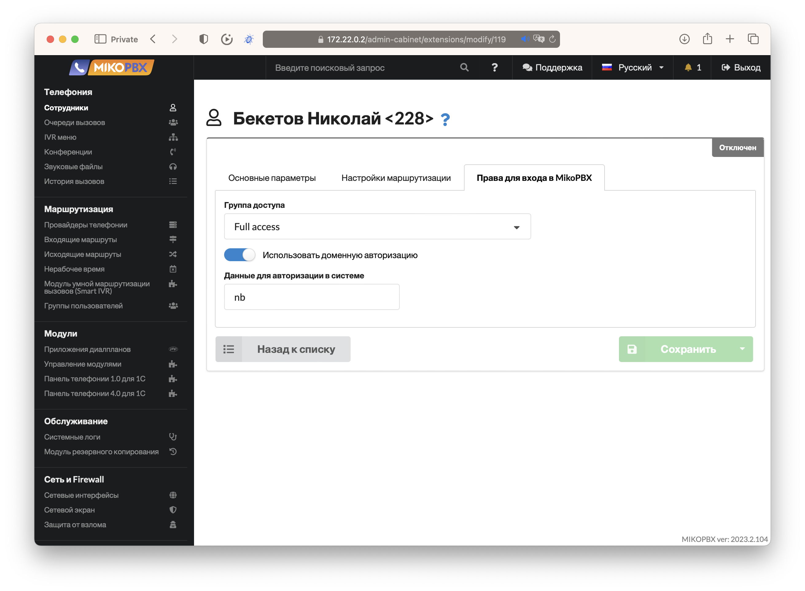
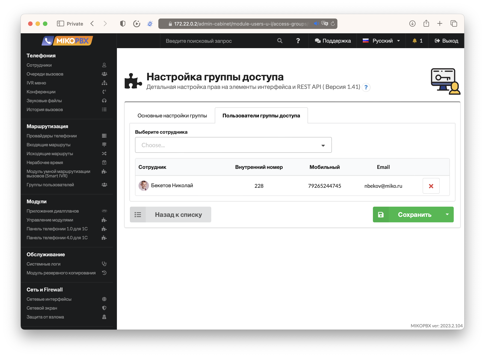
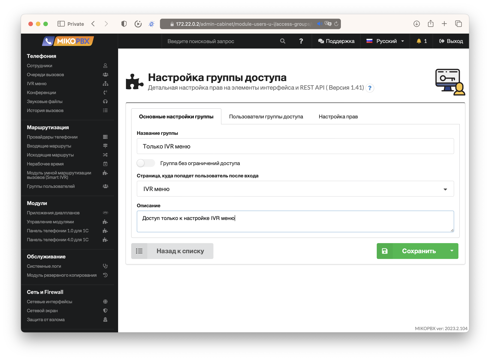
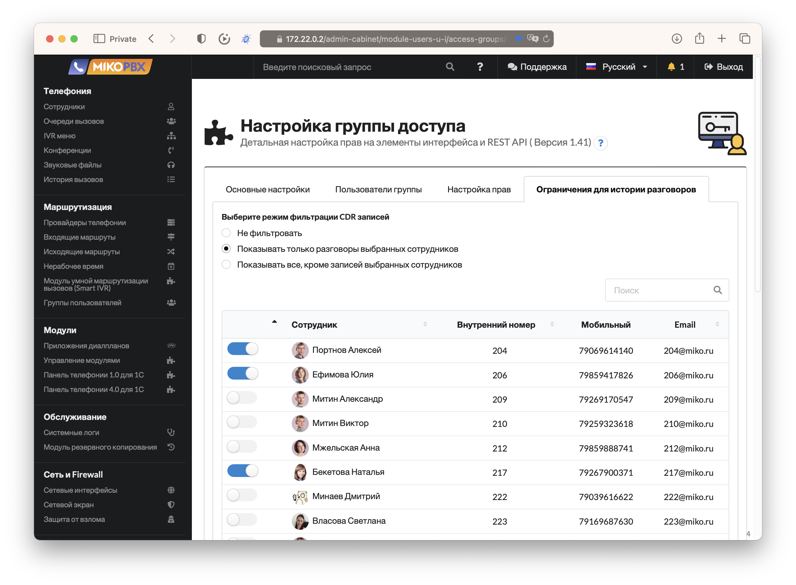
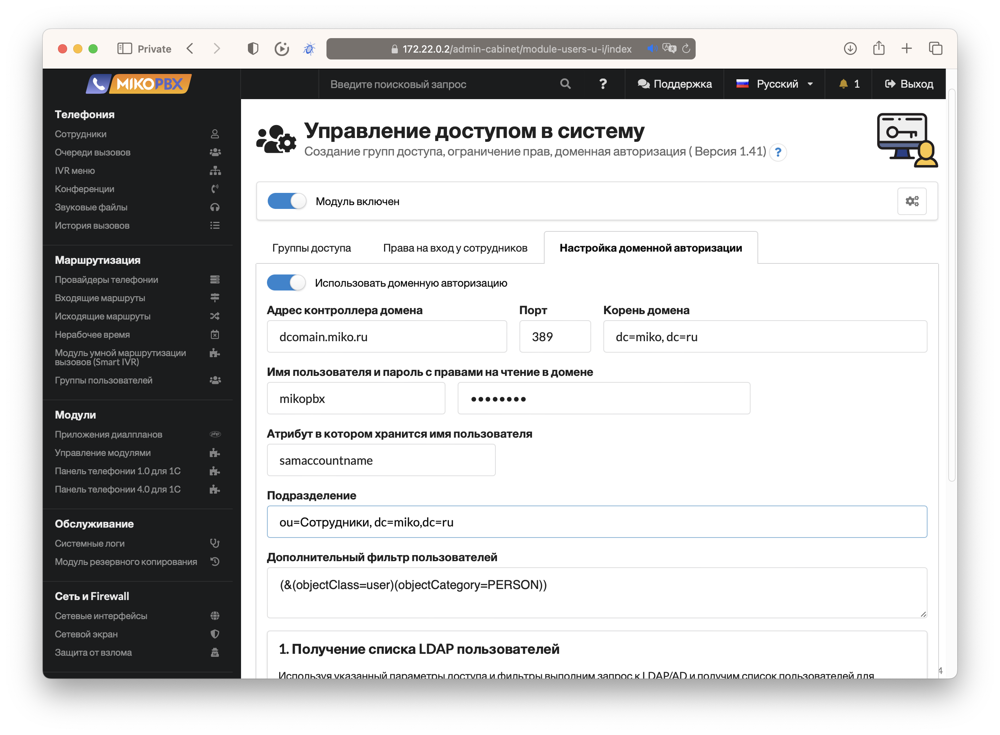
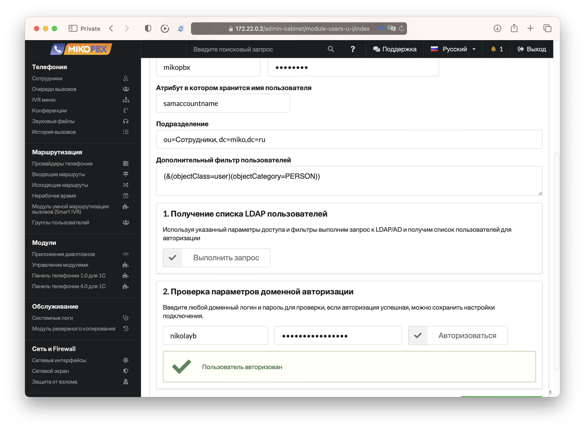

# Управление доступом в систему

<figure><figcaption>
Страница модуля с настройкой групп доступа
</figcaption></figure>

Так же модуль позволяет организовать авторизацию в MikoPBX используя внешние сервис LDAP/AD или просто назначить каждому сотруднику логин и проль.

<figure><figcaption>
Назначение групп доступа и данных авторизации
</figcaption></figure>

Так же модуль добавляет новую вкладку на странице настройки сотрудника, что позволяет быстро назначить группу доступа или изменить пароль прямо его карточке.

<figure><figcaption>
Дополнительная вкладка в карточке сотрудника с настройкой группы доступа
</figcaption></figure>

Рассмотрим несколько самых распространенных сценариев.

### Сценарий 1.  Доступ в MikoPBX нескольким администраторам

Создаем группу доступа и включаем переключатель **Группа без ограничений доступа.**

Выбираем домашнюю страницу, на которую будут попадать администраторы после авторизации.

<figure><figcaption>
Настройка группы доступа для администраторов
</figcaption></figure>

Переходим на вкладку **Пользователи группы доступа** и выбираем сотрудников, которым будет разрешено администрировать систему.

<figure><figcaption>
Выбор пользователей для группы доступа
</figcaption></figure>

### Сценарий 2. Доступ только к администрированию IVR меню

Создаем группу доступа, без полных прав.

<figure><figcaption>
Группа доступа с правами на  редактирование IVR меню
</figcaption></figure>

Переходим на вкладку настройка прав и выбираем только необходимые права для открытия и модификации существующих IVR меню.

<figure><figcaption>
Детальная настройка прав доступа в MikoPBX
</figcaption></figure>

Назначаем группу сотрудникам, которые будут администрировать IVR меню и сохраняем группу доступа.

### Сценарий 3. Доступ к истории разговоров с фильтром по пользователям

Создаем группу доступа, выключаем полные права и выбираем доступ только к разделу с историей вызовов.

<figure><figcaption>
Настройка доступа к истории звонков в MikoPBX
</figcaption></figure>

При выборе этого раздела, в настройках модуля появляется дополнительная вкладка, которая позволяет настроить права на просмотр и прослушивание записей разговоров в разрезе сотрудников.

<figure><figcaption>
Настройка прав на прослушивание и просмотр истории записей в MikoPBX
</figcaption></figure>

Можно выбрать разные варианты фильтрации и сотрудников, чьи записи можно будет прослушивать пользователям этой группы доступа.

### Настройка LDAP авторизации

Модуль позводляет авторизовать пользователей как простой парой логин и пароль, так и с помощью внешнего сервера авторизации LDAP.

Для настройки связи с сервером, перейдите на вкладку **Настройка доменной авторизации.**

<figure><figcaption>
Настройка параметров доступа к контроллеру домена
</figcaption></figure>

Укажите параметры доступа к вашему домену, при необходимости укажите парамтеры подразделения и фильтра к учетным записям пользователей. \
Перед сохранением можно выполнить проверку данных подключения и получить список пользователей с сервера.

<figure><figcaption>
Проверка связи с контроллером домена
</figcaption></figure>

В конце можно ввести учетные данные пользователя для проверки авторизации и сохранить настройки модуля.
