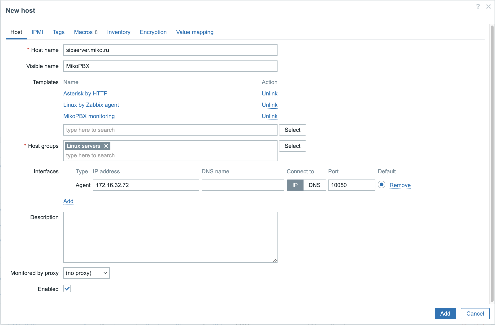
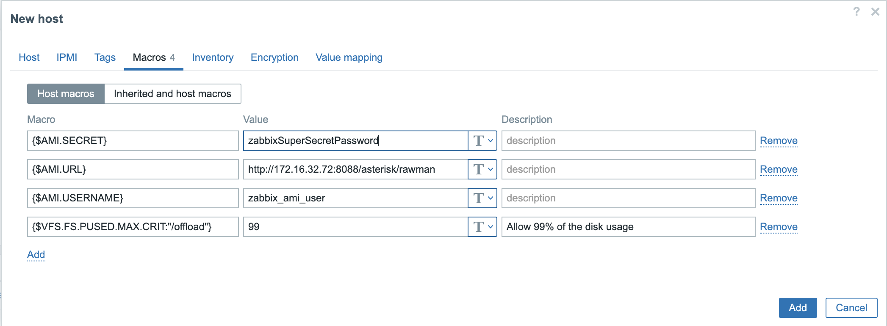

# Zabbix агент

Zabbix агент предназначен для мониторинга производительности и наличия сетевых устройств, серверов, виртуальных машин и приложений. Агент собирает различные метрики, включая использование CPU, объем занятой оперативной памяти, состояние жестких дисков, сетевую активность и множество других параметров. Эти данные отправляются на сервер Zabbix, который анализирует полученную информацию, позволяя администраторам своевременно обнаруживать возможные проблемы и отклонения в работе мониторинга систем. Установка агента Zabbix предусматривает гибкую настройку и поддерживает работу на множестве операционных систем, обеспечивая широкие возможности для комплексного мониторинга в разнообразных IT.

В MikoPBX реализован модуль, который позволяет установить и настроить работу Zabbix агента, а также получить доступ к специализированным метрикам телефонии.

<figure><figcaption></figcaption></figure>

После установки модуля необходимо внести необходимые правки в конфигурационный модуль агента, который доступен в форме модуля. Обычно достаточно указать адрес сервера Zabbix и порт, на котором агент будет принимать входящие запросы от сервера.

После этого необходимо в настройках Firewall указать подсеть в которой находится Zabbix сервер, или лучше создать отдельную подсеть с адресом Zabbix сервера и разрешить для этой подсети подключения к агенту.

<figure><figcaption></figcaption></figure>

Помимо разрешения основного порта для мониторинга системы, необходимо добавить доступ к AMI и AJAM интерфейсу, а также доступ к ICMP протоколу.

После этих настроек небходимо создать служебного AMI пользователя с правами **system** и **command** и разрешить доступ только для подсети Zabbix агента.

<figure><figcaption></figcaption></figure>

После этого можно переходить к настройке хоста на сервере Zabbix.

Скачиваем и импортируем стандартный шаблон мониторинга Asterisk  - [ссылка](https://git.zabbix.com/projects/ZBX/repos/zabbix/browse/templates/tel/asterisk\_http?at=release/6.4).

Дополнительно скачиваем и импортируем шаблон MikoPBX - [ссылка](https://github.com/mikopbx/ModuleZabbixAgent5/blob/develop/bin/zbx\_export\_templates.yaml).

На стороне Zabbix сервера создаем хост и привязываем его у имортированным ранее шаблонам.

<figure><figcaption></figcaption></figure>

Прописываем IP адрес MikoPBX, логин и проль AMI пользователя и адрес подключения к AJAM интерфейсу.

<figure><figcaption></figcaption></figure>

Через некоторое время после сохранения параметров, проверяем соединение и набор данных которые можно получать с сервера.


Если вы хорошо разбираетесь в  Zabbix, и можете что-то улучшить в этом модуле, напишите в наш телеграмм канал для разработчиков @mikopbx\_dev

