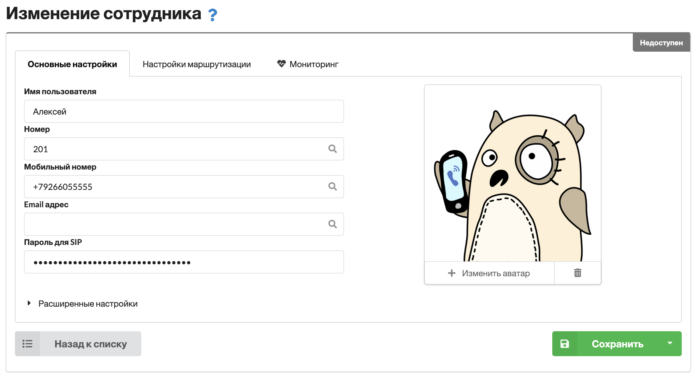
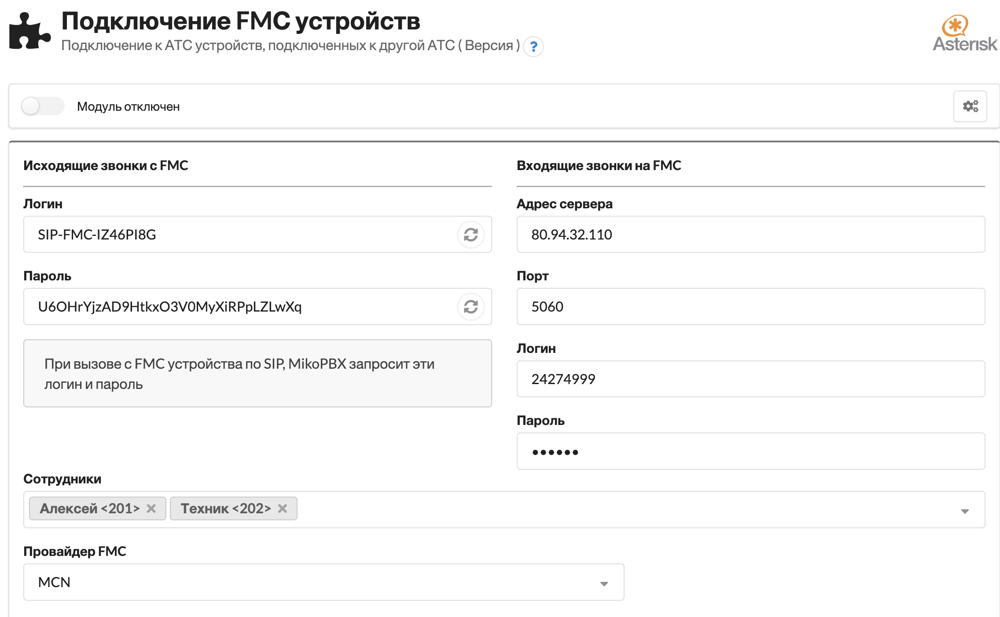

# Подключение FMС устройств

Модуль распоространяется на платной основе. На текущий момент работает с [MCN](https://www.mcn.ru/resheniya/mobilnyye-sotrudniki-fmc/) - провайдером **FMC SIM** карт.&#x20;

### Преимущества технологии FMC

* Использование GSM для звонков, даже при отсутствии интернета сотрудник всегда на связи
* Запись всех разговоров на вашей АТС
* Возможность интеграции с CRM системами
* Возможно направить входящий вызов на голосовое меню, полностью управлять вызовом средствами АТС

### Принцип работы

Как работает SIP телефон - аппарат регистрируется на MikoPBX на учетной записи сотрудника, по до логином (внутренний номер) и паролем.&#x20;

Принцип подключения FMC от MCN в нашем модуле - имитация работы SIP телефона. SIM будет "регистрироваться" на учетной записи АТС, к примеру под внутренним номером `201`

* **`Исходящий вызов`** - при звонке с SIM на АТС вы увидите, что вызов осуществляется с внутреннего номера `201`&#x20;
* **`Входящий вызов`** - если направить вызов на номер `201`, вызов будет направлен на SIM карту

### Настройка модуля

В карточке сотрудника необходимо описать мобильный номер телефона сотрудника через код `+7`

<figure><figcaption></figcaption></figure>


На вкладке "`Настройка маршрутизации`" **отключите** переадресацию на мобильный!


Перейдите в настройки модуля "`Подключение FMС устройств`":

<figure><figcaption></figcaption></figure>

В колонке "`Исходящие звонки`" для "`Логин`" и "`Пароль`" выполните действие "`Обновить`".&#x20;

В колонке "`Входящие звонки`" введите параметры подключения к "**Транку**" от MCN.&#x20;


За транком MCN должнен быть закреплен мобильный FMC номер телефона сотрудника.&#x20;


В поле "`Сотрудники`" заполните всех, кто будет использовать FMC SIM карты.&#x20;

В поле "`Провайдер FMC`" укажите `MCN`.&#x20;

После сохранения настроек:

* АТС выполнит регистрацию на транке MCN
* АТС выполнить регистрацию на внутренних номерах сотрудников

### Кастомизация

По умолчанию исходящие с SIM карты будут выполняться по описанным на АТС исходящим маршрутам.&#x20;

Если необходимо,  звонки выполнялись от имени номера SIM карты, то в разделе "`Кастомизация системных файлов`" можно добавить в конец файла `extensions.conf`

```
[outgoing-custom];
exten => _.X!,1,Set(FMC_ID=SIP-FMC-IZ46PI8G)
    ; Номер SIM будет подставлен только для exten, описанных в SIP-FMC-ENABLE-OUT
    same => n,ExecIf($["${DIALPLAN_EXISTS(SIP-FMC-ENABLE-OUT,${CALLERID(num)},1)}" != "1"]?return)
    ; Номер SIM будет подставлен только если вызов выполняется с SIM карты
    ;same => n,ExecIf($["${PJSIP_HEADER(read,User-Agent)}" != "miko-b24-fmc" ]?return)    
    same => n,GosubIf($["${DIALPLAN_EXISTS(all-outgoing-${FMC_ID}-custom,${EXTEN},1)}" == "1"]?all-outgoing-${FMC_ID}-custom,${EXTEN},1)
    same => n,return
    
[SIP-FMC-ENABLE-OUT]
exten => 201,1,NoOp(--- Out call ---)
exten => 202,1,NoOp(--- Out call ---)
```


В данном примере "`SIP-FMC-IZ46PI8G`" - это логин из колонки "**Исходящие звонки с FMC**".&#x20;


### Особенности транка MCN

"Транк" от MCN по умолчанию ограничен одним одновременным звонком. Лучше сразу увеличить этот лимит.&#x20;

Примеры:

Вызов поступает на АТС, его необходимо адресовать на SIM карту.&#x20;

* Одна линия на входящих вызов с номера клиента 74952293042 на MikoPBX
* Одна линия на исходящий вызов с MikoPBX на номер SIM карты

Исходящий вызов с SIM карты через иного провайдера

* Одна линия на вызов с SIM карты, вызов до клиента пойдет через стороннего поставщика услуг связи

Исходящий вызов с SIM карты, клиент увидит номер SIM

* Одна линия на вызов с SIM карты (входящий на MIkoPBX)
* Одна линия через транк MCN для исходящего звонка на номер клиента

Входящий вызов на номер SIM карты, распредяляем на 3 SIM карты MCN

* Одна линия на входящих вызов с номера клиента 74952293042 на MikoPBX
* Три линии на исходящий вызов с MikoPBX на номера SIM карт
