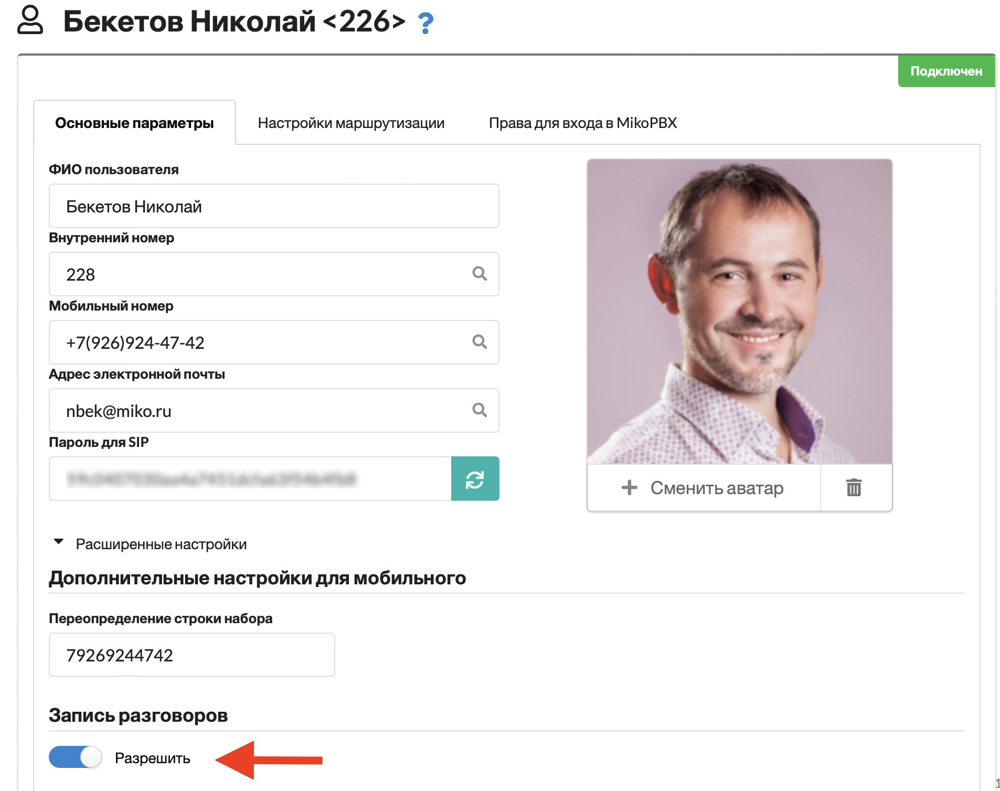
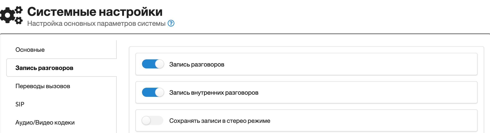
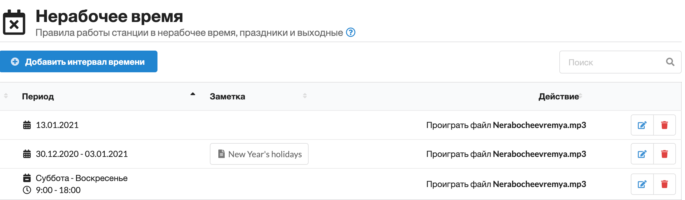
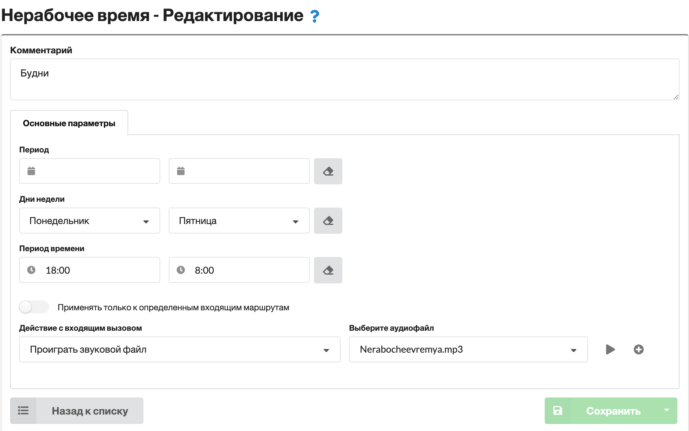
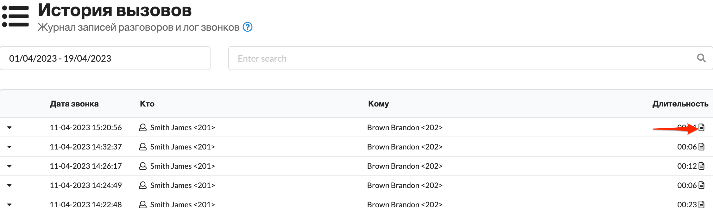
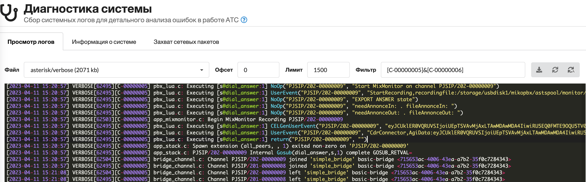

# MikoPBX 2023.1.223

### **Механизм обновления АТС**

Принципиально переработали подход к обновлению через **img** файл. Такой вариант обновления срабатывал в случае:

* Обновление **online**
* Обновление с использованием локального файла **img**

Ранее обновление выполнялось по следующему алгоритму:

1. Загрузка файла img на АТС
2. Завершение активных процессов
3. **Отключение дисков (umount)**
4. Запись файла обновления на диск (dd)

Часто проблемы возникали на **3**ем этапе. Система отказывалась отключать диск, даже если уже не использовала его ресурсы. В итоге, возникали проблемы, данные могли быть потеряны.

**В релизе 2022.3.15** был добавлен механизм предварительного "снэпшота" системных разделов, что позволяло восстановить систему из резервной копии.

**В релизе 2023.1.223** мы изменили алгоритм:

1. Загрузка файла img на АТС
2. Перезагрузка АТС
3. Снэпшот системного диска
4. Запись файла обновления на диск (ДО подключения дисков)

Кроме того, мы реализовали механизм сохранения резервной копии базы данных настроек АТС на **storage** диск. При модификации настроек будет создаваться резервная копия базы данных по пути: `/storage/usbdisk1/mikopbx/backup/db`

в каталоге будут храниться последние 5 версий:

```
── db
    ├── 2023-04-13_h14_m30_s00_mikopbx.db.gz
    ├── 2023-04-13_h16_m15_s01_mikopbx.db.gz
    ├── 2023-04-17_h13_m15_s00_mikopbx.db.gz
    ├── 2023-04-17_h13_m30_s01_mikopbx.db.gz
    └── 2023-04-17_h15_m25_s00_mikopbx.db.gz
```

Это должно повысить отказоустойчивость, и расширить возможности восстановления системы при возникновении сбоев.

### **Firewall**

Повысили версию **fail2ban** до **1.0.2**.

Переработали механизм блокирования IP адресов.

**В ранних релизах**, если обнаружены попытки подбора паролей, то доступ с IP адреса блокировался ко всем портам АТС.

**В релизе 2023.1.223** механизм был переработан. Если подбор паролей происходит к порту 5060, то доступ будет блокироваться только к 5060+диапазон RTP. Доступ к web интерфейсу закрыт не будет.

Это может оказаться полезным, когда АТС находится в облаке. Мы исключаем вариант блокирования доступа к станции при не намеренном вводе не корректного пароля. Останется возможность зайти в web и снять блокировку.

Были переработаны правила `iptables` в использованием `-m multiport`, что позволило сделать более понятными выводе `iptables -L -n`.

### **Кастомизация**

Расширены возможности кастомизации очередей. Пример dialplan очереди:

```clike
exten => 2002,1,NoOp(--- Start Queue ---) 
    same => n,Set(__QUEUE_SRC_CHAN=${CHANNEL})
    same => n,ExecIf($["${CHANNEL(channeltype)}" == "Local"]?Gosub(set_orign_chan,s,1))
    same => n,Set(CHANNEL(hangup_handler_wipe)=hangup_handler,s,1)
    same => n,GosubIf($["${DIALPLAN_EXISTS(queue-pre-dial-custom,${EXTEN},1)}" == "1"]?queue-pre-dial-custom,${EXTEN},1)
    same => n,Answer() 
    same => n,Gosub(queue_start,${EXTEN},1)
    same => n,Queue(QUEUE-D676A,kT${MQ_OPTIONS},,,30,,,queue_agent_answer) 
    same => n,Gosub(queue_end,${EXTEN},1)
```

Теперь есть возможность через кастомизацию системных файлов описать контекст:

```clike
[queue-pre-dial-custom]
exten => 2002,1,NoOp() 
same => n,retutn
```

В этом контексте можно выполнить произвольные действия перед тем, как вызов будет направлен на очередь. Воспроизведите медиа файл, установите дополнительные переменные канала, отправьте email ответственному.

### **Запись разговоров**

Исправлен ряд ошибок записи и возобновления записи разговоров.

Теперь в карточке сотрудника есть возможность запретить запись разговоров:&#x20;

<figure><figcaption><p>Новое в версии 2023.1.223, запись разговоров сотрудника</p></figcaption></figure>

Все диалоги, в которых будут участвовать внутренний и мобильный номера сотрудника записаны НЕ будут. Это может быть полезно для Директора и прочих руководителей компании.

Появилась возможность отключить запись всех внутренних разговоров. Для этого следует отключить флаг в разделе "**Система**" - "**Общие настройки**" - "**Запись разговоров**" - "**Запись внутренних разговоров**"&#x20;

<figure><figcaption><p>Новое в версии 2023.1.223, опция отключающая запись разговоров для внутренних</p></figcaption></figure>

### **Нерабочее время**

Новый интерфейс отображения списка нерабочего времени:  Он стал более информативным и компактным.

<figure><figcaption><p>Новое в версии 2023.1.223, обновлен интерфейс нерабочего времени</p></figcaption></figure>

Ранее, чтобы описать нерабочее время с 18:00 по 8:00 было необходимо создать два правила 00:00 - 08:00 и 18:00 - 23:59. Теперь возможно указать одно правило **18:00 - 08:00**: &#x20;

<figure><figcaption><p>Новое в версии 2023.1.223, упрощеное правило нерабочего времени <strong>18:00 - 08:00</strong></p></figcaption></figure>

Это позволит сократить количество правил и навести порядок.

Нас часто просили предоставить возможность настроить разное расписание работы для разных отделов компании. Теперь это стало возможно.

В карточке правила нерабочего времени появилась опция "**Применять только к определенным входящим маршрутам**". Теперь правило можно привязать к конкретным входящим маршрутам. Именно эта опция позволит создавать более гибкие правила, которые будут действовать на конкретных подразделения компании.

Пример:&#x20;

<figure><figcaption><p>Новое в версии 2023.1.223, применять нерабочее время только к определенным маршрутам</p></figcaption></figure>

В данном примере правило будет действовать только для одного номера компании.

### **Анализ проблем со звонками**

В журнал истории звонка добавлена кнопка перехода к логу звонка: &#x20;

<figure><figcaption><p>Новое в версии 2023.1.223, прееход к логам звонка</p></figcaption></figure>

Такой лог можно передать в техническую поддержку для анализа поведения АТС.

Расширены возможности отбора в журнале лога: &#x20;

<figure><figcaption><p>Новое в версии 2023.1.223, отбор логов звонка для анализа</p></figcaption></figure>

Можно ввести несколько подстрок, разделенных символом &, в итоге будет выведен лог, содержащий все перечисленные подстроки.

В сборку asterisk добавлены модули для подключения к [Homer](https://github.com/sipcapture/homer). Модули можно настроить через кастомизацию системных файлов.

### **Docker**

Проведена большая работа над ошибками. Считаю эту версию стабильной. Проверено из под **Ubuntu, Debian**, тут основное требование - **Linux 5** версии.

**Новые инструкции**

* [Настройка Jitter](https://wiki.mikopbx.ru/faq)
* [Мониторинг провайдеров на MikoPBX](https://wiki.mikopbx.ru/faq:monitoring-trunks)
* [Объединение MIKOPBX и FreePBX (PJSIP)](https://wiki.mikopbx.ru/faq:mikopbx\_freepbx)
* [Настройка Grandstream HT503](https://wiki.mikopbx.ru/faq:grandstreamht503)
* [Настройка шлюза GOIP](https://wiki.mikopbx.ru/faq:goip)
* [Инструкции по подключению почтового клиента](https://wiki.mikopbx.ru/mail-settings)
* [Маршрутизация по DID номеру](https://wiki.mikopbx.ru/faq:did-routs)
* [Уведомление в телеграмм о пропущенных](https://wiki.mikopbx.ru/faq:simple\_tg\_notify)

### **Заключение**

Перечислены лишь наиболее важные изменения. Полный список можно найти в [описании релиза](https://github.com/mikopbx/Core/releases/tag/2023.1.223).

Мы стараемся сделать MikoPBX стабильной, простой, понятной в настройке и сопровождении. Надеемся, что она станет надежным инструментом в вашей компании.
