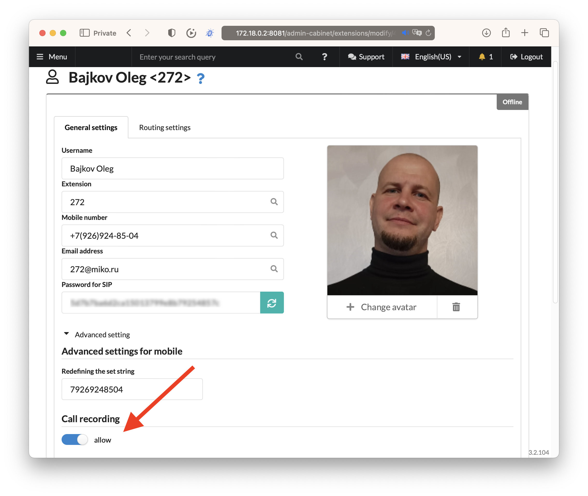
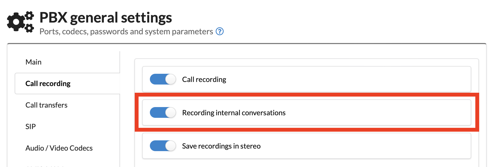
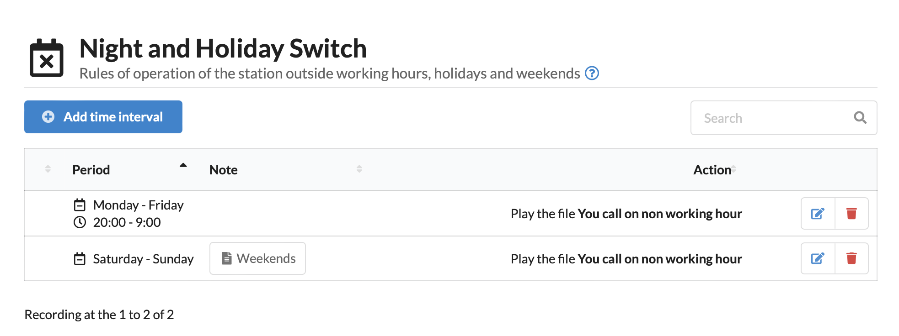
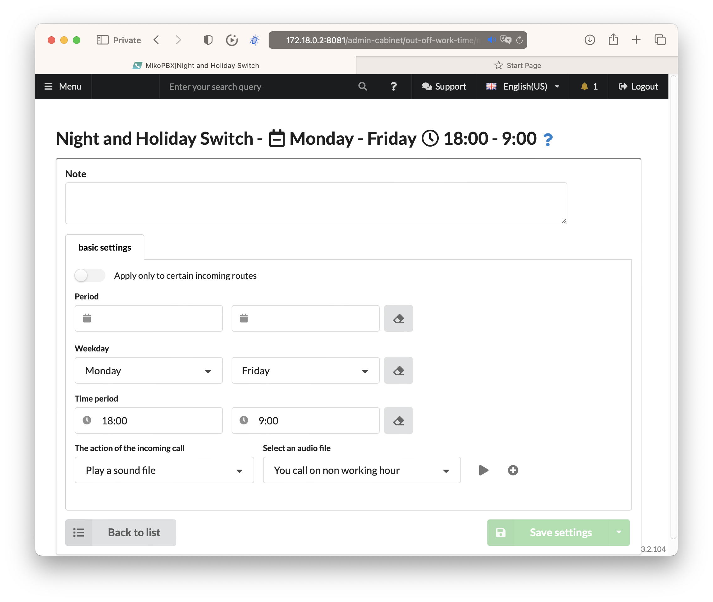
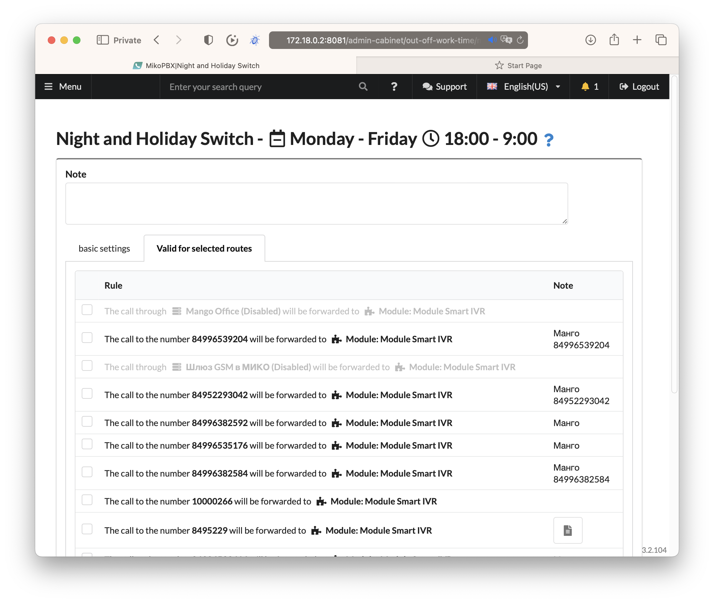
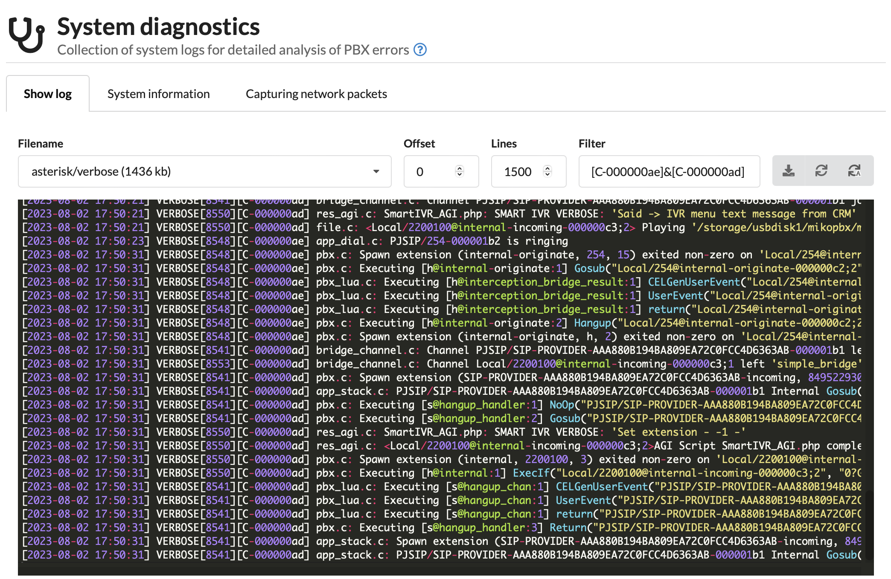

# MikoPBX 2023.1.223

### **PBX Update Mechanism**

We have fundamentally redesigned the approach to updating through the **img** file. This update method was triggered in the following cases:

* Online update
* Update using a local **img** file

Previously, the update was performed according to the following algorithm:

1. Uploading the img file to the PBX
2. Termination of active processes
3. **Unmounting the disks**
4. Writing the update file to the disk (dd)

Often, issues arose during the **3rd** step. The system refused to unmount the disk, even if it was no longer utilizing its resources. As a result, problems occurred, and data could be lost.

In **release 2022.3.15**, a mechanism for creating a preliminary "snapshot" of the system partitions was added, allowing the system to be restored from a backup.

In **release 2023.1.223**, we changed the algorithm as follows:

1. Uploading the img file to the PBX
2. Restarting the PBX
3. Snapshot of the system disk
4. Writing the update file to the disk (BEFORE connecting the disks)

In addition, we implemented a mechanism to save a backup copy of the PBX's settings database to the **storage** disk. When modifications to the settings are made, a backup of the database will be created in the following path: `/storage/usbdisk1/mikopbx/backup/db`

The directory will store the last 5 versions:

```
── db
    ├── 2023-04-13_h14_m30_s00_mikopbx.db.gz
    ├── 2023-04-13_h16_m15_s01_mikopbx.db.gz
    ├── 2023-04-17_h13_m15_s00_mikopbx.db.gz
    ├── 2023-04-17_h13_m30_s01_mikopbx.db.gz
    └── 2023-04-17_h15_m25_s00_mikopbx.db.gz
```

This should increase fault tolerance and expand the system recovery capabilities in case of failures.

### **Firewall**

We upgraded **fail2ban** to version **1.0.2**.

The mechanism for blocking IP addresses has been reworked.

In earlier releases, if there were password guessing attempts, access from the IP address was blocked to all PBX ports.

In **release 2023.1.223**, the mechanism was reworked. If password guessing occurs on port 5060, access will only be blocked to 5060+RTP range. Access to the web interface will remain open.

This can be useful when the PBX is in the cloud. We avoid blocking access to the station when an incorrect password is unintentionally entered. It will still be possible to access the web interface and remove the block.

The `iptables` rules have been reworked using `-m multiport`, which makes the output of `iptables -L -n` more understandable.

### **Customization**

We have expanded the possibilities of customizing queues. An example of a queue dialplan:

```clike
exten => 2002,1,NoOp(--- Start Queue ---) 
    same => n,Set(__QUEUE_SRC_CHAN=${CHANNEL})
    same => n,ExecIf($["${CHANNEL(channeltype)}" == "Local"]?Gosub(set_orign_chan,s,1))
    same => n,Set(CHANNEL(hangup_handler_wipe)=hangup_handler,s,1)
    same => n,GosubIf($["${DIALPLAN_EXISTS(queue-pre-dial-custom,${EXTEN},1)}" == "1"]?queue-pre-dial-custom,${EXTEN},1)
    same => n,Answer() 
    same => n,Gosub(queue_start,${EXTEN},1)
    same => n,Queue(QUEUE-D676A,kT${MQ_OPTIONS},,,30,,,queue_agent_answer) 
    same => n,Gosub(queue_end,${EXTEN},1)
```

Now it is possible to define a context through customization of system files:

```clike
[queue-pre-dial-custom]
exten => 2002,1,NoOp() 
same => n,retutn
```

In this context, you can perform arbitrary actions before the call is directed to the queue. Play a media file, set additional channel variables, send an email to the responsible person.

### **Call Recording**

Several bugs related to call recording and call resumption have been fixed.

Now, in the employee's profile, there is an option to disable call recording:

<figure><figcaption><p>New in MikoPBX 2023.1.223 Call recording option</p></figcaption></figure>

All dialogs involving internal and mobile numbers of the employee will NOT be recorded. This can be useful for directors and other company executives.

An option to disable recording of all internal calls has been added. To do this, you should uncheck the flag in the "**System**" - "**General Settings**" - "**Call Recording**" - "**Record Internal Calls**".

<figure><figcaption><p>New in MikoPBX 2023.1.223 Call internal conversations option</p></figcaption></figure>

### **Non-Working Time**

The new interface for displaying the list of non-working time is more informative and compact:

<figure><figcaption><p>New in MikoPBX 2023.1.223 optomized won working hours</p></figcaption></figure>

Previously, to describe non-working time from 18:00 to 8:00, it was necessary to create two rules: 00:00 - 08:00 and 18:00 - 23:59. Now it is possible to specify a single rule **18:00 - 08:00**:

<figure><figcaption><p>New in MikoPBX 2023.1.223 Now you can have only one rule for overnigt</p></figcaption></figure>

This allows reducing the number of rules and organizing the schedule more efficiently.

We were often asked to provide the ability to configure different working schedules for different company departments. Now it is possible.

In the non-working time rule card, there is an option "**Apply only to specific inbound routes**". Now the rule can be linked to specific inbound routes. This option allows creating more flexible rules that will apply to specific company departments.

Example:

<figure><figcaption><p>New in MikoPBX 2023.1.223 Non working hours, specify routes</p></figcaption></figure>

In this example, the rule will only apply to one company number.

### **Call Analysis**

A button has been added to the call history log to navigate to the call log:

<figure><figcaption><p>New in MikoPBX 2023.1.223 Quick go to logs from CDR</p></figcaption></figure>

Such logs can be passed to technical support for analysis of PBX behavior.

Extended filtering options have been added to the call log:

<figure><figcaption><p>New in MikoPBX 2023.1.223 Filtered logs by one call</p></figcaption></figure>

You can enter several substrings separated by the "&" symbol, and the log containing all listed substrings will be displayed.

Modules for connecting to [Homer](https://github.com/sipcapture/homer) have been added to the Asterisk build. The modules can be configured through customization of system files.

### **Docker**

A lot of work has been done on bug fixing. This version is considered stable. Tested on **Ubuntu, Debian**, with the main requirement being **Linux 5** version.

**New Instructions**

* [Jitter Configuration](https://wiki.mikopbx.ru/faq)
* [Monitoring Providers on MikoPBX](https://wiki.mikopbx.ru/faq:monitoring-trunks)
* [Integration of MIKOPBX and FreePBX (PJSIP)](https://wiki.mikopbx.ru/faq:mikopbx\_freepbx)
* [Grandstream HT503 Configuration](https://wiki.mikopbx.ru/faq:grandstreamht503)
* [GOIP Gateway Configuration](https://wiki.mikopbx.ru/faq:goip)
* [Instructions for Setting up Mail Client](https://wiki.mikopbx.ru/mail-settings)
* [Routing by DID Number](https://wiki.mikopbx.ru/faq:did-routs)
* [Telegram Notification for Missed Calls](https://wiki.mikopbx.ru/faq:simple\_tg\_notify)

### **Conclusion**

Only the most important changes have been listed. The full list can be found in the [release description](https://github.com/mikopbx/Core/releases/tag/2023.1.223).

We strive to make MikoPBX stable, easy to configure, and maintain. We hope it becomes a reliable tool for your company.
