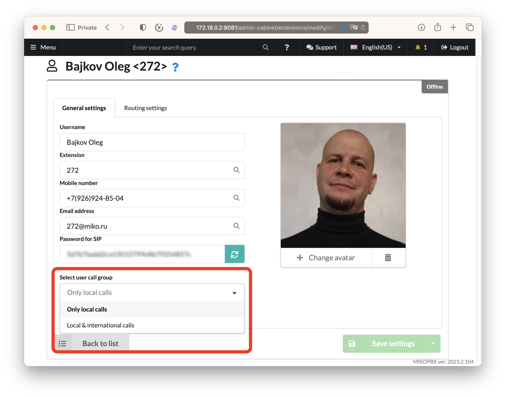
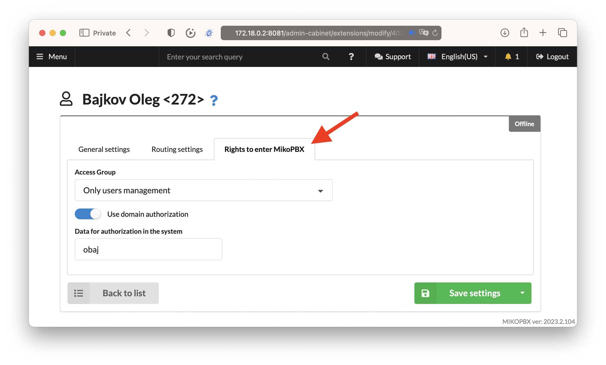
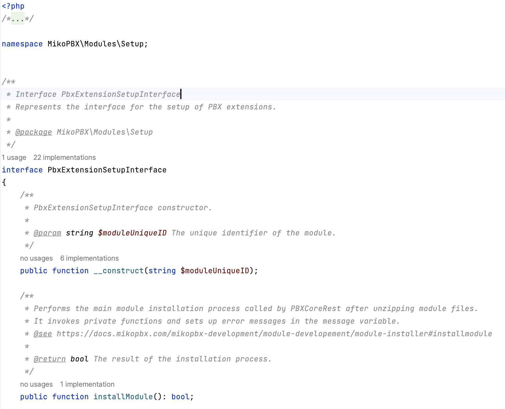
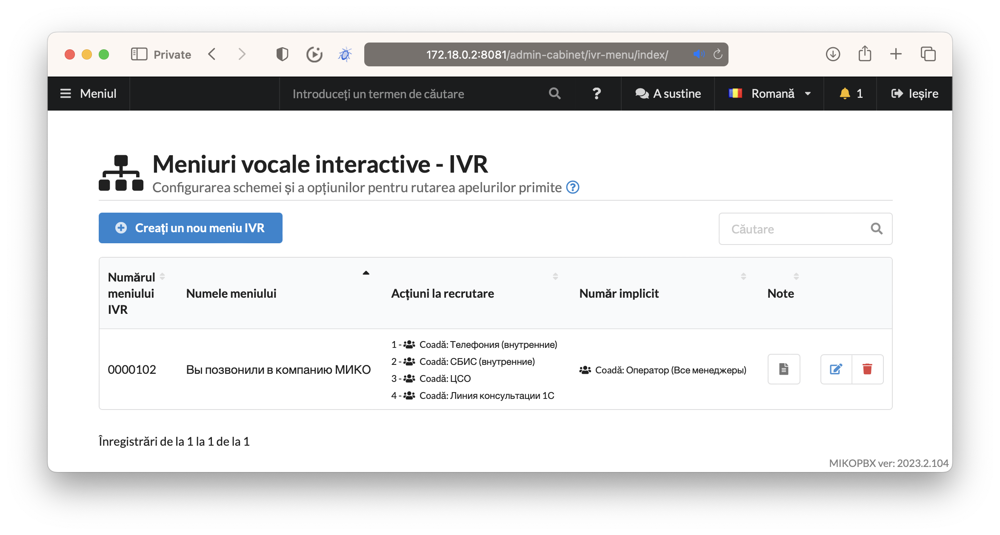

# MikoPBX 2023.2

### Optimization for Small Displays

In the new version of MikoPBX, we've made several interface and form improvements, allowing administrators to manage the server from tablets or even mobile phones. We tested form functionality in various resolutions and made the sidebar menu dynamic. If the screen is small, the menu is hidden, and unnecessary fields in tables are also hidden.

<figure><figcaption>
<em>New in MikoPBX 2023.2: Adaptive forms</em>
</figcaption></figure>

### User Access Management

We made numerous changes to the MikoPBX code to enable user access management to different sections of the system, including hiding or showing form elements, menu items, and buttons. We also added support for multiple authentication methods and external module-based authentication, including domain login and password usage.

<figure><figcaption>
<em>New in MikoPBX 2023.2: Employee access control and multiple authentication</em>
</figcaption></figure>

You can read more about the user access management module in [its documentation](../../modules/miko/module-users-u-i.md).

### Additional Fields and Tabs from Modules

In the new version of MikoPBX, we expanded the API to manage the interface. Now, when you install additional modules, you can modify the web interface of existing forms, add tabs, buttons, and input fields.

For example, with the User Groups module, you can manage groups directly from the employee form.

<figure><figcaption>
<em>New in MikoPBX 2023.2: Additional fields from modules</em>
</figcaption></figure>

You can also manage access rights and authentication data for employees directly from their card.

<figure><figcaption>
<em>New in MikoPBX 2023.2: Additional tabs from modules</em>
</figcaption></figure>

### Code Comment Refactoring

In the MikoPBX source code, we've made significant improvements and changes to ensure that class, method, and function descriptions follow best practices for JS and PHP development. We've organized complex classes separately from simpler ones and restructured some algorithms to work in the background.

<figure><figcaption>
<em>New in MikoPBX 2023.2: Code comments and descriptions for each method and class</em>
</figcaption></figure>

### Enhanced Security

We've introduced background tasks in the system to regularly check the complexity of passwords for SIP, AMI, and system access. Additionally, we've updated the general settings form to prevent "peeking" at previously set passwords.

<figure><figcaption>
<em>New in MikoPBX 2023.2: Automatic detection of weak passwords for SIP, SSH, WEB, and AMI accounts</em>
</figcaption></figure>

### Call Recordings Retention Period

The system settings now allow you to set the retention period for call recordings. You can choose from several standard values or disable the deletion of old recordings. In this case, recordings will be deleted only if the storage space drops below 500 megabytes, and they will be deleted starting from the oldest ones.

<figure><figcaption>
<em>New in MikoPBX 2023.2: Configuring the call recordings retention period</em>
</figcaption></figure>

### Docker Container Optimization

Installing MikoPBX inside a Docker container is one of the installation options. In the new release, we optimized the web interface and console menu, hiding menu items not used in the container installation.&#x20;

We've also improved network settings, allowing you to specify the system's external address, particularly useful for complex network topologies with port forwarding to public addresses on systems deployed within the perimeter and installed inside Docker containers.

<figure><figcaption>
<em>New in MikoPBX 2023.2: Optimized network settings for the docker instalation</em>
</figcaption></figure>

### Customizing System Files with Scripts

In some cases, more complex modifications to system files are required than simply adding text to the end of a configuration file. For instance, you may need to redistribute PJSIP account parameters while retaining the ability to configure the system through the web interface.

We've introduced a new approach to customization, where you can describe a Bash script that will execute each time the system generates a configuration file. This way, integrators can make precise changes to configuration files without developing additional modules.

For example, you can modify the **pjsip.conf** file and change the _max\_contacts_ parameter for all internal numbers, except one.

<figure><figcaption>
<em>New in MikoPBX 2023.2: Modifying pjsip.conf with a script</em>
</figcaption></figure>

Or you can include additional lines of code within the dialplan in the **extensions.conf** file.

<figure><figcaption>
<em>New in MikoPBX 2023.2: Modifying extensions.conf with a script</em>
</figcaption></figure>


This tool adds flexibility to the customization capabilities of the system but may lead to complete system malfunction. We strongly recommend testing customization scripts on a copy of the working system.


You can see the script's result on the file contents tab, after the system completes the generation and script execution. For some files, this process takes 1-2 minutes, while others may require system restart.

### Email Notifications for System Issues

The advice mechanism is now integrated with the notification mechanism. When changing the SSH password or encountering disk issues, the administrator will receive an email with details about the MikoPBX parameters in which the incident occurred. Previously, errors could only be checked after logging into the system, but now notifications are sent automatically.

In the future, additional metrics will be added to this system, including average CPU load, memory usage, issues with IP telephony provider registration, and critical kernel issues.

### Romanian Language Translation

We are gradually expanding the set of basic translations for the web interface. In the new release, we've added the Romanian language.

<figure><figcaption>
<em>New in MikoPBX 2023.2: Interface translation to Romanian</em>
</figcaption></figure>

If you want to help with the translation to Romanian or any other language, you can [follow this link](https://weblate.mikopbx.com/projects/mikopbx/admin-web-interface/).
