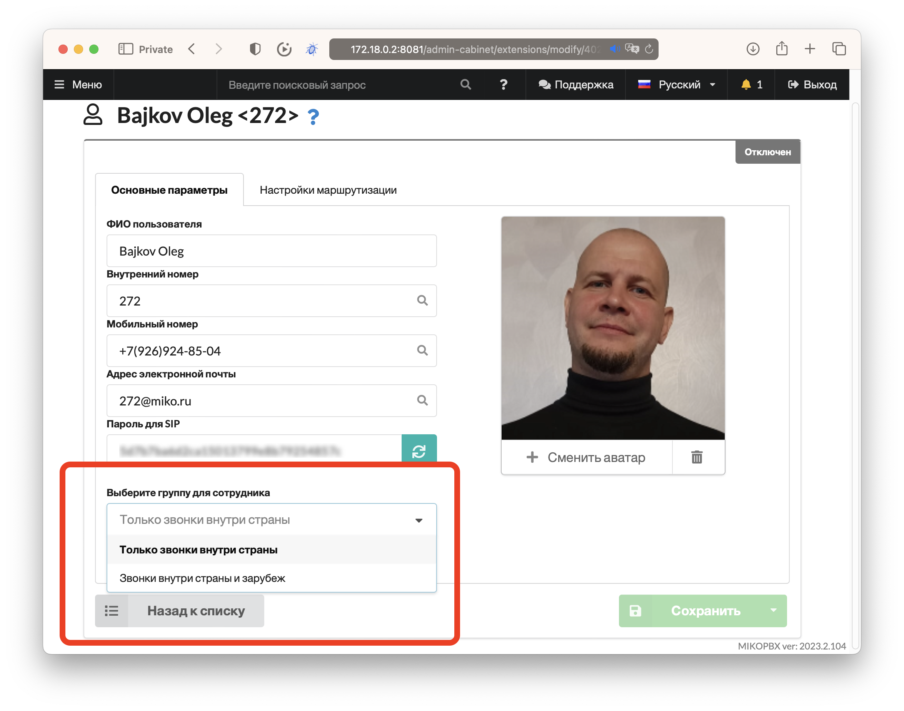
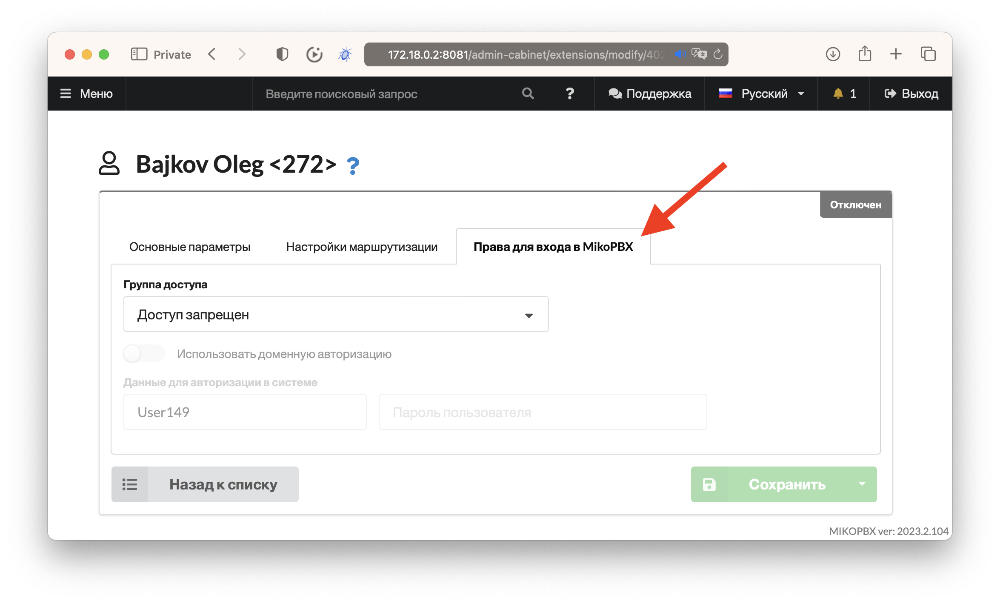

# MikoPBX 2023.2

### Оптимизация под управление с небольших дисплеев

В новой версии MikoPBX мы провели ряд улучшений интерфейса и форм, позволящюих адмнистрировать сервер с таблетов или даже мобильных телефонов.

Для этого проверили работу форм в разных разрешениях, сделали боковое меню динамическим, если экран небольшой, то меню прячется, также скрываются необязательные поля в таблицах.

<figure><figcaption>
Новое в MikoPBX 2023.2 Адаптивные формы
</figcaption></figure>

### Управление доступом пользователей

В коде MikoPBX сделано много изменений для возможности управлять правами доступа к разделам системы, а скрывать и показывать элементы формы, пункты меню, кнопки. Добавлена возможность множественной авторизации и авторизации с помощю внешних модулей, в частности реализован вход в систему с использованием доменного логина и проля.

<figure><figcaption>
Новое в MikoPBX 2023.2 Управление доступом сотрудников и множественная авторизация
</figcaption></figure>

Подробнее про модуль управления доступом можно почитать в [его документации](../../modules/miko/module-users-u-i.md).

### Включение дополнительных полей и вкладок из модулей

В новой версии MikoPBX расширено API для управления интерфейсом, реализована возможность при установке дополнительных модулей менять веб интерефейс существующих форм, добавлять вкладки, кнопки, поля ввода.&#x20;

Например для модуля группы пользователей реализована возможность управлять группой прямо из формы сотрудника.

<figure><figcaption>
Новое в MikoPBX 2023.2, дополнительные поля из модулей
</figcaption></figure>

Или управлять правами доступа и данными авторизации сотрудника прямо из его карточки.

<figure><figcaption>
Новое в MikoPBX 2023.2, дополнительные вкладки из модулей
</figcaption></figure>

### Рефакторинг комментариев в коде

В исходном коде MikoPBX много изменений и улучшений, привели описания классов, методов и функций к лучшим практикам разработки на JS и PHP, навели порядок, сложные классы разбиты от более простые, некоторые алгоритмы переписаны для работы в фоне.

<figure><figcaption>
Новое в MikoPBX 2023.2, оформление исходного кода, подробные комментарии к каждому методу и классу
</figcaption></figure>

### Повышение безопасности

В систему добавлены фоновые задания, которые регулярно проверяют сложность паролей SIP, AMI, пароли доступа в систему.

Доработна форма общих настроек для ввода SSH и пароля системного администратора, для предотвращения возможности "подсмотреть" установленный ранее пароль.

<figure><figcaption>
Новое в MikoPBX 2023.2, спрятали введенные ранее пароль в веб форме общих настроек
</figcaption></figure>

### Период хранения записей разговоров

В системных настройках появилась возможность устанавливать период хранения записей разговров, вы можете выбрать из нескольких стандартных значений, либо отключить удаление старых записей, тогда они будут удаляться только если на диске для хранения останется меньше 500 мегабайт, будут удаляться записи начиная с самых старых.

<figure><figcaption>
Новое в MikoPBX 2023.2 Настройка периода хранения записей разговоров
</figcaption></figure>

### Оптимизация работы в Docker контейнере

Установка MikoPBX внтури докер контейнера - это один из спосбов установки. В новом релизе проведена оптимизация веб интерфейса и консольного меню, скрыты пункты меню которые не используются при установке в контейнер. Оптимизирована работа настроек сети, теперь можно указать внешний адрес системы, если используется сложная топология сети с пробросом портов в публичного адреса на систему развернутую внутри периметра и установленную внутрь докер контейнера.

### Кастомизация системных файлов скриптом

Существуют сценарии, когда нужно выполнить более сложные модификации системных файлов, чем простое добавление текста в конец конфигурационного файла. Например нужно выполнить перелпределение параметров PJSIP учетных записей, но хочется сохранить возможность настройки системы через веб интерфейс.

Реализован новый подход к кастомизации, можно описать bash скрипт, который будет выполняться каждый раз после того как система сформирует конфигурационный файл, в итоге интегратор сможет делать очень точные изменения конфигурационных файлов без разработки дополнительных модулей.

Например нам нужено выполнить модификацию файла **pjsip.conf**, изменить параметр _max\_contacts для всех внутренних номеров, кроме одного._

<figure><figcaption>
Новое в MikoPBX 2023.2 Модификация pjsip.conf скриптом
</figcaption></figure>

Или мы хотим сделать включение внутрь диалплана в файле extersions.conf, и добавить дополнительные строчки кода.

<figure><figcaption>
Новое в MikoPBX 2023.2 Модификация externsions.conf скриптом
</figcaption></figure>


Этот инструмент добавляет гибкости в возможности кастомизации системы, но может привести к полной неработоспособности станции, потому строго рекомендуем тестировать скрипты кастомизации на копии рабочей станции.&#x20;


Результат работы скрипта видно на вкладке содержимое файла с изменениями после того, как системы выполнит генерацию и скрипт. Для некоторых файлов это происходит в течение 1-2 минут, для некоторых требуется перезагрузка системы.

### Перевод системы на румынский язык

Мы постепенно расширяем набор базовых переводов для веб интерфейса. В новом релизе добавили румынский язык.&#x20;

<figure><figcaption>
Новое в MikoPBX 2023.2 Перевод интерфейса на румынский язык
</figcaption></figure>

Если хотите помочь с переводом на этот или любой другой переходите [по ссылке](https://weblate.mikopbx.com/projects/mikopbx/admin-web-interface/).

