# MikoPBX 2024.1

### System Package and Library Updates

The Linux kernel and system libraries have been updated to the latest available versions. Notably, the Linux kernel has been updated to version 6.6.1, and Asterisk has been updated to version 20.7.0.

### App Store Refactoring

All operations for installing and updating modules have been moved to the backend. A detailed card for each module now allows users to select the version for installation, view the version history, and read the change log. It is now possible to not only update a module but also roll back to a previous version.

<figure><figcaption></figcaption></figure>

Error display during installation, updates, enabling, and disabling modules has been optimized. Now, they appear next to the module in the table, rather than in the marketplace header.

<figure>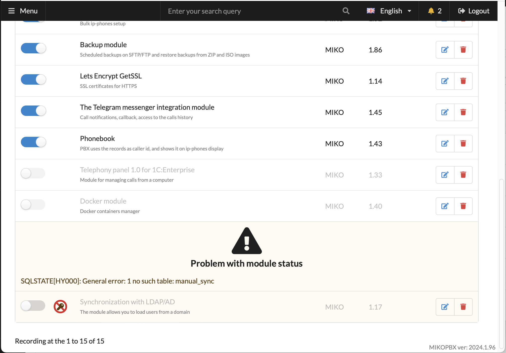<figcaption></figcaption></figure>

An option to update all modules with a single button has been added.

### Module Error Visualization

In the previous release, a mechanism was introduced that automatically disables modules that encounter severe errors. Some users faced difficulties identifying the cause of a module's deactivation. Now, the reason is displayed next to the toggle, and clicking on the icon reveals the error message text.

<figure><figcaption></figcaption></figure>

### Licensed Module Operation During Connectivity Issues

Some paid modules required guaranteed connectivity to the licensing server to function. In the current release, an offline mode has been implemented where the system remembers the last state of the license and uses the cached state if there is no connectivity to the licensing server. This reduces failures in operating licensed modules.

### MikoPBX Cloud Installation

The mechanism for automatic setup of MikoPBX during cloud installations has been standardized, and instructions have been updated for the following environments:

* [Microsoft Azure](../../setup/cloud/microsoft-azure.md)
* [Google Cloud Platform](../../setup/cloud/google-cloud/google-cloud-deployment-guide.md)
* [Amazon Web Services](../../setup/cloud/aws/)

An automatic MTU detection mechanism has been added for operations in cloud environments.

After installation and full system boot, the serial console displays the authentication parameters.

Previously, after system installation, it would repeatedly check the environment for cloud configuration at every reboot. Now, after successful installation and any system setting changes, cloud provisioning is disabled.

The storage disk for installation in the cloud is connected automatically, which is convenient as there is no need to use an SSH console when deploying a new image.

When installing in the cloud, an SSH user with root privileges and an arbitrary name, usually set in the instance settings, is automatically added. If necessary, the username can be changed in the main system settings.

After cloud installation, the web interface login uses the username **admin** and a password that matches the unique instance identifier. On first login, the system will require the password to be changed.

### MikoPBX Container Installation

The [instructions](../../setup/docker.md) for installing and updating MikoPBX in a Docker container have been completely updated.\
Added an example of automatic deployment of multiple containers on a single host, described a way to bypass Docker's limitations on passing a large range of RTP ports.\
Artificial limitations on working with kernel version 5+ have been removed; if the container starts and operates, then all is well.

<figure>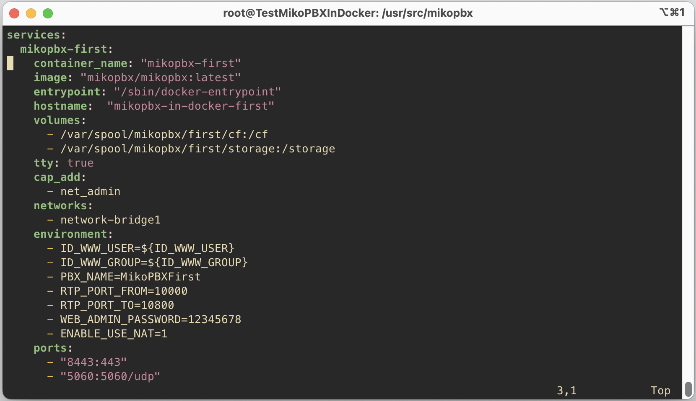<figcaption></figcaption></figure>

Added the ability to set many MikoPBX parameters via environment variables, including network settings, administrator name and password, SSH keys, SSL keys for proper HTTPS operation, and much more.

### Web Interface Password Brute Force Protection

Previously, the fail2ban mechanism, which automatically blocked the IP address of the attacker, was used for protection. By default, entering the wrong password three times was enough for the system to stop responding to browser requests. If active protection was disabled, it was possible to continuously guess passwords.

In the new version, a combined mechanism is used.

<figure>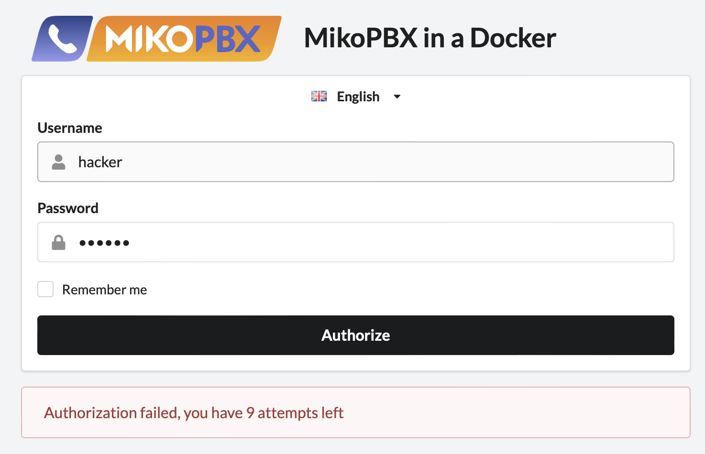<figcaption></figcaption></figure>

If the wrong password is entered, the system remembers the IP address and counts the attempts. If the wrong password is entered more than 10 times within 5 minutes, the password input form disappears, and an informational message is displayed instead.

<figure>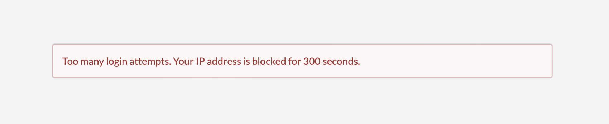<figcaption></figcaption></figure>

If the brute force attempt continues through REST requests, the system blocks the attacker's IP address for HTTP interface access on the 14th attempt.

### System Optimization for Handling a Large Number of Numbers

Added saving the state, sorting, and current page in the employee list. Optimized mechanisms for checking SIP passwords for security to reduce system load.\
Implemented an automatic adjustment mechanism for the number of rows per page depending on the screen size and resolution.

<figure>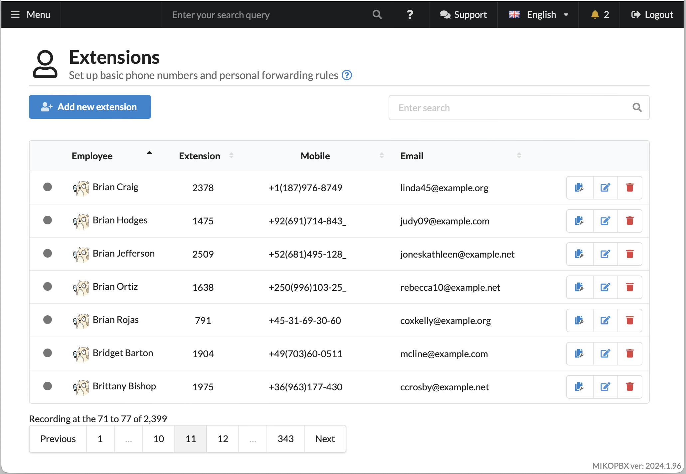<figcaption></figcaption></figure>

### New Interface for Configuring Asterisk Manager Interface (AMI)

Optimized the configuration form, added the ability to allow the **command** action for manager accounts.

<figure>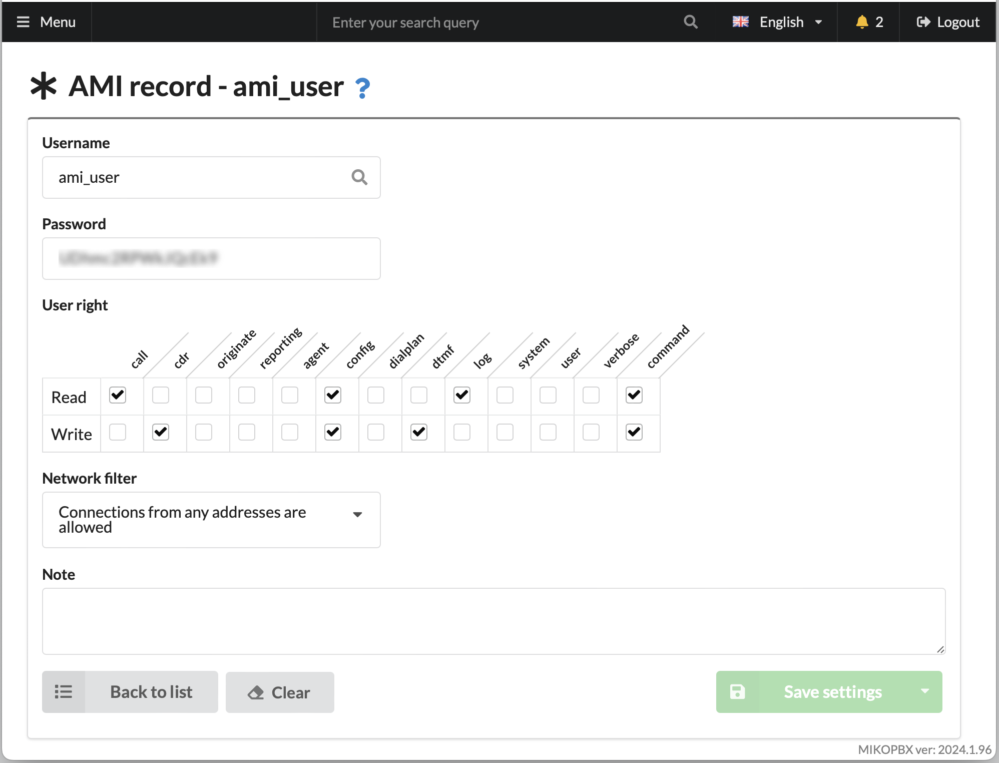<figcaption></figcaption></figure>

### Updated Zabbix Monitoring Module

All necessary system and firewall settings and agent startup are now automatically performed along with the module's start. The configuration file code has been moved to the module form for easy editing.\
If the port number is changed in the zabbix configuration file, it is automatically passed to the Firewall settings section to manage access to this port at the subnet level.

The zabbix\_agent binary is no longer included in the main delivery; it is now delivered as part of a separate module.

<figure>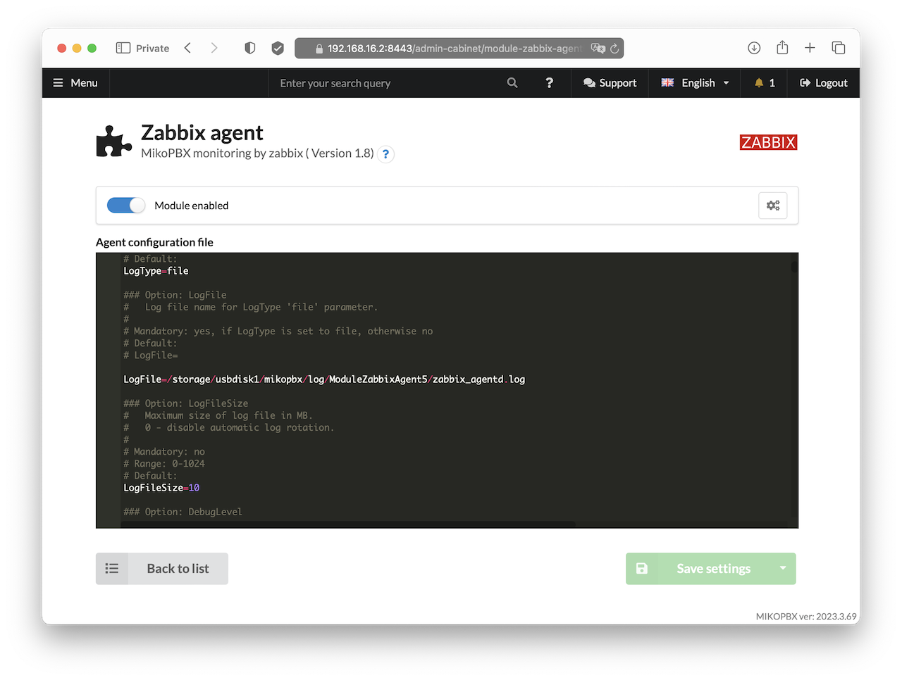<figcaption></figcaption></figure>

<figure>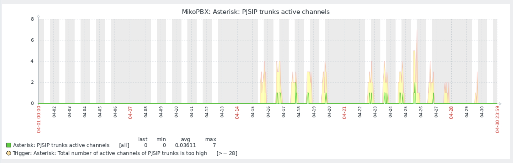<figcaption>
PJSIP Active Chanels
</figcaption></figure>

 

<figure>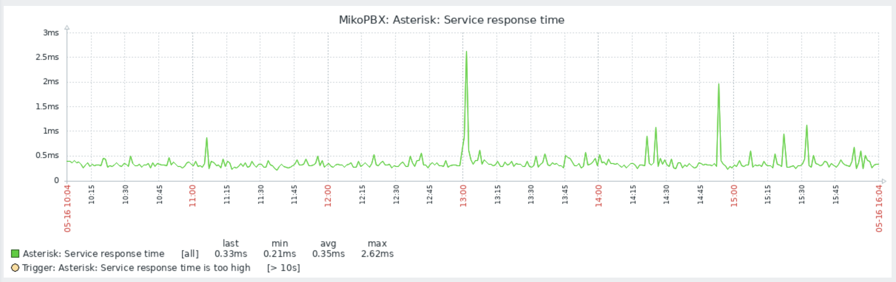<figcaption>
Asterisk responce time
</figcaption></figure>

 

<figure>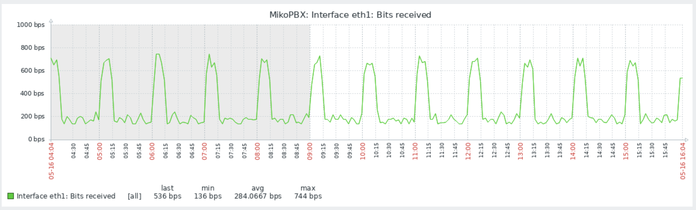<figcaption>
Network interface
</figcaption></figure>

 

<figure><figcaption>
Active calls
</figcaption></figure>

 

<figure>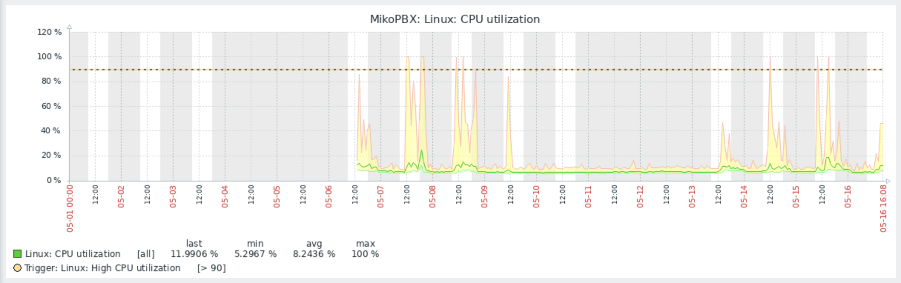<figcaption>
CPU Utilisation
</figcaption></figure>

 

<figure><figcaption>
Memory Utilisation
</figcaption></figure>

### Updated Access Control Module

In MikoPBX, a bug has been fixed that sometimes did not redirect to the selected page after authentication.

Rights for all currently available extension modules have been described and grouped for easy administration.

Added pagination to the user list to facilitate managing call record filters and employee access rights. Added sorting by selected accounts in the filter.

### Optimization of Active Fail2Ban Protection

In the setup form, tabs have been added, and a cross-search feature is now available in the table of blocked addresses.

Blocked addresses and reasons for blocking are grouped by IP address into a single line.

Module messages are now recorded in their own log files.

### Copying Providers and Routes

Added the ability to create a copy of a provider and routing settings with one click on the icon in the table.

### Support for CalDav in Setting Non-Working Hours

This new feature allows adding a link to a calendar and using it as a source for non-working hours. Simply set periods with the **busy** status in your calendar, and all calls during these periods will be routed according to the non-working hours route.

<figure>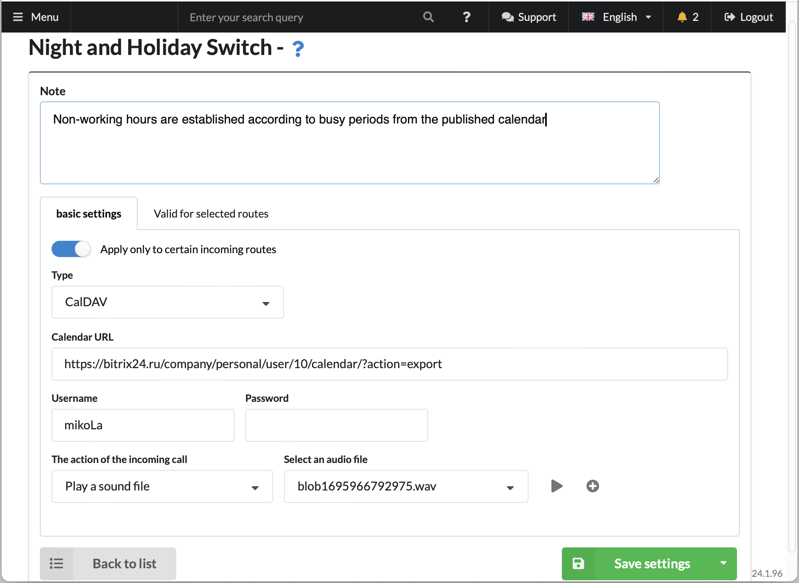<figcaption></figcaption></figure>

The non-working hours mechanism has been revamped. Now, each rule is processed in an isolated context. Errors in the operation of non-working hours restrictions for providers (incoming routes) have been corrected.

### System Update Mechanism Optimization

During system updates, the mechanism for obtaining update scripts from the new image has been implemented, allowing for correct system updates, even if errors were found in this subsystem in previous releases.

All messages during the update process are duplicated to the serial console, allowing for logging the process or monitoring the update in real-time when the installation was performed in a system without access to the usual graphic console, especially in cloud installations.

### System Installation Mechanism Optimization

Added a timer for booting from the LiveCD during system installation, similar to the Windows installer's prompt to boot from disk. Often, clients faced issues after installation when the disk was not ejected automatically, and the system continuously booted in recovery mode.

Optimized operation with NVMe disks; the previous release did not support installation on such disks.

When selecting the menu item - installation with the deletion of all settings, in the past release this did not work correctly and after the start, the system was automatically restored from backup. Now, not only the system partition is formatted but also the data storage disk.

### Network Setting Adjustments for NAT Usage

In the new version, separate parameters for external SIP and SIP\_TLS ports have been added to the network interface settings, from which port forwarding is performed on the network router.\
Added reference information with a list of current ports that need to be forwarded on the router when NAT support is enabled.

<figure>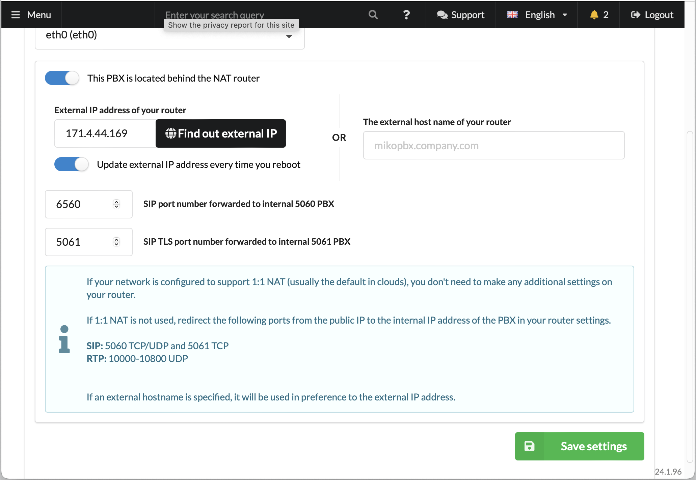<figcaption></figcaption></figure>

An option has been added that allows updating the router's IP address by making a request to an external resource at system boot. This eliminates problems when installing in the cloud, where the cloud environment does not pass information about the virtual machine's IP address.

### New Interface Languages: Thai

We are gradually expanding the number of available languages in the interface; Thai has been added in this release. Many thanks to our translators.

<figure>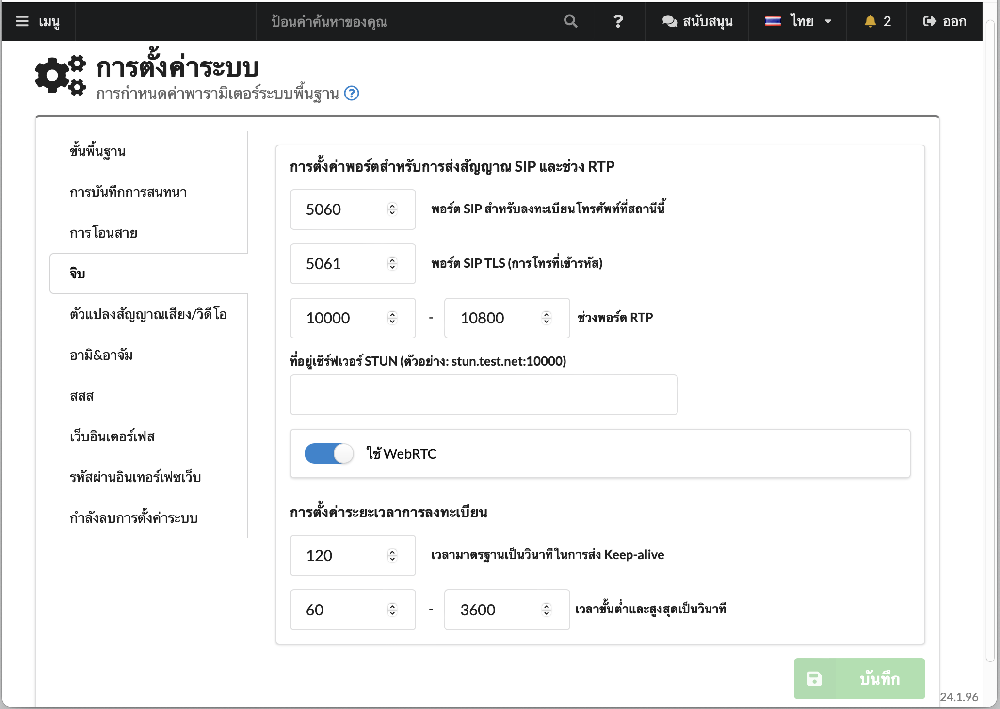<figcaption></figcaption></figure>

If you want to help with translating the MikoPBX interface and modules, please [click here](https://weblate.mikopbx.com/projects/mikopbx/admin-web-interface/).

### Other Improvements

In the call log, an automatic adjustment mechanism for the list size according to screen sizes has been implemented.

Implemented automatic cleaning of entries in the call history log according to the setting for deleting old records. Previously, only audio files were deleted.

Added a field for storing important information in the provider's card, such as account number, personal account address, provider contract number, list of used telephone numbers, etc.

Added the option to route a call to play a sound file in the incoming routing rules.

Implemented the ability to auto-answer during originate for MicroSIP and Telephone softphones.

In the advanced settings of the provider, it is now possible to specify **DIAL\_COMMAND** parameters.

Added a log of CLI commands of Asterisk to a file on disk for storage.

For SSH session authorization by key, support for the ed25519 standard signature has been implemented.

The DHCP client supports receiving a list of custom Route routes in the staticroutes parameter.

### Fixed Numerous Bugs

In the previous version, some clients encountered the issue of hanging channels, as a result of which it was impossible to call some employees without restarting Asterisk. Now, the channel will be reset if no RTP packets are received within 30 seconds.

In the previous version, call forwarding to service numbers, such as voicemail, busy signal, forwarding to an employee by DID, and call termination, did not work correctly.

In some cases, when authorizing, an error of the Crypt() algorithm occurred when using simple passwords.

By default, a call queue waiting limit of 300 seconds was set without displaying this parameter in the interface, leading to an unexpected drop of calls hanging in the queue for more than 5 minutes.

Sometimes, the call recording did not continue after successful forwarding.

Optimized the mechanism for deleting temporary files, which sometimes led to system hang-ups during loading.

Fixed the error in selecting the transport for the PJSIP protocol, which led to the inoperability of the channel.
