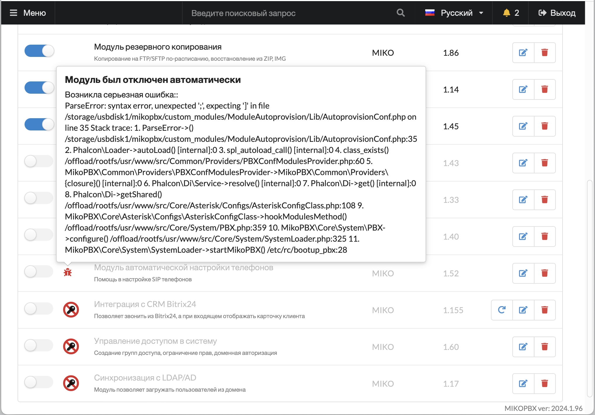
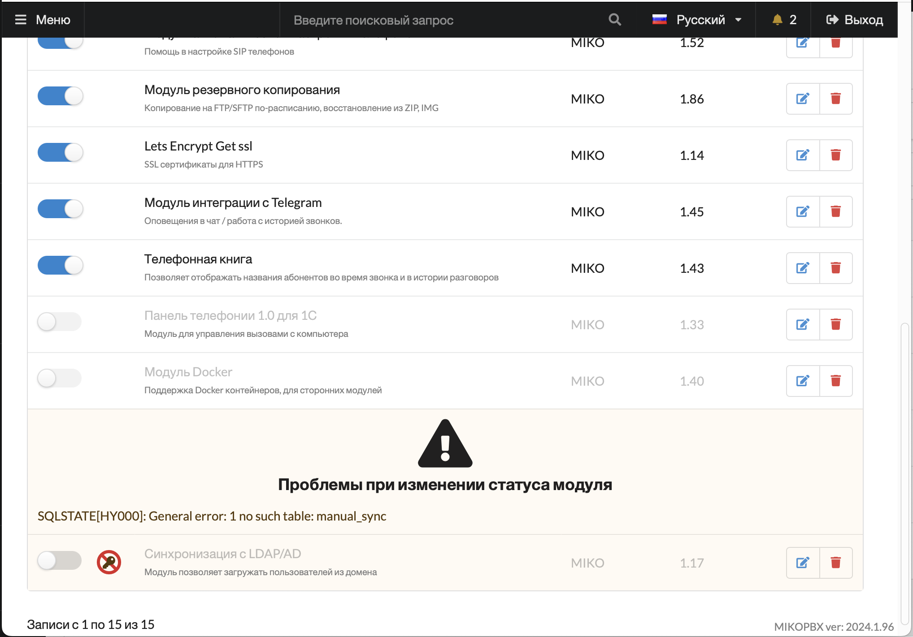
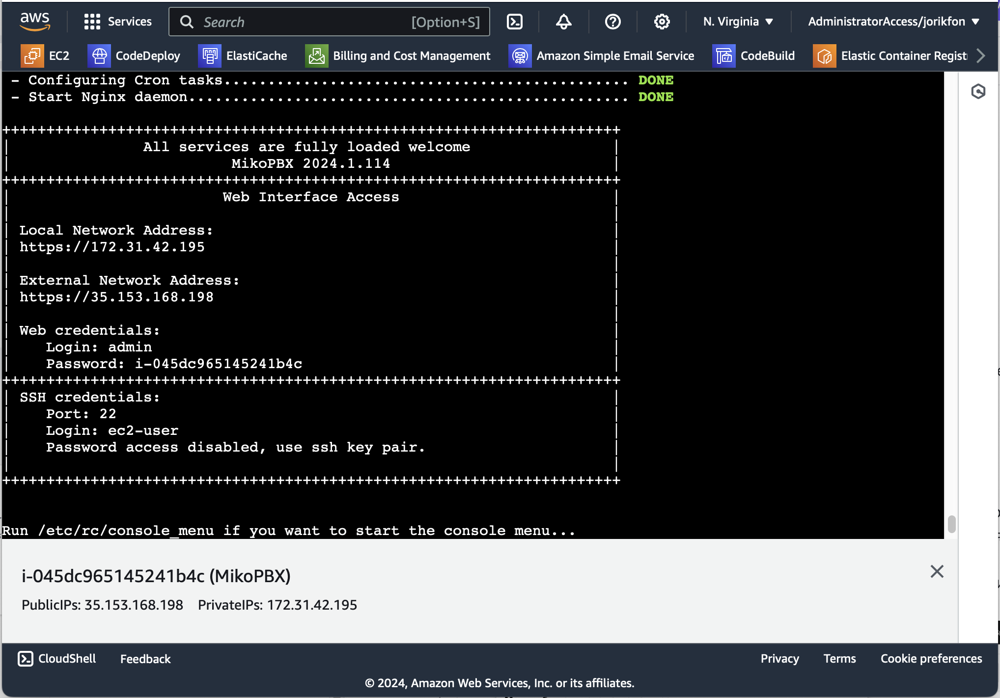
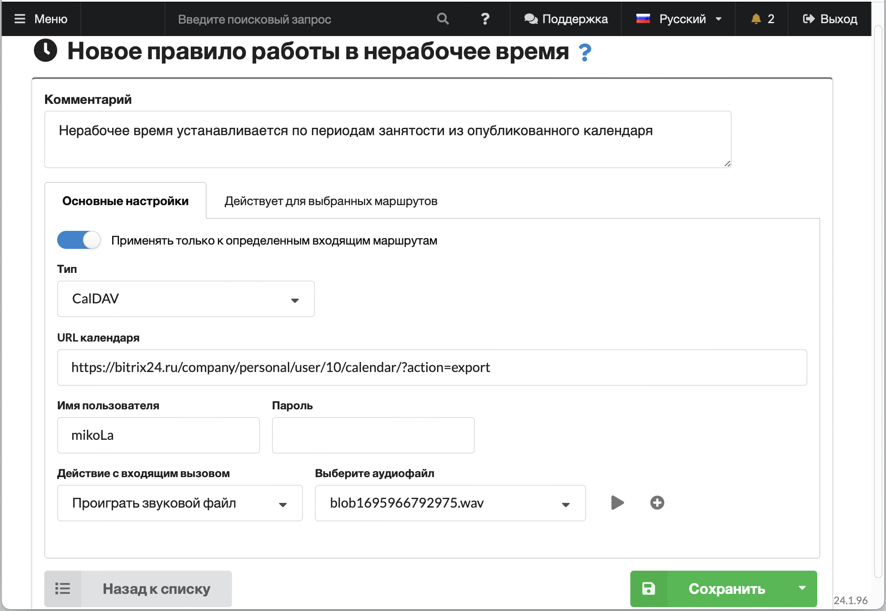
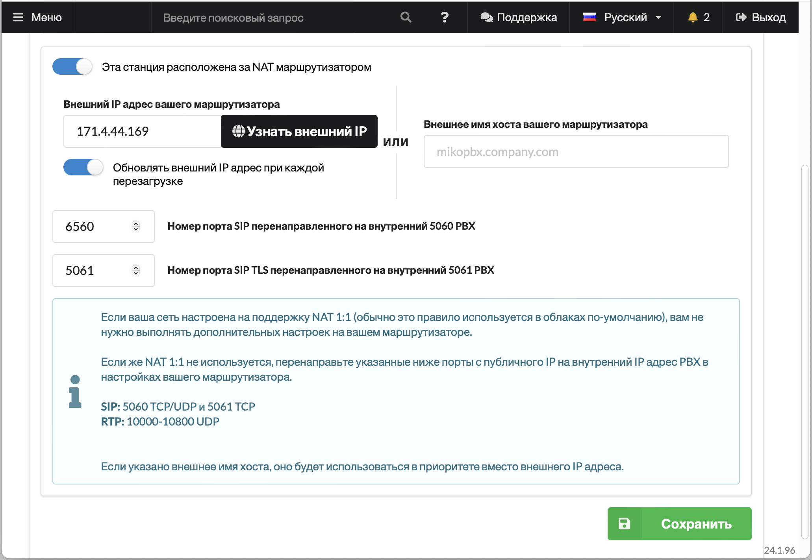

# MikoPBX 2024.1

### Обновление системных пакетов и библиотек

Ядро Linux и системные библиотеки обновлены до последних доступных версий. В частности ядро Linux обновлено до версии 6.6.1, Asterisk обновлен до версии  20.7.0

### Визуализация ошибок в модулях

В предыдущем релизе был добавлен механизм, который автоматически отключает модули, внутри которых возникают серъезные ошибки. Некоторые пользователи столкнулись с проблемой определения причины отключения того или иного модуля. Теперь причина отображается рядом с переключателем, а при клике на иконку можно получить и текст самой ошибки.

<figure><figcaption></figcaption></figure>

### Рефакторинг магазина приложений

Все операции по установке и обновлению модулей перенесены на BackEnd, добавили детальную карточку для каждого модуля с возможностью выбрать версию для установки, посмотреть историю версий и описание изменений. Повяилась возможность не только обновлять модуль, но и выполнять откат к предыдущей версии.&#x20;

<figure><figcaption></figcaption></figure>

Оптимизировано отображение ошибок при установке, обновлении, включении и выключении модулей. Теперь они отображаются рядом с самим модулем в таблице, а не в заголовке маркетплейса.

<figure><figcaption></figcaption></figure>

Исправлена ошибка отображения системных сообщений на английском языке вместо выбранного в настройках интерфейса пользователем.

Добавили возможность обновлять все модули одной кнопкой.

### Работа лицензируемых модулей при проблемах со связью

Некоторые платные модули требовали гарантированной связи с сервером лицензий для работы. В текущем релизе реализован режим работы оффлан, когда система запоминает последнее состояние лицензии и при отсутвии связи с сервером лицензирования использует закешированное состояние. В итоге сбоев в работе с лицензируемыми модулями будет меньше.

### Установка MikoPBX в облака

Унифицирован механиз автоматической настройки MikoPBX при установке в облаках, обновлены инструкции для следующих окружений:

* [Яндекс облако](../../setup/cloud/yandex-cloud/)
* [Microsoft Azure](../../setup/cloud/microsoft-azure.md)
* [VK облако](../../setup/cloud/vk-cloud.md)
* [1C:Облачная инфраструктура](../../setup/cloud/1c-oblachnaya-infrastruktura.md)
* [Google Cloud Platform](../../setup/cloud/google-cloud.md)
* [Amazon Web Services](../../setup/cloud/aws/)

Добавлен механизм автоматического определения MTU при работе в облаках.

В серийную консоль после установки и полной загрузки выводятся параметры для авторизации.

<figure><figcaption></figcaption></figure>

Ранее после установки системы, она продолжала опрашивать окружение при каждой перезагрузке на наличе облака для автоматической настройки. Теперь после успешной установки и изменения любых системных настроек, облачный провижинг отключается.

Диск для хранения при установке в облаке подключается автоматически, это удобно, нет необходимости использовать SSH консоль при разворачивании нового образа.

### Установка MikoPBX контейнер

Полностью обновлена [инструкция](../../setup/docker.md) по установке и обновлению MikoPBX в контейнер Docker. \
Добавили пример автоматического развертывания нескольких контейнеров на одном хосте, описан вариант обхода ограничений Docker на пророс большого диапазона RTP портов.\
Убрали искусственное ограничение на работу с ядром 5+, если контейнер запускется и работает, значит все хорошо.\
Добавили возможность установки множества параметров MikoPBX через переменные окружения, можно установить параметры сети, имя и пароль администратора, SSH ключи, SSL ключи для корректной работы HTTPS и многое другое.

### Оптимизация системы для работы с большим количеством номеров

Добавили сохранение состояния, сортировки и текущей страницы в списке сотрудников. Оптимизированы механизмы работы проверки SIP паролей на безопасность для сокращения нагрузки на систему.\
Реализован механизм автоматической подстройки количества строк на странице в зависимости от размера экрана и разрешения.

### Новый интерфейс для настройки Asterisk Manager Interface (AMI)

Опитимизирована форма настройки, добавили возможность разрешать действие **command** для учетной записи менеджера.

### Обновлен модуль мониторинга Zabbix

Теперь все необходимые настройки системы, фаервола и запуск агента выполняются автоматически вместе со стартом модуля. На форму модуля вынесен код конфигурационного файла для его удобного редактирования.\
При изменении номер порта в конфигурационном файле zabbix, он автоматически передается в раздел настройки Firewall для возможнсти управления доступом к этому порту на уровне подсетей.

Из основной поставки исключен бинарник zabbix\_agent, теперь он поставляется в составе отдельного модуля.

### Обновлен модуль управления доступом

В MikoPBX исправлена ошибка, при которой иногда после авторизации не просиходил автоматический редирект на выбранную в модуле страницу.

В модуле описаны и сгруппированы права для всех доступных на сегодняшний день модулей расширений, для удобного администрирования.

Добавлен механиз разделения списка пользователей на страницы, чтобы было удобно администрировать фильтры записей разговоров и права доступа сотрудников. Добавлена сортировка по выбранным учетным записям в фильтре.

### Оптимизация активной защиты Fail2Ban

В форме настройки, добавили вкладки, в таблице заблокированных адресов появилась возможность сквозного поиска.&#x20;

Заблокированные адреса и причины блокировки сгруппированы по IP адресу в одну строку.

Сообщения модуля теперь записываются в собственные файлы логов.

### Копирование провайдеров и маршрутов

Добавили возможность создавать копию провайдера и настроек маршрутизации одним кликом по иконке в таблице.

### Поддержка CalDav в настройке нерабочего времени

Это новая фишка, можно добавить ссылку на календарь и использовать его в качестве источника для нерабочего времени.  Просто установите в вашем календаре периоды со статусом **занято** и все звонки в эти периоды будут отправляться по маршруту нерабочего времени.

<figure><figcaption></figcaption></figure>

### Оптимизация механизма обновления системы

При обновлении системы реализован механизм получения скрпитов обновления из нового образа, что позволяет выполнять корректное обновление системы, даже если в предыдущих релизах были найденны ошибки в этой подсистеме.

Релизовано дублирование всех сообщений в процессе обновления в серийную консоль, что позволяет логировать процесс или следить за обновлением в реальном времени в том случае, когда установка была выполнена в систему, у которой нет доступа к привычной графической консоли. В частности в случае установки в облаках.

### Оптимизация механизма установки системы

Добавлен таймер на загрузку с LiveCD, при установке системы, по примеру установщика Windows появляется вопрос на загрузку с диска. Часто возникали проблемы у клиентов после установки, когда диск не извлекался автоматически и система постоянно грузилась в режиме восстановления.

Оптимизирована работа с NVMe дисками, предыдущий релиз не поддерживал установку на такие диски.

При выборе пункта меню - установка с удалением всех настроек, в прошлом релизе это не срабатывало корректно и после старта, система восстанавливалась из бекапа автоматически. Теперь происходит не только форматирование системного раздела, но и диска для хранения данных.

### Настройка сетевых параметров когда используется NAT

В новой версии в настройки сетевого интерфейса добавлены отдельные параметры для внешних SIP и SIP\_TLS портов, с которых осуществляется проброс портов на сетевом маршрутизаторе.\
Добавлена справочная информация с списом текущих портов, которые необходимо пробросить на маршрутизаторе при включения поддержки NAT.

<figure><figcaption></figcaption></figure>

Добавлена опция, которая позволяет обновлять значение IP адреса маршрутизатора выполнением запроса к внешнему ресурсу при загрузке системы. Это позволяет исключить проблемы при установке в облака, когда окружение облака не передает информации об IP адресе виртуальной машины.

### Новые языки интерфейса: Тайский

Постепенно расширяем количество доступных языков в интерфейсе, в этом релизе добавили тайский. Большое спасибо нашим переводчикам.\
Если хотите помочь с переводом интерфейса MikoPBX и модулей, переходите [по ссылке](https://weblate.mikopbx.com/projects/mikopbx/admin-web-interface/).

### Прочие улучшения

В журнале звонков добавлен механиз автоматической подстройки размера списка под размеры экрана.

Реализована автоматическая очистка записей в журнале истории вызовов, согласно настройке удаления старых записей. Ранее удалялись только звуковые файлы.

В карточке провайдра добавлено поле для хранения важной инфрмации, например номер аккаунта, адрес личного кабинета, номер догвора провайдра, список используемых номеров телефонов и т.д.

В правилах входящей маршрутизации добавили возможность перевода вызова на воспроизведение звукового файла.

Реализовали возможность автоподъема при originate для софтфонов MicroSIP и Telephone софтфонов.

В расширенных настройках провайдера теперь можно указывать параметры **DIAL\_COMMAND**

Добавлен лог cli комманд Asterisk в файл на диске для хранения.

Для авторизации SSH сессии по ключу реализована поддержка подписи по стандарту ed25519.

### Исправлено множество  ошибок

В предыдущей версии некоторые клиенты сталкивались с проблемой зависающих каналов, в следствие чего без перезагрузки Asterisk было невозможно дозвониться до некоторых сотрудников. Теперь канал будет сбрасываться если в течение 30 секунд не поступает никаких RTP пакетов.

В предыдущей версии не корректно работала переадресация на сервисные номера, такие как голосовая почта, сигнал занято, переадресация на сотрудника по DID, завершить вызов.

В некоторых случаях при авторизации появлялась ошибка Crypt() алгоритма, при использовании простых паролей.

По умолчанию для очереди вызовов было установлено ограничение ожидания 300 секунд, без отображения этого параметра в интерфейсе, что приводило к неожиданному сбросу вызова висящего в очереди более 5 минут.

Иногда запись разговора не продолжалась после нуспешной переадресации.

Оптимизирован механиз удаления временных файлов, иногла это приводило к зависанию системы при загрузке.

Исправлена ошибка выбора транспорта для PJSIP протокола, которая приводила к неработоспособности канала.
