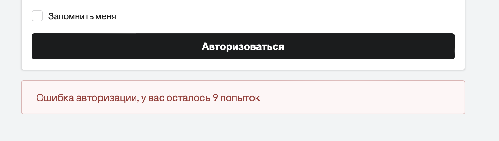
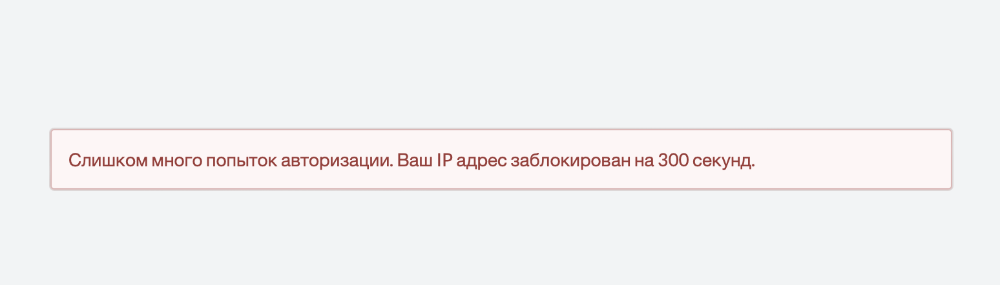
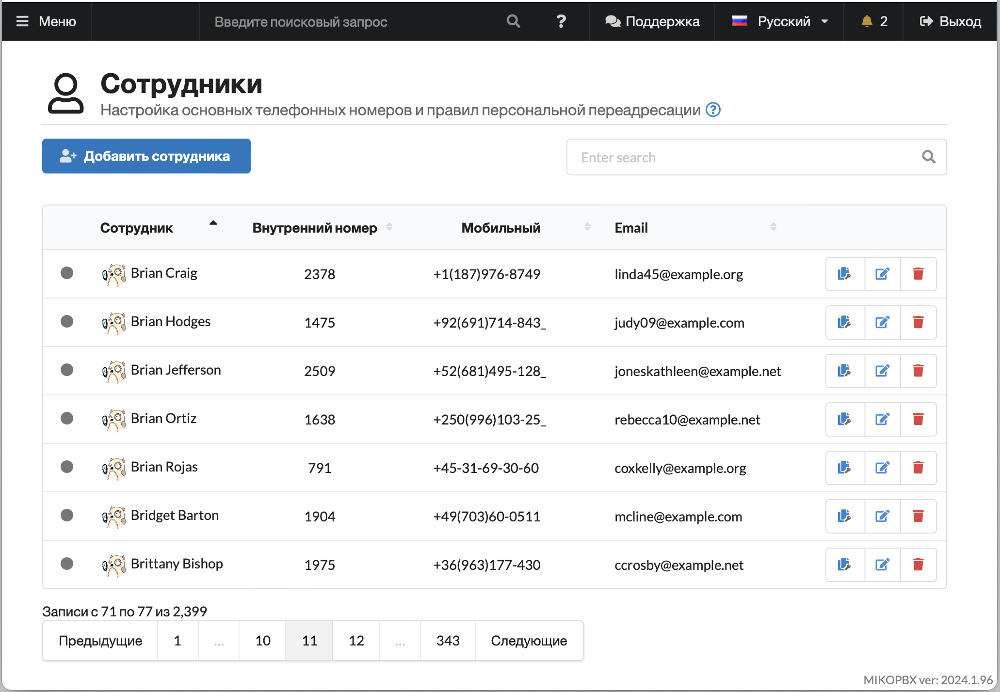
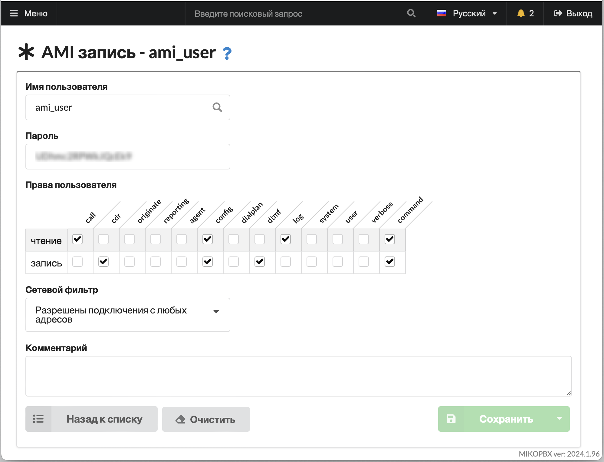
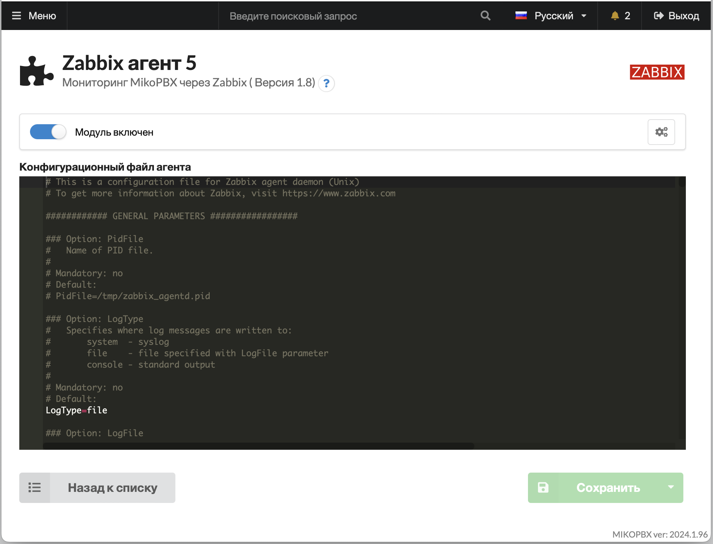

# MikoPBX 2024.1

Обновление системных пакетов и библиотек

Ядро Linux и системные библиотеки обновлены до последних версий. В частности, ядро Linux обновлено до версии 6.6.1, Asterisk — до версии 20.7.0.

### Рефакторинг магазина приложений

Все операции по установке и обновлению модулей перенесены в BackEnd. Добавлена детальная карточка для каждого модуля с возможностью выбора версии для установки, просмотра истории версий и описания изменений. Теперь можно не только обновлять модуль, но и выполнять откат к предыдущей версии.

<figure><figcaption></figcaption></figure>

Оптимизировано отображение ошибок при установке, обновлении, включении и выключении модулей. Теперь ошибки отображаются рядом с самим модулем в таблице, а не в заголовке маркетплейса.

<figure><figcaption></figcaption></figure>

Исправлена ошибка отображения системных сообщений на английском языке вместо выбранного в настройках интерфейса пользователя.

Добавлена возможность обновлять все модули одной кнопкой.

### Визуализация ошибок в модулях

В предыдущем релизе был добавлен механизм, который автоматически отключает модули при возникновении серьёзных ошибок. Некоторые пользователи столкнулись с трудностями в определении причин отключения модулей. Теперь причина отключения отображается рядом с переключателем, а при нажатии на иконку можно увидеть текст ошибки.

<figure><figcaption></figcaption></figure>

### Работа лицензируемых модулей при проблемах со связью

Некоторые платные модули требовали гарантированной связи с сервером лицензий для работы. В текущем релизе реализован режим оффлайн, когда система запоминает последнее состояние лицензии и при отсутствии связи с сервером лицензирования использует закешированное состояние. Это уменьшает количество сбоев в работе с лицензируемыми модулями.

### Установка MikoPBX в облака

Унифицирован механизм автоматической настройки MikoPBX при установке в облаках, обновлены инструкции для следующих окружений:

* [Яндекс облако](../../setup/cloud/yandex-cloud/)
* [Microsoft Azure](../../setup/cloud/microsoft-azure.md)
* [VK облако](../../setup/cloud/vk-cloud.md)
* [1C:Облачная инфраструктура](../../setup/cloud/1c-oblachnaya-infrastruktura.md)
* [Google Cloud Platform](../../setup/cloud/google-cloud/google-cloud-podrobnaya-instrukciya.md)
* [Amazon Web Services](../../setup/cloud/aws/)

Добавлен механизм автоматического определения MTU при работе в облаках.

В серийную консоль после установки и полной загрузки выводятся параметры для авторизации.

<figure><figcaption></figcaption></figure>

Ранее после установки система продолжала опрашивать окружение при каждой перезагрузке на наличие облака для автоматической настройки. Теперь после успешной установки и изменения любых системных настроек, облачный провижинг отключается.

Диск для хранения при установке в облаке подключается автоматически, что удобно, так как нет необходимости использовать SSH консоль при разворачивании нового образа.

При установке в облака автоматически добавляется SSH пользователь с правами root и произвольным именем, обычно устанавливаемым в настройках инстанса. При необходимости имя пользователя можно изменить в основных настройках системы.

После установки в облако для входа в веб-интерфейс используется пользователь **admin** и пароль, равный уникальному идентификатору инстанса. При первой авторизации система потребует сменить этот пароль.

### Установка MikoPBX контейнер

Полностью обновлена [инструкция](../../setup/docker.md) по установке и обновлению MikoPBX в контейнер Docker.

<figure><figcaption></figcaption></figure>

Добавлен пример автоматического развертывания нескольких контейнеров на одном хосте, описан вариант обхода ограничений Docker на проброс большого диапазона RTP-портов.\
Убрано искусственное ограничение на работу с ядром 5+, если контейнер запускается и работает, значит всё хорошо.\
Добавлена возможность установки множества параметров MikoPBX через переменные окружения, можно установить параметры сети, имя и пароль администратора, SSH-ключи, SSL-ключи для корректной работы HTTPS и многое другое.

### Защита от подбора паролей веб интерфейса

Ранее для защиты от подбора использовался механизм fail2ban, который автоматически блокировал IP-адрес злоумышленника. При настройках по умолчанию достаточно было ввести 3 раза неправильный пароль, чтобы система перестала отвечать на запросы из браузера. Если же активная защита была отключена, то можно было бесконечно подбирать пароли.

В новой версии используется комбинированный механизм.

<figure><figcaption></figcaption></figure>

При вводе неправильного пароля, система запоминает IP-адрес и считает попытки. В случае ввода неправильного пароля более 10 раз в течение 5 минут, форма ввода пароля исчезает, а вместо неё отображается информационное сообщение.

<figure><figcaption></figcaption></figure>

В случае если подбор продолжается автоматизированным способом, через REST запросы система блокирует IP-адрес злоумышленника для HTTP-интерфейса на 14 попытке.

### Оптимизация системы для работы с большим количеством номеров

Добавлено сохранение состояния, сортировки и текущей страницы в списке сотрудников. Оптимизированы механизмы работы проверки SIP-паролей на безопасность для сокращения нагрузки на систему.

<figure><figcaption></figcaption></figure>

Реализован механизм автоматической подстройки количества строк на странице в зависимости от размера экрана и разрешения.

### Новый интерфейс карточки Asterisk Manager Interface (AMI)

Оптимизирована форма настройки, добавлена возможность разрешать действие **command** для учетной записи менеджера.

<figure><figcaption></figcaption></figure>

### Обновлен модуль мониторинга Zabbix

Теперь все необходимые настройки системы, фаервола и запуск агента выполняются автоматически вместе со стартом модуля. На форму модуля вынесен код конфигурационного файла для его удобного редактирования.\
При изменении номера порта в конфигурационном файле Zabbix, он автоматически передается в раздел настройки Firewall для возможности управления доступом к этому порту на уровне подсетей.

<figure><figcaption></figcaption></figure>

Из основной поставки исключен бинарник **zabbix\_agent**, теперь он поставляется в составе отдельного модуля.

<figure><figcaption>
Активные каналы
</figcaption></figure>

 

<figure><figcaption>
Статус Asterisk
</figcaption></figure>

 

<figure><figcaption>
Загрузка сетевого интерфейса
</figcaption></figure>

 

<figure><figcaption>
Статистика звонков
</figcaption></figure>

 

<figure><figcaption>
Загрузка процессора
</figcaption></figure>

 

<figure><figcaption>
Использование памяти
</figcaption></figure>

### Обновлен модуль управления доступом

В MikoPBX исправлена ошибка, при которой иногда после авторизации не происходил автоматический редирект на выбранную в модуле страницу.

В модуле описаны и сгруппированы права для всех доступных на сегодняшний день модулей расширений, для удобного администрирования.

Добавлен механизм разделения списка пользователей на страницы, чтобы было удобно администрировать фильтры записей разговоров и права доступа сотрудников. Добавлена сортировка по выбранным учетным записям в фильтре.

### Оптимизация активной защиты Fail2Ban

В форме настройки добавлены вкладки, в таблице заблокированных адресов появилась возможность сквозного поиска.\
Заблокированные адреса и причины блокировки сгруппированы по IP-адресу в одну строку.

Сообщения модуля теперь записываются в собственные файлы логов.

### Копирование провайдеров и маршрутов

Добавлена возможность создавать копию провайдера и настроек маршрутизации одним кликом по иконке в таблице.

### Поддержка CalDav в настройке нерабочего времени

Это новая функция, можно добавить ссылку на календарь и использовать его в качестве источника для нерабочего времени. Просто установите в вашем календаре периоды со статусом **занято** и все звонки в эти периоды будут отправляться по маршруту нерабочего времени.

<figure><figcaption></figcaption></figure>

Переработан механизм работы правил нерабочего времени. Теперь каждое правило обрабатывается в изолированном контексте. Исправлены ошибки в работе при ограничении нерабочего времени по провайдерам (входящим маршрутам).

### Оптимизация механизма обновления системы

При обновлении системы реализован механизм получения скриптов обновления из нового образа, что позволяет выполнять корректное обновление системы, даже если в предыдущих релизах были найдены ошибки в этой подсистеме.

Реализовано дублирование всех сообщений в процессе обновления в серийную консоль, что позволяет логировать процесс или следить за обновлением в реальном времени в том случае, когда установка была выполнена в систему, у которой нет доступа к привычной графической консоли. В частности в случае установки в облаках.

### Оптимизация механизма установки системы

Добавлен таймер на загрузку с LiveCD, при установке системы, по аналогии с установщиком Windows, появляется вопрос на загрузку с диска. Часто возникали проблемы у клиентов после установки, когда диск не извлекался автоматически и система постоянно грузилась в режиме восстановления.

Оптимизирована работа с NVMe дисками, предыдущий релиз не поддерживал установку на такие диски.

При выборе пункта меню - установка с удалением всех настроек, в прошлом релизе это не срабатывало корректно и после старта, система восстанавливалась из бекапа автоматически. Теперь происходит не только форматирование системного раздела, но и диска для хранения данных.

### Настройка сетевых параметров когда используется NAT

В новой версии в настройки сетевого интерфейса добавлены отдельные параметры для внешних SIP и SIP\_TLS портов, с которых осуществляется проброс портов на сетевом маршрутизаторе.\
Добавлена справочная информация с списком текущих портов, которые необходимо пробросить на маршрутизаторе при включении поддержки NAT.

<figure><figcaption></figcaption></figure>

Добавлена опция, которая позволяет обновлять значение IP-адреса маршрутизатора выполнением запроса к внешнему ресурсу при загрузке системы. Это позволяет исключить проблемы при установке в облака, когда окружение облака не передает информацию об IP-адресе виртуальной машины.

### Новые языки интерфейса: Тайский

Постепенно расширяем количество доступных языков в интерфейсе, в этом релизе добавлен тайский. Большое спасибо нашим переводчикам.

<figure><figcaption></figcaption></figure>

Если хотите помочь с переводом интерфейса MikoPBX и модулей, переходите [по ссылке](https://weblate.mikopbx.com/projects/mikopbx/admin-web-interface/).

### Прочие улучшения

В журнале звонков добавлен механизм автоматической подстройки размера списка под размеры экрана.

Реализована автоматическая очистка записей в журнале истории вызовов, согласно настройке удаления старых записей. Ранее удалялись только звуковые файлы.

В карточке провайдера добавлено поле для хранения важной информации, например номер аккаунта, адрес личного кабинета, номер договора провайдера, список используемых номеров телефонов и т.д.

В правилах входящей маршрутизации добавлена возможность перевода вызова на воспроизведение звукового файла.

Реализована возможность автоподъема при originate для софтфонов MicroSIP и Telephone.

В расширенных настройках провайдера теперь можно указывать параметры **DIAL\_COMMAND**.

Добавлен лог CLI-команд Asterisk в файл на диске для хранения.

Для авторизации SSH-сессии по ключу реализована поддержка подписи по стандарту ed25519.

DHCP-клиент поддерживает получение списка кастомных Route-маршрутов в параметрах staticroutes.

### Исправлено множество ошибок

В предыдущей версии некоторые клиенты сталкивались с проблемой зависающих каналов, в результате чего без перезагрузки Asterisk было невозможно дозвониться до некоторых сотрудников. Теперь канал будет сбрасываться, если в течение 30 секунд не поступает никаких RTP-пакетов.

В предыдущей версии некорректно работала переадресация на сервисные номера, такие как голосовая почта, сигнал занято, переадресация на сотрудника по DID, завершение вызова.

В некоторых случаях при авторизации появлялась ошибка Crypt() алгоритма при использовании простых паролей.

По умолчанию для очереди вызовов было установлено ограничение ожидания 300 секунд, без отображения этого параметра в интерфейсе, что приводило к неожиданному сбросу вызова, висящего в очереди более 5 минут.

Иногда запись разговора не продолжалась после успешной переадресации.

Оптимизирован механизм удаления временных файлов, иногда это приводило к зависанию системы при загрузке.

Исправлена ошибка выбора транспорта для PJSIP-протокола, которая приводила к неработоспособности канала.
