# MikoPBX 2026.1.223

<figure>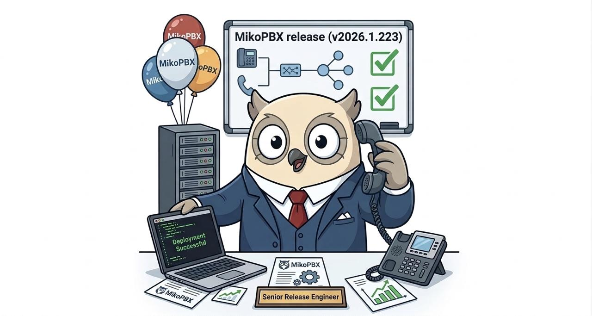<figcaption></figcaption></figure>

Ядро Linux и системные библиотеки обновлены до последних версий. В частности, ядро Linux обновлено до версии 6.12.73, Asterisk — до версии 22.8.2, PHP — до версии 8.4.16. Обновление обеспечивает улучшенную производительность, поддержку современного оборудования и актуальные исправления безопасности.

### Полная поддержка IPv6

MikoPBX теперь полностью поддерживает IPv6 наравне с IPv4. Реализован dual-stack режим, позволяющий использовать оба протокола одновременно. Для каждого сетевого интерфейса доступны три режима работы IPv6: **Выключено**, **Автоматически** (DHCPv6 с fallback на SLAAC) и **Вручную** (статический адрес и шлюз).

Настройка выполняется в разделе **Система → Сетевые интерфейсы** — выберите интерфейс и укажите нужный режим IPv6. При ручной настройке потребуется указать IPv6-адрес, длину префикса и шлюз.

Firewall поддерживает правила как для IPv4, так и для IPv6. DNS можно настроить отдельно для каждого протокола. Веб-интерфейс доступен по IPv6-адресу.

<figure>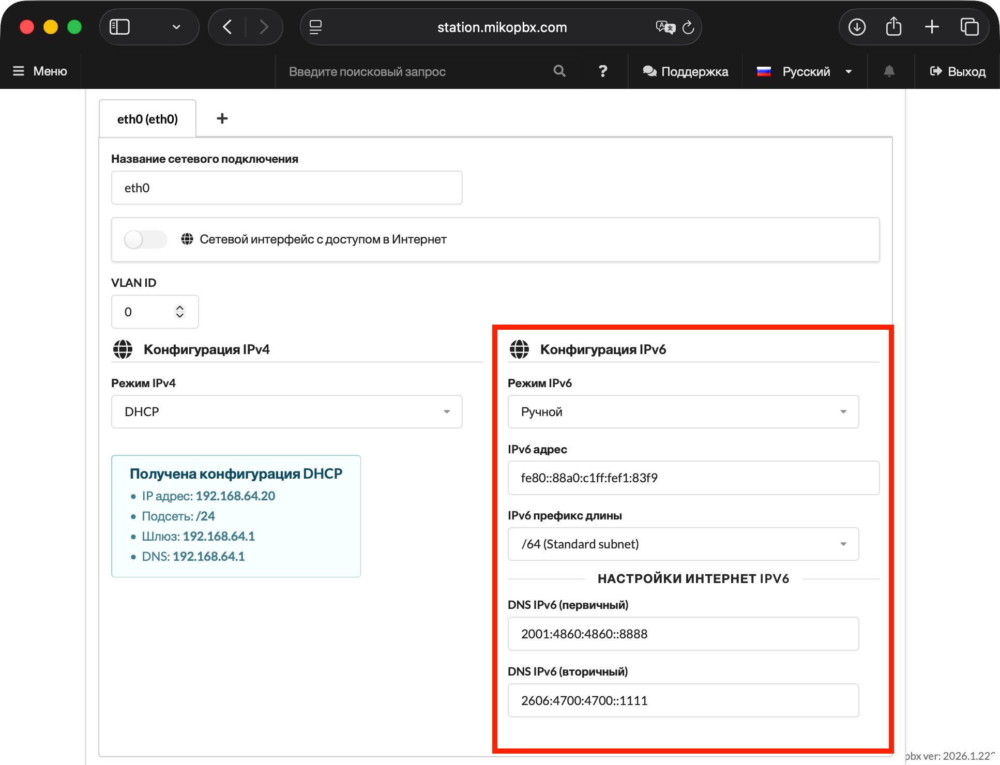<figcaption><p>Настройка IPv6 на сетевом интерфейсе</p></figcaption></figure>

### Статические маршруты

Добавлена возможность настраивать статические маршруты прямо в веб-интерфейсе без необходимости использования SSH. Это упрощает работу в сложных сетевых топологиях и в сетях с несколькими шлюзами.

Для добавления маршрута откройте **Система → Сетевые интерфейсы → Статические маршруты**, нажмите **Добавить маршрут.** Укажите сеть назначения и шлюз.

<figure>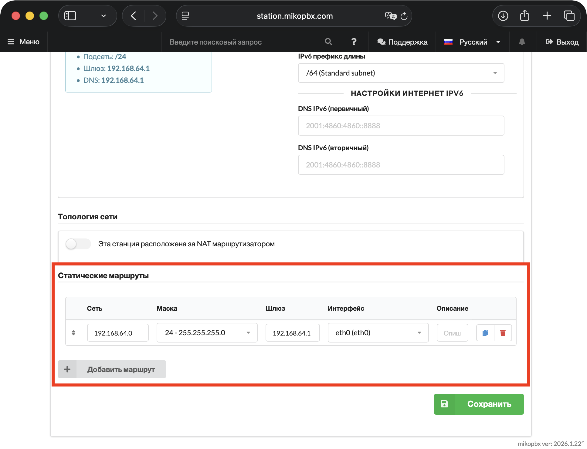<figcaption><p>Управление статическими маршрутами</p></figcaption></figure>

### Cloud Provisioning — автоматическая настройка при развертывании

MikoPBX автоматически настраивается при развертывании в облаке или среде виртуализации. Поддерживаются облачные провайдеры AWS, Google Cloud, Azure, Yandex Cloud, DigitalOcean, Vultr, VK Cloud, Alibaba Cloud, а также платформы виртуализации VMware, Proxmox, KVM (через NoCloud) и контейнеры Docker, LXC/Proxmox.

При запуске система автоматически применяет настройки из cloud-init: имя хоста, сетевые параметры, пароль администратора, SSH-ключи, язык интерфейса, SIP-порты и топологию сети.

Пример user-data для AWS EC2:

```yaml
#cloud-config
mikopbx:
  hostname: pbx-office
  web_password: MySecurePassword123!
  ssh_authorized_keys:
    - ssh-rsa AAAAB3NzaC1... admin@company.com
  pbx_settings:
    PBXLanguage: ru-ru
    SIPPort: 5160
  network:
    topology: private
```

После запуска инстанса система настроится автоматически — останется войти в веб-интерфейс с указанным паролем.

<figure>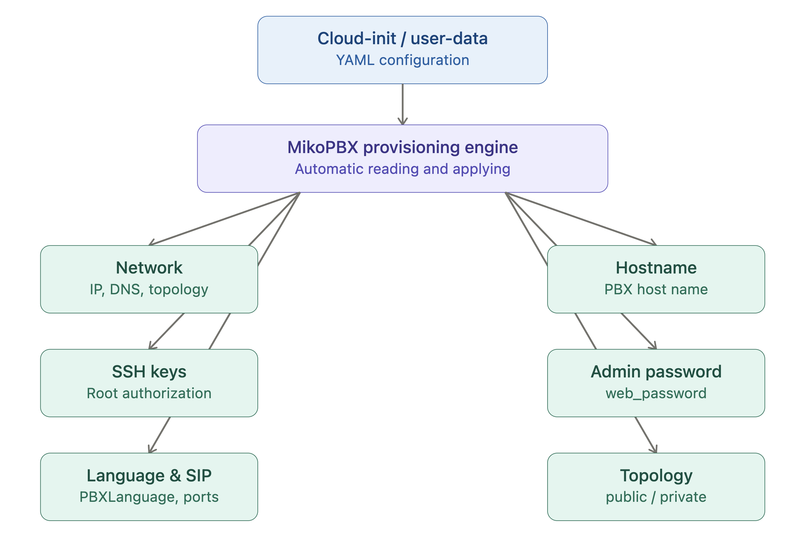<figcaption><p>Схема работы Cloud Provisioning</p></figcaption></figure>

### LXC контейнеры (Proxmox)

Реализована полная поддержка LXC системных контейнеров для on-premise виртуализации. По сравнению с Docker, LXC обеспечивает полное управление сетевыми настройками, поддержку DHCP-клиентов (IPv4/IPv6), работу правил firewall (при наличии соответствующих capabilities) и поведение, аналогичное полноценной виртуальной машине, но с меньшим потреблением ресурсов.

Для развертывания в Proxmox создайте LXC-контейнер с образом MikoPBX, настройте сеть (bridge, DHCP или статический IP) и при необходимости добавьте capability `CAP_NET_ADMIN` для работы firewall и сетевых настроек.

Контейнер автоматически читает файлы `/etc/mikopbx-*.conf` от Proxmox, настраивает DNS search domain и импортирует SSH-ключи.

Пример конфигурации Proxmox:

```bash
# /etc/pve/lxc/100.conf
arch: amd64
cores: 2
memory: 2048
net0: name=eth0,bridge=vmbr0,firewall=1,ip=dhcp,type=veth
rootfs: local-lvm:vm-100-disk-0,size=32G
lxc.cap.keep: CAP_NET_ADMIN
```

Руководстсво по установке MikoPBX в Proxmox LXC:


[lxc.md](../../setup/hypervisor/proxmox/lxc.md)


### Passkeys (WebAuthn) — вход без пароля

Добавлена поддержка входа в систему с помощью биометрии или аппаратного ключа безопасности. Passkeys невозможно украсть как обычный пароль, при этом они совместимы с отпечатком пальца, Face ID и USB/NFC-ключами (YubiKey и др.).

<figure>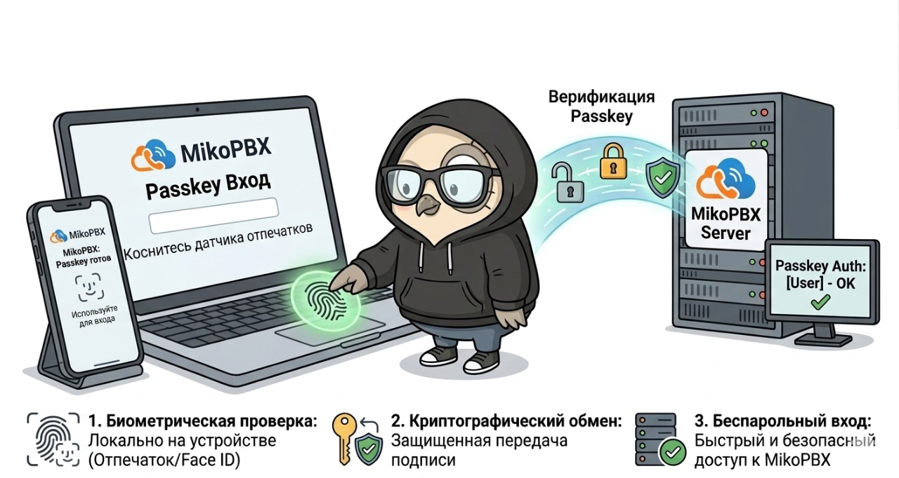<figcaption></figcaption></figure>

Для настройки откройте **Система → Общие настройки**, в разделе **Passkeys** нажмите **Добавить Passkey** и следуйте инструкциям браузера. Каждому ключу можно дать имя (например, «MacBook Touch ID»).

<figure>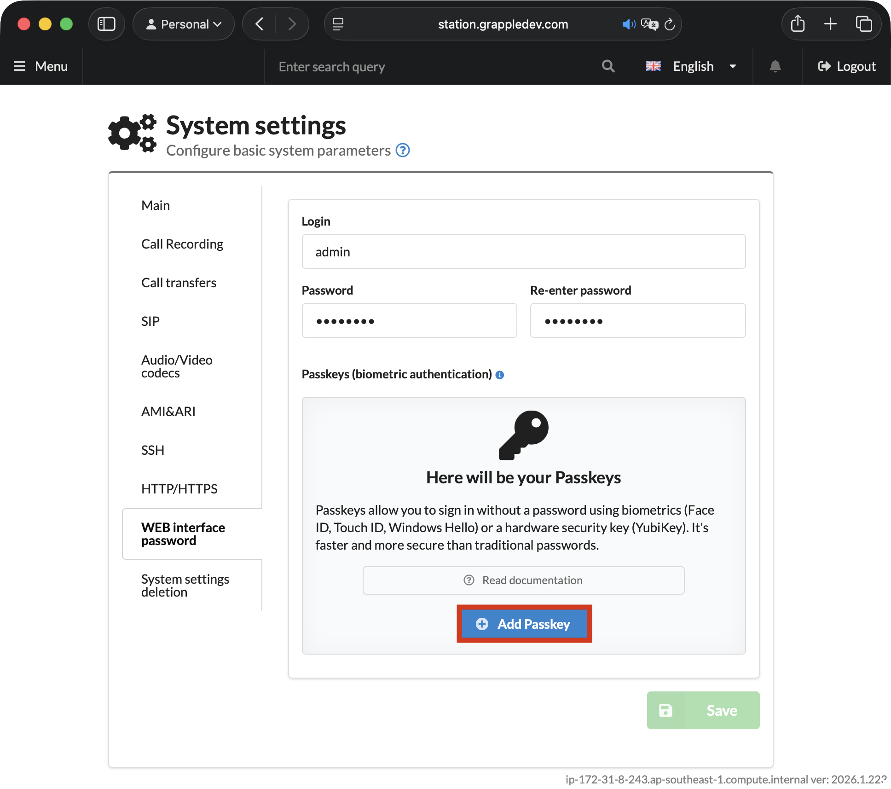<figcaption><p>Добавление Passkey в настройках системы</p></figcaption></figure>

На странице входа появилась кнопка **Войти с Passkey** — подтвердите биометрией или аппаратным ключом, и вы авторизованы без ввода пароля.

Подробнее про добавление Passkey:


[passkeys.md](../../faq/management/passkeys.md)


### REST API v3 — полностью переработанный API

Подробное руководство по MikoPBX REST API v3:


[api-keys](../../manual/system/api-keys/)


Выпущена третья версия REST API с 259 endpoints для управления всеми функциями PBX. Основные улучшения: JWT-аутентификация с Bearer-токенами, гранулярные права доступа для каждого API-ключа, интерактивная документация, встроенная в веб-интерфейс, и спецификация OpenAPI 3.1.0.

Интерактивная документация доступна по адресу `https://your-pbx/admin-cabinet/api-keys/openapi` — можно выбрать endpoint и протестировать его прямо в браузере кнопкой **Try it out**.

Примеры применения: интеграция с CRM для автоматического создания внутренних номеров, получение статистики звонков для дашбордов, автоматизация управления провайдерами и маршрутизацией.

<figure>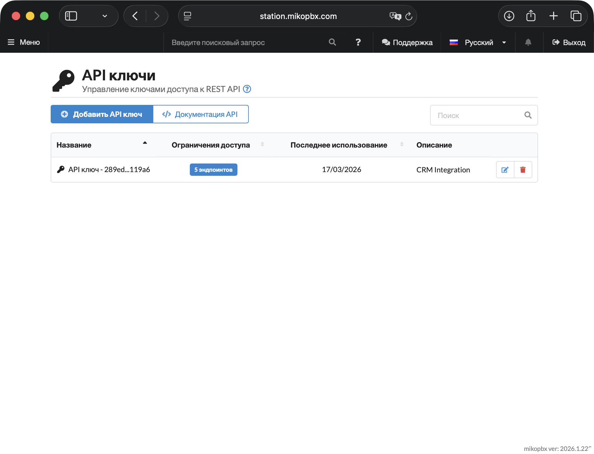<figcaption><p>Раздел "API ключи" в MikoPBX</p></figcaption></figure>

#### Детальные права доступа для API ключей

При создании API-ключа открывается редактор прав, где для каждого ресурса (Extensions, CDR, Providers и др.) можно выбрать уровень доступа: **Чтение**, **Запись** или **Удаление**. Это обеспечивает безопасность, аудит и изоляцию: разные ключи для разных интеграций с минимально необходимыми правами.

Примеры: CRM нужен только список номеров — дайте `Extensions: Чтение`; биллинг-система читает CDR — дайте `CDR: Чтение`; система автонастройки создает провайдеров — дайте `Providers: Запись`.

<figure>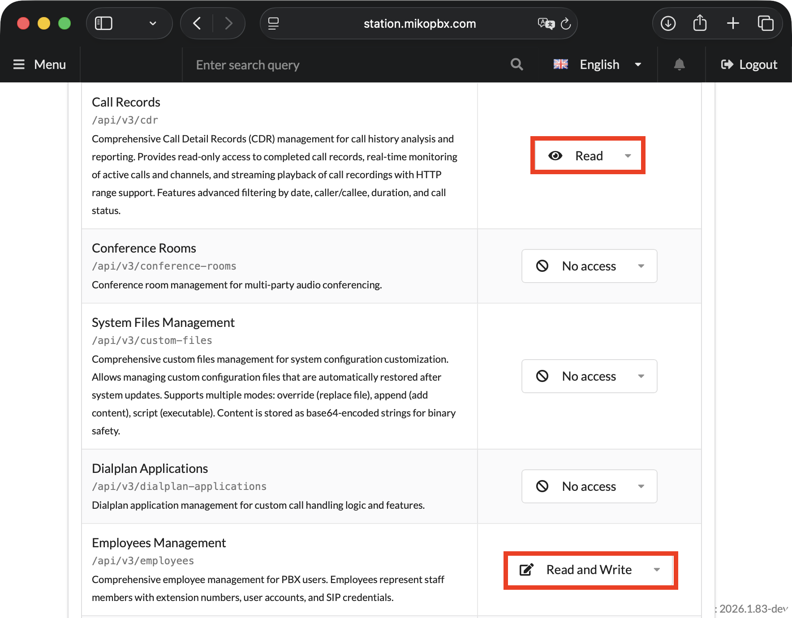<figcaption><p>Пример выдачи права доступа к Call Records в режиме "Чтение"</p></figcaption></figure>

### GeoIP2 — определение страны по IP-адресу

Система автоматически определяет страну для каждого IP-адреса, используя бесплатную базу MaxMind GeoLite2, которая обновляется раз в месяц и работает без подключения к интернету.

Флаг страны отображается в истории заблокированных IP (**Сеть и Firewall → Защита от взлома → Заблокированные адреса**)

<figure>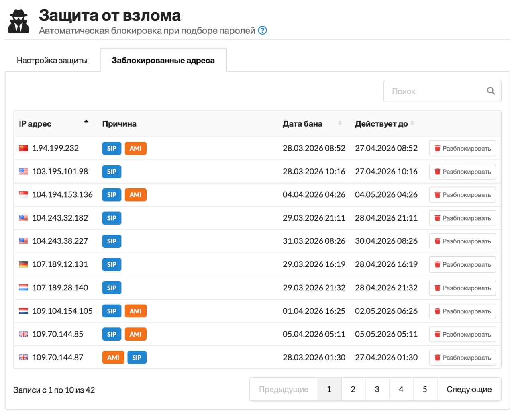<figcaption><p>Флаги стран в списке заблокированных IP</p></figcaption></figure>

### S3 облачное хранилище для записей

Реализована автоматическая синхронизация записей разговоров в Amazon S3 или совместимые хранилища. Это позволяет экономить место на сервере PBX, обеспечивает надежное хранение в облаке с автоматическим удалением локальных файлов после загрузки и соблюдением срока хранения записей.

<figure>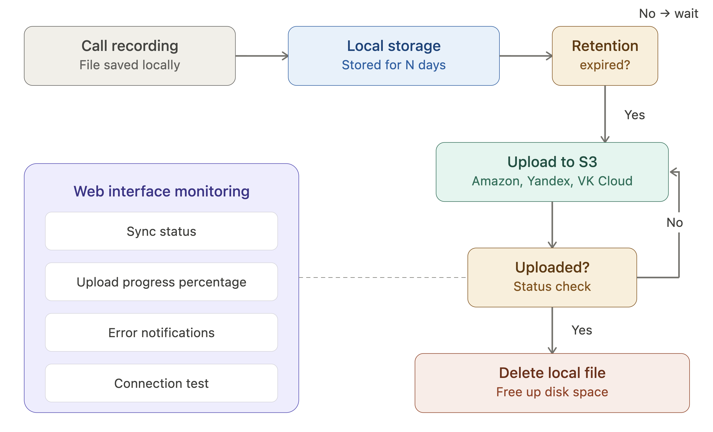<figcaption><p>Диаграмма работы с S3 хранилищем в MikoPBX</p></figcaption></figure>

Для настройки откройте **Обслуживание → Хранилище → Облачное хранилище S3**, введите параметры подключения (Endpoint, Access Key, Secret Key, Bucket, Region), включите автосинхронизацию и укажите срок хранения. Статус синхронизации, процент загруженных записей и уведомления об ошибках отображаются в веб-интерфейсе.

Подробнее в статье:


[storage](../../manual/maintenance/storage/)


### Asterisk REST Interface (ARI)

Добавлено управление ARI-пользователями для продвинутых интеграций. Теперь можно создавать пользователей ARI для внешних приложений, контролировать доступ к ARI WebSocket и интегрироваться с внешними call-control системами.

Управление доступно в **Система → Доступ к ARI**. Применения: разработка собственных IVR-приложений, интеграция с контакт-центрами, реализация кастомной логики обработки звонков.

<figure><figcaption><p>Включение ARI интерфейса в разделе "Настройки ARI"</p></figcaption></figure>

### IAX транки

Добавлена поддержка протокола IAX2 для соединения с провайдерами и офисами. IAX является NAT-friendly альтернативой SIP и создает меньшую нагрузку на firewall, используя один порт вместо диапазона RTP.

Для настройки откройте **Маршрутизация → Провайдеры телефонии**, нажмите **Подключить** **IAX**, заполните параметры провайдера (Host, Username/Password, контекст) и настройте правила маршрутизации.

<figure>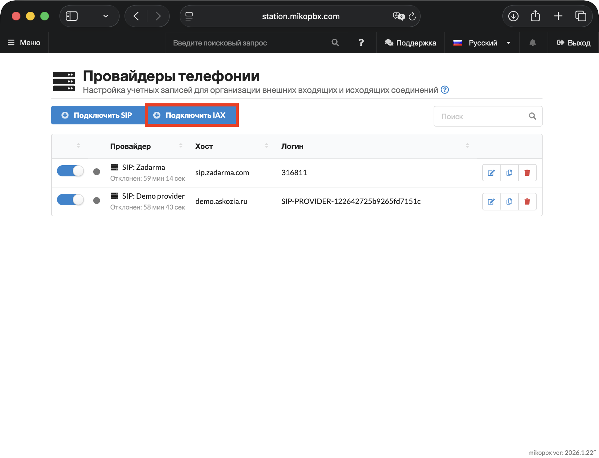<figcaption><p>Добавление IAX-транка</p></figcaption></figure>

### OAuth2 для почты

Реализована безопасная интеграция с современными почтовыми сервисами без необходимости создавать пароли приложений. Поддерживаются Microsoft 365 / Outlook, Gmail / Google Workspace и Yandex Mail. OAuth2 обеспечивает более безопасную аутентификацию и корректно работает с двухфакторной аутентификацией.

Подробнее в статье:


[mail-settings-1](../../manual/system/mail-settings-1/)


<figure>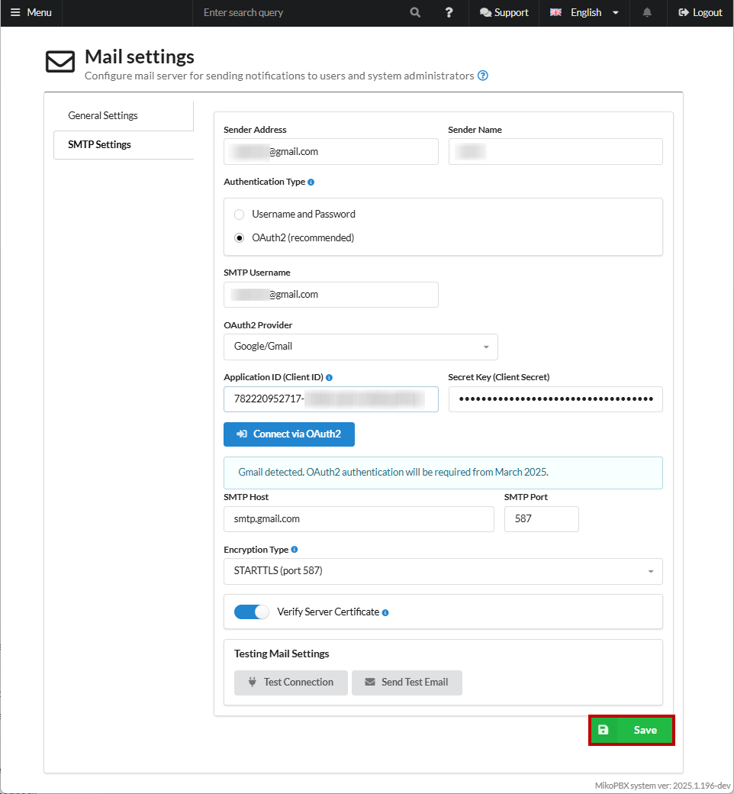<figcaption><p>Пример настройки OAuth2 для Gmail</p></figcaption></figure>

### Уведомления о входе в админ-панель

Добавлены email-уведомления при каждом входе в систему администрирования. Уведомление содержит дату и время входа, IP-адрес, страну (через GeoIP2) и имя пользователя.

Для включения откройте **Система → Уведомления → Email уведомления**, активируйте опцию **Уведомлять о входе в систему** и укажите email для уведомлений.

<figure>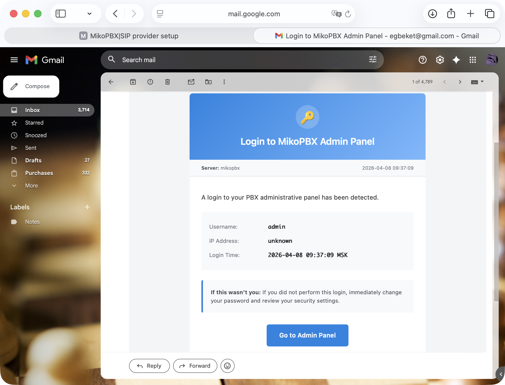<figcaption><p>Пример email-уведомления о входе</p></figcaption></figure>

### Консольное меню в стиле ESXi

Реализовано полноэкранное меню статуса с системной информацией и метриками, отображаемое при подключении к консоли сервера (IPMI, виртуальная консоль, SSH).

Меню отображает ASCII-логотип MikoPBX, текущие IP-адреса всех интерфейсов, загрузку CPU, памяти и диска и другую полезную информацию. Нажмите для любую клавишу для перехода в консольное меню. Доступные действия в нем: настройка сети, перезагрузка/выключение, просмотр логов, мониторинг системы, проверка целостности и управление модулями. В меню статуса нажмите **Ctrl+C** для выхода в shell.

<figure>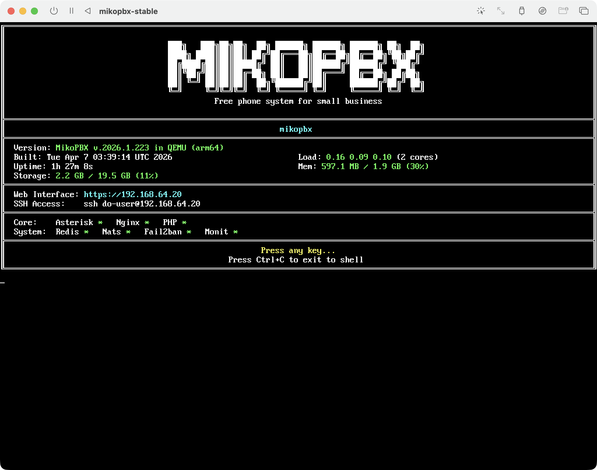<figcaption><p>Меню статуса MikoPBX</p></figcaption></figure>

### CSV импорт/экспорт сотрудников

Добавлена массовая загрузка и выгрузка внутренних номеров через CSV-файлы. Это упрощает создание десятков и сотен номеров, миграцию с других АТС и резервное копирование настроек.

Для импорта откройте **Сотрудники**, нажмите **Импорт из CSV** и выберите файл с колонками: `number`, `mobile`, `email`, `name`, `username`, `secret`. Доступны три стратегии обновления: **Объединить** (обновить существующие, добавить новые), **Заменить** (перезаписать существующие) и **Пропустить** (добавить только новые).

Экспорт выполняется аналогично — нажмите **Экспорт в CSV** для скачивания файла со всеми внутренними номерами.

<figure>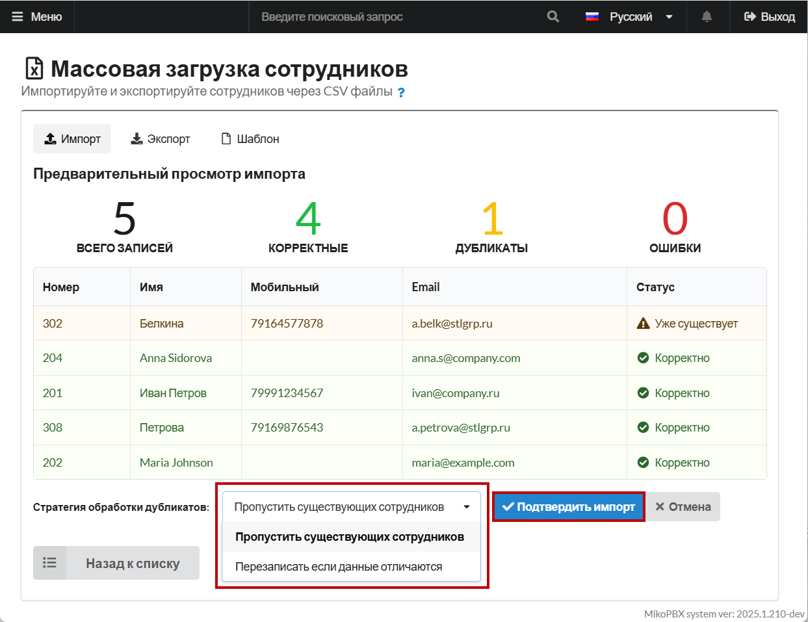<figcaption><p>Импорт сотрудников и стратегия обработки результатов</p></figcaption></figure>

Подробнее в разделе статьи **Сотрудники**:


[extensions.md](../../manual/telephony/extensions.md)


### Копирование конфигураций

Добавлена функция **Сохранить как копию** для быстрого дублирования настроек IVR-меню, очередей, конференций и пользователей Asterisk Manager. Откройте карточку существующей конфигурации, нажмите **Сохранить как копию**, измените имя и параметры — будет создана независимая копия.

Применение: создание похожих IVR для разных офисов, дублирование очередей с небольшими изменениями, тестирование изменений на копии.

### Улучшения DataTable

Обновлены таблицы данных во всём интерфейсе. Добавлен retry-механизм с автоматической повторной попыткой при ошибке сети, интеграция с ACL (автоматическое скрытие недоступных действий), сохранение фильтров CDR между обновлениями страницы. Код оптимизирован на ES6 для более быстрой загрузки.

### Интерактивные подсказки (tooltips)

Добавлены контекстные подсказки с подробными объяснениями настроек. Рядом со сложными параметрами появился значок **(i)** — при наведении отображается всплывающая подсказка с объяснением простым языком. Подсказки доступны в настройках провайдеров (кодеки, транспорт), сетевых параметрах (MTU, VLAN) и настройках безопасности (Rate Limit, Fail2Ban).

<figure>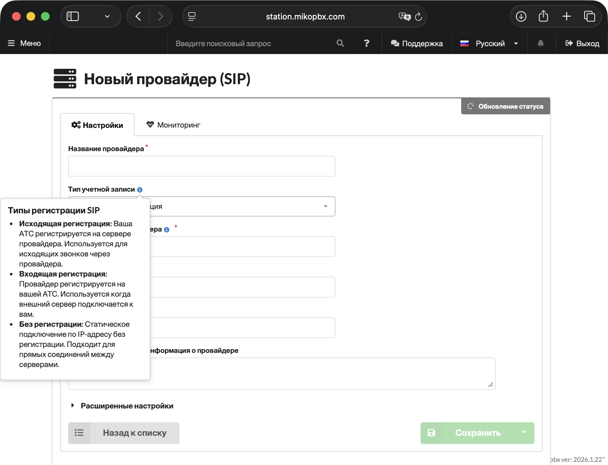<figcaption><p>Интерактивные подсказки в настройках провайдера</p></figcaption></figure>

### Визуализация хранилища

Добавлено графическое отображение использования дискового пространства в разделе **Система → Хранилище → Информация о хранилище**. Диаграмма показывает распределение места по категориям: записи разговоров, системные логи, backup-файлы, модули и другие файлы — с процентами и размером для каждой категории.

<figure>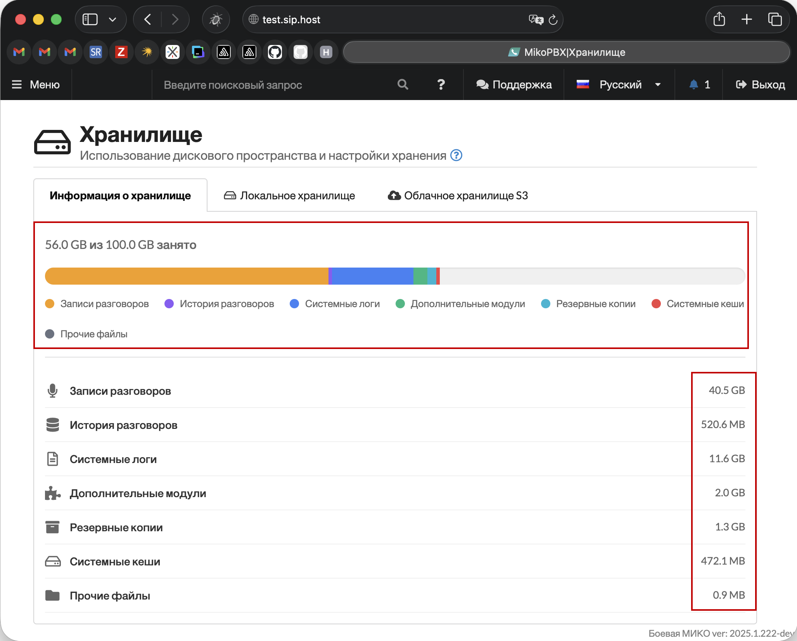<figcaption><p>Визуализация использования дискового пространства</p></figcaption></figure>

***

### Улучшения безопасности

#### SHA-512 хеши паролей

Пароли теперь хранятся в формате SHA-512 вместо ранее использовавшегося MD5. Миграция происходит автоматически при первом входе пользователя — никаких действий со стороны администратора не требуется.

#### Уровень защиты от вторжений

Переработан интерфейс настройки Fail2Ban. Вместо ручного ввода параметров теперь доступен ползунок с четырьмя предустановленными уровнями защиты, каждый из которых автоматически настраивает количество допустимых попыток, период наблюдения и время блокировки:

* **Слабая** — 20 попыток за 10 минут, бан на 10 минут. Подходит для первоначальной настройки и доверенных сетей.
* **Нормальная** — 10 попыток за 1 час, бан на 1 день. Рекомендуется для большинства инсталляций.
* **Усиленная** — 5 попыток за 6 часов, бан на 7 дней. Для серверов, доступных из интернета.
* **Паранойя** — 3 попытки за 24 часа, бан на 30 дней. Для серверов под активной атакой.

Убедитесь, что IP-адреса администраторов добавлены в белый список перед повышением уровня защиты.

<figure><figcaption><p>Настройка уровня защиты от вторжений</p></figcaption></figure>

<figure><figcaption><p>Список заблокированных IP</p></figcaption></figure>

#### SIP Rate Limiting

Добавлено ограничение количества новых SIP-подключений с одного IP-адреса для защиты от DDoS и flood-атак на SIP-сервер. Настраивается через параметр PBXFirewallMaxReqSec; защита работает на уровне firewall (iptables recent).

#### Защита от path traversal в CDR

Исправлена уязвимость, позволявшая потенциально скачивать системные файлы через API: добавлена валидация путей к файлам записей.

#### Shell escaping в DHCP callbacks

Исправлена уязвимость, связанная с возможностью command injection через DHCP-параметры: добавлено экранирование аргументов команд.

***

### Изменения в конфигурации

#### Docker развертывание

Работа Docker-контейнеров не претерпела изменений. Добавлена поддержка cloud provisioning через переменные окружения и унифицированный entrypoint для Docker и LXC.

Пример запуска:

```bash
docker run -d \
  -e WEB_ADMIN_PASSWORD=MyPassword123 \
  -e WEB_SSH_PASSWORD=SshPassword456 \
  -e PBX_NAME=office-pbx \
  -e PBX_LANGUAGE=ru-ru \
  -p 80:80 -p 443:443 -p 5060:5060/udp \
  mikopbx/mikopbx:latest
```

#### LXC развертывание

Полная поддержка LXC-контейнеров с управлением сетью внутри контейнера, поддержкой DHCP (IPv4/IPv6) и работой firewall при наличии `CAP_NET_ADMIN`.

#### Расположение файлов

| Файл               | Путь                                                                          |
| ------------------ | ----------------------------------------------------------------------------- |
| Основная БД        | `/cf/conf/mikopbx.db` (без изменений)                                         |
| Метаданные записей | `/storage/usbdisk1/mikopbx/astlogs/asterisk/recording_storage.db` **(новое)** |
| Системные логи     | `/storage/usbdisk1/mikopbx/log/system/messages`                               |
| PHP логи           | `/storage/usbdisk1/mikopbx/log/php/error.log`                                 |
| Nginx логи         | `/storage/usbdisk1/mikopbx/log/nginx/error.log`                               |
| Asterisk логи      | `/storage/usbdisk1/mikopbx/log/asterisk/`                                     |
