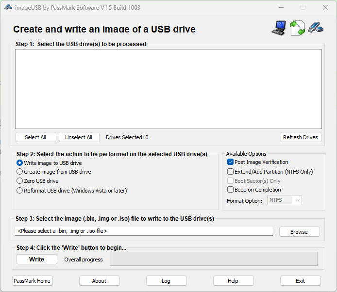

# Отдельный компьютер


Протестировано на:

* Intel NUC DCCP847DYE
* Intel NUC D54250WUKH


Большинство современных ПК поддерживают загрузку с USB устройства.\
**MikoPBX** может быть запущена с USB устройства.&#x20;


**Обратите внимание!** Минимальная емкость USB диска - **600MB**



* Режим **Bootable USB** предназначен для работы АТС с USB диска (флэш карты). Используйте для установки файл **\*.img**
* Режим **Live USB** предназначен для установки или восстановления системы. Используйте для установки файл **\*.iso**


### Используем Windows <a href="#ispolzuem_windows" id="ispolzuem_windows"></a>

Для создания загрузочного USB диска рекомендуем использовать приложение **imageUSB**. Скачать можно по [ссылке](http://www.osforensics.com/tools/write-usb-images.html). Альтернатива - используйте [**balenaEtcher**](https://www.balena.io/etcher/)

1. Загрузите и установите приложение.&#x20;
2. Запустите **ImageUSB**

<figure><figcaption><p>Стартовое окно ImageUSB</p></figcaption></figure>

3. Выполните действие «**Refresh drives**». Выберите **USB диск,** далее выберите файл образа. Выполните действие «**Write**»

<figure><figcaption><p>Руководство по записи образа на флэш-накопитель</p></figcaption></figure>

4. Дождитесь окончания записи, далее подключите **USB** диск к ПК. Перезагрузите ПК для загрузки с диска.

### Используем OSX <a href="#ispolzuem_osx" id="ispolzuem_osx"></a>


Будьте внимательны при выборе устройства к форматированию. Изменения не обратимы!


1. Откройте приложение «**Terminal**» (Терминал)
2. Подключите USB диск
3. Выполните команду:

```
diskutil list
```

Будет отображена информация о **всех** подключенных дисках

<figure><figcaption><p>Список всех подключенных дисков</p></figcaption></figure>

В текущем примере имя устройства USB «**/dev/disk3**». Cравним вывод команды «diskutil list» до и после подключения устройства.

4. Форматируем диск. Потребуется ввести пароль администратора

```
sudo diskutil eraseDisk FAT32 NONAME  MBRFormat /dev/disk3;
```

5. Отключим устройство следующей командой

```
sudo diskutil unmountDisk /dev/disk3;
```

6. Запишем образ на **USB носитель**

```
sudo dd if=1.0.64-9.0-svn-mikopbx-x86-64-cross-linux.img of=/dev/disk3 bs=1m;
```

Дождитесь окончания записи, далее подключите **USB** диск к ПК. Перезагрузите ПК для загрузки с диска.
