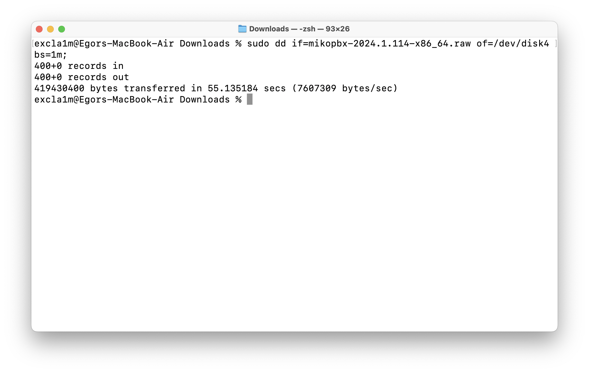

# Установка системы на USB носитель (Bootable USB)

Перед началом загрузите образ диска с расширением .raw. Сделать это можно [здесь](https://www.mikopbx.ru/download/).

## Установка системы на USB-носитель

### Windows


Размер USB-носителя должен быть не менее 1 ГБ. **Все данные на USB-носителе будут удалены!**


В данной инструкции будет использоваться утилита balenaEtcher. Скачать можно [по ссылке](https://etcher.balena.io/).

1. Первым делом, отформатируйте Ваш USB-носитель со следующими параметрами:

* **File system** - FAT32
* **Allocation unit size** - 8192 bytes

<figure><figcaption><p>Форматирование USB-накопителя</p></figcaption></figure>

2. Откройте balenaEtcher. Нажмите "**Flash from file**" и выберите ранее загруженный .raw файл.

<figure><figcaption><p>Опция "Flash from drive"</p></figcaption></figure>

3. Нажмите "**Select target**".

<figure><figcaption><p>"Select target"</p></figcaption></figure>

4. Из списка выберите Ваш USB-носитель.

Нажмите "**Select 1**".

<figure><figcaption><p>Выбор диска для записи</p></figcaption></figure>

5. Далее нажмите "Flash!"

<figure><figcaption><p>Начало записи образа</p></figcaption></figure>

Дождитесь окончания записи. Далее перейдите к разделу "[Загрузка с USB-накопителя](bootable-usb.md#zagruzka-s-usb-nakopitelya)".

<figure><figcaption><p>Успешная запись образа</p></figcaption></figure>

### MacOS

1. Подключите Ваш usb-носитель и откройте Terminal.


Размер USB-носителя должен быть не менее 1 ГБ. **Все данные на USB-носителе будут удалены!**


2. Выполните команду:

```bash
diskutil list
```

Будет отображена информация про все подключенные диски. Нас интересует диск с маркировкой **(external, physical)**. В нашем случае это **disk4, в Вашем случае номер может быть другим**. Используйте его номер для выполнения дальнейших шагов в этой инструкции.

<figure><figcaption><p>Вывод команды diskutil list</p></figcaption></figure>

3. Далее необходимо отформатировать USB носитель. Для этого используйте команду:

```bash
sudo diskutil eraseDisk FAT32 NONAME  MBRFormat /dev/disk4;
```


**Все данные на диске будут удалены!** Еще раз проверьте название диска который Вы форматируете!


Для подтверждения введите пароль администратора, дождитесь окончания форматирования.

<figure><figcaption><p>Форматирование диска</p></figcaption></figure>

4. Отмонтируйте (отключите) диск, используя следующую команду:

```bash
sudo diskutil unmountDisk /dev/disk4;
```

<figure><figcaption><p>Отключение диска (команда unmountDisk)</p></figcaption></figure>

5. Запишите образ на USB-носитель, используя следующую команду:

```bash
sudo dd if=mikopbx-2024.1.114-x86_64.raw of=/dev/disk4 bs=1m;
```

Дождитесь окончания записи образа. Далее перейдите к разделу "[Загрузка с USB-накопителя](bootable-usb.md#zagruzka-s-usb-nakopitelya)".

<figure><figcaption><p>Успешная запись образа</p></figcaption></figure>

### Linux

В данной инструкции в качестве примера, запись образа будет произведена на Ubuntu 24.04.

1. Подключите Ваш usb-носитель и откройте Terminal.


Размер USB-носителя должен быть не менее 1 ГБ. **Все данные на USB-носителе будут удалены!**


2. Выполните команду:

```bash
lsblk
```

Будет отображена информация про все подключенные диска. Найдите в этом списке Ваш usb-носитель и запомните его наименование. В нашем случае, это диск sdb.

<figure><figcaption><p>Список всех подключенных дисков</p></figcaption></figure>

3. Далее необходимо отформатировать usb-носитель, используя следующую команду:

```bash
sudo mkfs.vfat -F 32 -n NONAME /dev/sdb
```


**Все данные на диске будут удалены!** Еще раз проверьте название диска который Вы форматируете!


Для подтверждения введите пароль администратора, дождитесь окончания форматирования.

<figure><figcaption><p>Форматирование диска</p></figcaption></figure>

4. Отмонтируйте (отключите) диск, используя следующую команду:

```bash
sudo umount /dev/sdb*
```

<figure><figcaption><p>Команда "umount"</p></figcaption></figure>

5. Запишите образ на USB-носитель, используя следующую команду:

```bash
sudo dd if=mikopbx-2024.1.114-x86_64.raw of=/dev/sdb bs=1M
```

<figure><figcaption><p>Успешно записанный образ</p></figcaption></figure>

Дождитесь окончания записи образа. Далее перейдите к разделу "[Загрузка с USB-накопителя](bootable-usb.md#zagruzka-s-usb-nakopitelya)".

## Загрузка с USB-накопителя
