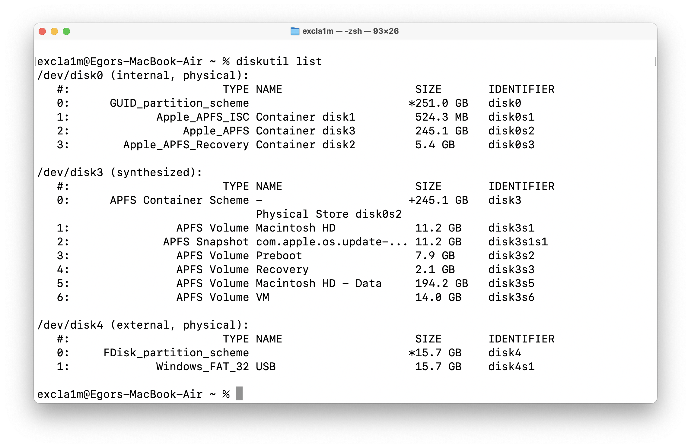
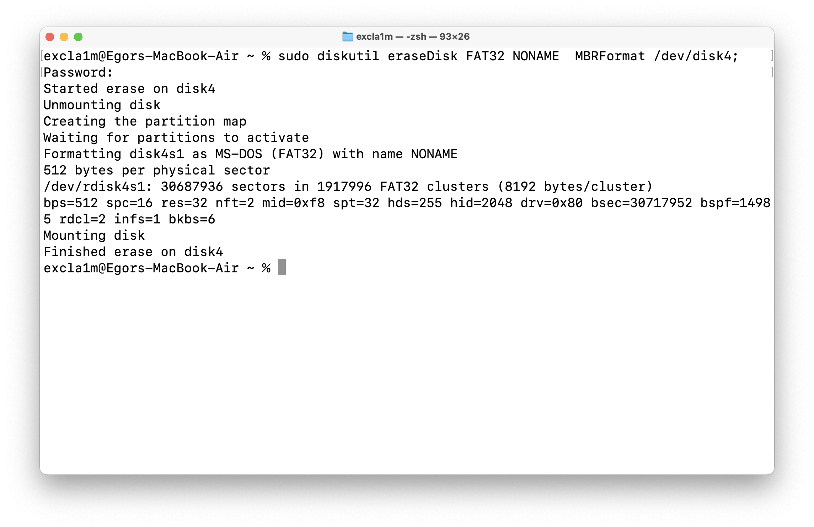
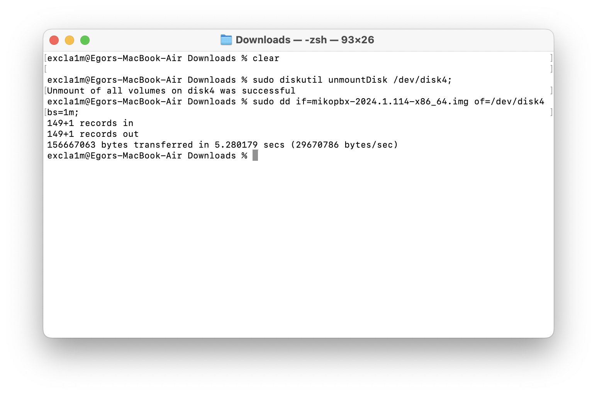

# Установка системы на USB носитель (Bootable USB)

Перед началом загрузите образ диска с расширением .img. Сделать это можно [здесь](https://www.mikopbx.ru/download/).

### Windows

...

### MacOS

1. Подключите Ваш usb-носитель и откройте Terminal.


Размер USB-носителя должен быть не менее 1 ГБ. **Все данные на USB-носителе будут удалены!**


2. Выполните команду:

```bash
diskutil list
```

Будет отображена информация про все подключенные диски. Нас интересует диск с маркировкой **(external, physical)**. В нашем случае это **disk4, в Вашем случае номер может быть другим**. Используйте его номер для выполнения дальнейших шагов в этой инструкции.

<figure><figcaption><p>Вывод команды diskutil list</p></figcaption></figure>

3. Далее необходимо отформатировать USB носитель. Для этого используйте команду:

```bash
sudo diskutil eraseDisk FAT32 NONAME  MBRFormat /dev/disk4;
```


**Все данные на диске будут удалены!** Еще раз проверьте название диска который Вы форматируете!


Для подтверждения введите пароль администратора, дождитесь окончания форматирования.

<figure><figcaption><p>Форматирование диска</p></figcaption></figure>

4. Отмонтируйте (отключите) диск, используя следующую команду:

```bash
sudo diskutil unmountDisk /dev/disk4;
```

<figure><figcaption><p>Отключение диска (команда unmountDisk)</p></figcaption></figure>

5. Запишите образ на USB-носитель, используя следующую команду:

```bash
sudo dd if=mikopbx-2024.1.114-x86_64.img of=/dev/disk4 bs=1m;
```

Дождитесь окончания записи образа. Далее перейдите к разделу "".

<figure><figcaption><p>Успешная запись образа</p></figcaption></figure>

### Linux

