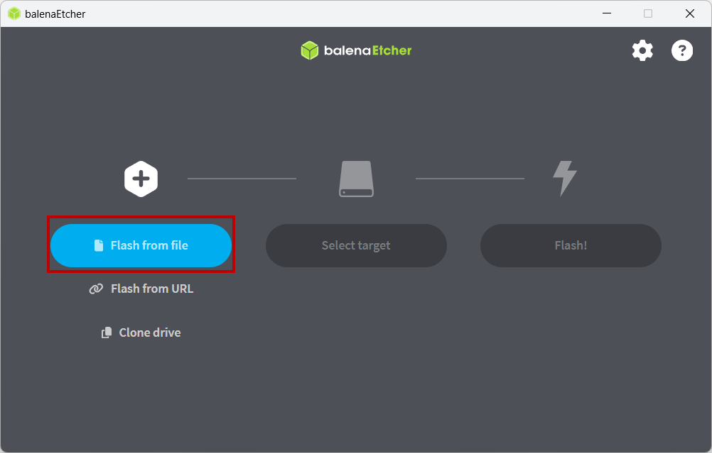
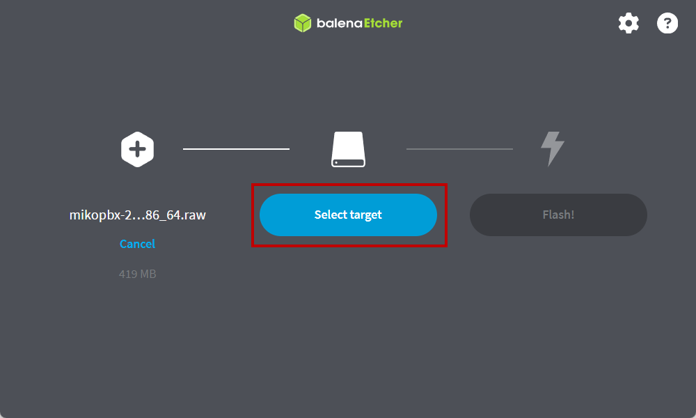
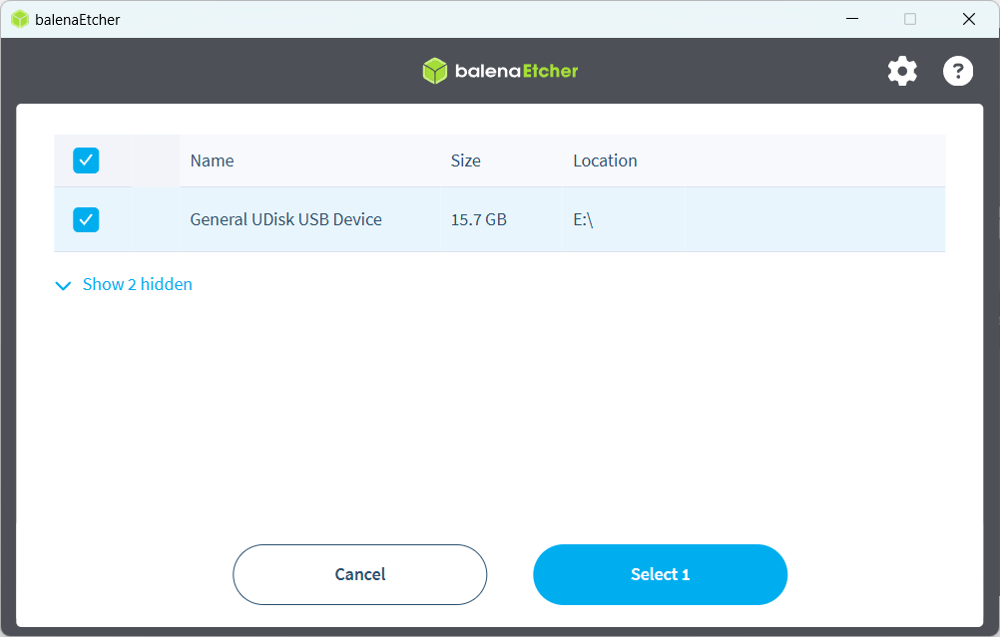
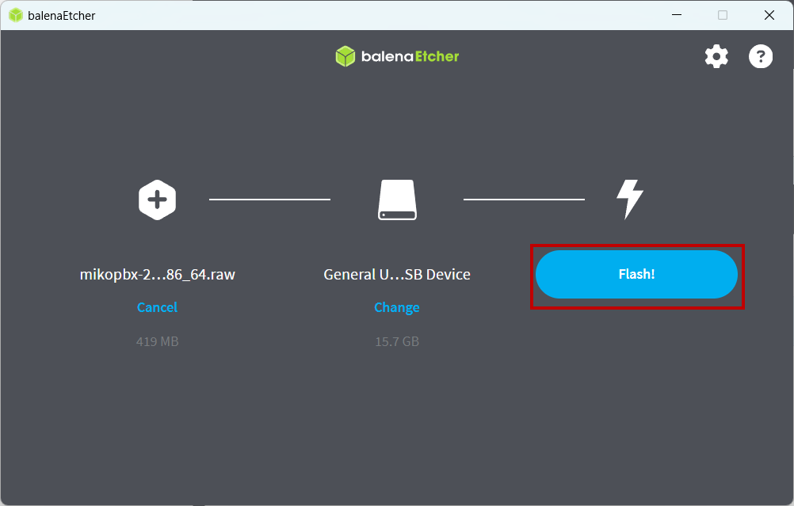
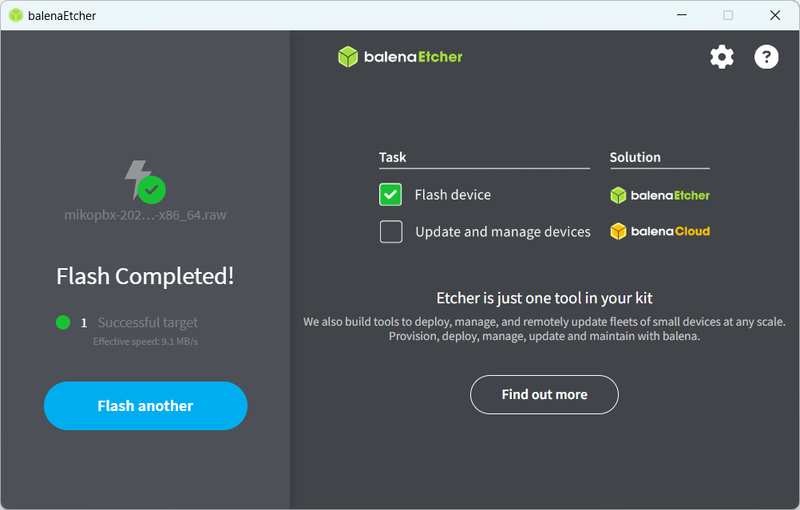
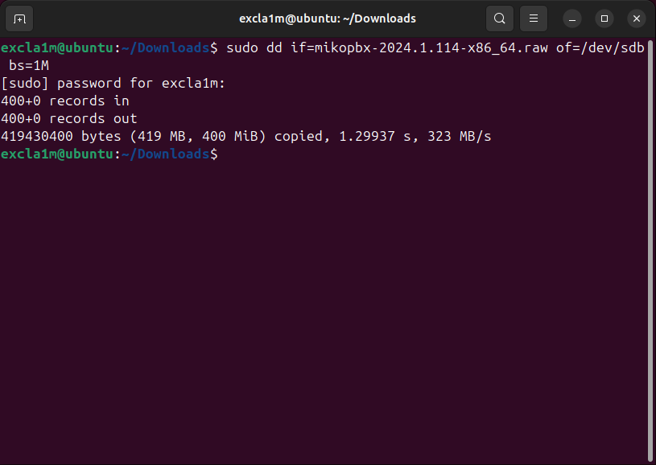
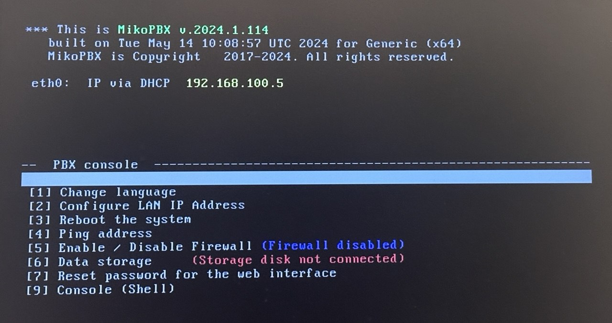
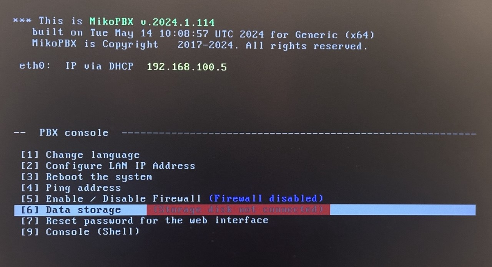
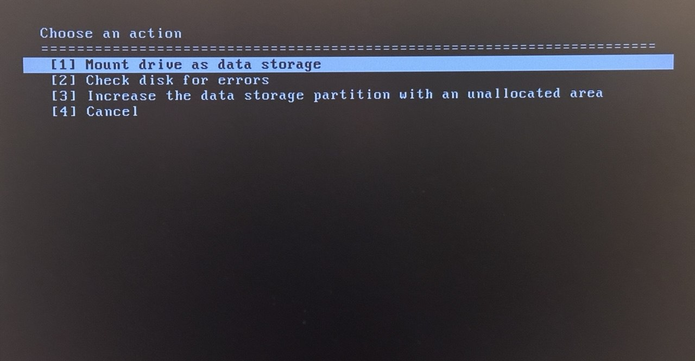
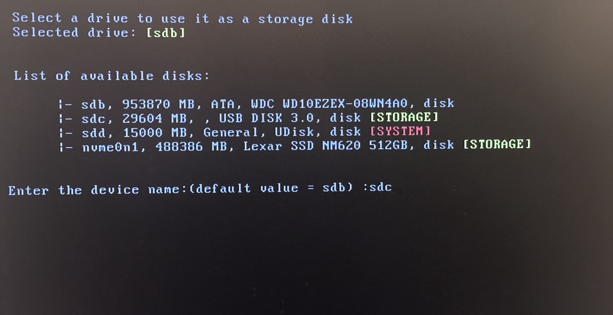

# Installing the system on a USB drive (Bootable USB)

Before starting, download the disk image file with the `.raw` extension. You can do this [here](https://www.mikopbx.com/download/).

## Installing the system on a USB drive

### Windows


The USB drive must be at least 1 GB in size. **All data on the USB drive will be deleted!**


This guide uses the **balenaEtcher** utility. You can download it [here](https://etcher.balena.io/).

1. First, format your USB drive with the following parameters:

* **File system** - FAT32
* **Allocation unit size** - 8192 bytes

<figure><figcaption><p>Formatting USB drive</p></figcaption></figure>

2. Open **balenaEtcher**. Click "**Flash from file**" and select the previously downloaded `.raw` file.

<figure><figcaption><p>"Flash from file" button</p></figcaption></figure>

3. Click "**Select target**".

<figure><figcaption><p>"Select target" button</p></figcaption></figure>

4. From the list, select your USB drive. Then click "**Select 1**".

<figure><figcaption><p>Selecting the disk for writing</p></figcaption></figure>

5. Next, click "**Flash!**"

<figure><figcaption><p>"Flash!" button</p></figcaption></figure>

Wait for the process to complete. Then proceed to the section ["Booting from USB drive"](installing-the-system-on-a-usb-drive-bootable-usb.md#booting-from-usb-drive).

<figure><figcaption><p>Successfully writed image</p></figcaption></figure>

### MacOS

1. Connect your USB drive and open the Terminal.


The USB drive must be at least 1 GB in size. **All data on the USB drive will be deleted!**


2. Run the following command:

```bash
diskutil list
```

This command displays all connected disks. Look for the disk labeled **(external, physical)**.\
In our case, it is **disk4** (the number may differ on your system). Use this number in the following steps.

3. Next, format the USB drive using this command:

```bash
sudo diskutil eraseDisk FAT32 NONAME MBRFormat /dev/disk4;
```


**All data on the disk will be deleted!** Double-check the disk name before formatting!


Enter your administrator password when prompted and wait for the formatting to complete.

4. Unmount (disconnect) the disk using the following command:

```bash
sudo diskutil unmountDisk /dev/disk4;
```

5. Write the image to the USB drive using this command:

```bash
sudo dd if=mikopbx-2024.1.114-x86_64.raw of=/dev/disk4 bs=1m;
```

Wait for the writing process to complete.\
Then proceed to the section ["Booting from USB drive"](installing-the-system-on-a-usb-drive-bootable-usb.md#booting-from-usb-drive).

### Linux

In this example, the image writing process will be demonstrated on Ubuntu 24.04.

1. Connect your USB drive and open the Terminal.


The USB drive must be at least 1 GB in size. **All data on the USB drive will be deleted!**


2. Run the following command:

```bash
lsblk
```

This command displays information about all connected disks. Find your USB drive in the list and note its name. In our case, it is **sdb**.

<figure><figcaption><p>"lsblk" command</p></figcaption></figure>

3. Next, format the USB drive using this command:

```bash
sudo mkfs.vfat -F 32 -n NONAME /dev/sdb
```


**All data on the disk will be deleted!** Double-check the disk name before formatting!


Enter your administrator password when prompted and wait for the formatting to complete.

<figure><figcaption><p>Formatting the disk</p></figcaption></figure>

4. Unmount (disconnect) the disk using this command:

```bash
sudo umount /dev/sdb*
```

<figure><figcaption><p>"umount" command</p></figcaption></figure>

5. Write the image to the USB drive using this command:

```bash
sudo dd if=mikopbx-2024.1.114-x86_64.raw of=/dev/sdb bs=1M
```

Wait for the process to complete. Then proceed to the section ["Booting from USB drive"](installing-the-system-on-a-usb-drive-bootable-usb.md#booting-from-usb-drive).

<figure><figcaption><p>Successfully writed image</p></figcaption></figure>

## Booting from USB drive

1. Boot from the USB drive. If errors occur (black screen), make sure that:

* **Secure Boot** - Disabled
* **CSM (Compatibility Support Module)** - Enabled

<figure><figcaption><p>Booting from USB drive</p></figcaption></figure>

2. The system has successfully booted, but no drive is connected for storing call recordings. To connect it, use the arrow keys to navigate to "**\[6] Data storage**" and press **Enter**.

<figure><figcaption><p>"<strong>[6] Data Storage</strong>" section</p></figcaption></figure>

3. Then select "**Mount drive as data storage**" to connect the disk.

<figure><figcaption><p>"<strong>Mount drive as data storage</strong>" option</p></figcaption></figure>

4. Select the disk that will be used to store call recordings. Enter its ID (name), for example **sdc** in our case, and press **Enter**.

<figure><figcaption><p>Selecting the disk</p></figcaption></figure>

5. After this, the system will reboot and will be ready for use and for the first login to the Web interface.

<figure><figcaption><p>Successfully installed MikoPBX system</p></figcaption></figure>

To open the Web interface, enter your MikoPBX IP address in your browser’s address bar.\
Use the default login credentials.


Default credentials for first login to the Web interface:

Login: admin\
Password: admin


<figure><figcaption></figcaption></figure>
