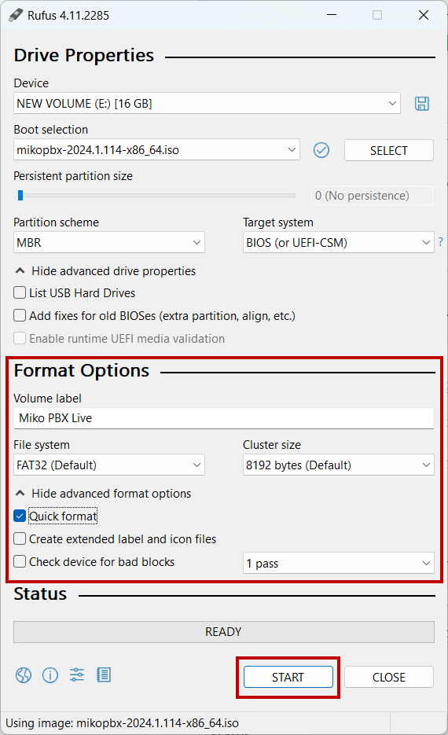

# Installation via writing the image to a USB drive (Live USB)

## Writing the image to a USB drive

### Windows

Before starting the process, format your USB drive with the following parameters:

* **File system** - FAT32
* **Allocation unit size** - 8192 bytes

<figure><figcaption><p>Formatting the disk</p></figcaption></figure>

The image will be written using the Rufus utility. You can download it [here](https://rufus.ie/en/).

<figure><figcaption><p>Rufus main page</p></figcaption></figure>


The USB drive size must be at least 1 GB. **All data on the USB drive will be deleted!**


1. After installing the utility, open its interface. In the "**Device**" section, select your USB drive, click **SELECT**, and choose the previously downloaded [.iso image](https://www.mikopbx.com/download/). Its verification will begin.

<figure><figcaption><p>Selected image and disk</p></figcaption></figure>

2. Once verification is complete, set the following parameters and click **START**:

* **File system** - FAT32
* **Cluster size** - 8192 Bytes
* **Quick format** - checked
* **Create extended label and icon files -** **uncheck this option**

<figure><figcaption><p>Starting the image writing process</p></figcaption></figure>

3. In the popup window, **select "Write in DD Image mode"** and click **OK**.

<figure><figcaption><p>"Write in DD image mode" option</p></figcaption></figure>

4. In the confirmation window warning that all data on the disk will be erased, click **OK**.'

<figure><figcaption><p>Disk format confirmation</p></figcaption></figure>

Wait until the image writing process is complete. When done, you’ll see the message "READY".\
Then proceed to the section ["System installation"](live-usb.md#system-installation).

<figure><figcaption><p>Successfully writed image</p></figcaption></figure>

### MacOS

1. Connect your USB drive and open the Terminal.


The USB drive size must be at least 1 GB. **All data on the USB drive will be deleted!**


2. Run the following command:

```bash
diskutil list
```

This will display information about all connected disks. Find the one labeled **(external, physical)** — for example, **disk4** (the number may differ on your system). Use its number for the next steps.

<figure><figcaption><p>List of all available disks</p></figcaption></figure>

3. Next, format the USB drive with this command:

```bash
sudo diskutil eraseDisk FAT32 NONAME MBRFormat /dev/disk4;
```


**All data on the disk will be deleted!** Double-check the disk name before formatting!


Enter your admin password when prompted and wait until formatting completes.

<figure><figcaption><p>Formatting the disk</p></figcaption></figure>

4. Unmount (disconnect) the disk using this command:

```bash
sudo diskutil unmountDisk /dev/disk4;
```

<figure><figcaption><p>unmountDisk command</p></figcaption></figure>

5. Write the image to the USB drive using this command:

```bash
sudo dd if=mikopbx-2024.1.114-x86_64.iso of=/dev/disk4 bs=1m;
```

Wait until the writing process is complete. Then proceed to the section ["System installation"](live-usb.md#system-installation).

<figure><figcaption><p>Successfully writed image</p></figcaption></figure>

### Linux

This example uses Ubuntu 24.04 to demonstrate the image writing process.

1. Connect your USB drive and open the Terminal.


The USB drive size must be at least 1 GB. **All data on the USB drive will be deleted!**


2. Run the following command:

```bash
lsblk
```

This will display information about all connected drives.\
Find your USB drive in the list and remember its name. In our example, it is **sdb**.

<figure><figcaption><p>lsblk command</p></figcaption></figure>

3. Next, format the USB drive with the following command:

```bash
sudo mkfs.vfat -F 32 -n NONAME /dev/sdb
```


**All data on the disk will be deleted!** Double-check the disk name before formatting!


Enter your admin password when prompted and wait until formatting completes.

<figure><figcaption><p>Disk fromatting</p></figcaption></figure>

4. Unmount (disconnect) the disk using this command:

```bash
sudo umount /dev/sdb*
```

<figure><figcaption><p>umount command</p></figcaption></figure>

5. Write the image to the USB drive using this command:

```bash
sudo dd if=mikopbx-2024.1.114-x86_64.iso of=/dev/sdb bs=1M
```

Wait until the writing process is complete. Then proceed to the section ["System installation"](live-usb.md#system-installation).

<figure><figcaption><p>Successfully writed image</p></figcaption></figure>

## System installation

1. Boot from the USB drive.\
   If errors occur (black screen), make sure that:

* **Secure Boot** - Disabled
* **CSM (Compatibility Support Module)** - Enabled

<figure><figcaption><p>System booted from LiveUSB device</p></figcaption></figure>

2. The system is booted in LiveCD mode — indicated by the red message. To install, use the keyboard arrows to navigate to "**\[8] Install**" and press **Enter**.

<figure><figcaption><p>Section "[8] Install"</p></figcaption></figure>

3. Select the disk where the system will be installed. Enter its ID (name), for example **sdc**.

<figure><figcaption><p>Selecting the system disk</p></figcaption></figure>

4. Confirm your choice by typing "**y**" to continue.


**All data** on the selected disk will be erased!


<figure><figcaption><p>Confirmation of your choice</p></figcaption></figure>

5. After installation, you will be asked to select a disk for storing call recordings.\
   Make your choice as before.

<figure><figcaption><p>Selecting the records storage disk</p></figcaption></figure>

6. After that, the system will reboot and be ready for use and the first login to the Web interface.

<figure><figcaption><p>Successfully installed system</p></figcaption></figure>

To open the Web interface, enter the IP address of your MikoPBX in your browser’s address bar.\
Use the default login credentials.


Default credentials for first login to the Web interface:

Login: admin\
Password: admin


<figure><figcaption></figcaption></figure>
