# Установка с записью образа на USB-носитель (Live USB)



## Запись образа на USB-носитель&#x20;

### Windows

Перед началом процесса, отформатируйте Ваш носитель со следующими параметрами:

* **File system** - FAT32
* **Allocation unit size** - 8192 bytes

<figure>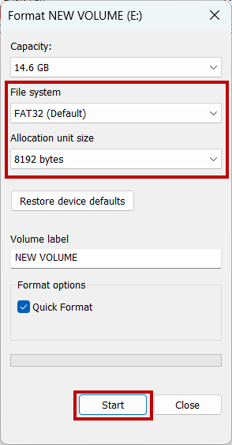<figcaption><p>Форматирование диска</p></figcaption></figure>

Для записи образа будет использована утилита Rufus. Скачать ее можно [по ссылке](https://rufus.ie/en/).


Размер USB-носителя должен быть не менее 1 ГБ. **Все данные на USB-носителе будут удалены!**


<figure>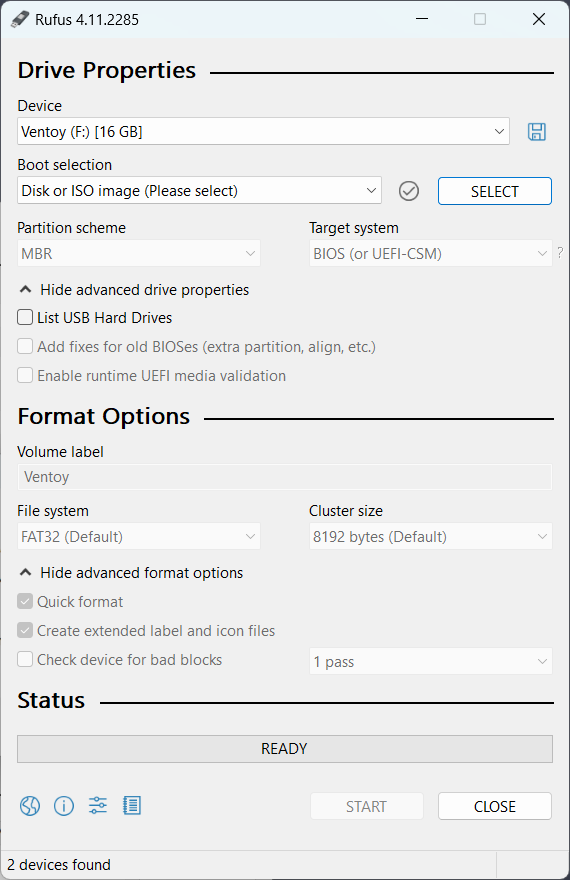<figcaption><p>Утилита Rufus</p></figcaption></figure>

1. После установки утилиты, перейдите в ее интерфейс. В разделе "Device" выберите Ваш носитель, нажмите SELECT и выберите ранее загруженный [.iso образ](https://www.mikopbx.ru/download/). Начнется его проверка.

<figure><figcaption><p>Выбранный образ и носитель</p></figcaption></figure>

2. После окончания проверки, установите следующие параметры и нажмите "START":

* **File system** - FAT32
* **Cluster size** - 8192 Bytes
* **Quick format -** отмечено
* **Create extended label and icon files -&#x20;**<mark style="color:$success;">**убрать галочку**</mark>

<figure><figcaption><p>Начало записи образа</p></figcaption></figure>

3. После этого, во всплывающем окне **выберите "Write in DD Image mode".** Нажмите "OK".

<figure>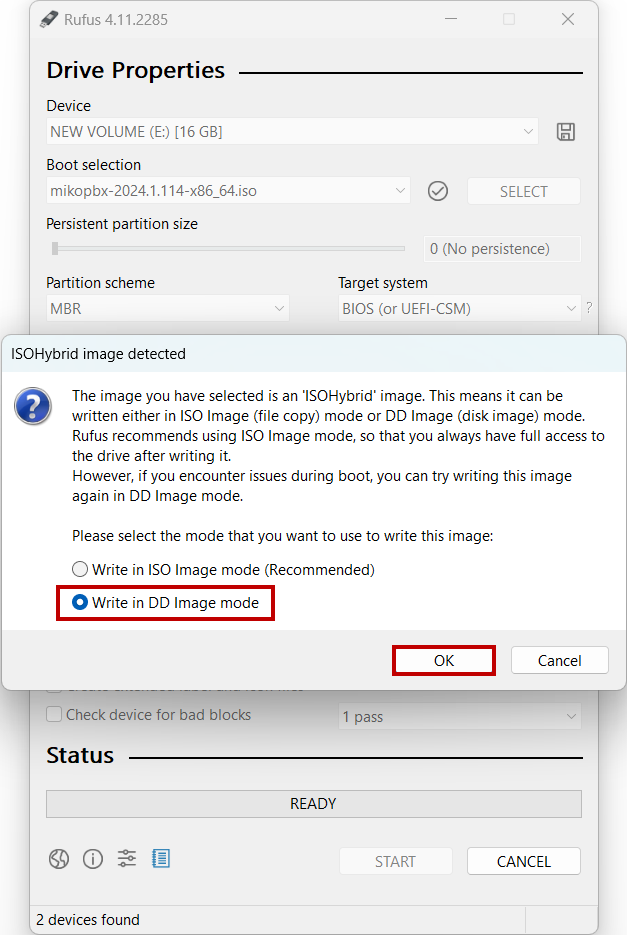<figcaption><p>Параметр "Write in DD image mode"</p></figcaption></figure>

4. Во всплывающем предупреждении, о том, что все данные на диске будут удалены, нажмите "ОК".

<figure>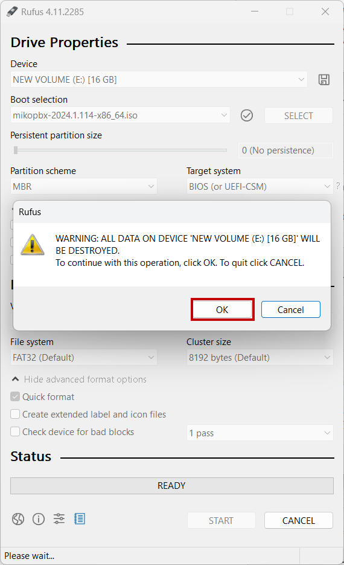<figcaption><p>Подтверждение форматирования диска</p></figcaption></figure>

Дождитесь окончания записи образа. По его завершении, Вы увидите надпись "<mark style="color:$success;">READY</mark>". Далее перейдите к разделу ["Установка системы"](live-usb.md#ustanovka-sistemy).

<figure>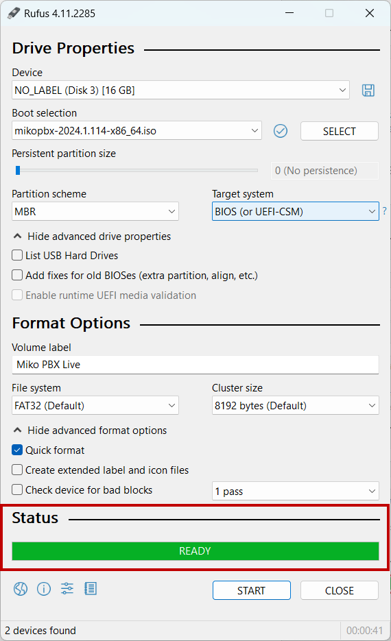<figcaption><p>Успешная запись образа на USB-носитель</p></figcaption></figure>

### MacOS

1. Подключите Ваш usb-носитель и откройте Terminal.


Размер USB-носителя должен быть не менее 1 ГБ. **Все данные на USB-носителе будут удалены!**


2. Выполните команду:

```bash
diskutil list
```

Будет отображена информация про все подключенные диски. Нас интересует диск с маркировкой **(external, physical)**. В нашем случае это **disk4, в Вашем случае номер может быть другим**. Используйте его номер для выполнения дальнейших шагов в этой инструкции.

<figure>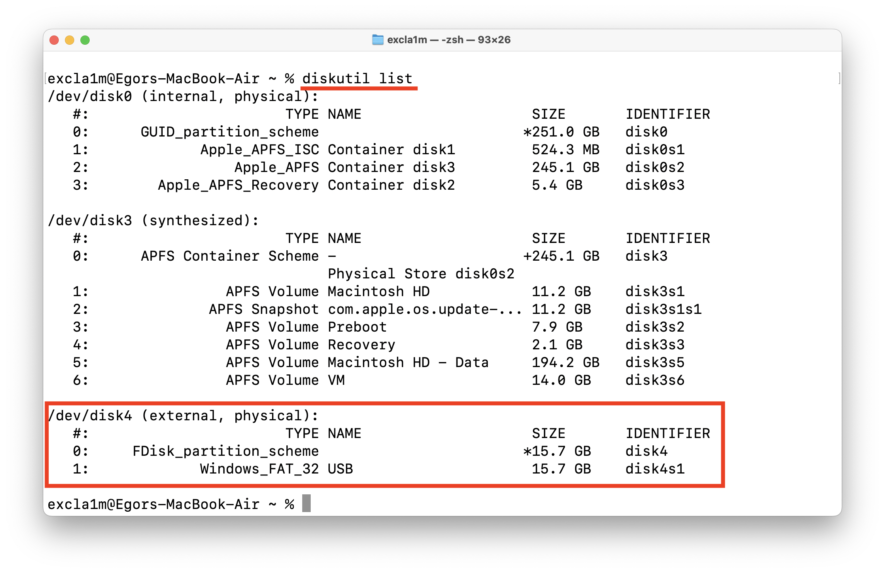<figcaption><p>Список дисков</p></figcaption></figure>

3. Далее необходимо отформатировать USB носитель. Для этого используйте команду:

```bash
sudo diskutil eraseDisk FAT32 NONAME  MBRFormat /dev/disk4;
```


**Все данные на диске будут удалены!** Еще раз проверьте название диска который Вы форматируете!


Для подтверждения введите пароль администратора, дождитесь окончания форматирования.

<figure><figcaption><p>Форматирование USB-носителя</p></figcaption></figure>

4. Отмонтируйте (отключите) диск, используя следующую команду:

```bash
sudo diskutil unmountDisk /dev/disk4;
```

<figure>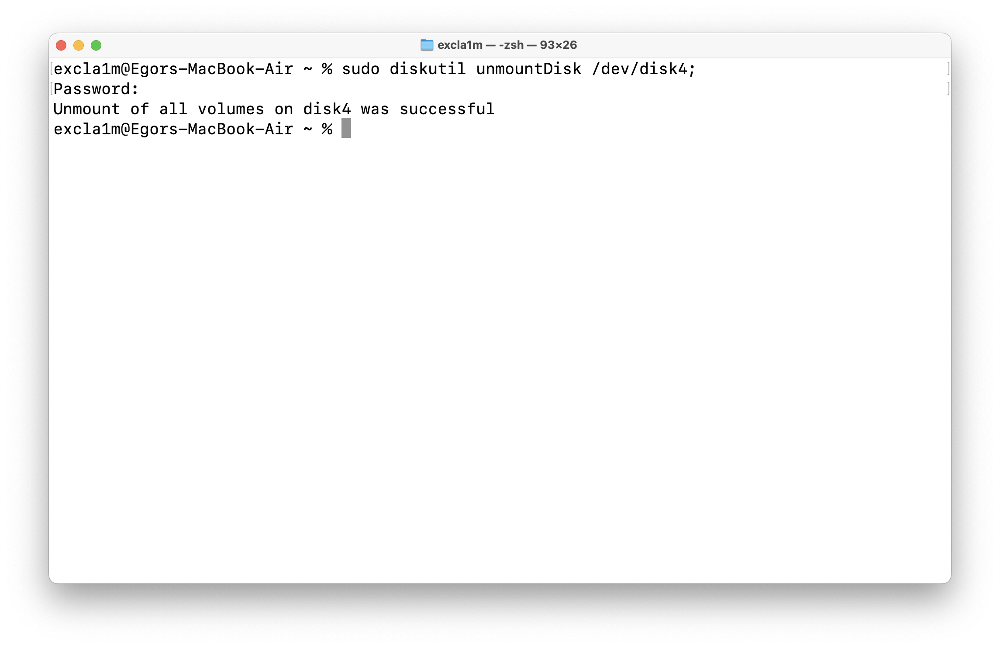<figcaption><p>Выполнение команды unmount</p></figcaption></figure>

5. Запишите образ на USB-носитель, используя следующую команду:

```bash
sudo dd if=mikopbx-2024.1.114-x86_64.iso of=/dev/disk4 bs=1m;
```

Дождитесь окончания записи образа. Далее перейдите к разделу ["Установка системы"](live-usb.md#ustanovka-sistemy).

<figure>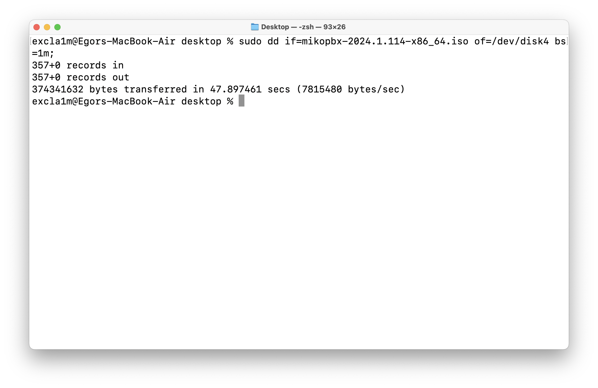<figcaption><p>Запись образа на USB-носитель</p></figcaption></figure>

### Linux

В данной инструкции в качестве примера, запись образа будет произведена на Ubuntu 24.04.

1. Подключите Ваш usb-носитель и откройте Terminal.


Размер USB-носителя должен быть не менее 1 ГБ. **Все данные на USB-носителе будут удалены!**


2. Выполните команду:

```bash
lsblk
```

Будет отображена информация про все подключенные диска. Найдите в этом списке Ваш usb-носитель и запомните его наименование. В нашем случае, это диск sdb.

<figure>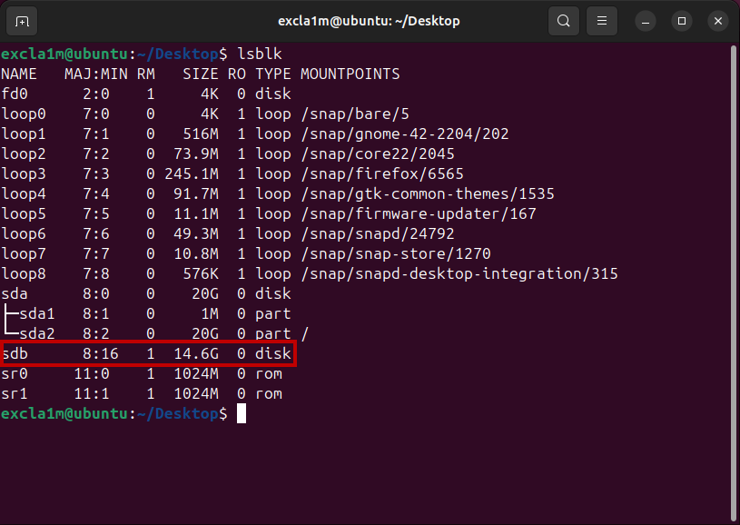<figcaption><p>Команда lsblk</p></figcaption></figure>

3. Далее необходимо отформатировать usb-носитель, используя следующую команду:

```bash
sudo mkfs.vfat -F 32 -n NONAME /dev/sdb
```


**Все данные на диске будут удалены!** Еще раз проверьте название диска который Вы форматируете!


Для подтверждения введите пароль администратора, дождитесь окончания форматирования.

<figure>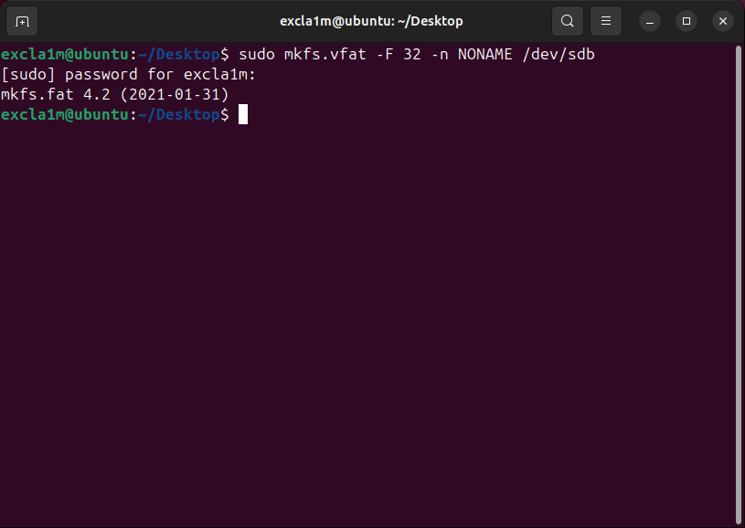<figcaption><p>Форматирование диска</p></figcaption></figure>

4. Отмонтируйте (отключите) диск, используя следующую команду:

```bash
sudo umount /dev/sdb*
```

<figure>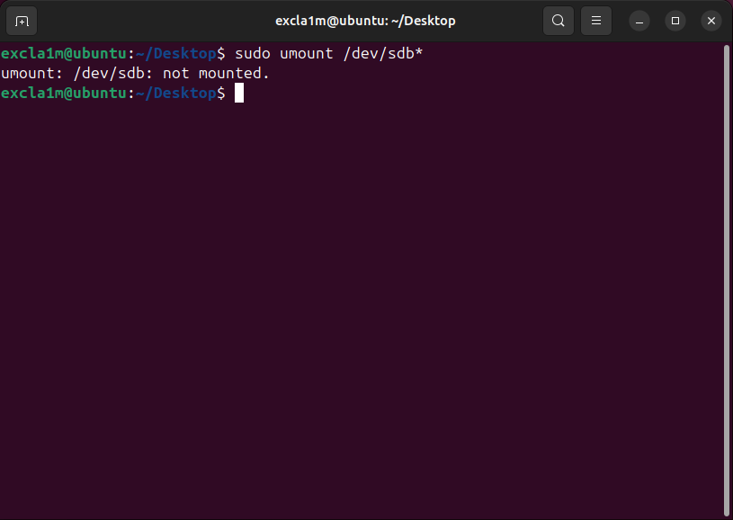<figcaption><p>Команда umount</p></figcaption></figure>

5. Запишите образ на USB-носитель, используя следующую команду:

```bash
sudo dd if=mikopbx-2024.1.114-x86_64.iso of=/dev/sdb bs=1M
```

Дождитесь окончания записи образа. Далее перейдите к разделу ["Установка системы"](live-usb.md#ustanovka-sistemy).

<figure>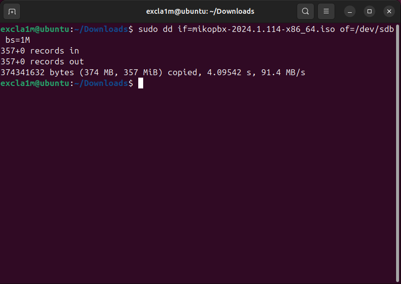<figcaption><p>Успешная запись образа на диск</p></figcaption></figure>

## Установка системы

1. Запуститесь с USB-носителя. При возникновении ошибок (черный экран) - убидитесь, что:

* **Secure Boot** - Disabled
* **CSM (Compatibility Support Module)** - Enabled

<figure>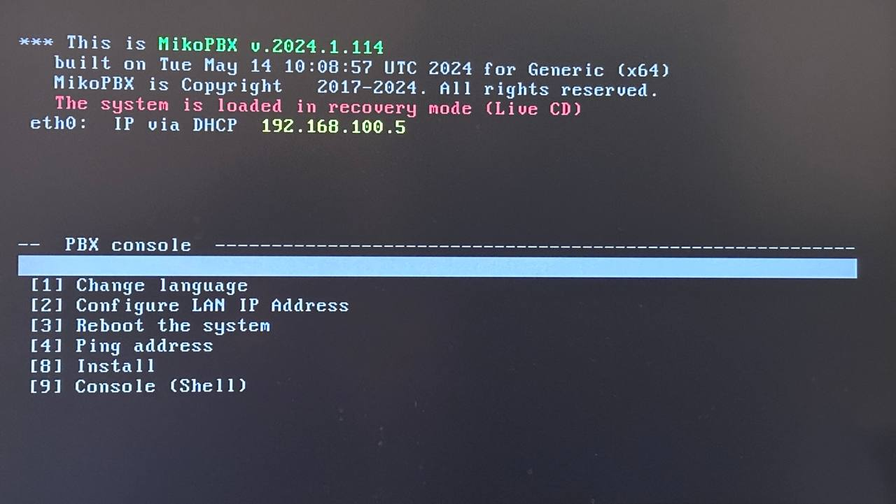<figcaption><p>Загруженная система с USB-носителя</p></figcaption></figure>

2. Система загружена в режиме LiveCD, об этом нам говорит красная надпись. Необходимо произвести установку. Для этого, передвигаясь стрелочками на клавиатуре, перейдите в раздел "**\[8] Install**". Нажмите "**Enter**".

<figure>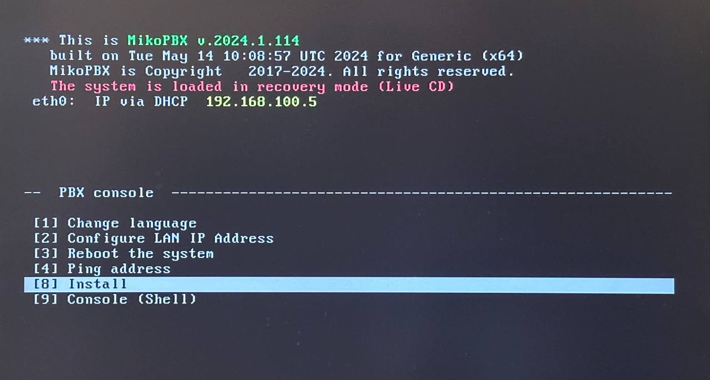<figcaption><p>Раздел "<strong>[8] Install</strong>"</p></figcaption></figure>

3. Выберите диск, который будет использоваться для установки системы. Для этого введите его ID (название), например sdc в нашем случае.

<figure>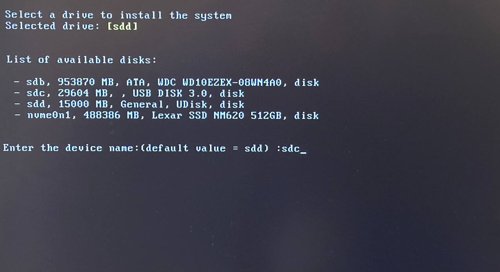<figcaption><p>Выбор системного диска</p></figcaption></figure>

4. Подтвердите Ваш выбор, введите "**y**" для продолжения.


Все данные с выбранного диска будут удалены!


<figure>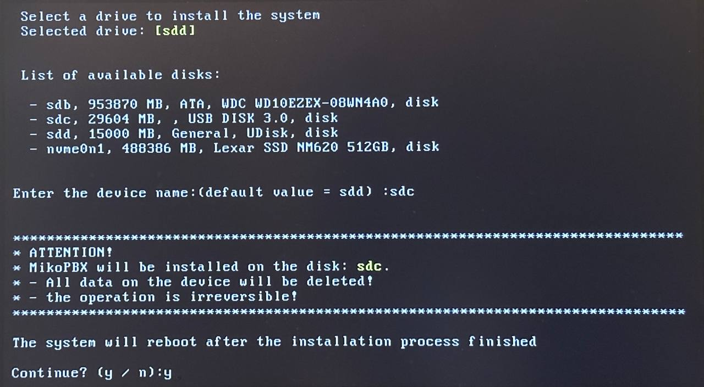<figcaption><p>Подтверждение выбора диска</p></figcaption></figure>

5. После установки системы, Вам будет предложено выбрать диск для хранения записей разговоров. По аналогии с первым диском, сделайте выбор.

<figure>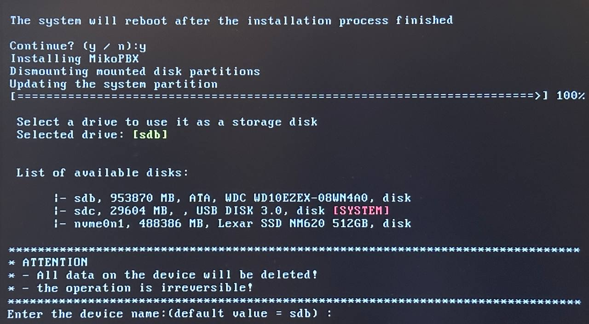<figcaption><p>Выбор диска для хранения записей разговоров</p></figcaption></figure>

6. После этого система перезагрузится и будет готова к работе и первой авторизации в Web-интерфейс.

<figure>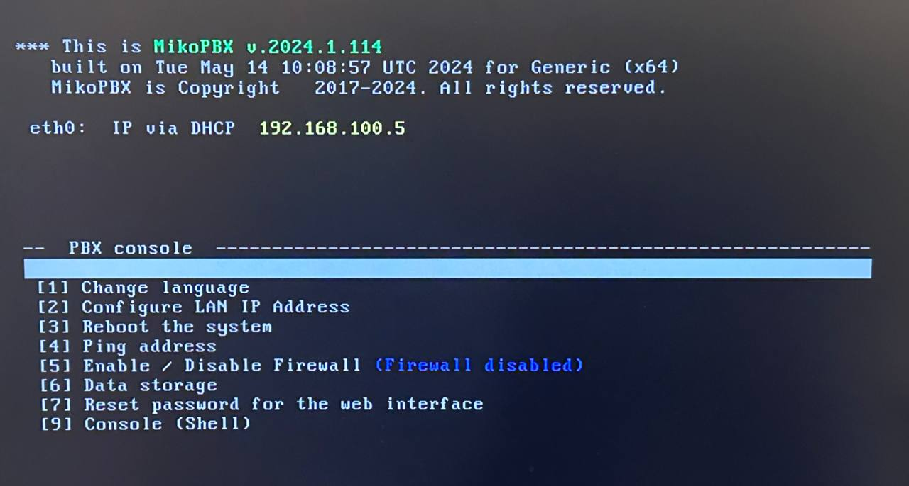<figcaption><p>Успешно установленная система</p></figcaption></figure>

Для перехода в Web-интерфейс, введите IP-адрес Вашей MikoPBX в строку браузера. Используйте стандартные данные для авторизации.


Данные для первого входа в Web-интерфейс:

Логин: admin

Пароль: admin


<figure>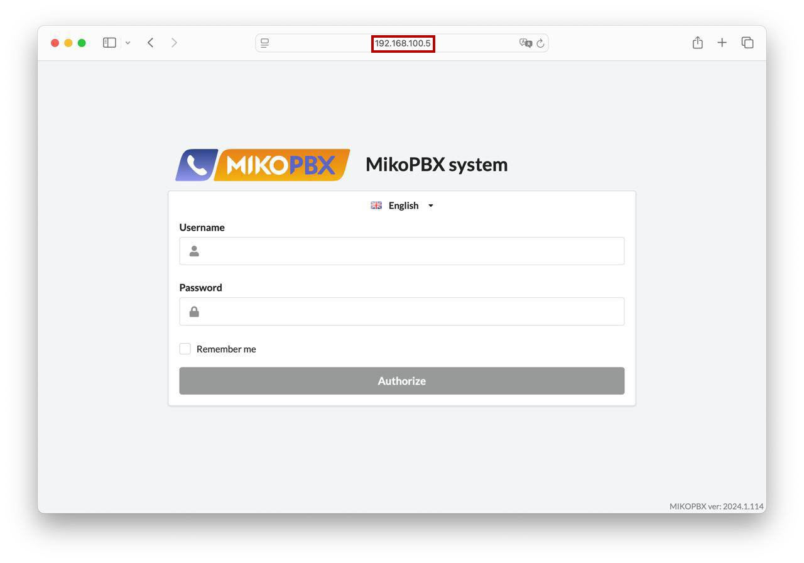<figcaption></figcaption></figure>
