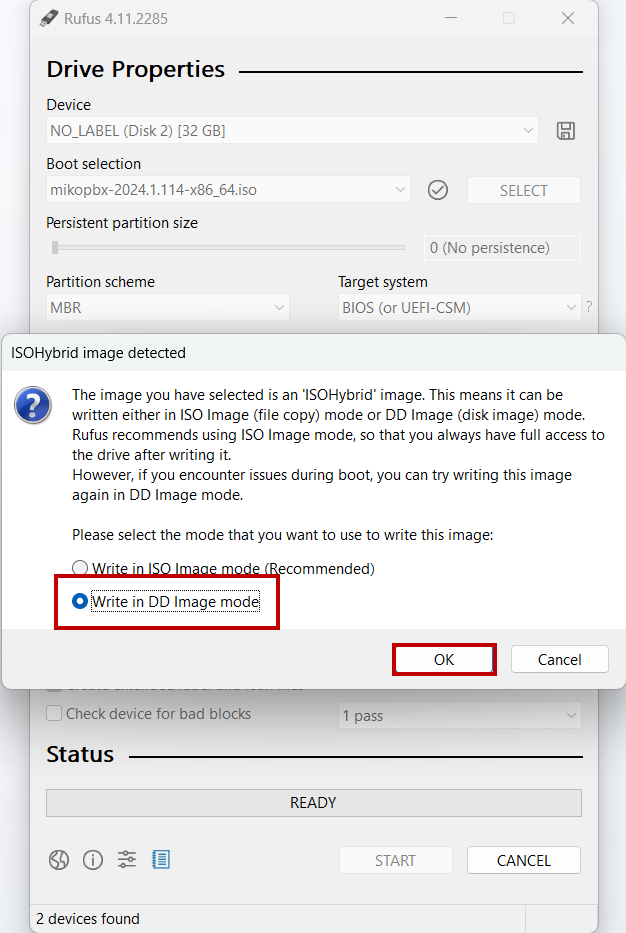
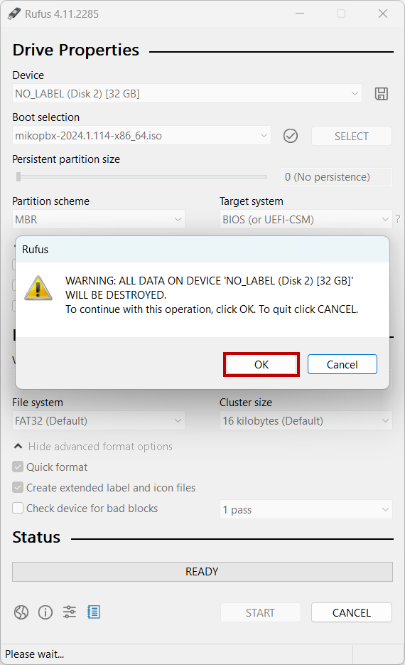
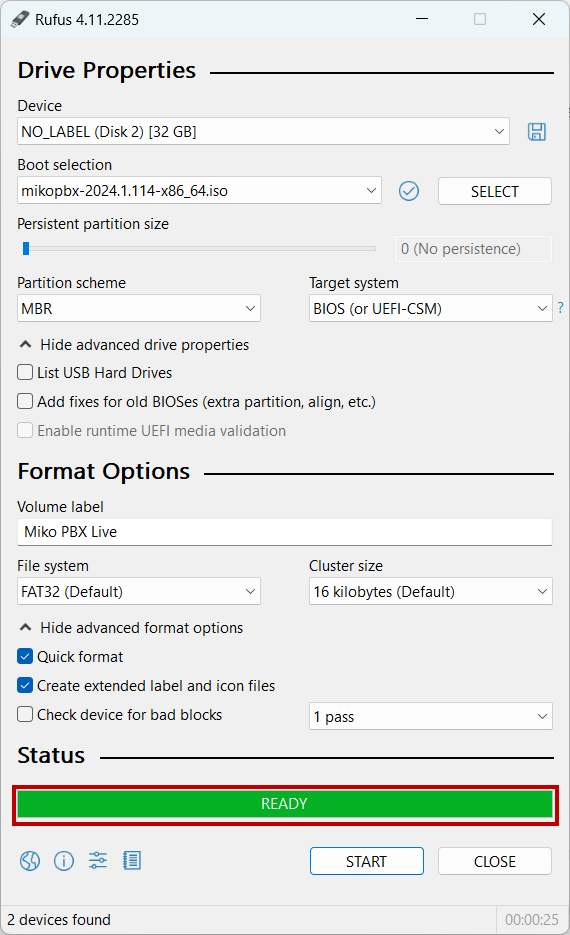

# Установка с записью образа на USB-носитель (Live USB)

## Запись образа на USB-носитель

Для записи образа будет использована утилита Rufus. Скачать ее можно [по ссылке](https://rufus.ie/en/).


Размер USB-носителя должен быть не менее 1 ГБ. **Все данные на USB-носителе будут удалены!**


<figure><figcaption>
Утилита Rufus
</figcaption></figure>

1. После установки утилиты, перейдите в ее интерфейс. В разделе "Device" выберите Ваш носитель, нажмите SELECT и выберите ранее загруженный [.iso образ](https://www.mikopbx.ru/download/). Начнется его проверка.

<figure><figcaption>
Выбранный образ и носитель
</figcaption></figure>

2. После окончания проверки оставьте все параметры по-умолчанию и нажмите "START".

<figure><figcaption>
Начало записи образа
</figcaption></figure>

3. После этого, во всплывающем окне **выберите "Write in DD Image mode".** Нажмите "OK".

<figure><figcaption>
Параметр "Write in DD image mode"
</figcaption></figure>

4. Во всплывающем предупреждении, о том, что все данные на диске будут удалены, нажмите "ОК".

<figure><figcaption>
Подтверждение форматирования диска
</figcaption></figure>

Дождитесь окончания записи образа. По его завершении, Вы увидите надпись "<mark style="color:$success;">READY</mark>".

<figure><figcaption>
Успешная запись образа на USB-носитель
</figcaption></figure>

