# Alibaba cloud (In dev)


Инструкция актуальна для версии 2024.2.131 и новее!


В данной инструкции мы пошагово произведем установку MikoPBX с помощью облачной платформы Alibaba cloud.

&#x20;Перед началом Вам необходимо скопировать ссылку на актуальный образ MikoPBX с расширением **.raw**. Сделать это можно на [github MikoPBX](https://github.com/mikopbx/core/releases).

## Загрузка образа в Alibaba cloud

### Создание Bucket

Для начала необходимо создать bucket для хранения образа. Для этого необходимо перейти в "**OSS Management Console**" ([ссылка](https://oss.console.aliyun.com/overview)).

<figure>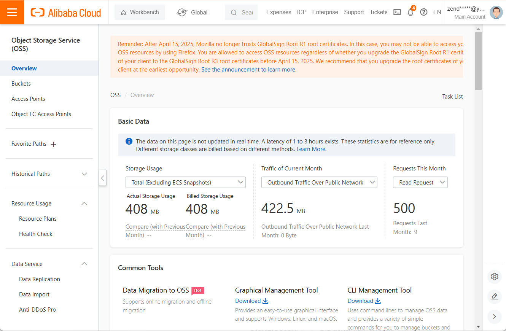<figcaption>
OSS Консоль
</figcaption></figure>

1. Перейдите в раздел "**Buckets**".

<figure>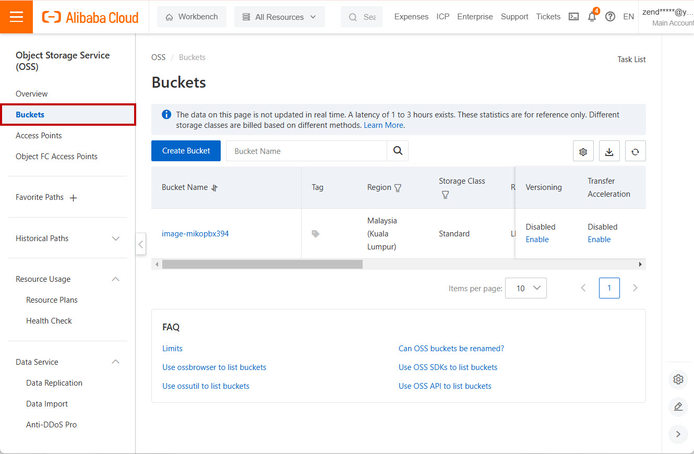<figcaption>
Раздел "Buckets"
</figcaption></figure>

2. Нажмите "**Create Bucket**" для создания нового **Bucket'а**:

<figure>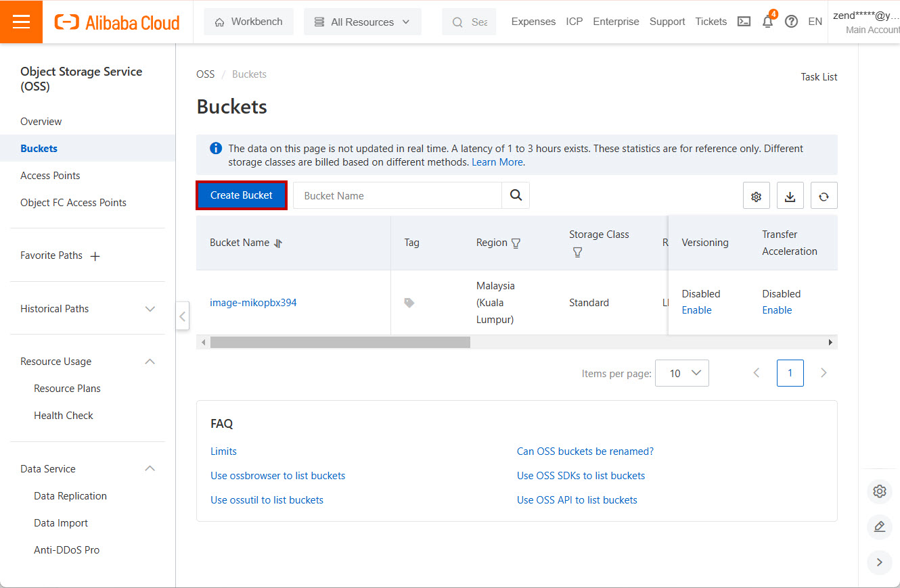<figcaption>
Элемент "Create bucket"
</figcaption></figure>

3. Заполните следующие данные:

* "**Bucket name**" - произвольное название для хранилища.
* "**Region**" - выберите регион, где будет храниться ваш образ


Регион у хранилища для образа и регион виртуальной машины должны совпадать!


Нажмите "**OK**".

<figure>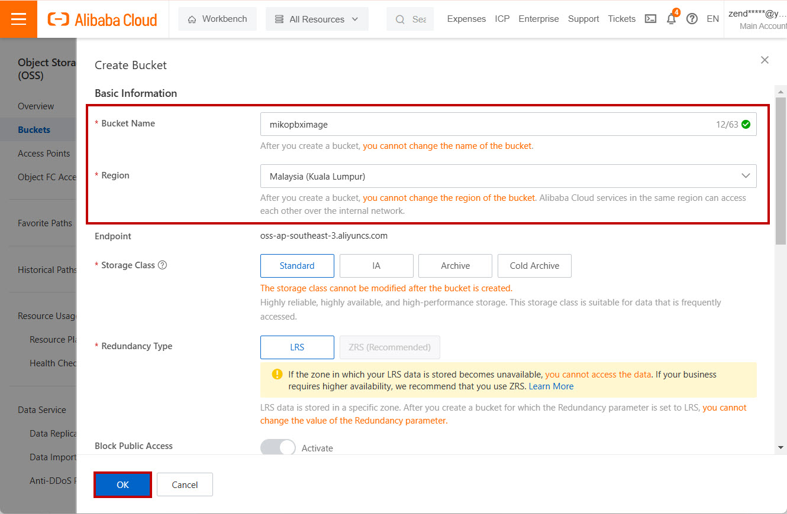<figcaption>
Параметры Bucket'а
</figcaption></figure>

4. Перейдите в созданный bucket, нажав на его название в разделе "**Buckets**":

<figure>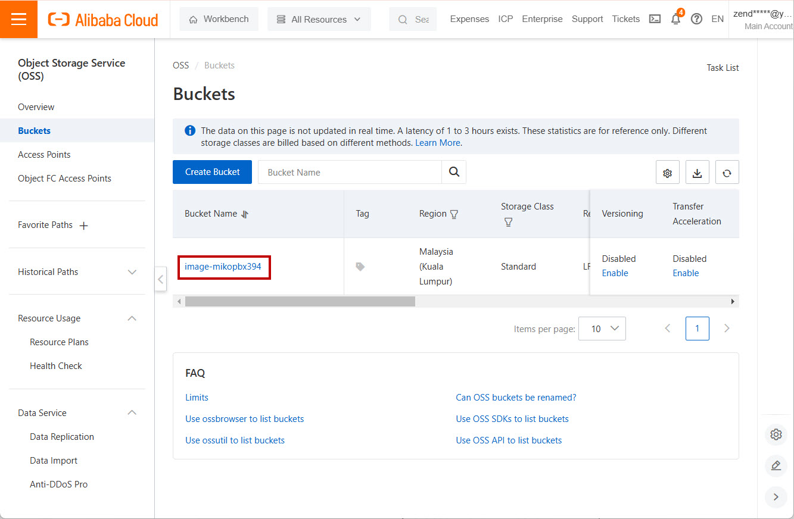<figcaption>
Созданный bucket
</figcaption></figure>

5. Нажмите "**Upload object**" и загрузите ранее скаченный файл образа диска в формате **.raw** (все параметры оставьте по умолчанию).

<figure>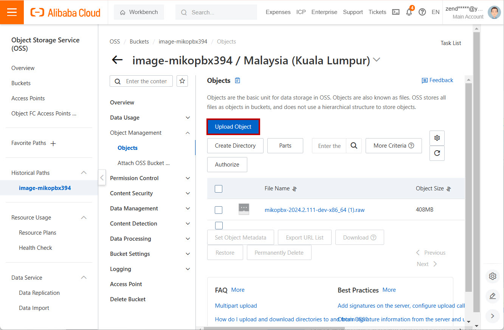<figcaption>
Элемент "Upload object"
</figcaption></figure>

6. После того, как файл образа диска будет загружен, Вам необходимо скопировать ссылку на него. Для этого нажмите "**View Details**" справа от названия файла, в открывшемся меню скопируйте ссылку из поля "**URL**".

<figure>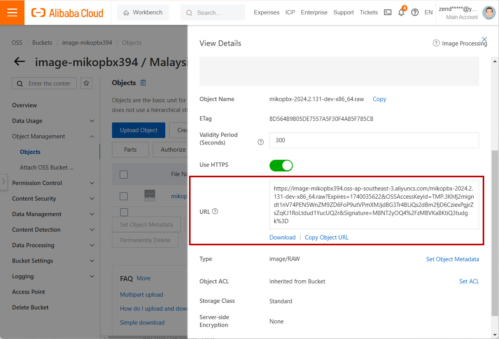<figcaption>
Ссылка на файл образа диска
</figcaption></figure>

### Создание образа

1. Вернитесь в ECS Console ([ссылка](https://ecs.console.aliyun.com/home)). Перейдите в раздел "**Images**".

<figure>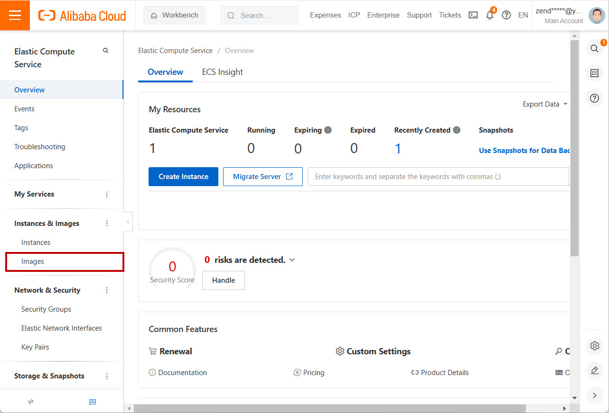<figcaption>
Раздел "Images"
</figcaption></figure>

2. Нажмите "**Import Image**" для испорта образа из хранилища (**Bucket**):

<figure>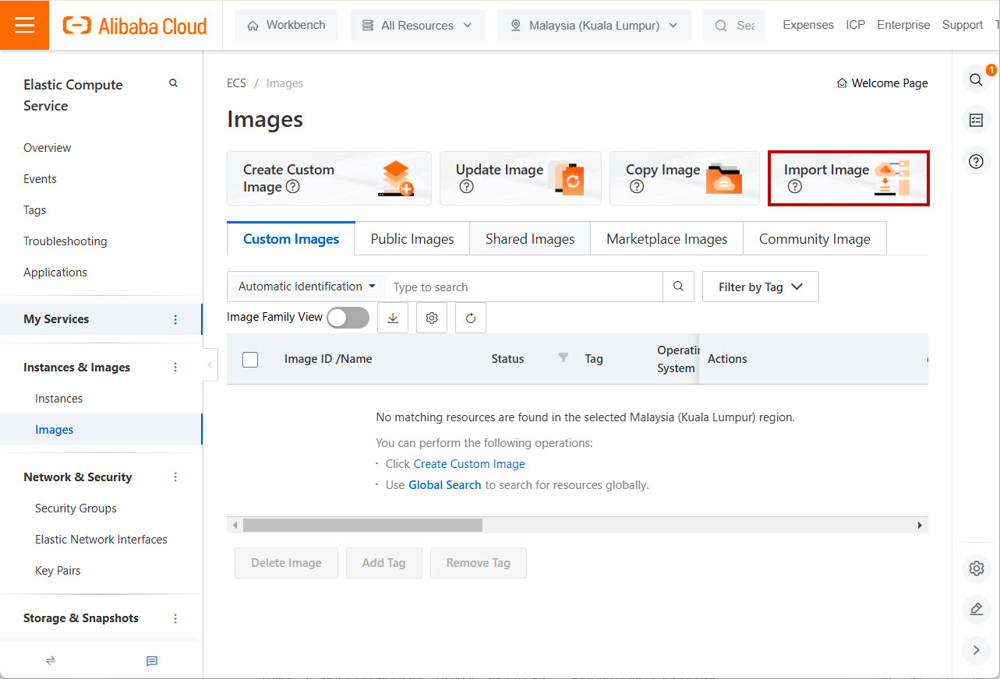<figcaption>
Элемент "Import Image"
</figcaption></figure>

3. В открывшейся вкладке выберите "**Linux Operating System**" и  нажмите "**Next**".
4. Введите/выберите следующие параметры для образа:

* "**Image File URL**" - вставьте ранее скопированную ссылку на загруженный файл образа диска.
* "**Image Name**" - введите произвольное, **уникальное** название для Вашего образа.
* "**OS Type**" - linux
* "**OS Version**" - Others Linux
* "**Architecture**" - 64-bit OS
* Уберите галочку с чек-бокса "**Check After Import**".

Нажмите "**OK**" для создания образа. Дождитесь его создания (при завершении в поле Status вы увидите надпись <mark style="color:green;">Available</mark>)

<figure>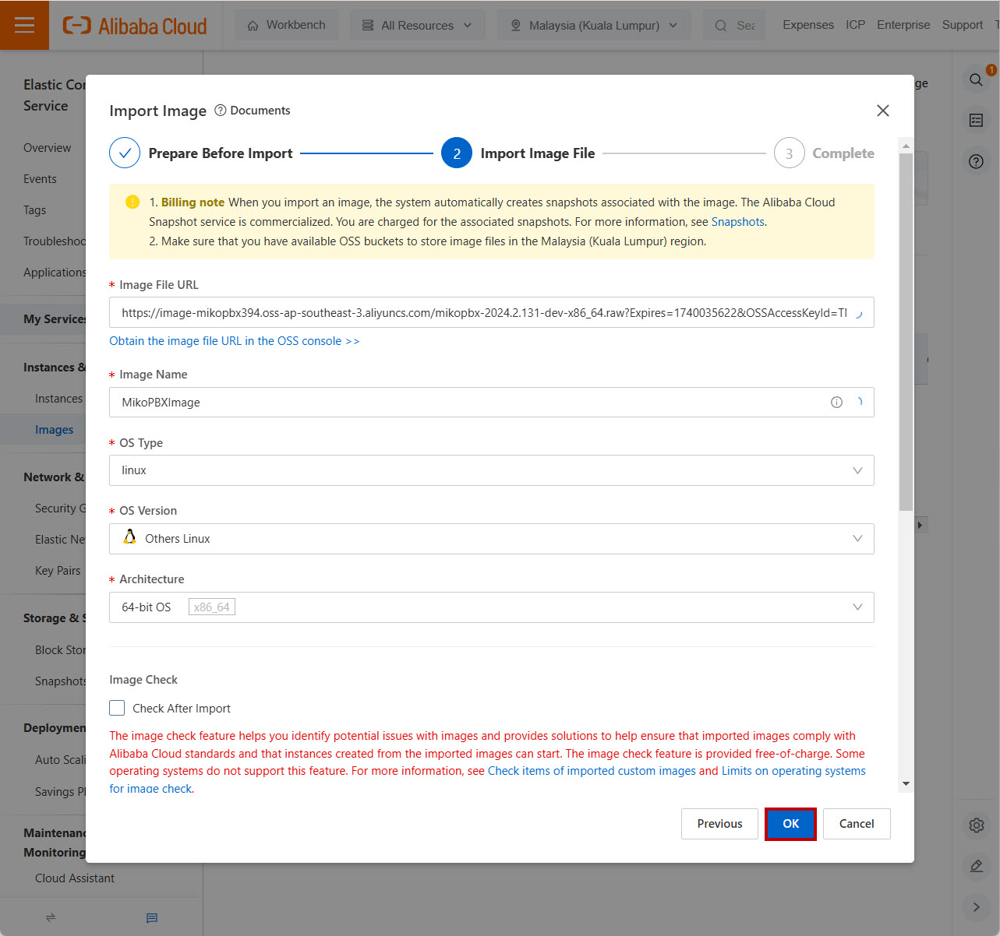<figcaption>
Параметры импорта образа
</figcaption></figure>

## Создание пары SSH-ключей

Далее необходимо создать и добавить связку SSH ключей в Alibaba Cloud.

1. &#x20;В ESS Консоли перейдите в раздел "**Network Security**" -> "**Key Pairs**":

<figure>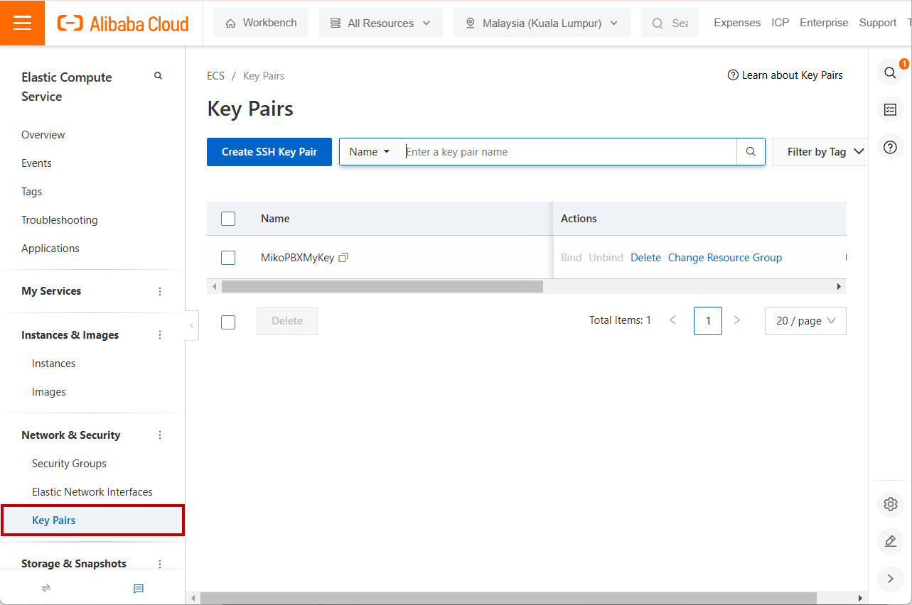<figcaption>
Раздел "Key Pairs"
</figcaption></figure>

2. Нажмите "**Create SSH Key Pair**".

<figure>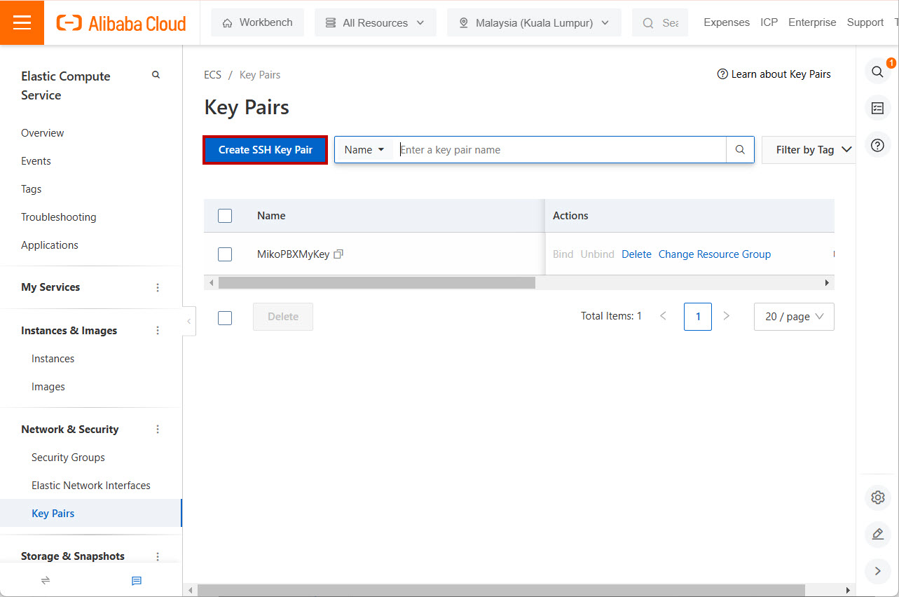<figcaption>
Элемент "Create SSH Key Pair"
</figcaption></figure>

3. Далее необходимо сгенерировать пару SSH-ключей. Про то как это сделать - Вы можете прочитать [здесь](../../faq/troubleshooting/connecting-to-a-pbx-using-ssh/). Далее заполните все необходимые данные:

* "**Name**" - произвольное название для создаваемой связки ключей
* "**Creation Mode**" - Import
* "**Public Key**" - вставьте Ваш **публичный** ключ, сгенерированный ранее
* "**Resource Group**" - выберите Вашу ресурсную группу в облаке

Нажмите "**OK**" для создания связки ключей в облаке

<figure>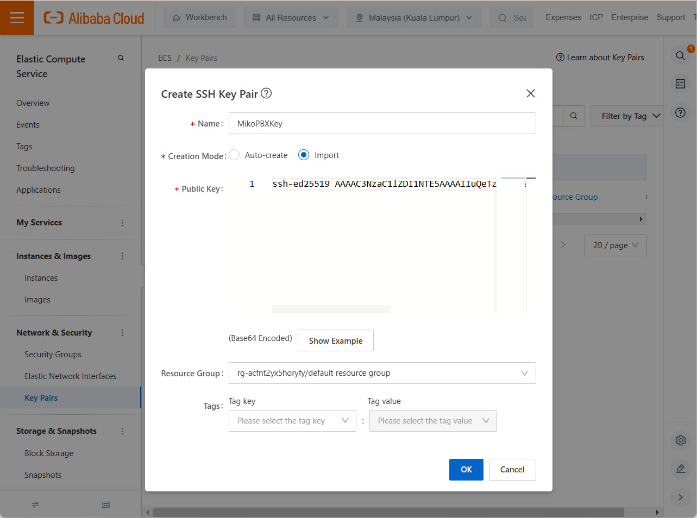<figcaption>
Параметры создаваемой связки ключей
</figcaption></figure>

## Создание группы правил

Перед созданием виртуальной машины так же нужно создать и группу правил (firewall).&#x20;

1. Перейдите в раздел "**Network & Security**" -> "**Security Groups**"

<figure>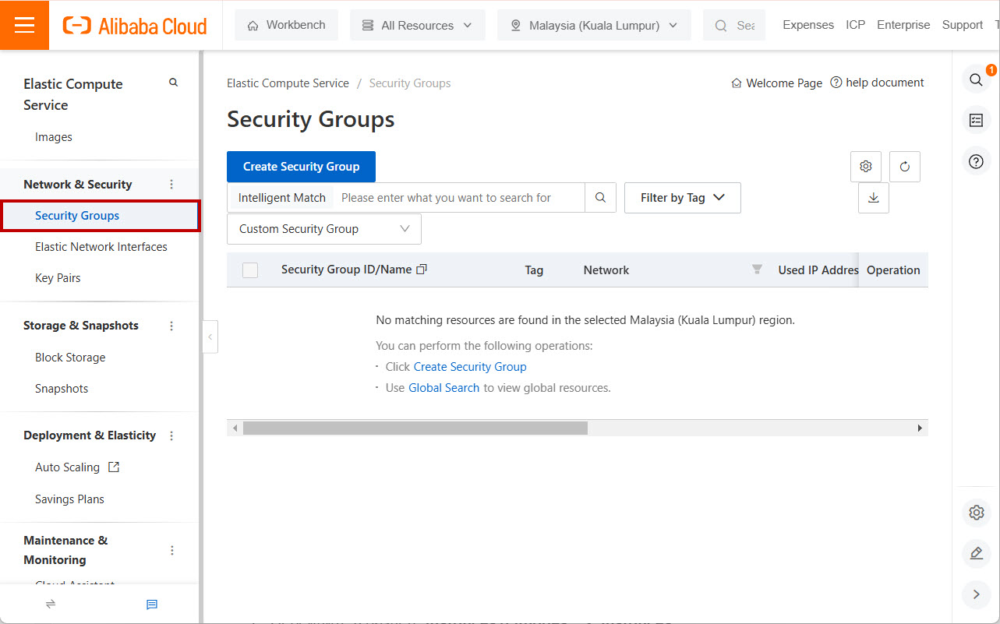<figcaption>
Раздел "Security Groups"
</figcaption></figure>

2. Нажмите "**Create Security Group**":

<figure>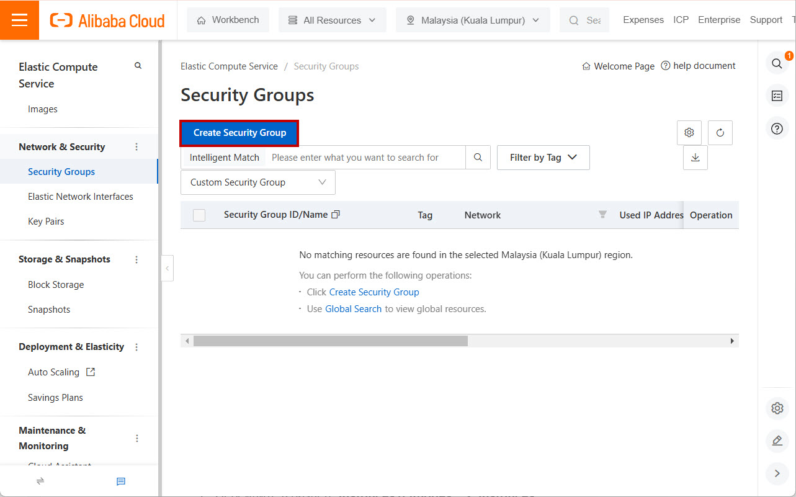<figcaption>
Элемент для создания новой группы правил
</figcaption></figure>

3. Укажите следующие параметры для группы правил:

* "**Security Group**" -  введите произвольное название для группы правил.
* "**Network**" - выберите вашу сеть. Если она не созданна - нажмите "**Create VPC**" справа от поля.
* "**Security Group**" - Basic Security Group.
* "**Resource Group**" - выбрите Вашу группу ресурсов.
* Разрешите все входящие подключения (пример на скриншоте ниже). Все исходящие подключения разрешены по умолчанию.


Обязательно настройте firewall в самой MikoPBX как можно раньше после создания виртуальной машины. Подробнее про то как это сделать, Вы можете прочитать [здесь](../../manual/connectivity/firewall.md).&#x20;


Нажмите "**Create Security Group**".

<figure><figcaption>
Параметры группы правил
</figcaption></figure>

## Создание виртуальной машины

1. Перейдите в раздел "**Instances & Images**" -> "**Instances**":

<figure>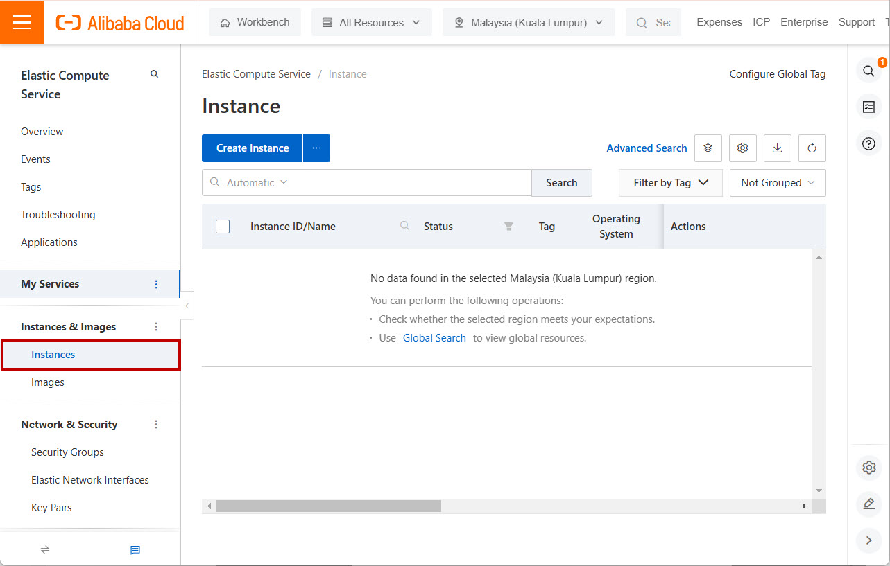<figcaption>
Раздел "Instances"
</figcaption></figure>

2. Нажмите "**Create Instance**" для создания новой виртуальной машины.

<figure>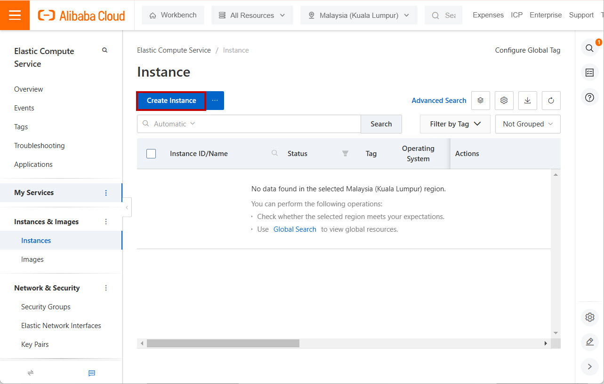<figcaption>
Элемент "Create Instance"
</figcaption></figure>

3. Выберите параметры для вашей виртуальной машины:

* "**Billing Method**" - выберите вариант оплаты ВМ.
* "**Region**", "**Network and Zone**" - выберите параметры региона и зоны, подходящие Вам.
* "**Instance**" - выберите конфигурацию Вашей виртуальной машины.

<figure>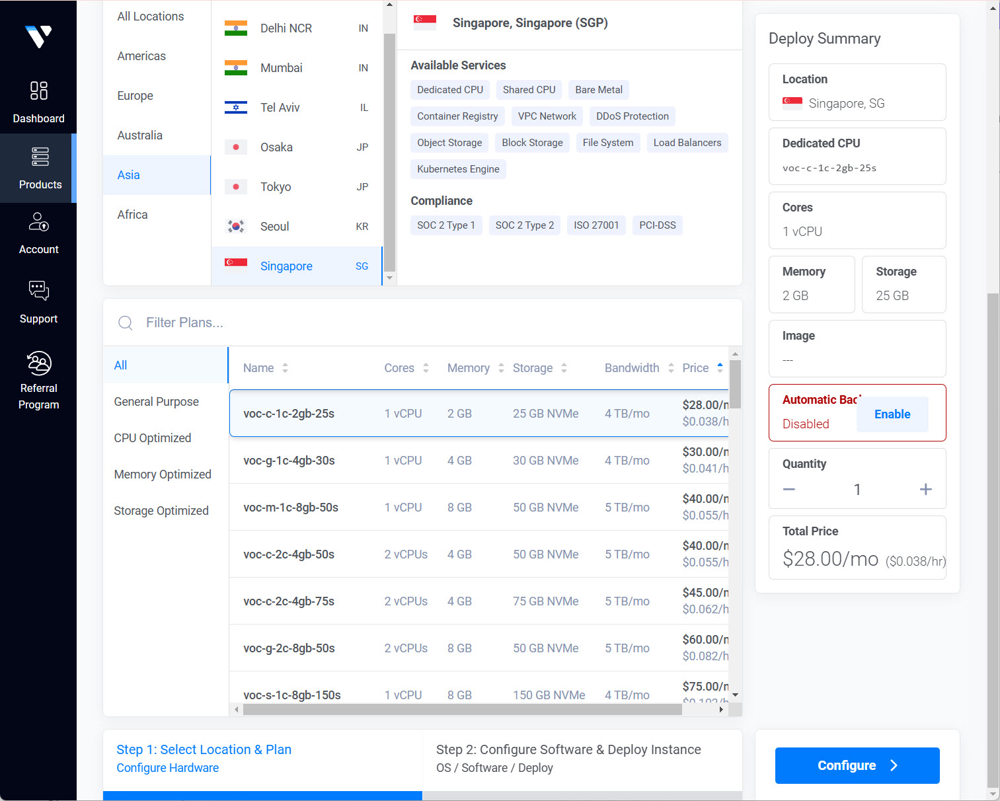<figcaption>
Параметры виртуальной машины №1
</figcaption></figure>

4. Выберите параметры для вашей виртуальной машины:

* "**Image**" - выберите "**Custom Images**" -> Загруженный ранее образ
* "**Storage**" - выберите тип и размер "**System Disk**". 20 Гб - минимально возможный в Alibaba Cloud.
* Добавьте второй диск, нажав "**Add Data Disk**". Укажите его тип и размер.


Рекомендуемый размер диска для хранения записей разговора - не менее 50ГБ. В данной инструкции, в качестве примера, используется диск размером 30ГБ.


<figure>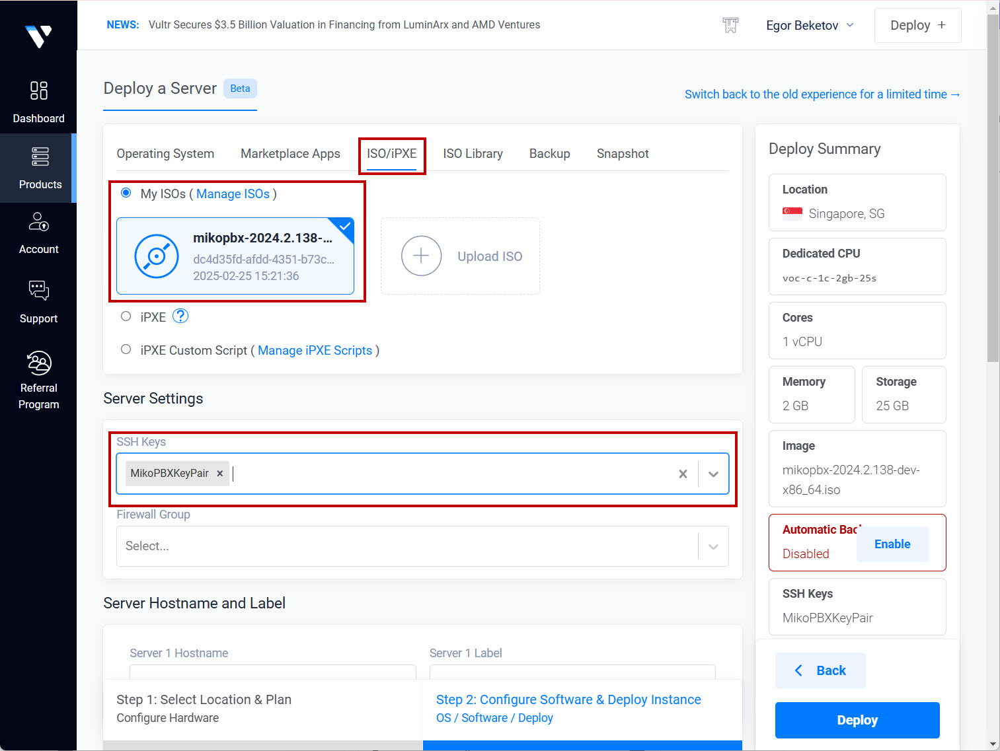<figcaption>
Параметры виртуальной машины №2
</figcaption></figure>

5. Выберите параметры сети для Вашей ВМ. Группа правил будет назначена автоматически (ранее созданная):

<figure>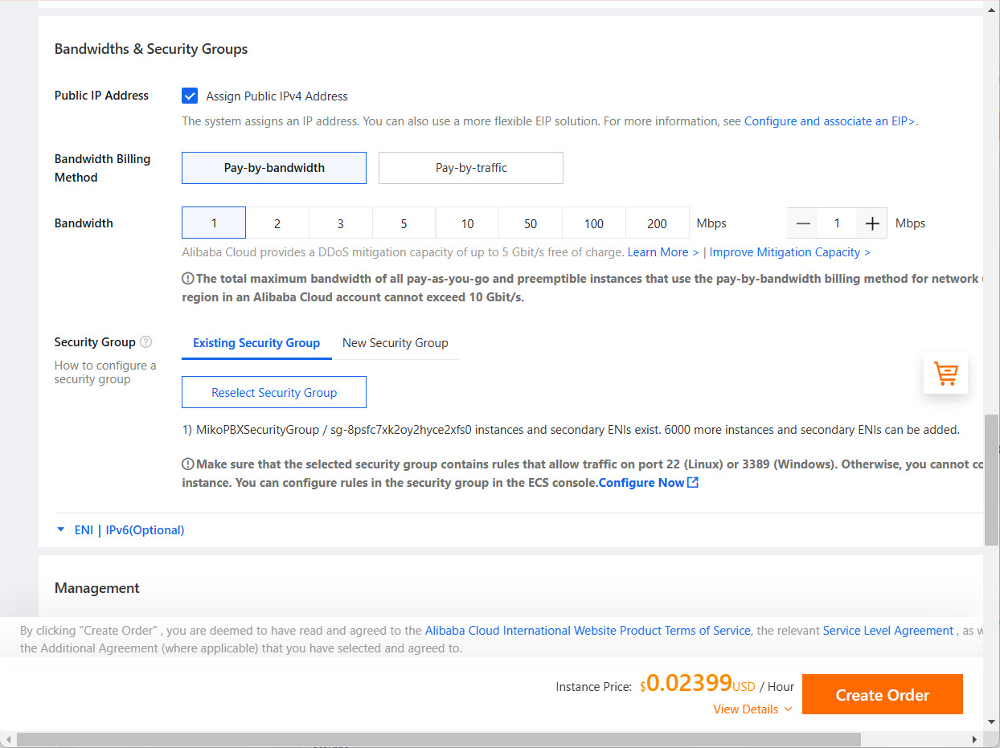<figcaption>
Параметры сети
</figcaption></figure>

6. Нажмите "**Create Order**".

<figure>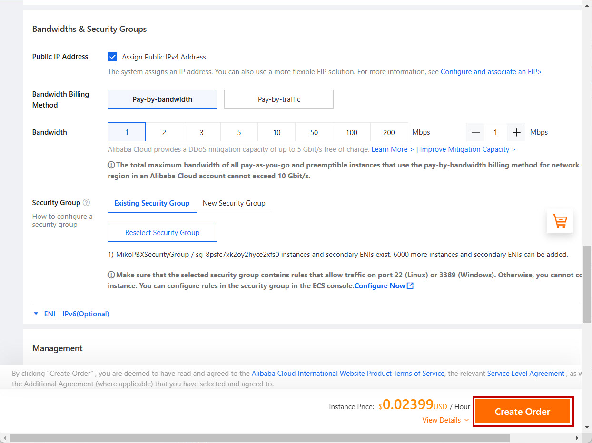<figcaption>
Элемент "Create Order"
</figcaption></figure>

## Подключение к консоли MikoPBX

В разделе "**Instances**" перейдите к созданной виртуальной машине, нажав на ее название.

<figure>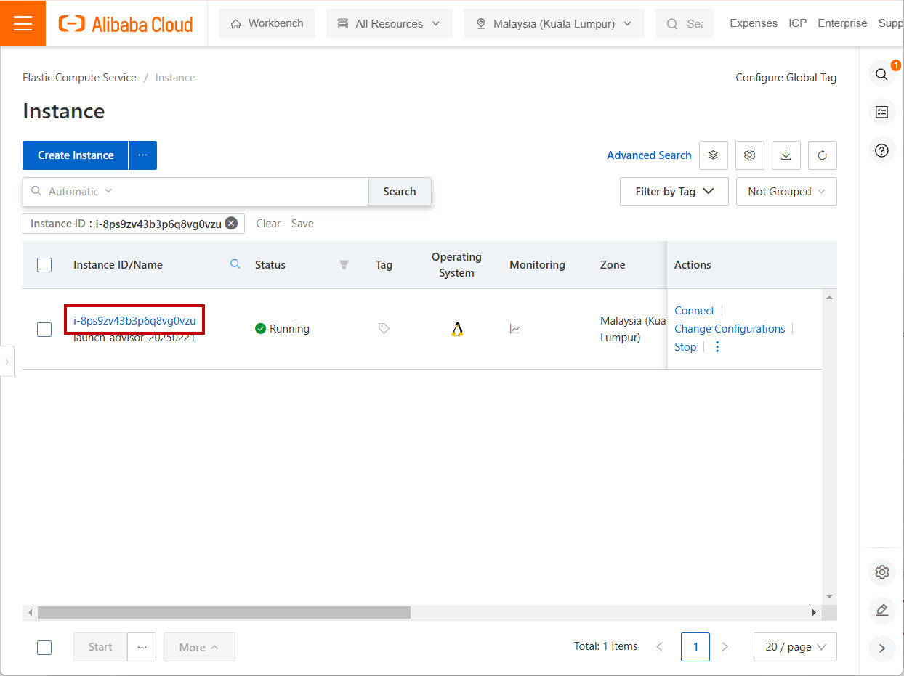<figcaption>
Переход к созданной виртуальной машине
</figcaption></figure>

### Подключение из встроенной в облако консоли

1. Нажмите "**Connect**".&#x20;

<figure>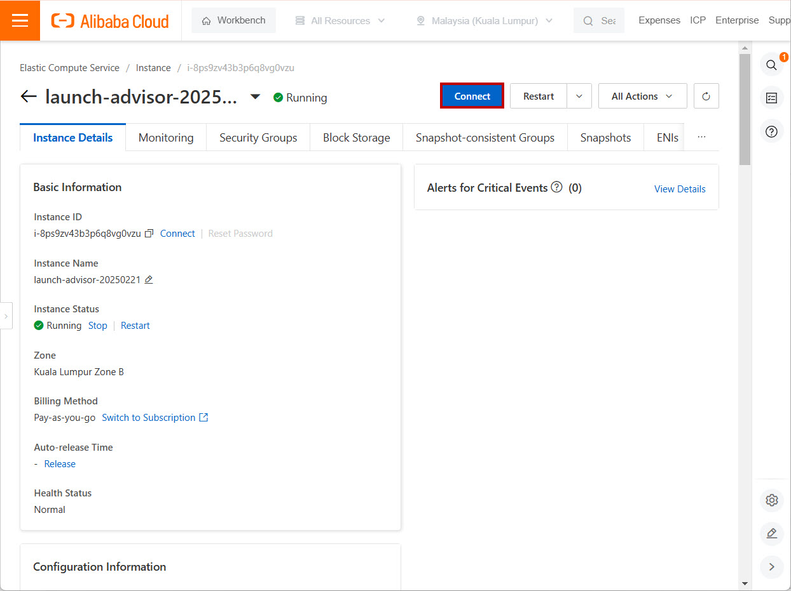<figcaption>
Элемент "Connect"
</figcaption></figure>

2. Выберите "**VNC**". Произойдет подключение в новой вкладке Вашего браузера.

