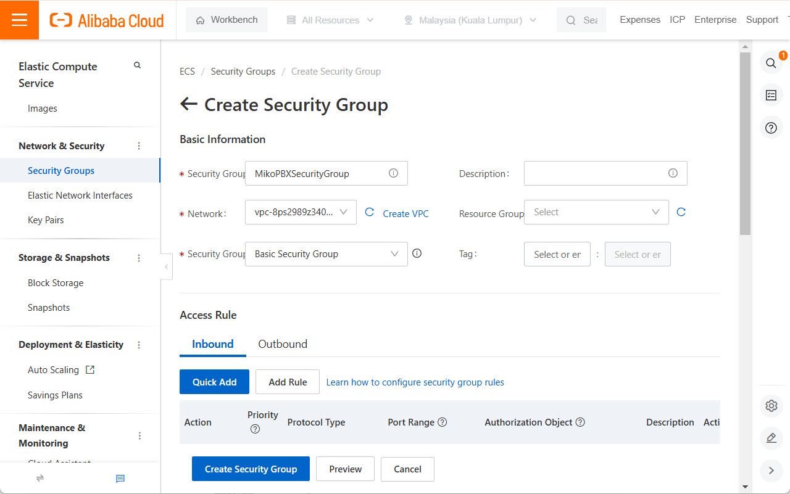
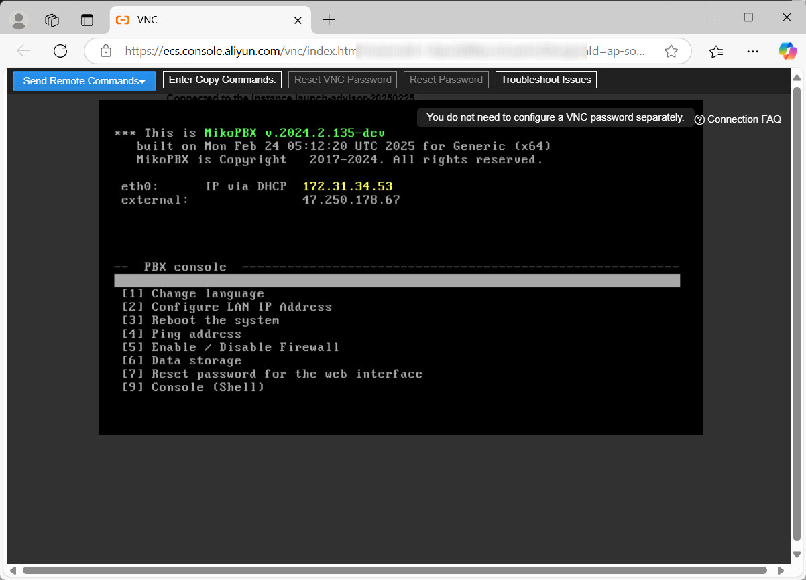
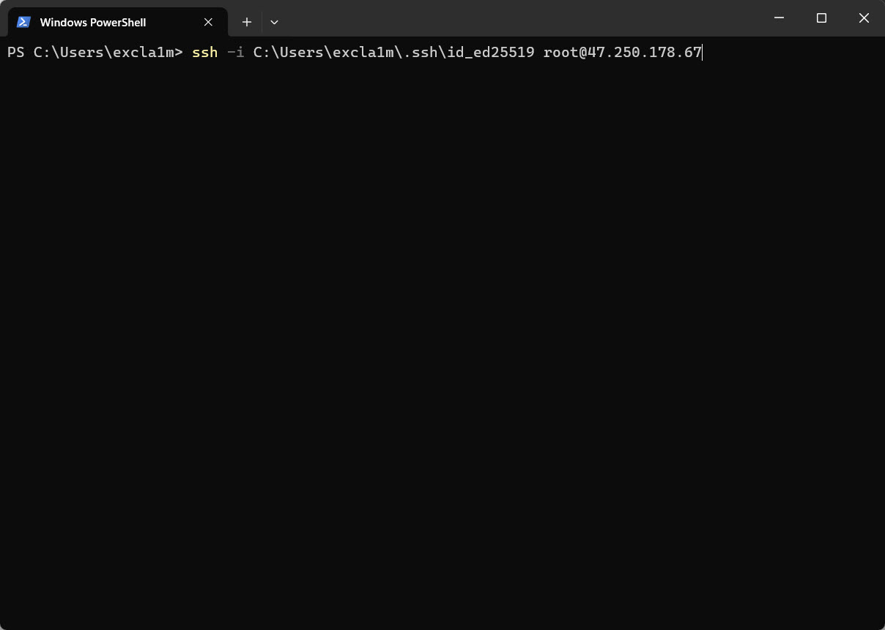
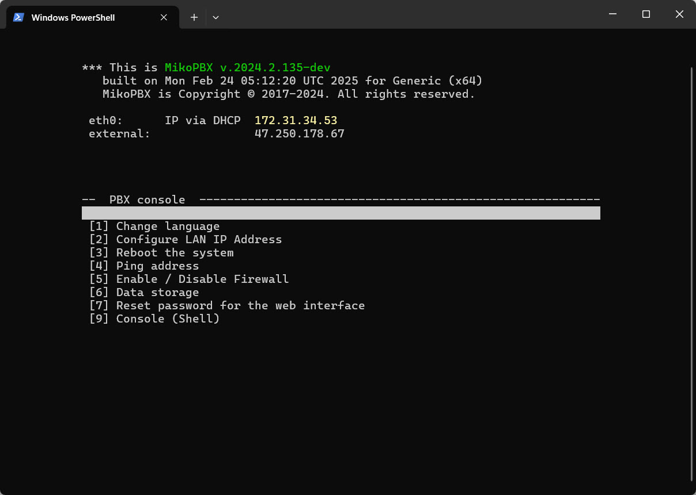
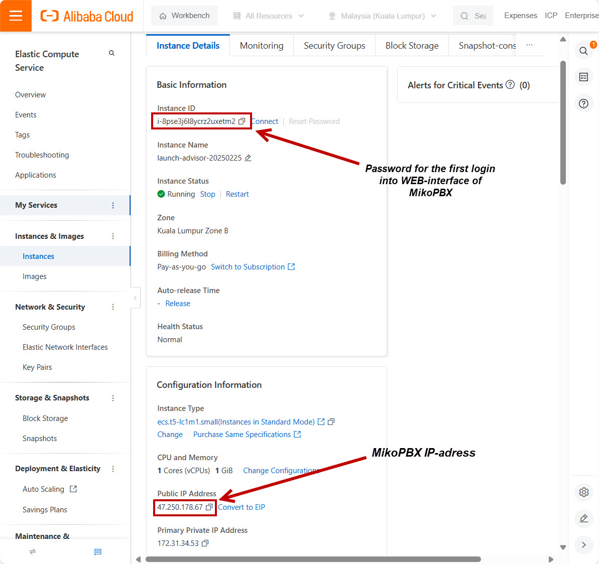
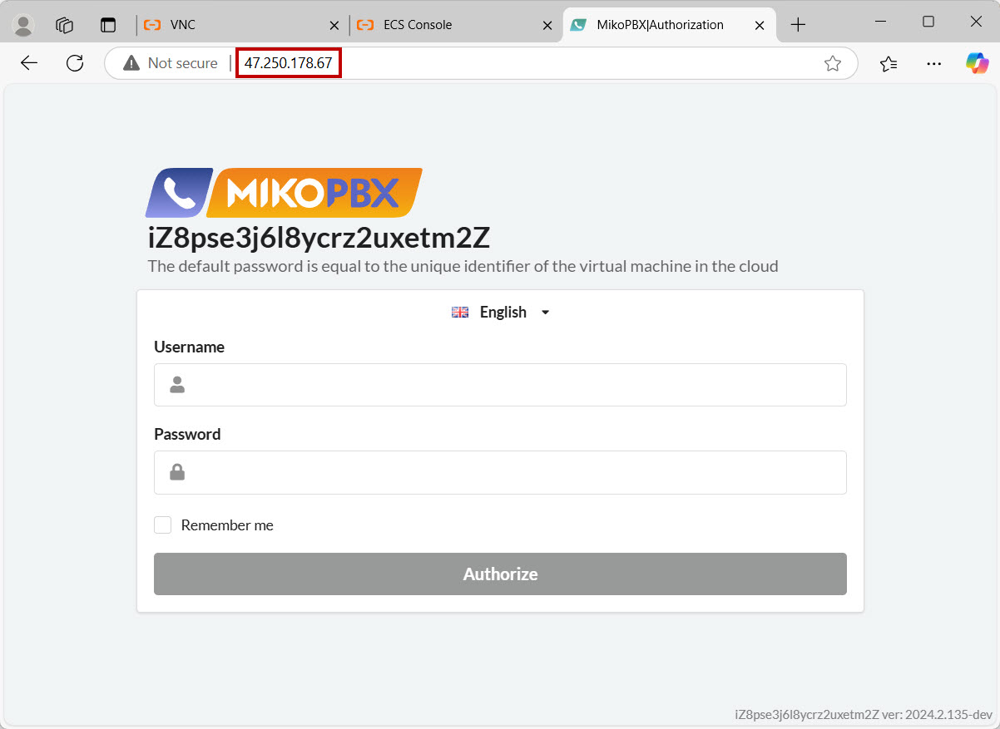

# Alibaba Cloud


This guide applies to **MikoPBX version 2024.2.135** and later!




This step-by-step guide will walk you through installing MikoPBX on the Alibaba Cloud platform.

Before starting, download the latest **.raw** MikoPBX image from [MikoPBX’s GitHub releases](https://github.com/mikopbx/core/releases).

## Uploading the Image to Alibaba Cloud

### Creating a Bucket

First, create a bucket for storing your image. Go to the **OSS Management Console** ([link](https://oss.console.aliyun.com/overview)).

1. Go to **Buckets**.

<figure><figcaption><p>Buckets section</p></figcaption></figure>

2. Click **Create Bucket**:

<figure><figcaption><p>"Create Bucket" button</p></figcaption></figure>

3. Specify the following:

* **Bucket name** – a custom name for your storage.
* **Region** – pick the region where your image will be stored.


The bucket region for your image must match the region of your future virtual machine!


Click **OK**.

<figure><figcaption><p>Bucket parameters</p></figcaption></figure>

4. Go to your newly created bucket by clicking its name in the **Buckets** section:

<figure><figcaption><p>Bucket name</p></figcaption></figure>

5. Click **Upload object** and upload the previously downloaded **.raw** disk image file (leave other parameters at default).

<figure><figcaption><p>"Upload Object" button</p></figcaption></figure>

6. Once the disk image file is uploaded, copy its link. Click **View Details** to the right of the file name; in the opened menu, copy the **URL** field.

<figure><figcaption><p>URL of the uploaded file</p></figcaption></figure>

### Creating the Image

1. Return to the **ECS Console** ([link](https://ecs.console.aliyun.com/home)) and go to **Images**.

<figure><figcaption><p>"Images" section</p></figcaption></figure>

2. Click **Import Image**:

<figure><figcaption><p>"Import Image" Button</p></figcaption></figure>

3. Select **Linux Operating System** and click **Next**.
4. Enter/select the following image parameters:
   * **Image File URL** – Paste the link to the disk image file you uploaded.
   * **Image Name** – A custom, **unique** name for your image.
   * **OS Type** – Linux
   * **OS Version** – Others Linux
   * **Architecture** – 64-bit OS
   * Uncheck **"Check After Import"**

Click **OK** to create the image. Wait until the process finishes (the Status will show <mark style="color:green;">**Available**</mark>).

<figure><figcaption><p>Image Parameters</p></figcaption></figure>

## Creating an SSH Key Pair

Next, create and add an SSH key pair in Alibaba Cloud.

1. In the ECS Console, go to **Network Security** → **Key Pairs**:

<figure><figcaption><p>"Key Pairs" section</p></figcaption></figure>

2. Click **Create SSH Key Pair**:

<figure><figcaption><p>"Create SSH Key Pair" button</p></figcaption></figure>

3. Generate an SSH key pair. For details on how to generate a key pair, see [this guide](../../faq/troubleshooting/connecting-to-a-pbx-using-ssh/). Fill in the required parameters:

* **Name** – A custom name for your key pair.
* **Creation Mode** – Import
* **Public Key** – Paste your **public** key, generated earlier.
* **Resource Group** – Choose your resource group.

Click **OK** to create the key pair in the cloud.

<figure><figcaption><p>SSH Key Pair Parameters</p></figcaption></figure>

## Creating a Security Group

Before creating the virtual machine, you must set up a security group (firewall).

1. Go to **Network & Security** → **Security Groups**:

<figure><figcaption><p>"Security Groups" Section</p></figcaption></figure>

2. Click **Create Security Group**:

<figure><figcaption><p>"Create Security Group" button</p></figcaption></figure>

3. Specify the following security group parameters:

* **Security Group** – A custom name for your security group.
* **Network** – Your selected network. If it doesn’t exist yet, click **"Create VPC"** to the right.
* **Security Group** – Basic Security Group.
* **Resource Group** – Your resource group.
* Allow all inbound connections (see example below). Outbound is allowed by default.


Be sure to configure the firewall within MikoPBX itself as soon as possible after creating the virtual machine. Read more about that [here](../../manual/connectivity/firewall.md).


Click **Create Security Group**.

<figure><figcaption><p>Security Group parameters</p></figcaption></figure>

## Creating the Virtual Machine

1. Go to **Instances & Images** → **Instances**:

<figure><figcaption><p>"Instances" section</p></figcaption></figure>

2. Click **Create Instance** to create a new virtual machine:

<figure><figcaption><p>"Create Instance" button</p></figcaption></figure>

3. Select your VM parameters:

* **Billing Method** – Choose how you’ll pay for the VM.
* **Region**, **Network, and Zone** – Select the region and zone to match your needs.
* **Instance** – Pick a configuration for your VM.

<figure><figcaption><p>VM Parameters №1</p></figcaption></figure>

4. Configure additional VM parameters:

* **Image** – **Custom Images** → Choose the previously imported image.
* **Storage** – Select the type and size of the **System Disk** (20 GB is the minimum for Alibaba Cloud).
* **Add a second disk** by clicking **Add Data Disk**, specifying its type and size.


We recommend a minimum of **50GB** for call recordings.In this guide we use 30GB as an example.


<figure><figcaption><p>VM Parameters №2</p></figcaption></figure>

5. Choose the network parameters for your VM. The security group created earlier will be assigned automatically:

<figure><figcaption><p>VM Parameters №3</p></figcaption></figure>

6. Click **Create Order**.

<figure><figcaption><p>"Create Order" button</p></figcaption></figure>

## Connecting to the MikoPBX Console

In the **Instances** section, open the newly created VM by clicking its name.

<figure><figcaption><p>VM's name</p></figcaption></figure>

### Connecting via Built-in Cloud Console

1. Click **Connect**.

<figure><figcaption><p>"Connect" button</p></figcaption></figure>

2. Select **VNC**. A new tab will open in your browser with console access.

<figure><figcaption><p>VNC Console</p></figcaption></figure>

### Connecting via SSH


For more information on SSH connections, refer to [this set of articles](../../faq/troubleshooting/connecting-to-a-pbx-using-ssh/). In this guide, we demonstrate SSH access via PowerShell.&#x20;


Enter the following command to connect via SSH:

```powershell
ssh -i C:\Users\username\.ssh\id_ed25519 root@ip-adress
```

Replace:

* `C:\Users\username\.ssh\id_ed25519` with the path to your SSH key,
* `root` if you changed the default user when creating the VM,
* `ip-adress` with the external IP address of your MikoPBX instance.

<figure><figcaption><p>Command for SSH connection</p></figcaption></figure>

You will then connect via SSH:

<figure><figcaption><p>SSH Connection</p></figcaption></figure>

## First Login to the Web Interface

On the VM’s main page, you’ll see important parameters for logging into the MikoPBX web interface.

<figure><figcaption><p>Authorization Parameters for the WEB-interface</p></figcaption></figure>

Paste the IP address into your browser’s address bar to access the MikoPBX web interface login page.


&#x20;**Login credentials**:

* **Username**: admin
* **Password**: Your Virtual Machine’s ID


<figure><figcaption><p>MikoPBX WEB-interface</p></figcaption></figure>
