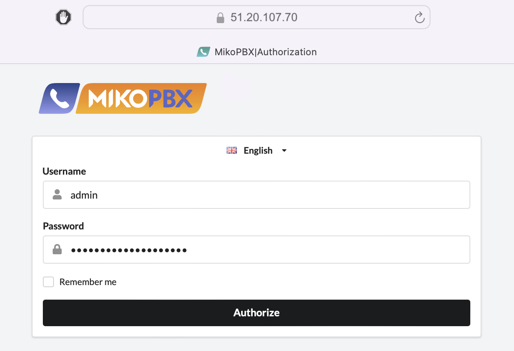

# Amazon Web Services (AWS)

Sign in to the service https://aws.amazon.com

To follow the instructions, install the Amazon Command Line Utility by opening Terminal and entering the following command

```bash
curl "https://awscli.amazonaws.com/AWSCLIV2.pkg" -o "AWSCLIV2.pkg" 
sudo installer -pkg AWSCLIV2.pkg -target /
```

Let's get started with the setup


For quick and convenient navigation within the Amazon service, use the search panel


### Copying access keys&#x20;

1. Go to your account
2. From the dropdown menu, select Security credentials

If you don't have an access key, do the following

3. Under the Access keys table, select Create access key
4. Copy the Access key and Secret access key

If you already have an access key, simply copy the Access key and Secret access key

<figure><figcaption></figcaption></figure>

### Creating a bucket&#x20;

1. Open Services / Storage / **S3**
2. On the tab select **Create bucket**
3. Enter a unique bucket name

<figure><figcaption></figcaption></figure>

4. Use default values for other fields
5. After entering the values, click **Create bucket**

<figure><figcaption></figcaption></figure>

6. Open the created bucket and select **Upload**
7. On the opened tab select **Add files**
8. Upload the file from the MikoPBX distribution with the **.raw** extension
9. Click **Upload**
10. Wait for the file to finish uploading

<figure><figcaption></figcaption></figure>

### Adding permissions and attaching policies&#x20;

If not done previously for this cloud

1. Create a separate folder for files on your computer
2. Create a file named trust-policy.json in the folder
   1. Open Terminal and navigate to the created folder
   2. Run the command **vi trust-policy.json**
   3. Enter editing mode by pressing **i** and paste the text
   4. Press **ESC** and type **:wq** to save the file

```bash
vi trust-policy.json
```

```json
{
"Version": "2012-10-17",
    "Statement":
    [
        {
            "Effect": "Allow",
            "Principal": { "Service": "vmie.amazonaws.com" },
            "Action": "sts:AssumeRole",
            "Condition": {
                "StringEquals":{"sts:Externalid": "vmimport"}
            }
        }
    ]
}
```

3. Similarly, create a file named role-policy.json and change the bucket name value in the text to the name of your created bucket

<pre class="language-json"><code class="lang-json">{
    "Version":"2012-10-17",
    "Statement":
    [
        {
        "Effect": "Allow",
        "Action": [
            "s3:GetBucketLocation",
            "s3:GetObject",
            "s3:ListBucket"
            ],
        "Resource": [
            "arn:aws:s3:::<a data-footnote-ref href="#user-content-fn-1">mikopbx-bucket</a>",
            "arn:aws:s3:::<a data-footnote-ref href="#user-content-fn-2">mikopbx-bucket</a>/*"
            ]
        },
        {
        "Effect": "Allow",
        "Action": [
            "ec2:ModifySnapshotAttribute",
            "ec2:CopySnapshot",
            "ec2:RegisterImage",
            "ec2:Describe*"
        ],
        "Resource": "*"
        }
    ]
}

</code></pre>

4. Similarly, create a file named import-image.sh, change the DEFAULT\_BUCKET parameter value to the name of your created bucket and the DEFAULT\_IMAGE parameter value to the name of the image uploaded to the bucket

<pre class="language-bash"><code class="lang-bash">#!/bin/bash

# Default variable definition
DEFAULT_IMAGE="<a data-footnote-ref href="#user-content-fn-3">mikopbx-2024.1.40-dev-x86_64.raw</a>"
DEFAULT_BUCKET="<a data-footnote-ref href="#user-content-fn-4">mikopbx-bucket</a>"
DEFAULT_DESCRIPTION="MikoPBX the best open source PBX on asterisk"
DEFAULT_NAME="MikoPBX 2024.1.40-dev"

# Overriding variables with environment variable values, if set
IMAGE="${IMAGE:-$DEFAULT_IMAGE}"
BUCKET="${BUCKET:-$DEFAULT_BUCKET}"
DESCRIPTION="${DESCRIPTION:-$DEFAULT_DESCRIPTION}"
NAME="${NAME:-$DEFAULT_NAME}"

# JSON file for import-snapshot command
JSON_FILE="disk_container.json"

# Creating JSON file
cat &#x3C;&#x3C;EOF> ${JSON_FILE}
{
  "Description": "${DESCRIPTION} image",
  "Format": "raw",
  "UserBucket": {
	"S3Bucket": "${BUCKET}",
	"S3Key": "${IMAGE}"
  }
}
EOF

# Importing the snapshot
IMPORT_TASK_ID=$(aws ec2 import-snapshot --description "${DESCRIPTION} image" --disk-container "file://${JSON_FILE}" --query 'ImportTaskId' --output text)

echo "Import task started with ID: $IMPORT_TASK_ID"

# Waiting for snapshot import to complete
while true; do
	STATUS=$(aws ec2 describe-import-snapshot-tasks --import-task-ids $IMPORT_TASK_ID --query 'ImportSnapshotTasks[0].SnapshotTaskDetail.Status' --output text)
	echo "Current status: $STATUS"
	if [ "$STATUS" == "completed" ]; then
		break
	fi
	sleep 30
done

# Getting SnapshotId
SNAPSHOT_ID=$(aws ec2 describe-import-snapshot-tasks --import-task-ids $IMPORT_TASK_ID --query 'ImportSnapshotTasks[0].SnapshotTaskDetail.SnapshotId' --output text)

# Registering AMI
AMI_ID=$(aws ec2 register-image --name "$NAME" --description "$DESCRIPTION" --architecture x86_64 --virtualization-type hvm --ena-support --root-device-name "/dev/sda1" --block-device-mappings "DeviceName=/dev/sda1,Ebs={SnapshotId=$SNAPSHOT_ID}" --query 'ImageId' --output text)

echo "AMI created with ID: $AMI_ID"

</code></pre>

5. Run the command aws configure, specify the region and copied Access key and Secret access key

```bash
aws configure
```

6. Run the command

```bash
aws iam create-role --role-name vmimport --assume-role-policy-document "file://trust-policy.json"
```

7. Run the command

```bash
aws iam put-role-policy --role-name vmimport --policy-name vmimport --policy-document "file://role-policy.json"
```

8. Run the command

```bash
sh import-image.sh
```

If the command executes successfully, a unique AMI identifier will be generated

<figure><figcaption></figcaption></figure>

### Creating a virtual machine&#x20;

1. Open Services / Compute / **EC2** and navigate to Images / AMIs
2. Select the created image and click **Launch an instance from AMI** to create a virtual machine

<figure><figcaption></figcaption></figure>

3. Enter the virtual machine name, for example _mikopbx-vm_

<figure><figcaption></figcaption></figure>

4. Specify the instance type - t**3.micro**

If you have an SSH key

5. Specify the SSH key in the Key pair field

If you don't have an SSH key

5. Select **Create new key pair** and specify the key pair name, for example _mikopbx\_key_

<figure><figcaption></figcaption></figure>

<figure><figcaption></figcaption></figure>

Follow the instructions further

6. In the Network settings section, check **Allow SSH traffic** and **Allow HTTPS traffic**

<figure><figcaption></figcaption></figure>


To deploy the PBX use **two** disks:

* A **1 Gb** disk for the main system
* A **50+ Gb** disk for storing call recordings


7. In the Configure storage section, create a disk for the system and specify a size of 1GB
8. Add another disk for data storage and specify a disk size of at least 50GB

<figure><figcaption></figcaption></figure>

9. For other fields use default values
10. Click **Launch instance**

<figure><figcaption></figcaption></figure>

### Starting MikoPBX

1. Go to the created virtual machine _mikopbx-vm_
2. On the opened tab, select Connect / EC2 serial console, wait for the system to fully load until the authentication parameters are displayed

<figure><figcaption></figcaption></figure>

3. Copy the external address of the created virtual machine and enter it in the browser's address bar
4. Use the login and password provided in EC2 serial console for login

<figure><figcaption></figcaption></figure>


Make sure to configure the Firewall on the MikoPBX


[^1]: change

[^2]: change

[^3]: change

[^4]: change
