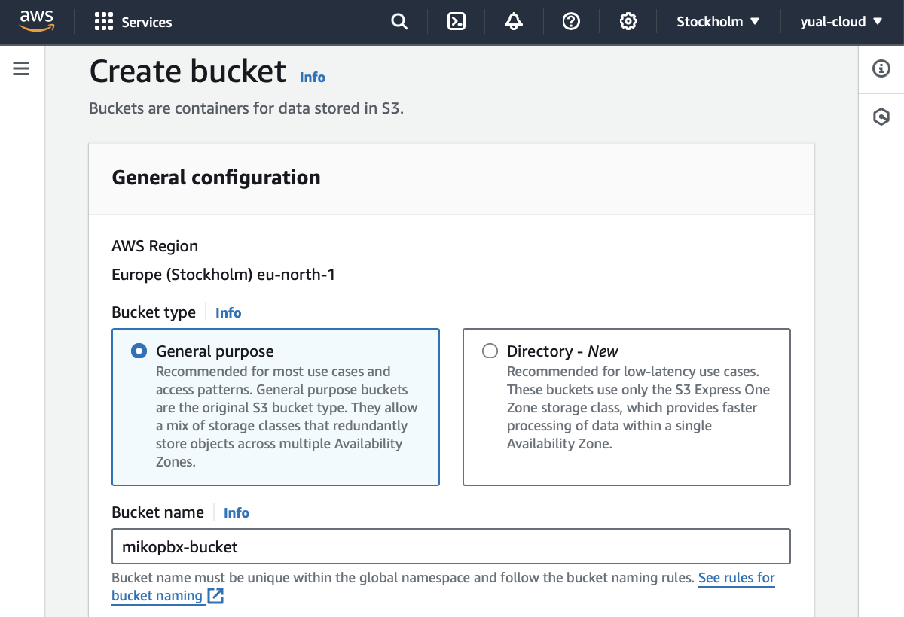
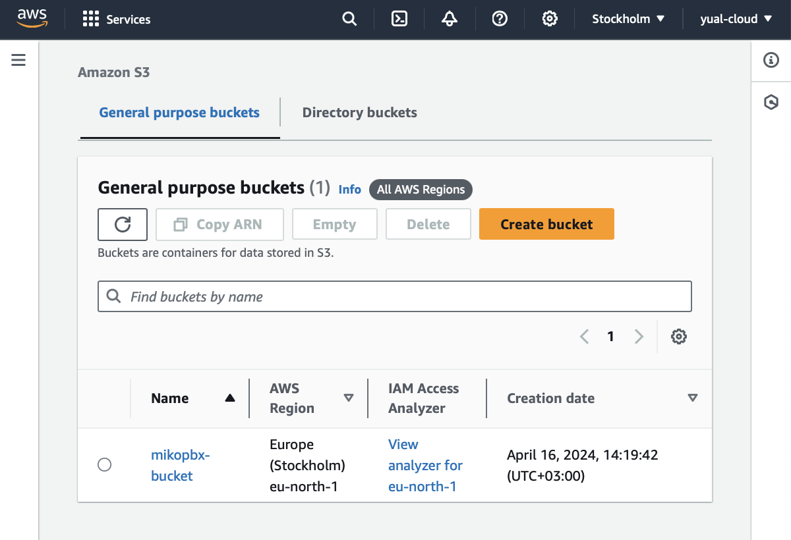
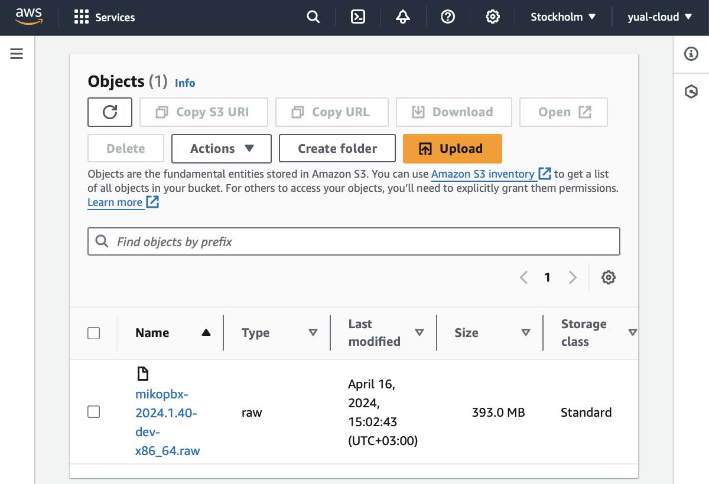
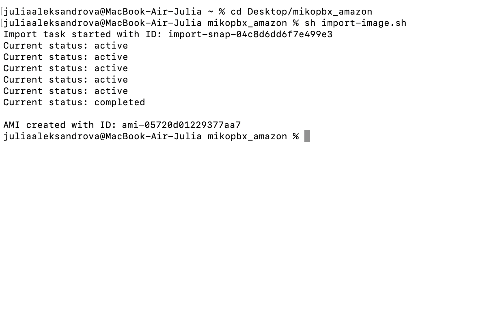
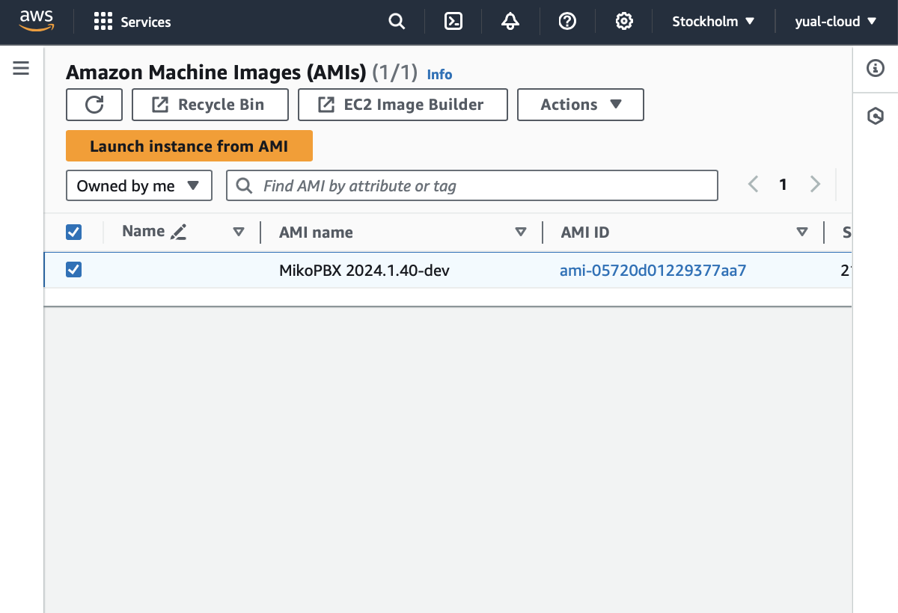
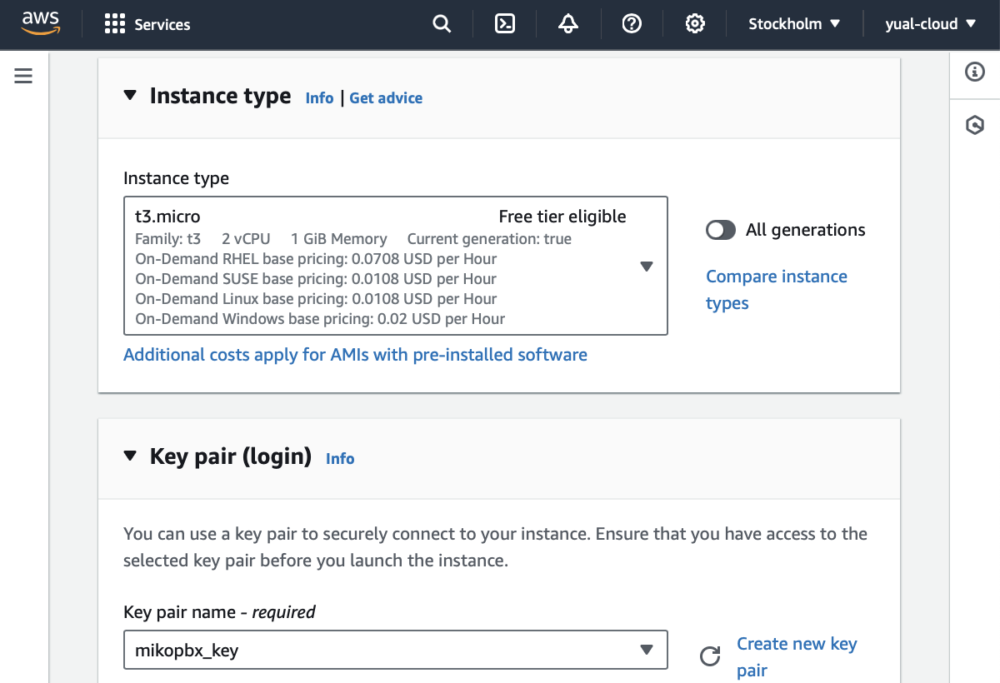
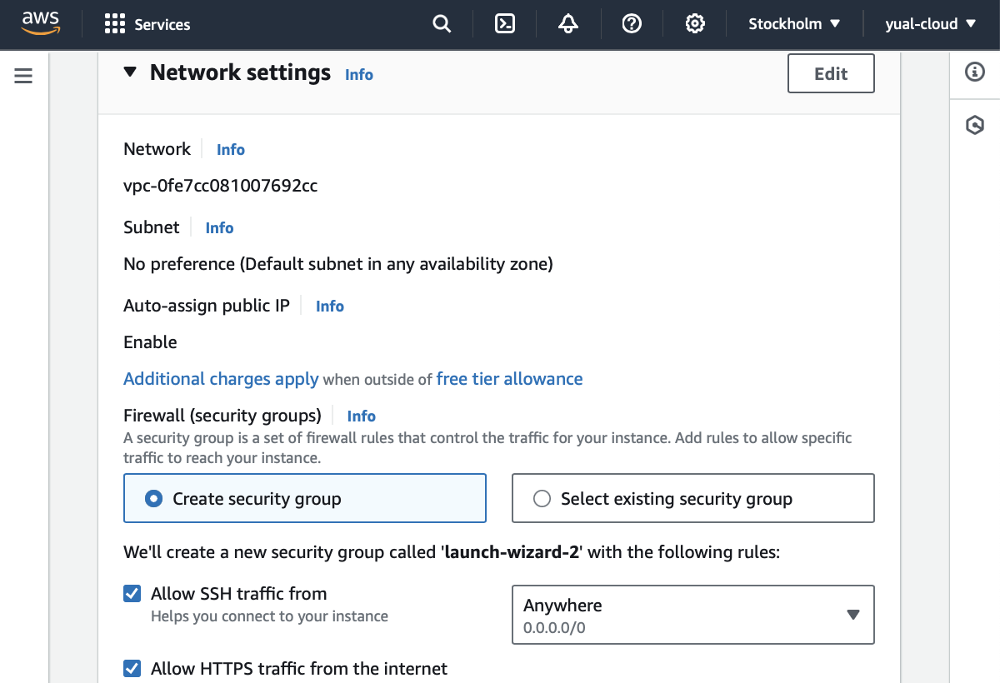
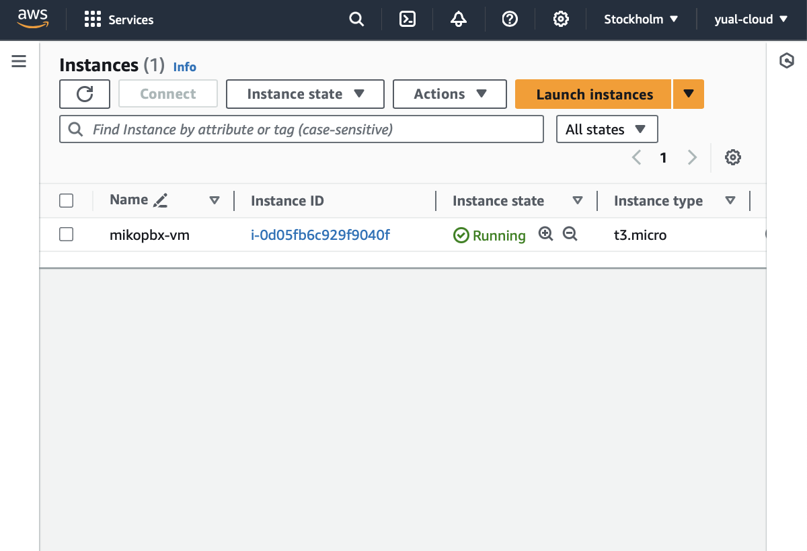

# Amazon Web Services (AWS)

Авторизуйтесь в сервисе [https://aws.amazon.com](https://aws.amazon.com/)

Для выполнения инструкций установите утилиту командной строки Amazon, для этого откройте Терминал и введите в командной строке&#x20;

```bash
curl "https://awscli.amazonaws.com/AWSCLIV2.pkg" -o "AWSCLIV2.pkg" 
sudo installer -pkg AWSCLIV2.pkg -target /
```

Приступим к настройке


Для быстрого и удобного поиска в сервисе Amazon используйте панель поиска


### Копирование ключей доступа

1. Перейдите к своему аккаунту
2. В выпадающем меню выберите **Security credentials**

Если у вас нет ключа доступа, выполните следующее

3. В таблице Access keys выберите **Create access key**
4. Скопируйте Access key и Secret access key

Если у вас есть ключ доступа, скопируйте Access key и Secret access key

<figure><figcaption></figcaption></figure>

### **Создание бакета**

1. Откройте Services / Storage / **S3**
2. На вкладке выберите **Create bucket**
3. Введите уникальное имя бакета (Bucket name)

<figure><figcaption></figcaption></figure>

4. Для других полей используйте значения по умолчанию
5. Завершив ввод значений, нажмите кнопку **Create bucket**

<figure><figcaption></figcaption></figure>

6. Откройте созданный бакет и выберите **Upload**
7. На открывшейся вкладке выберите **Add files**
8. Загрузите файл из дистрибутива MikoPBX с расширением **.raw**
9. Нажмите кнопку **Upload**
10. Дождитесь окончания загрузки файла

<figure><figcaption></figcaption></figure>

### Добавление прав и прикрепление политик

Если для данного облака не выполнялось, сделайте один раз

1. Создайте отдельную папку для файлов на компьютере
2. Создайте в папке файл trust-policy.json
   1. Откройте Терминал и перейдите к созданной папке
   2. Выполните команду **vi trust-policy.json**
   3. Перейдите в режим редактирования, нажав **i**, вставьте текст
   4. Нажмите **ESC** и напишите **:wq**, чтобы записать файл

```bash
vi trust-policy.json
```

```json
{
"Version": "2012-10-17",
    "Statement":
    [
        {
            "Effect": "Allow",
            "Principal": { "Service": "vmie.amazonaws.com" },
            "Action": "sts:AssumeRole",
            "Condition": {
                "StringEquals":{"sts:Externalid": "vmimport"}
            }
        }
    ]
}
```

4. Аналогично создайте файл role-policy.json, измените значение имени бакета в тексте на имя созданного вами бакета

<pre class="language-json"><code class="lang-json">{
    "Version":"2012-10-17",
    "Statement":
    [
        {
        "Effect": "Allow",
        "Action": [
            "s3:GetBucketLocation",
            "s3:GetObject",
            "s3:ListBucket"
            ],
        "Resource": [
            "arn:aws:s3:::<a data-footnote-ref href="#user-content-fn-1">mikopbx-bucket</a>",
            "arn:aws:s3:::<a data-footnote-ref href="#user-content-fn-2">mikopbx-bucket</a>/*"
            ]
        },
        {
        "Effect": "Allow",
        "Action": [
            "ec2:ModifySnapshotAttribute",
            "ec2:CopySnapshot",
            "ec2:RegisterImage",
            "ec2:Describe*"
        ],
        "Resource": "*"
        }
    ]
}
</code></pre>

4. Аналогично создайте файл import-image.sh, измените значения параметра DEFAULT\_BUCKET на имя созданного вами бакета и параметра DEFAULT\_IMAGE на имя образа, загруженного в бакет

<pre class="language-bash"><code class="lang-bash">#!/bin/bash

# Определение переменных по умолчанию
DEFAULT_IMAGE="<a data-footnote-ref href="#user-content-fn-3">mikopbx-2024.1.40-dev-x86_64.raw</a>"
DEFAULT_BUCKET="<a data-footnote-ref href="#user-content-fn-4">mikopbx-bucket</a>"
DEFAULT_DESCRIPTION="MikoPBX the best open source PBX on asterisk"
DEFAULT_NAME="MikoPBX 2024.1.40-dev"

# Переопределение переменных значениями переменных окружения, если они установлены
IMAGE="${IMAGE:-$DEFAULT_IMAGE}"
BUCKET="${BUCKET:-$DEFAULT_BUCKET}"
DESCRIPTION="${DESCRIPTION:-$DEFAULT_DESCRIPTION}"
NAME="${NAME:-$DEFAULT_NAME}"

# Файл JSON для команды import-snapshot
JSON_FILE="disk_container.json"

# Создание файла JSON
cat &#x3C;&#x3C;EOF> ${JSON_FILE}
{
  "Description": "${DESCRIPTION} image",
  "Format": "raw",
  "UserBucket": {
	"S3Bucket": "${BUCKET}",
	"S3Key": "${IMAGE}"
  }
}
EOF

# Импорт снимка
IMPORT_TASK_ID=$(aws ec2 import-snapshot --description "${DESCRIPTION} image" --disk-container "file://${JSON_FILE}" --query 'ImportTaskId' --output text)

echo "Import task started with ID: $IMPORT_TASK_ID"

# Ожидание завершения импорта снимка
while true; do
	STATUS=$(aws ec2 describe-import-snapshot-tasks --import-task-ids $IMPORT_TASK_ID --query 'ImportSnapshotTasks[0].SnapshotTaskDetail.Status' --output text)
	echo "Current status: $STATUS"
	if [ "$STATUS" == "completed" ]; then
		break
	fi
	sleep 30
done

# Получение SnapshotId
SNAPSHOT_ID=$(aws ec2 describe-import-snapshot-tasks --import-task-ids $IMPORT_TASK_ID --query 'ImportSnapshotTasks[0].SnapshotTaskDetail.SnapshotId' --output text)

# Регистрация AMI
AMI_ID=$(aws ec2 register-image --name "$NAME" --description "$DESCRIPTION" --architecture x86_64 --virtualization-type hvm --ena-support --root-device-name "/dev/sda1" --block-device-mappings "DeviceName=/dev/sda1,Ebs={SnapshotId=$SNAPSHOT_ID}" --query 'ImageId' --output text)

echo "AMI created with ID: $AMI_ID"
</code></pre>

5. Выполните команду aws configure, укажите регион и скопированные ключи Access key и Secret access key

```bash
aws configure
```

6. Выполните команду&#x20;

```bash
aws iam create-role --role-name vmimport --assume-role-policy-document "file://trust-policy.json"
```

7. Выполните команду&#x20;

```bash
aws iam put-role-policy --role-name vmimport --policy-name vmimport --policy-document "file://role-policy.json"
```

8. Выполните команду

```bash
sh import-image.sh
```

В случае успешного выполнения команды будет сформирован уникальный идентификатор образа AMI

<figure><figcaption></figcaption></figure>

### **Создание виртуальной машины**

1. Откройте Services / Compute / **EC2** и перейдите в раздел Images / AMIs
2. Выберите созданный образ и нажмите кнопку **Launch an instance form AMI** для создания виртуальной машины

<figure><figcaption></figcaption></figure>

3. Введите имя виртуальной машины (Name), например _mikopbx-vm_

<figure><figcaption></figcaption></figure>

4. Укажите тип машины (Instance type) - **t3.micro**

Если у вас есть ключ SSH, выполните следующее

5. Укажите SSH ключ в поле Key pair

Если у вас есть нет ключа SSH, выполните следующее

5. Выберите **Create new key pair** и укажите имя пары ключей (Key pair name), например _mikopbx\_key_

<figure><figcaption></figcaption></figure>

<figure><figcaption></figcaption></figure>

Следуйте дальше по инструкции

6. В разделе Network settings установите флажки **Allow SSH traffic** и **Allow HTTPS traffic**


Обязательно выполните настройку Firewall на самой АТС MikoPBX


<figure><figcaption></figcaption></figure>


Для развертывания АТС используйте **два** диска:

* диск объемом **1 Гб** для основной системы
* диск объемом **50+ Гб** для хранения записей разговоров


7. В разделе Configure storage создайте диск для системы и укажите размер 1 Гб
8. Добавьте еще один диск для хранения данных и укажите размер диска не менее 50Гб

<figure><figcaption></figcaption></figure>

9. Для других полей используйте значения по умолчанию
10. Нажмите кнопку **Launch instance**

<figure><figcaption></figcaption></figure>

### **Запуск АТС MikoPBX**

1. Перейдите к созданной виртуальной машине _mikopbx-vm_
2. На открытой вкладке выберите Connect / EC2 serial console

<figure><figcaption></figcaption></figure>

3. Скопируйте внешний адрес созданной виртуальной машины и введите его в строке браузера
4. Для входа используйте указанные в EC2 serial console логин и пароль

<figure><figcaption></figcaption></figure>

[^1]: измените

[^2]: измените

[^3]: измените

[^4]: измените
