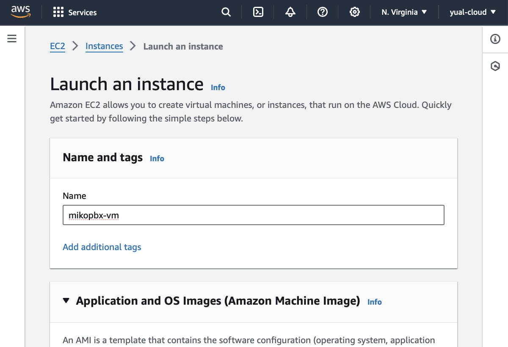
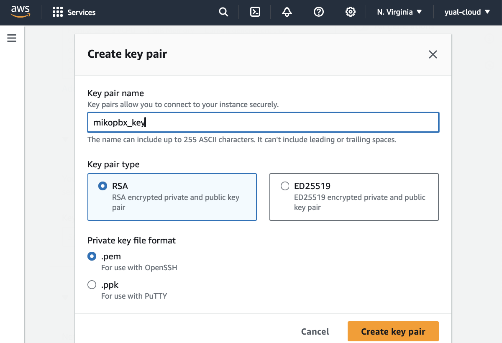
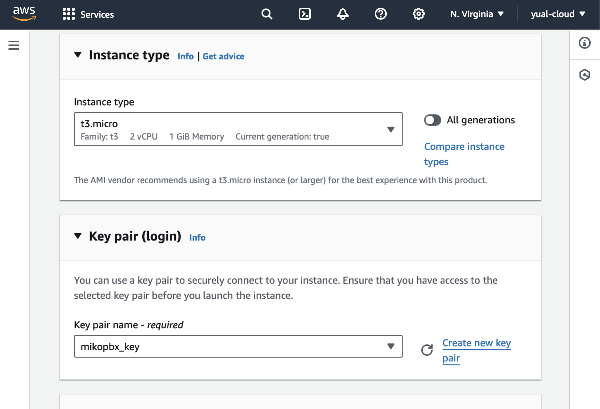
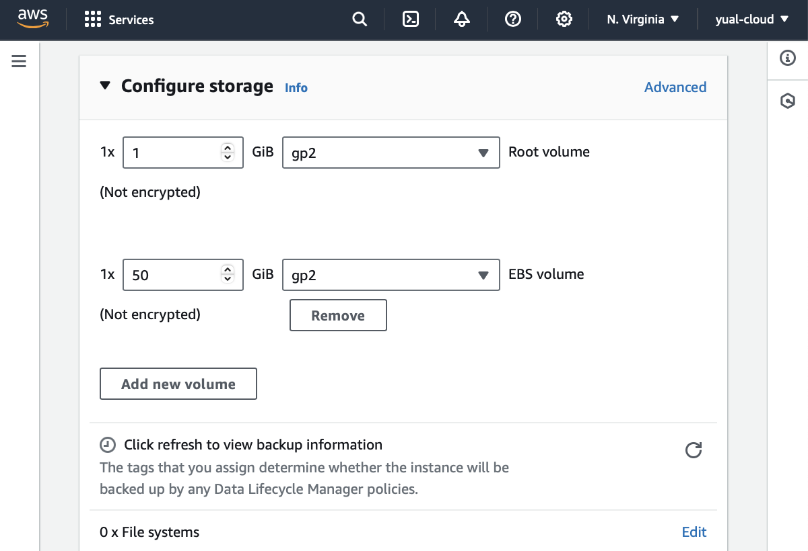
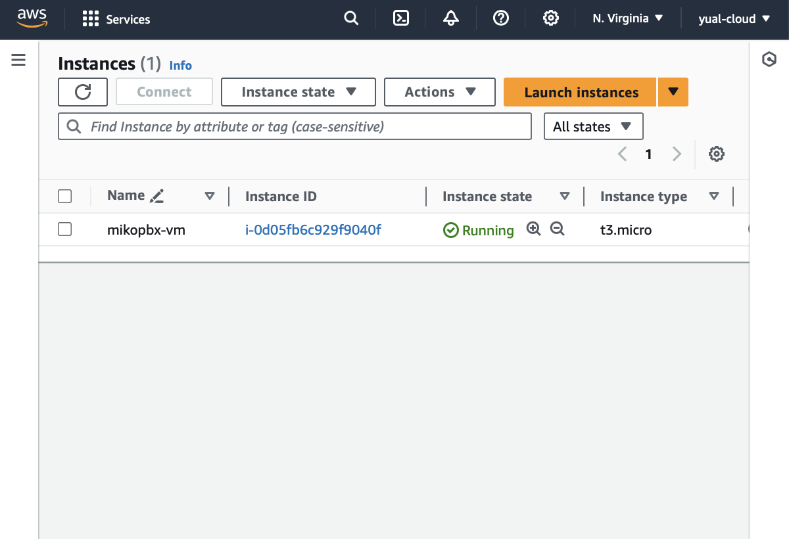

# AWS Маркетплейс

Авторизуйтесь в сервисе Amazon Web Services [https://aws.amazon.com](https://aws.amazon.com/)

Приступим к настройке


Для быстрого и удобного поиска в сервисе Amazon используйте панель поиска


### **Создание виртуальной машины**

1. Откройте Services / Compute / **EC2** и перейдите в раздел Images / AMI Catalog
2. На открытой вкладке в поисковой строке введите **MikoPBX**
3. В разделе AWS Marketplace AMIs выберите образ MikoPBX, нажав кнопку **Select**
4. Нажмите кнопку **Launch an instance form AMI** для создания виртуальной машины

<figure><figcaption></figcaption></figure>

4. Введите имя виртуальной машины (Name), например _mikopbx-vm_

<figure><figcaption></figcaption></figure>

Если у вас есть ключ SSH, выполните следующее

6. Укажите SSH ключ в поле Key pair

Если у вас есть нет ключа SSH, выполните следующее

6. Выберите **Create new key pair** и укажите имя пары ключей (Key pair name), например _mikopbx\_key_

Следуйте дальше по инструкции

<figure><figcaption></figcaption></figure>

<figure><figcaption></figcaption></figure>


Для развертывания АТС используйте **два** диска:

* диск объемом **1 Гб** для основной системы
* диск объемом **50+ Гб** для хранения записей разговоров


7. При необходимости измените размер диска для хранения данных в разделе Configure storage, по умолчанию его размер - 50Гб

<figure><figcaption></figcaption></figure>

8. Для других полей используйте значения по умолчанию
9. Нажмите кнопку **Launch instance**

<figure><figcaption></figcaption></figure>

### **Запуск АТС MikoPBX**

1. Перейдите к созданной виртуальной машине _mikopbx-vm_
2. На открытой вкладке выберите Connect / EC2 serial console, дождитесь полной загрузки системы, пока не отобразятся параметры авторизации

<figure><figcaption></figcaption></figure>

3. Скопируйте внешний адрес созданной виртуальной машины и введите его в строке браузера
4. Для входа используйте указанные в EC2 serial console логин и пароль

<figure><figcaption></figcaption></figure>


Обязательно выполните настройку Firewall на самой АТС MikoPBX

